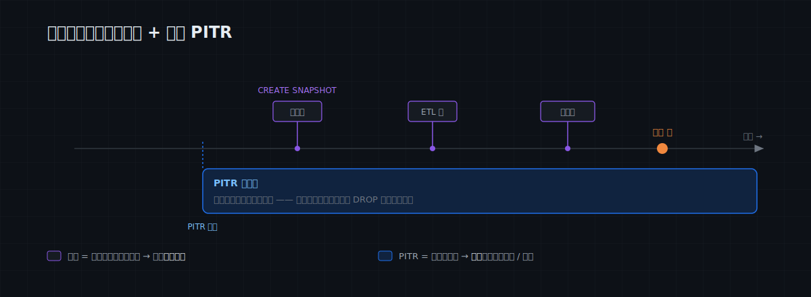
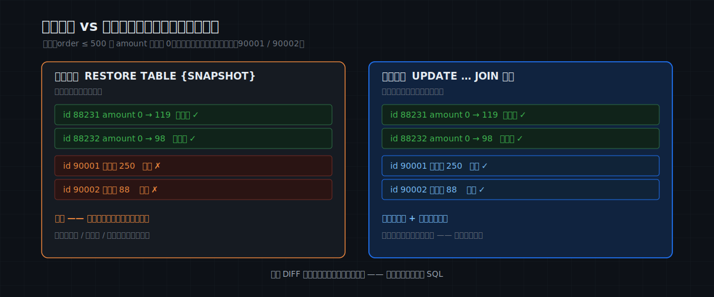
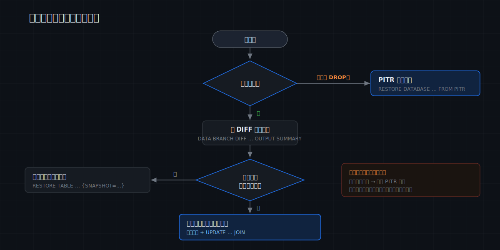

# MatrixOne Git4Data 技术详解（五）·数据运维实践篇：误操作急救——从手滑 UPDATE 到误删整表，都能秒级回退

上一篇画完了数据版本控制的全景地图——你现在清楚我们说的 git4data 具体指什么。从这一篇起进入实践篇，第一个主题是**数据运维**。而数据运维里，没有什么比这件事更让人心跳加速：

> 凌晨两点，你在生产库上敲下一条 `UPDATE`——回车之后才发现，**WHERE 条件忘了写**。8 万条订单的金额，瞬间全变成了同一个数。

传统的处理方式大家都熟：翻昨晚的备份、拉起一个恢复实例、等几个小时导数据，再想办法把备份之后的正常写入补回来——一边操作一边祈祷。整个过程以**小时**计，而事故本身只用了 0.5 秒。

这一篇不是讲概念，而是一份能贴在工位上的**运维急救手册**。我们用一张真实的订单表，把四类最常见的事故从头到尾走一遍——**手滑 UPDATE、批处理跑错、应用 bug 慢性脏写、误删整表**——每一类都讲清楚三件事：怎么**事前布防**、出事后怎么**看清损失**、以及怎么**用最小代价恢复**（整表回滚？还是只修受损的行、保住事故后的正常业务？）。每条 SQL 都可以直接复制运行。

> 📦 本文全部 SQL 在配套仓库 [matrixorigin/git4data-tutorial](https://github.com/matrixorigin/git4data-tutorial) 的 `05-incident-rescue/` 目录。环境：`docker run -d -p 6001:6001 --name matrixone matrixorigin/matrixone:4.0.0-rc3`。

---

## 先把安全网铺好：平时就该做的两件事

急救的成败，八成在事故发生**之前**就决定了。git4data 让"事前布防"便宜到没有借口——平时就把下面两件事做成肌肉记忆。

**第一件：给生产库常备 PITR（任意时间点恢复）。**

```sql
CREATE DATABASE rescue_demo;
USE rescue_demo;

-- 给整个库开一个 1 天的滚动保护窗口。一次配置，持续生效。
CREATE PITR ops_pitr FOR DATABASE rescue_demo RANGE 1 'd';
```

PITR 配好之后就在后台默默工作，**它维护的是一个"最近一段时间"的滚动恢复窗口**——窗口内的任意一秒，无论你有没有手动打过快照，都能恢复回去。窗口长度（`RANGE 1 'd'`）就是你的 RPO 与回溯深度：按业务能容忍的程度设成 1 天、7 天都行。要紧的是，这个窗口**会随时间不断向前滚动**——比窗口更久远的旧时刻会逐渐滑出保护范围、不再保证能恢复。所以 PITR 是**短期的连续兜底**，**而且必须在事故之前就配好**——出了事再建已经晚了。

**第二件：任何有风险的批量操作之前，随手打一个快照。**

```sql
CREATE TABLE orders (
    order_id BIGINT PRIMARY KEY,
    customer VARCHAR(32),
    amount   DECIMAL(10, 2),
    status   VARCHAR(16)
);
INSERT INTO orders
SELECT result, concat('cust_', result % 10000), round(rand()*1000, 2), 'paid'
FROM generate_series(1, 1000000) g;          -- 100 万行，几秒钟
```

第二篇实测过：给一张 100 万行（乃至 1 亿行）的表打快照，只要 **5–8 毫秒**——因为它只是记录一个时刻、并保护住该时刻的对象（第三篇讲过原理）。这意味着打快照**没有任何心理负担**：每次变更前都打一个，就像写文档时随手 Ctrl+S。

记住这两件事的分工——它们是**两个独立的能力，各管一段时间尺度**：

> - **PITR：后台自动织的、随时间向前滚动的"连续安全网"。** 最近一段时间里任意一秒都能恢复（连你没存档的时刻、连被 DROP 的表都兜得住），但它**只保护窗口内**——旧时刻会随窗口前移而滑走。
> - **快照：你手动埋下、一旦打下就长期留存的"具名存档点"。** 它**不随时间过期**（直到你显式删除），所以特别适合钉住一个"已知良好状态"（上线前、季度结算、训练数据切片）——哪怕几周后 PITR 窗口早已滚过那一刻，你仍能对它做 DIFF、定点修复或整体恢复。

下面四个场景，会反复用到这一对工具。



---

## 场景一：手滑 UPDATE 忘了 WHERE

这是最经典的一幕。变更前我们有好习惯，先存了个档：

```sql
-- 上线"批量调价"之前，先存档（毫秒级）
CREATE SNAPSHOT before_repricing FOR TABLE rescue_demo orders;

-- 然后……事故发生了：本想只改一批，WHERE 写漏了
UPDATE orders SET amount = 0 WHERE order_id <= 500;   -- 本应带更多条件
```

### 第一步：别回滚，先看清损失

真实事故里，**回滚几乎从不该是第一动作**。你得先回答三个问题：改坏了多少行？是哪些行？有没有伤到不该碰的数据？因为回滚本身有代价——它会把事故之后所有正常写入一起抹掉。先看清，再决定。

git4data 给你的是一份**行级的事故报告**。先看规模：

```sql
DATA BRANCH DIFF orders AGAINST orders {SNAPSHOT='before_repricing'} OUTPUT SUMMARY;
```
```
metric   | orders | (snapshot)
INSERTED |      0 |      0
DELETED  |      0 |      0
UPDATED  |    500 |      0      ← 受损范围：500 行被改，没有误删/误插
```

`OUTPUT SUMMARY` 一眼定性：只有 UPDATED=500，说明是"改坏"而非"删错/插错"。需要精确数字时用 `OUTPUT COUNT`；想看具体是哪些行、改成了什么，用 `OUTPUT LIMIT`：

```sql
DATA BRANCH DIFF orders AGAINST orders {SNAPSHOT='before_repricing'} OUTPUT LIMIT 10;
-- 每一行：哪张表、什么操作、主键、各列当前值 —— 损失清单一目了然
```

如果要把完整改动交给事故复盘、或留一份可回放的补丁，导成文件——注意 `OUTPUT FILE` 后面给的是一个**已存在的目录**（写在 MO 服务端），git4data 会在里面生成一份带时间戳的 `.sql`，用 `DELETE / INSERT` 把这批改动完整表达出来：

```sql
DATA BRANCH DIFF orders AGAINST orders {SNAPSHOT='before_repricing'} OUTPUT FILE '/tmp';
-- → /tmp/diff_orders_orders_before_repricing_<时间戳>.sql
```

实测：100 万行的表、手滑改 500 行，这条 DIFF **毫秒级**返回，UPDATED=500 分毫不差（第三篇讲过为什么这么快：只扫增量对象，不扫全表）。

### 第二步：选恢复方式——整表回滚，还是定点修复？

看清之后，关键的判断只有一个：**事故发生后，这张表上有没有发生过正常的业务写入？**



**情况 A：没有正常新写入（半夜、或表瞬间被你锁住了）→ 整表回滚最干净。**

```sql
RESTORE TABLE rescue_demo.orders {SNAPSHOT = before_repricing};
SELECT COUNT(*) FROM orders WHERE amount = 0 AND order_id <= 500;   -- 0，全好了
```

秒级完成，整张表回到存档点。这就是 `git reset --hard` 在数据上的样子。

**情况 B：事故后仍有正常成交（新订单还在不停进来）→ 不能无脑回滚。** 因为 `RESTORE` 会把整张表拨回存档点，那 5 分钟里真实成交的新订单会跟着一起消失。这时要做的是**定点修复**：只把被改坏的 500 行还原，其余一概不动。

git4data 让这件事变得直接——把事故前的快照"拉"成一张可查询的表，再用它定点回填：

```sql
-- 1) 把事故前的快照零拷贝成一张旁表（秒级，不搬数据）
DATA BRANCH CREATE TABLE rescue_demo.orders_snap FROM rescue_demo.orders{SNAPSHOT='before_repricing'};

-- 2) 只回填"现在和快照不一致"的行；事故后新插入的订单不在快照里，
--    join 不到，天然不受影响
UPDATE orders o
JOIN   orders_snap s ON o.order_id = s.order_id
SET    o.amount = s.amount, o.status = s.status
WHERE  (o.amount, o.status) <> (s.amount, s.status);

-- 3) 验证修复：按【值】比对当前表与快照，应当一行都不差
SELECT COUNT(*) AS value_mismatch
FROM   orders o JOIN orders_snap s ON o.order_id = s.order_id
WHERE  o.amount <> s.amount OR o.status <> s.status;   -- 期望 0

-- 4) 收尾，删掉旁表
DROP TABLE orders_snap;
```

> 小贴士：确认"值有没有修对"，用上面第 3 步那条**按值比对**的 SQL 最直接；而 `DATA BRANCH DIFF` 更适合**事故刚发生时**快速看清"改动波及了多少行"。两者分工不同，各用在该用的地方。

这其实是一次"手工三方合并"：以**快照**为基准，把"被改坏"的行还原，把"事故后新增"的行保留。唯一需要留意的边界是——如果某一行在事故之后**又被一次合法更新覆盖过**，上面的 `WHERE` 会把它也一并拨回快照值（真冲突）。这种行通常极少，可以先用 DIFF 把它们单独捞出来人工确认。顺带说一句：这套"以共同祖先为基准、自动区分真假冲突"的合并，git4data 有内建命令（`DATA BRANCH MERGE`）能自动完成——那是下一篇协作开发的主角，这里先用最朴素的 SQL 把原理跑通。

> **本场景的心态变化**：传统数据库出事后第一反应是"赶紧回滚"，而代价（丢掉新写入）往往到事后才发现。git4data 让你**先看清、再选择**——回滚和定点修复都只是一两条 SQL，贵的从来不是操作，是判断。

---

## 场景二：批处理 / ETL 跑错了

第二常见的事故不是人手滑，是**任务跑错**：夜里的 ETL 失败重试，结果某批数据导了两遍；或者上游来了个脏文件，把一批行覆盖成了 NULL。这类事故的特征是——**改动量大、且常常是 INSERT/UPDATE 混在一起**。

对策的第一步同样在事前：把"入库前打快照"写进 ETL 脚本，让每次跑批都自带存档点。

```sql
-- ETL 脚本里，真正灌数之前的一行：用 run-id 命名，方便回溯
CREATE SNAPSHOT etl_pre_run8842 FOR TABLE rescue_demo orders;
-- …… 这里是你的导入逻辑（LOAD / INSERT … SELECT）……
```

出事后，DIFF 立刻能区分"是多导了还是改坏了"：

```sql
DATA BRANCH DIFF orders AGAINST orders {SNAPSHOT='etl_pre_run8842'} OUTPUT SUMMARY;
```
```
metric   | orders | (snapshot)
INSERTED |   1000 |      0      ← 重复导入：多出来 1000 行
UPDATED  |      0 |      0
```

- **如果是"任务整体跑错"**（这批根本不该进）：直接回滚到 `etl_pre_run8842`，干净利落，然后修好任务重跑。**快照让 ETL 天然可重试**——每次 run 前存档，失败就回退、重来，不留脏数据。
- **如果是"大部分对、只有一批多导了"**：用 `OUTPUT FILE` 把多出来的行（INSERTED 那部分）导出来，按主键精确 `DELETE`，保留其余正确数据。

一句话：**跑批之前那行 `CREATE SNAPSHOT`，把"ETL 幂等"这个老大难，变成了"出错就回退重跑"的小事。**

---

## 场景三：应用 bug，脏数据是"慢慢"写坏的

前两个场景都有个共同点：你**知道**自己刚做了一次危险操作，所以事前能存档。但最难受的一类事故是**慢性的**——一次发版引入了 bug，过去三个小时里悄悄把一部分订单的 `status` 写成了错误值，直到监控报警你才发现。**没有"变更前快照"**，因为它不是一次批量操作，而是连续三小时的零散脏写。

这正是 **PITR 的主场**：它不依赖你手动存档，窗口内任意一刻都能回去。第一步永远是看清窗口、定位"坏掉之前"的时刻：

```sql
SHOW PITR;        -- 看 ops_pitr 的保护窗口和生效起点，确认"发版前"的时刻在窗口内
```

接下来要**诚实地面对一个权衡**，这也是运维真正需要想清楚的地方：

- **PITR 的恢复是库级、覆盖式的**（`RESTORE DATABASE … FROM PITR …`）。直接拿它把整库拨回"发版前"，确实能抹掉那三小时的脏写——但**同时也会抹掉这三小时里所有正常的业务**。对一个还在成交的生产库，这通常不可接受。
- 所以 PITR 最锋利的用途，是救**结构性灾难**（下一个场景的 DROP / TRUNCATE / 整库被污染）——那种情况下"整库拨回去"正是你想要的。
- 而像本场景这种"只想精修一部分行、又要保住其余新业务"的需求，**真正靠得住的是事前快照 + 定点修复**（场景一的情况 B）。

所以这个场景给运维的真正教训，恰恰是回到事前：**把"打快照"挂到每一次发版、每一次有风险的变更上**。一次 `CREATE SNAPSHOT before_deploy_v231` 的成本是几毫秒，而它换来的，是出事后能做"定点修复"而不是"整库回滚"的底气。PITR 是最后的兜底，但你不会想每次都动用它——**好的运维，是让自己永远有一个更近、更精确的存档点可用。**

---

## 场景四：误删——DROP / TRUNCATE 整张表

最糟糕的一幕：表没了。这时快照也救不了（连表带快照元数据可能一起没了），唯一的依靠就是平时配好的 PITR。

```sql
-- 出事前先记下当前时刻（恢复时要用）
SELECT now();        -- 例如 2026-06-18 02:14:07

DROP TABLE orders;                 -- 100 万行，瞬间没了
SELECT COUNT(*) FROM orders;       -- ERROR: no such table
```

恢复——整库拨回出事前的那一刻：

```sql
RESTORE DATABASE rescue_demo FROM PITR ops_pitr "2026-06-18 02:14:07";
SELECT COUNT(*) FROM orders;       -- 1000000，表结构连同数据原样回来了
```

实测：**被 DROP 的 100 万行表，从 PITR 整库恢复，数据一行不少。** 传统流程里这是"重大事故、全员加班、拉备份实例"级别的事件；在这里，是一条 SQL、几秒钟。`TRUNCATE`、误删整个库，同理。

---

## 把恢复做对：一张决策树

四个场景背后，其实是同一套判断流程。出事后照着走，基本不会选错工具：



- **表还在吗？** 不在（被 DROP/TRUNCATE）→ 直接走 PITR 整库恢复。
- 表还在 → 先 `DATA BRANCH DIFF … OUTPUT SUMMARY` **看清损失**。
- **事故后有没有正常新写入？**
  - 没有 → `RESTORE TABLE … {SNAPSHOT=…}` 整表回滚，最简单。
  - 有 → 把快照拉成旁表、`UPDATE … JOIN` **定点修复**，保住新业务。
- **完全没有事前快照、且是慢性脏写？** → PITR 只能整库覆盖式回滚，代价大；记住教训，把"变更前打快照"补成习惯。

---

## 全粒度 + 多表原子：从一张表到整个集群

上面演示都在表和库级别，但这套安全网是**全粒度**的——单表手滑、整库污染、租户级灾难，对应同一套语义：

| 事故范围 | 存档 | 恢复 |
|---|---|---|
| 一张表 | `CREATE SNAPSHOT s FOR TABLE db t` | `RESTORE TABLE db.t {SNAPSHOT = s}` |
| 一个库（多表一致） | `CREATE SNAPSHOT s FOR DATABASE db` | `RESTORE DATABASE db {SNAPSHOT = s}` |
| 一个租户 | `CREATE SNAPSHOT s FOR ACCOUNT acc` | `RESTORE ACCOUNT acc {SNAPSHOT = s}` |
| 整个集群 | `CREATE SNAPSHOT s FOR CLUSTER` | `RESTORE CLUSTER {SNAPSHOT = s}` |

库级一点尤其值得记住：**库级快照/恢复是多表原子的**——订单表、库存表、流水表一起回到同一时刻，不会出现"这张表回去了、那张表没回去"的撕裂状态。对一个由多张表共同维持一致性的业务来说，这一点常常比"能恢复"本身更重要。

---

## 成本与边界：运维必须知道的几件事

把引擎盖掀开后该讲的"诚实话"，免得你在生产上踩坑：

- **创建近乎零成本，长期持有不是。** 打快照、建 PITR 都是毫秒级、几乎不占空间；但**被快照或 PITR 钉住的历史对象不会被后台 GC 回收**，会一直占着存储，直到快照/PITR 删除。所以：短期的"变更前快照"用完随手 `DROP SNAPSHOT`；PITR 窗口按 RPO 设，别盲目拉到 30 天。
- **PITR 恢复是库级、覆盖式的。** 它最适合救结构性灾难（DROP/TRUNCATE/整库污染）。要"只修某些行、保住其余新写"，请用快照 + 定点修复，而不是 PITR。
- **时序边界。** PITR 只保护**滚动窗口内**最近一段时间——更久远的旧时刻已滑出，得靠快照；恢复时间戳要落在 `SHOW PITR` 显示的有效区间内。
- **先 DIFF、再动手。** 这是本篇最该带走的习惯：恢复动作（回滚 / 定点修 / PITR）都很便宜，**真正贵的是判断**，而 DIFF 就是把判断建立在事实而非猜测上的那一步。

---

## 一页急救卡

把这一篇压缩成一张可以贴在工位上的卡片：

| 时刻 | 动作 | SQL |
|---|---|---|
| **平时** | 给生产库常备 PITR | `CREATE PITR p FOR DATABASE db RANGE 1 'd'` |
| **每次变更 / 跑批前** | 随手打快照 | `CREATE SNAPSHOT s FOR TABLE db t` |
| **出事第一步** | 别慌，先看损失 | `DATA BRANCH DIFF t AGAINST t {SNAPSHOT='s'} OUTPUT SUMMARY` |
| **要完整改动** | 导出为 `.sql` 补丁 | `DATA BRANCH DIFF … OUTPUT FILE '/已存在的目录'` |
| **没有新写入** | 整表回滚 | `RESTORE TABLE db.t {SNAPSHOT = s}` |
| **有新写入** | 定点修复 | `DATA BRANCH CREATE TABLE tmp FROM t{SNAPSHOT='s'}` ＋ `UPDATE … JOIN …` |
| **表被 DROP** | 整库 PITR 恢复 | `RESTORE DATABASE db FROM PITR p "YYYY-MM-DD HH:MM:SS"` |
| **用完** | 清理快照、控成本 | `DROP SNAPSHOT s` |

成本几乎为零（快照毫秒级、与数据量无关），收益是把"以小时计的事故恢复"变成"以秒计的一两条 SQL"。这笔账，怎么算都划算。

---

## 结语

误操作急救是 git4data 最"朴素"的应用——没有花哨的概念，就是把软件工程里"犯错可以撤销"这件理所当然的事，带给生产数据库。但请注意这一篇里反复出现的那个模式：**事前廉价存档、事中行级看清、事后按需回退（整表或定点）。** 这个模式不只属于救火。

你也许已经发现了：场景一里那个"以快照为基准、只修受损行、保留新业务"的定点修复，本质上就是一次三方合并——只是我们手工做的。下一篇，我们把它交给数据库自动完成，并推向它真正的进阶形态：**数据团队的协作开发**——多个工程师在同一张大表上并行干活，每人一条分支，改完合并回主线，冲突由数据库逐行裁决。也就是把 GitHub 上的多人协作，原样搬到数据上。

> 📎 可运行 SQL：[github.com/matrixorigin/git4data-tutorial](https://github.com/matrixorigin/git4data-tutorial) ｜ 源码与社区：[github.com/matrixorigin/matrixone](https://github.com/matrixorigin/matrixone)
