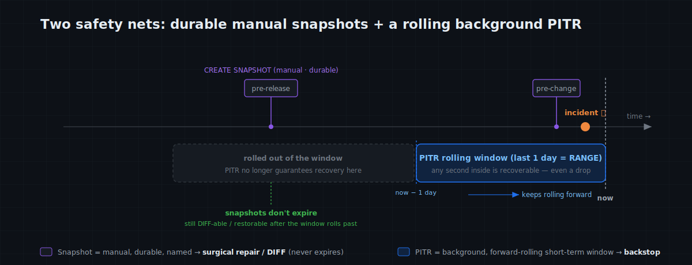
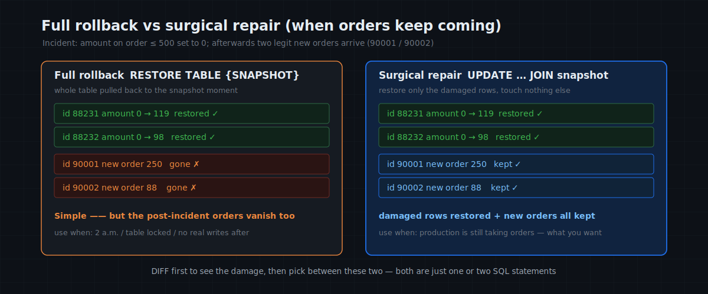
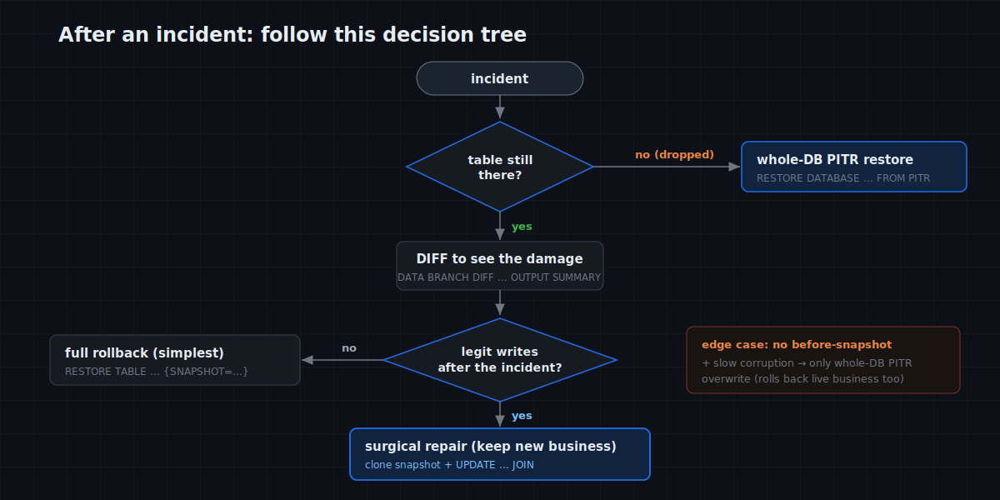

# MatrixOne Git4Data Deep Dive (Part 5) · Data Operations in Practice — Incident Rescue: From a Fat-Fingered UPDATE to a Dropped Table, Roll Back in Seconds

The last article mapped the data-versioning landscape — you now know exactly what we mean by git4data. From here the series turns practical, and the first theme is **data operations**. And in ops, nothing raises your heart rate quite like this:

> 2 a.m. You run an `UPDATE` against production — and only after hitting Enter do you realize **you forgot the WHERE clause**. The amounts on 80,000 orders are now all the same number.

Everyone knows the traditional drill: dig out last night's backup, spin up a recovery instance, wait hours for the data to load, then figure out how to replay the legitimate writes that happened after the backup — praying the whole way through. The recovery takes **hours**; the accident itself took half a second.

This article isn't concept — it's a **field manual you could pin at your desk**. Using one real orders table, we walk four of the most common incidents end to end — **a fat-fingered UPDATE, a botched batch job, an app bug that corrupts data slowly, and a dropped table** — and for each we make three things concrete: how to **set up defenses beforehand**, how to **see the damage** once it happens, and how to **recover at the lowest cost** (full rollback? or repair only the damaged rows and keep the legitimate business that came after?). Every SQL statement is copy-paste runnable.

> 📦 All SQL lives in the companion repo [matrixorigin/git4data-tutorial](https://github.com/matrixorigin/git4data-tutorial), under `05-incident-rescue/`. Environment: `docker run -d -p 6001:6001 --name matrixone matrixorigin/matrixone:4.0.0-rc3`.

---

## Lay the safety net first: two things to do routinely

Eighty percent of a rescue is decided **before** the accident. git4data makes "defend beforehand" so cheap there's no excuse — make these two things muscle memory.

**First: keep standing PITR on production.**

```sql
CREATE DATABASE rescue_demo;
USE rescue_demo;

-- A rolling 1-day protection window for the whole database. Configure once.
CREATE PITR ops_pitr FOR DATABASE rescue_demo RANGE 1 'd';
```

Once configured, PITR works quietly in the background, maintaining a **rolling recovery window of the most recent stretch** — any second inside it is recoverable, whether or not you ever took a manual snapshot. The window length (`RANGE 1 'd'`) is your RPO and lookback depth: set it to 1 day, 7 days, whatever your business can tolerate. The catch is that this window **keeps rolling forward**: moments older than the window length slide out of protection and are no longer guaranteed recoverable. So PITR is your **short-term continuous backstop** — and it **has to exist before the incident**; creating it afterward is too late.

**Second: before any risky bulk operation, casually take a snapshot.**

```sql
CREATE TABLE orders (
    order_id BIGINT PRIMARY KEY,
    customer VARCHAR(32),
    amount   DECIMAL(10, 2),
    status   VARCHAR(16)
);
INSERT INTO orders
SELECT result, concat('cust_', result % 10000), round(rand()*1000, 2), 'paid'
FROM generate_series(1, 1000000) g;          -- 1,000,000 rows, seconds
```

Part 2 measured it: snapshotting a 1M-row (even 100M-row) table takes **5–8 milliseconds** — it only records a moment and protects that moment's objects (Part 3 explained why). Which means snapshots carry **zero psychological cost**: take one before every change, the way you hit Ctrl+S while writing a document.

Remember the division of labor — these are **two independent capabilities, each covering a different timescale**:

> - **PITR is the automatic, forward-rolling "continuous net."** Any second in the recent window is recoverable (even moments you never saved, even a dropped table), but it only protects **inside the window** — older moments roll off as the window advances.
> - **A snapshot is a named save point you place by hand, and once taken it persists.** It **doesn't expire** (until you drop it), which makes it the right tool to pin a "known-good state" (before a release, a quarterly close, a training-data cut) — so even weeks later, after the PITR window has long rolled past that moment, you can still DIFF against it, surgically repair from it, or restore it.

The four scenarios below lean on this pair again and again.



---

## Scenario 1: a fat-fingered UPDATE with no WHERE

The classic. We had the good habit of saving before the change:

```sql
-- Before the "bulk repricing" goes in, save a checkpoint (milliseconds)
CREATE SNAPSHOT before_repricing FOR TABLE rescue_demo orders;

-- …and then it happens: meant to touch one batch, missed the WHERE
UPDATE orders SET amount = 0 WHERE order_id <= 500;   -- should have been narrower
```

### Step 1: don't roll back — see the damage first

In a real incident, **rollback should almost never be the first move.** You first need to answer three questions: how many rows got damaged? which rows? did anything that shouldn't be touched get touched? Because rollback has a cost too — it wipes out every legitimate write that came after the accident. See clearly, then decide.

git4data hands you a **row-level incident report**. First, the scope:

```sql
DATA BRANCH DIFF orders AGAINST orders {SNAPSHOT='before_repricing'} OUTPUT SUMMARY;
```
```
metric   | orders | (snapshot)
INSERTED |      0 |      0
DELETED  |      0 |      0
UPDATED  |    500 |      0      ← damage: 500 rows changed, nothing dropped/inserted
```

`OUTPUT SUMMARY` classifies it at a glance: only UPDATED=500, so this is "overwritten," not "deleted/inserted by mistake." Need the exact number? `OUTPUT COUNT`. Want to see which rows and what they became? `OUTPUT LIMIT`:

```sql
DATA BRANCH DIFF orders AGAINST orders {SNAPSHOT='before_repricing'} OUTPUT LIMIT 10;
-- Each row: which table, what operation, the key, current column values — a damage inventory at a glance
```

To hand the full changeset to a post-mortem, or keep a replayable patch, export it to a file — note that `OUTPUT FILE` takes an **existing directory** (on the MO server), and git4data writes a timestamped `.sql` there that expresses the whole change as `DELETE / INSERT`:

```sql
DATA BRANCH DIFF orders AGAINST orders {SNAPSHOT='before_repricing'} OUTPUT FILE '/tmp';
-- → /tmp/diff_orders_orders_before_repricing_<timestamp>.sql
```

Measured: on a 1M-row table, a fat-fingered change to 500 rows, this DIFF returns in **milliseconds** with UPDATED=500, exactly right (Part 3 explained why it's this fast: it scans only the increment objects, never the full table).

### Step 2: pick a recovery — full rollback, or surgical repair?

Once you can see clearly, there's one decision that matters: **after the accident, did any legitimate business writes land on this table?**



**Case A: no legitimate new writes (it's 2 a.m., or you locked the table instantly) → full rollback is cleanest.**

```sql
RESTORE TABLE rescue_demo.orders {SNAPSHOT = before_repricing};
SELECT COUNT(*) FROM orders WHERE amount = 0 AND order_id <= 500;   -- 0, all good
```

Done in seconds; the whole table is back at the checkpoint. This is `git reset --hard`, for data.

**Case B: real orders are still coming in after the accident → don't blindly roll back.** A `RESTORE` pulls the entire table back to the checkpoint, and those real orders from the last 5 minutes vanish with it. What you want here is **surgical repair**: restore only the 500 damaged rows, touch nothing else.

git4data makes this direct — materialize the pre-incident snapshot as a queryable table, then use it to patch in place:

```sql
-- 1) Zero-copy the pre-incident snapshot into a side table (seconds, no data moved)
DATA BRANCH CREATE TABLE rescue_demo.orders_snap FROM rescue_demo.orders{SNAPSHOT='before_repricing'};

-- 2) Restore only rows that now differ from the snapshot; orders inserted after
--    the accident aren't in the snapshot, so the join skips them naturally
UPDATE orders o
JOIN   orders_snap s ON o.order_id = s.order_id
SET    o.amount = s.amount, o.status = s.status
WHERE  (o.amount, o.status) <> (s.amount, s.status);

-- 3) Verify the repair by VALUE: compare the table against the snapshot — should be zero rows off
SELECT COUNT(*) AS value_mismatch
FROM   orders o JOIN orders_snap s ON o.order_id = s.order_id
WHERE  o.amount <> s.amount OR o.status <> s.status;   -- expect 0

-- 4) Clean up the side table
DROP TABLE orders_snap;
```

> Tip: to confirm the *values* were restored, the value-comparison query in step 3 is the most direct check; `DATA BRANCH DIFF` is better suited to quickly sizing **how many rows an incident touched** the moment it happens. Different tools for different jobs.

This is really a hand-rolled three-way merge: with the **snapshot** as the base, restore the "damaged" rows and keep the "inserted-after-the-accident" rows. The one edge to watch: if a row was **legitimately updated again after the accident**, the `WHERE` above will also pull it back to the snapshot value (a true conflict). Such rows are usually rare — pull them out separately with DIFF and review by hand. (And by the way: this "base-aware merge that auto-distinguishes true from false conflicts" is a built-in command — `DATA BRANCH MERGE` — which is the star of the next article. Here we run the principle by hand with plain SQL.)

> **The mindset shift**: a traditional database's first reflex after an incident is "roll back now," and the cost (losing the new writes) is often discovered only afterward. git4data lets you **see clearly, then choose** — rollback and surgical repair are both one or two SQL statements. The expensive part was never the operation; it's the judgment.

---

## Scenario 2: a batch / ETL job gone wrong

The second-most-common incident isn't a human slip, it's a **job misfiring**: a nightly ETL fails and retries, so one batch loads twice; or an upstream dirty file overwrites a batch of rows with NULLs. The signature of this class: **large change volume, often a mix of INSERTs and UPDATEs.**

The first defense is again beforehand — bake "snapshot before load" into the ETL script, so every run carries its own save point.

```sql
-- One line in the ETL script, right before the real load. Name it by run-id for traceability.
CREATE SNAPSHOT etl_pre_run8842 FOR TABLE rescue_demo orders;
-- …… your load logic (LOAD / INSERT … SELECT) ……
```

After the incident, DIFF immediately tells "over-loaded" from "overwritten":

```sql
DATA BRANCH DIFF orders AGAINST orders {SNAPSHOT='etl_pre_run8842'} OUTPUT SUMMARY;
```
```
metric   | orders | (snapshot)
INSERTED |   1000 |      0      ← duplicate load: 1,000 extra rows
UPDATED  |      0 |      0
```

- **If the whole job misfired** (this batch shouldn't be in at all): roll straight back to `etl_pre_run8842`, clean and simple, then fix the job and rerun. **Snapshots make ETL naturally retryable** — save before each run, and on failure just roll back and redo, leaving no dirty data behind.
- **If most of it is right and only one batch double-loaded**: `OUTPUT FILE` the extra rows (the INSERTED set) and `DELETE` them by key precisely, keeping the rest.

In one line: **that `CREATE SNAPSHOT` before the load turns "ETL idempotency," that perennial headache, into "on error, roll back and rerun."**

---

## Scenario 3: an app bug that corrupts data slowly

The first two scenarios share something: you **knew** you'd just done something risky, so you could save beforehand. The nastiest class is the **slow** one — a release introduces a bug that, over the past three hours, has quietly written the wrong `status` onto a fraction of orders, and you only find out when monitoring fires. There's **no "before-the-change snapshot,"** because it wasn't one bulk operation — it was three hours of scattered dirty writes.

This is **PITR's home turf**: it doesn't depend on you having saved, and any moment in the window is reachable. The first step is always to see the window and locate the "before it broke" moment:

```sql
SHOW PITR;        -- check ops_pitr's window and valid-from; confirm "pre-release" is inside it
```

Now face a trade-off **honestly** — this is exactly where ops needs to think clearly:

- **PITR recovery is whole-database and overwriting** (`RESTORE DATABASE … FROM PITR …`). Using it to pull the whole database back to "pre-release" does erase those three hours of dirty writes — but it **also erases every legitimate piece of business from those three hours.** For a database still taking orders, that's usually unacceptable.
- So PITR's sharpest use is **structural disasters** (the next scenario's DROP / TRUNCATE / whole-database pollution) — there, "pull the whole database back" is exactly what you want.
- For a need like this one — "repair only some rows while keeping the rest of the new business" — **what you really rely on is a beforehand snapshot + surgical repair** (Case B of Scenario 1).

So the real lesson of this scenario sends you back to "beforehand": **hang a snapshot on every release, every risky change.** A `CREATE SNAPSHOT before_deploy_v231` costs a few milliseconds, and it buys you the ability to do surgical repair instead of a whole-database rollback when something breaks. PITR is the last line of defense, but you won't want to invoke it every time — **good ops is about always having a closer, more precise save point available.**

---

## Scenario 4: an accidental DROP / TRUNCATE

The worst frame: the table is gone. A snapshot can't help now (the table and its snapshot metadata may be gone together); your only lifeline is the PITR you configured in advance.

```sql
-- Note the current time before the accident (you'll restore to it)
SELECT now();        -- e.g. 2026-06-18 02:14:07

DROP TABLE orders;                 -- 1,000,000 rows, gone in an instant
SELECT COUNT(*) FROM orders;       -- ERROR: no such table
```

Recover — pull the whole database back to the moment before:

```sql
RESTORE DATABASE rescue_demo FROM PITR ops_pitr "2026-06-18 02:14:07";
SELECT COUNT(*) FROM orders;       -- 1000000, schema and data back, intact
```

Measured: **a dropped 1M-row table, restored whole-database from PITR, not a row missing.** In the traditional playbook this is a "major incident, all hands, spin up a backup instance" event; here it's one SQL statement and a few seconds. `TRUNCATE`, a dropped whole database — same.

---

## Getting recovery right: one decision tree

Behind the four scenarios is a single judgment flow. Follow it after an incident and you'll rarely reach for the wrong tool:



- **Is the table still there?** No (DROP/TRUNCATE) → go straight to whole-database PITR restore.
- Yes → first `DATA BRANCH DIFF … OUTPUT SUMMARY` to **see the damage.**
- **Were there legitimate writes after the incident?**
  - No → `RESTORE TABLE … {SNAPSHOT=…}` full rollback, simplest.
  - Yes → materialize the snapshot as a side table and `UPDATE … JOIN` for **surgical repair**, keeping the new business.
- **No before-snapshot at all, and slow corruption?** → PITR can only do a whole-database overwriting rollback, at a cost; learn the lesson and make "snapshot before change" a habit.

---

## Full granularity + multi-table atomic: from one table to the whole cluster

The demos above were at table and database level, but this safety net is **full-granularity** — a fat-fingered table, a polluted database, a tenant-level disaster, all with the same semantics:

| Incident scope | Save | Recover |
|---|---|---|
| One table | `CREATE SNAPSHOT s FOR TABLE db t` | `RESTORE TABLE db.t {SNAPSHOT = s}` |
| One database (multi-table consistent) | `CREATE SNAPSHOT s FOR DATABASE db` | `RESTORE DATABASE db {SNAPSHOT = s}` |
| One account (tenant) | `CREATE SNAPSHOT s FOR ACCOUNT acc` | `RESTORE ACCOUNT acc {SNAPSHOT = s}` |
| The whole cluster | `CREATE SNAPSHOT s FOR CLUSTER` | `RESTORE CLUSTER {SNAPSHOT = s}` |

The database level is especially worth remembering: **database-level snapshot/restore is multi-table atomic** — the orders table, the inventory table, and the ledger table all return to the same instant together, with no torn state where one table went back and another didn't. For a business whose consistency is held by several tables at once, that often matters more than "can recover" itself.

---

## Cost and boundaries: what ops must know

The honest notes you want before you try this in production:

- **Creation is near-free; long-term retention is not.** Snapshots and PITR are milliseconds to create and take almost no space — but **the historical objects pinned by a snapshot or PITR are not reclaimed by background GC**; they hold storage until the snapshot/PITR is dropped. So: `DROP SNAPSHOT` your short-lived "before-change" snapshots once done; size the PITR window to your RPO, don't blindly stretch it to 30 days.
- **PITR recovery is whole-database and overwriting.** It's best for structural disasters (DROP/TRUNCATE/whole-database pollution). To "repair only some rows while keeping the rest of the new writes," use a snapshot + surgical repair, not PITR.
- **The timing boundary.** PITR only protects the recent rolling window — older moments have rolled off and need a snapshot; your restore timestamp must fall inside the valid range shown by `SHOW PITR`.
- **DIFF first, act second.** This is the habit to take away: the recovery actions (rollback / surgical repair / PITR) are all cheap; **the expensive part is the judgment**, and DIFF is the step that grounds that judgment in fact rather than guesswork.

---

## The one-page rescue card

This whole article, compressed into a card you could pin at your desk:

| When | Action | SQL |
|---|---|---|
| **Routinely** | Keep standing PITR on production | `CREATE PITR p FOR DATABASE db RANGE 1 'd'` |
| **Before every change / batch** | Snapshot, casually | `CREATE SNAPSHOT s FOR TABLE db t` |
| **First move after an incident** | Don't panic — assess the damage | `DATA BRANCH DIFF t AGAINST t {SNAPSHOT='s'} OUTPUT SUMMARY` |
| **Need the full changeset** | Export as a `.sql` patch | `DATA BRANCH DIFF … OUTPUT FILE '/an-existing-dir'` |
| **No new writes after** | Full rollback | `RESTORE TABLE db.t {SNAPSHOT = s}` |
| **New writes after** | Surgical repair | `DATA BRANCH CREATE TABLE tmp FROM t{SNAPSHOT='s'}` ＋ `UPDATE … JOIN …` |
| **Table was dropped** | Whole-database PITR restore | `RESTORE DATABASE db FROM PITR p "YYYY-MM-DD HH:MM:SS"` |
| **Done** | Clean up snapshots, control cost | `DROP SNAPSHOT s` |

The cost is near zero (snapshots in milliseconds, independent of data size); the payoff is turning "hours of incident recovery" into "one or two SQL statements in seconds." That math works out every time.

---

## Closing

Incident rescue is git4data's most "unglamorous" application — no fancy concepts, just bringing the thing software engineering takes for granted ("mistakes can be undone") to production databases. But notice the pattern that kept repeating: **cheap checkpoint before, row-level clarity during, recover-as-needed after (whole-table or surgical).** That pattern isn't only for firefighting.

You may have already spotted it: the surgical repair in Scenario 1 — "use the snapshot as a base, restore only the damaged rows, keep the new business" — is essentially a three-way merge, just done by hand. Next time we hand that to the database to do automatically, and push it to its grown-up form: **collaborative data development** — multiple engineers working on the same large table in parallel, each on their own branch, merging back to mainline when done, conflicts adjudicated row by row by the database. In other words: GitHub-style teamwork, brought straight to data.

> 📎 Runnable SQL: [github.com/matrixorigin/git4data-tutorial](https://github.com/matrixorigin/git4data-tutorial) ｜ Source & community: [github.com/matrixorigin/matrixone](https://github.com/matrixorigin/matrixone)
