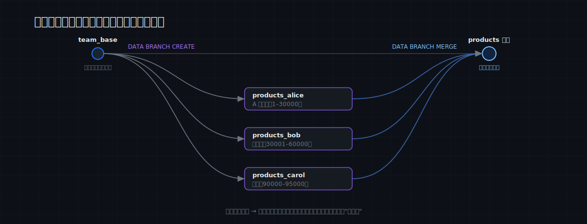
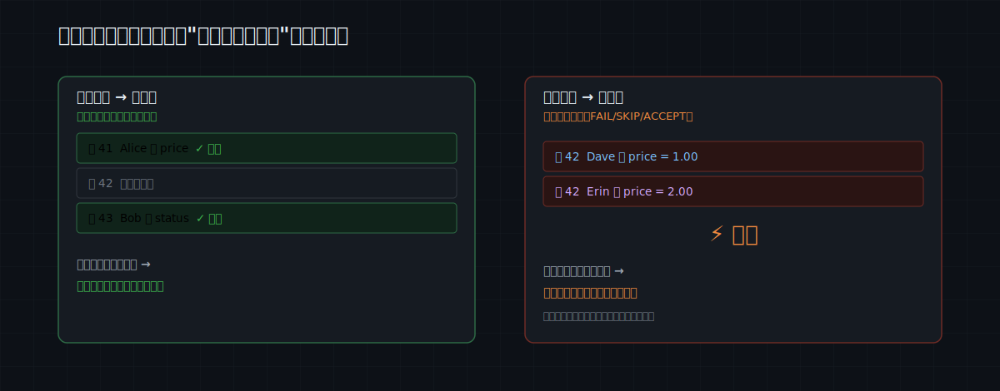
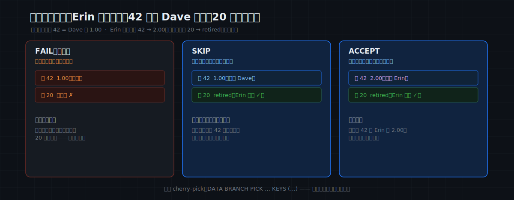

# MatrixOne Git4Data 技术详解（六）·数据运维实践篇：数据协作开发——像合并代码一样合并数据

上一篇讲的是一个人出了事故怎么救。这一篇讲一件更日常、也更容易被低估的事：**一个团队，同时改同一份数据。**

但"数据协作"先要回答一个更前提的问题：**它到底发生在什么团队？** 答案可能和直觉相反——越成熟的业务系统，越**不会**这么用。所以这一篇先把"在哪发生"讲清楚，再用一个最贴合的场景把动作完整走一遍。SQL 全部在 MatrixOne `4.0.0-rc3` 上实测过。

> 📦 本文 SQL 整体可跑：[matrixorigin/git4data-tutorial](https://github.com/matrixorigin/git4data-tutorial) 的 `06-collaborative-dev/`。环境：`docker run -d -p 6001:6001 --name matrixone matrixorigin/matrixone:4.0.0-rc3`。

---

## 数据协作开发，到底发生在什么团队？

先泼个冷水：在一家成熟的电商或大厂里，`products`、`orders` 这种核心业务表是**有归属服务**的——定价走定价系统、文案走 CMS、下架走商品生命周期流程，改动都经过 API 和审批落库。**没有哪个团队会真的去 branch 一张订单表再 merge。** 这些地方早有一套成熟的工程化流程，不需要、也不适合数据分支。

数据的 branch / merge 真正用得上，前提是另一种工作方式：**一个团队直接拥有、并且频繁手改一份数据集，中间没有一层成熟的应用系统挡着。** 满足这个的，典型就是——

- **小的 ML / 数据团队，合着养一张特征表 / 训练集**：这是最典型的一类；
- 分析团队共同维护一张口径表 / 指标表；
- 标注团队（这是本系列第十篇的主题）。

团队越小、越早期，越是**直接拿 SQL 和 notebook 改数据**、改得**勤**、还**并行**地改——"谁的改动算数"于是变成天天要面对的问题。这其实正是 DVC、lakeFS 这类工具当年为 ML 数据而生的原因。下面我们就用这个最贴合的场景：**一个三人 ML 小队，一起迭代一张特征表。**

---

## 起点：一张共享的特征表，每人一条分支

三个人在做一个流失预测模型，共用一张特征表 `ml_features`（一个用户一行：几个特征列 + 一个 label，十万行量级）。这两周，三个人要同时改它：

- **Alice 做特征工程**：重算、校准某个特征（比如把 `monetary` 重新标定）；
- **Bob 做数据清洗**：补缺失值、修离群、给漏标的样本补 label；
- **Carol 灌新数据**：接一批新来源的、已标注好的用户进来。

没有版本控制时，这种局面只有两条难走的路：要么排期串行（你改完我再改，根本来不及），要么各自 `ml_features_alice副本` 这样拷一份、最后人肉对账合并（极易把彼此的成果覆盖掉）。

git4data 的做法：固定一个全队共同的起点，三个人各 fork 一条分支，**互相完全不可见、互相完全不影响地并行干**。

```sql
CREATE SNAPSHOT team_base FOR TABLE collab_demo ml_features;   -- 全队的共同起点

DATA BRANCH CREATE TABLE feat_alice FROM ml_features;   -- Alice·特征工程
DATA BRANCH CREATE TABLE clean_bob  FROM ml_features;   -- Bob·数据清洗
DATA BRANCH CREATE TABLE data_carol FROM ml_features;   -- Carol·新数据
```

三条分支**瞬间就位**（第三篇讲过：分支只复制对象引用、不搬数据，毫秒级，十万行和六亿行一样快）。从这一刻起，谁也不用问"这张表现在谁占着"。



---

## 三个人并行改：各管一段，改完自查再合

```sql
-- Alice·特征工程（负责 1~30000 号用户）：重算 / 校准 monetary 特征
UPDATE feat_alice SET monetary = round(monetary * 1.10, 2)
WHERE user_id <= 30000 AND monetary IS NOT NULL;

-- Bob·数据清洗（负责 30001~60000）：补缺失 monetary、给漏标的补 label
UPDATE clean_bob SET monetary = 0 WHERE monetary IS NULL AND user_id BETWEEN 30001 AND 60000;
UPDATE clean_bob SET label    = 0 WHERE label    IS NULL AND user_id BETWEEN 30001 AND 60000;

-- Carol·新数据（负责 100001 号以上）：灌一批新来源的已标注用户
INSERT INTO data_carol
SELECT result + 100000, result % 90, result % 50, round(rand()*500, 2), result % 365, result % 2
FROM generate_series(1, 2000) g;
```

> ⚠ **一个实操要点：分工按「行」切，不要按「列」切。** git4data 的冲突判定是**行级**的——哪怕 Alice 改的是某用户的 `monetary`、Bob 改的是同一用户的 `label`，碰的是不同列，合并时也会算作冲突（我们写这篇时真踩到过这个坑）。所以让每个人负责**不重叠的 user_id 号段**，就天然无冲突。

合并前，每人用 DIFF 给自己的改动做一次行级 self-review——相当于提 PR 前先看一眼自己的 diff：

```sql
DATA BRANCH DIFF feat_alice AGAINST ml_features OUTPUT SUMMARY;   -- UPDATED 27000：我重算了多少行？范围对不对？
DATA BRANCH DIFF clean_bob  AGAINST ml_features OUTPUT SUMMARY;   -- UPDATED  6857：补了多少缺失 / 漏标？
DATA BRANCH DIFF data_carol AGAINST ml_features OUTPUT SUMMARY;   -- INSERTED 2000：灌进来多少新用户？
```

注意 Carol 那条是 **INSERTED 2000**——DIFF 不只看"改了哪些行"，新增、删除一样分得清。确认无误，依次合并。因为号段不重叠，三条分支**以任意顺序合并都干净通过**，不需要任何协调：

```sql
DATA BRANCH MERGE feat_alice INTO ml_features;
DATA BRANCH MERGE clean_bob  INTO ml_features;
DATA BRANCH MERGE data_carol INTO ml_features;
-- 实测：合并后主线 102000 行（Carol 的 2000 个新用户进来了），Bob 负责段的缺失值也补齐了（还剩 0 个）。
```

整个过程：**没有锁表、没有窗口期、没有"你等我先合"。** 三个人真正并行往前推。

> 🎯 **对 ML 团队还有一个额外的好处**：每条分支就是一个**完整、可复现的数据集版本**。Alice 可以直接拿 `feat_alice` 跑一版模型，看自己重算的特征到底有没有带来提升，**确认有用再合回主线**——而不是改完直接覆盖、出了问题谁也说不清是哪一步。分支让"改特征"这件事，从"赌一把"变成"先验证、再合入"。

---

## 一次大改：整表重算一个特征，当前训练集照常用

> 团队决定把某个特征整体重算一遍——比如把 `recency` 按 30 天分桶。这不是一两行 SQL，而是要试好几版、还要看对模型的影响，前后好几天。难点在于：**这期间当前这版训练集还得能用**（线上模型在用、别人也在拿它做实验）。

git4data 的做法和上一篇的迁移如出一辙：开一条分支，在分支上慢慢试，**主线零感知、照常被使用**：

```sql
DATA BRANCH CREATE TABLE feat_recompute FROM ml_features;

-- 在分支上反复迭代重算逻辑（几小时 / 几天都行），主线 ml_features 完全不受影响
UPDATE feat_recompute SET recency = (recency DIV 30) * 30;   -- 把 recency 分到 0 / 30 / 60 桶

-- 验收：切换前先 DIFF 确认改动范围正是预期
DATA BRANCH DIFF feat_recompute AGAINST ml_features OUTPUT SUMMARY;   -- UPDATED 102000（全表）

-- 一切无误，一次性原子切换（合并是秒级的一步）
DATA BRANCH MERGE feat_recompute INTO ml_features;
```

分支就是你的"实验场"：里面怎么折腾都行，外面用的人无感；切换（合并）是**秒级**一步。万一重算的特征上线后发现反而掉点？`RESTORE TABLE … {SNAPSHOT = team_base}` 一键回到改之前。

> 边界提醒：这套行级 diff/merge **要求两边 schema 一致**。如果你的改动是**加一个新特征列**（动表结构），顺序得是"**先在主线加列，再开分支灌这一列的值**"，而不是在分支里加完列再合（第四篇讲过这个边界）。

---

## 改动进主数据集之前：让队友 review 一下

> 训练集是全队的"事实来源"，谁都不想某天它被悄悄改了却没人知道、也复现不出来。于是团队定了条规矩：**任何对主数据集的改动，先在分支上做，合并前要有人 review。**

这正是 git4data 最自然的用法——把每个人的改动变成一个**可评审、可留痕的 PR**：

```sql
-- 作者：在分支上改，绝不直接动主数据集
DATA BRANCH CREATE TABLE feat_review FROM ml_features;
UPDATE feat_review SET label = 1 WHERE user_id <= 2000 AND label = 0;   -- 修正一批系统性标错的样本

-- Reviewer 把分支当 PR 审：先看规模，再逐行看，最后导出补丁存档
DATA BRANCH DIFF feat_review AGAINST ml_features OUTPUT SUMMARY;   -- UPDATED 858：改了多少、什么类型
DATA BRANCH DIFF feat_review AGAINST ml_features OUTPUT LIMIT 20;  -- 逐行看改成了什么
DATA BRANCH DIFF feat_review AGAINST ml_features OUTPUT FILE '/tmp';  -- 存一份 .sql 补丁，谁、何时、改了什么一清二楚
```

这一步，和你在 GitHub 上点开一个 PR、逐行看 diff，是**完全一样的动作**——只不过看的是数据。看完之后：

```sql
DATA BRANCH MERGE feat_review INTO ml_features;   -- 批准：合入主线
-- 或者打回：DROP TABLE feat_review; —— 主数据集一行都没动过
```

三个关键点正好对上"数据集可信"这件事：改动在**合并前对主数据集完全不可见**；review 建立在**行级事实（DIFF）**上、而非口头描述；`OUTPUT FILE` 导出的 `.sql` 补丁可以**归档留痕**，哪条样本、什么时候、被谁改成了什么，事后随时可查、可复现。

---

## 真撞车了：两个人改到了同一个用户

分工再清楚也有意外。Alice 在重算特征时调了 **42 号用户**的 `monetary`，而 Bob 在清洗时**恰好也"修"了 42 号**——42 号就撞上了，这是**真冲突**。先记住那条唯一的规则：

> **只有"两条分支都独立改了同一行"，才算真冲突。** 改的是不同的行 → 假冲突，数据库自动合并、无人介入；哪怕两人改的是同一行的不同列，也算真冲突（行级判定）。



```sql
DATA BRANCH CREATE TABLE feat_alice2 FROM ml_features;
DATA BRANCH CREATE TABLE clean_bob2  FROM ml_features;
UPDATE feat_alice2 SET monetary = 11.00 WHERE user_id = 42;   -- Alice 改 42
UPDATE clean_bob2  SET monetary = 22.00 WHERE user_id = 42;   -- Bob 也改 42（撞车）
UPDATE clean_bob2  SET label    = 1     WHERE user_id = 20;   -- Bob 独有、不冲突

DATA BRANCH MERGE feat_alice2 INTO ml_features;     -- Alice 先到，干净合入，主线 42 号 monetary = 11.00
```

现在 Bob 来合，42 号撞上了。三种裁决方式，行为各不相同（实测确认）：

```sql
-- ① FAIL（默认）：一旦发现冲突，整个合并中止回滚。
DATA BRANCH MERGE clean_bob2 INTO ml_features WHEN CONFLICT FAIL;
--   报错：conflict on pk(42)；主线一行未动——连 Bob 不冲突的 20 号也没合进来。
--   FAIL 是"全有或全无"：把冲突摆上台面，逼你先去解决。

-- ② SKIP：只跳过冲突的行，其余正常合入。
DATA BRANCH MERGE clean_bob2 INTO ml_features WHEN CONFLICT SKIP;
--   结果：42 号保留主线（Alice 的 11.00）；20 号成功合入（Bob 的 label=1）。

-- ③ ACCEPT：冲突行采用分支的值，其余也照常合入。
DATA BRANCH MERGE clean_bob2 INTO ml_features WHEN CONFLICT ACCEPT;
--   结果：42 号变成 Bob 的 22.00。
```



放到这个场景里就很具体了：如果**Bob 的清洗结果更可信**，就 `ACCEPT` 他那条分支；如果只是想把**几个确认无误的用户**单独提到主线、不合整条分支，就用 cherry-pick：

```sql
DATA BRANCH CREATE TABLE feat_pick FROM ml_features;
UPDATE feat_pick SET recency = 999 WHERE user_id IN (50, 51, 52);
-- 只把 50、51 两个用户的改动挑到主线，其余不动（PICK 需要主键）
DATA BRANCH PICK feat_pick INTO ml_features KEYS (50, 51) WHEN CONFLICT FAIL;
--   实测：只有 50、51 号被合入，52 号即便在分支里也改过，主线保持原值。
```

这里有两个容易忽略、但很关键的点：

1. **数据库把冲突显式摆出来，而不是悄悄让后写覆盖先写。** "后写静默覆盖先写"正是没有版本控制时最常见的事故来源（lost update）——多人同时改一张特征表时，它意味着有人辛辛苦苦标的数据，被另一个人一次合并悄无声息地冲掉了。
2. **要裁决的只有真撞上的那一行。** Bob 分支里其它正常改动会跟着 SKIP / ACCEPT 自动合入——要人拍板的，永远只是那几行真冲突。

> 回到上一篇埋的伏笔：第五篇里"手工 `UPDATE … JOIN` 把受损行还原、保住新订单"的定点修复，本质上就是这里 `DATA BRANCH MERGE` 自动做的三方合并——以共同祖先为基准、自动区分真假冲突。当时我们手工跑了一遍原理，现在把它交还给数据库。

---

## 几条让冲突更少的实践

- **按 user_id 号段 / 分区分工**，让各人的改动天然不重叠——这是成本最低的"无冲突"。
- **小步快合**：频繁地把小分支合回主线，比攒两周再做一次大爆炸式合并，冲突少得多。
- **全队固定一个 base 快照**（`team_base`），所有分支从它分出——血缘清晰，合并走第三篇说的增量快路径。
- **要加新特征列（动表结构）？先在主线加列、再开分支灌值**，别在分支里改完结构再合。

---

## 这就是数据的 Pull Request

把上面的动作抽出来，对照你每天在 GitHub 上做的事，几乎一一对应：

| GitHub | git4data |
|---|---|
| fork / branch | `DATA BRANCH CREATE TABLE … FROM …` |
| 看自己 / 别人的 diff | `DATA BRANCH DIFF … AGAINST … OUTPUT SUMMARY / LIMIT / FILE` |
| merge PR | `DATA BRANCH MERGE … INTO …` |
| 冲突解决 | `WHEN CONFLICT FAIL / SKIP / ACCEPT` |
| cherry-pick | `DATA BRANCH PICK … INTO … KEYS (…)` |
| 回到分叉点 | `RESTORE TABLE … {SNAPSHOT = team_base}` |

区别只有一个：GitHub 合的是代码文件，这里合的是**一张几十万、乃至上亿行的表**——而且分支、合并都是秒级，与表多大无关。

---

## 成本与边界

- **分支免费、合并秒级**，且与表多大、并行多少人无关：之前实测过，6 亿行的表、4 个人各自 fork、各改百万行，每次合并都是**秒级**。无论是三人小队还是更大的数据团队，瓶颈都不在 git4data 这一侧。
- **冲突裁决是行级，不是单元格级**：同一行的不同列也算冲突（第四篇讲过；单元格级自动合并是未来工作）。
- **diff / merge 要求 schema 一致**，且血缘可用时才走增量快路径（第三篇）。
- **`FAIL` 是全有或全无**：要"部分合并"，用 `SKIP` / `ACCEPT`，或用 `PICK` 精确挑行。

---

## 结语

数据协作开发不是一个抽象能力，而是**一个团队直接共养一份数据集时，每天都会用上的基础设施**：分支免费、合并秒级、冲突显式且只裁决真撞上的行。它最先打动的，往往就是那些"几个人一起喂一个模型"的小队——没有成熟流程兜着，改特征、补标注、灌新数据全靠手，"谁的改动算数"过去只能靠群里喊话，现在和合并代码一样自然。

但有个问题这篇还没回答：合并进主数据集的数据，**质量谁来把关**？万一某条分支合进来的本身就是脏数据呢？下一篇讲发布侧的答案：**Write-Audit-Publish**——新数据先进 staging 分支、过一道 SQL 审计门禁、再原子发布，让主数据集**永远看不到**没过关的数据。

> 📎 可运行 SQL：[github.com/matrixorigin/git4data-tutorial](https://github.com/matrixorigin/git4data-tutorial) ｜ 源码与社区：[github.com/matrixorigin/matrixone](https://github.com/matrixorigin/matrixone)
