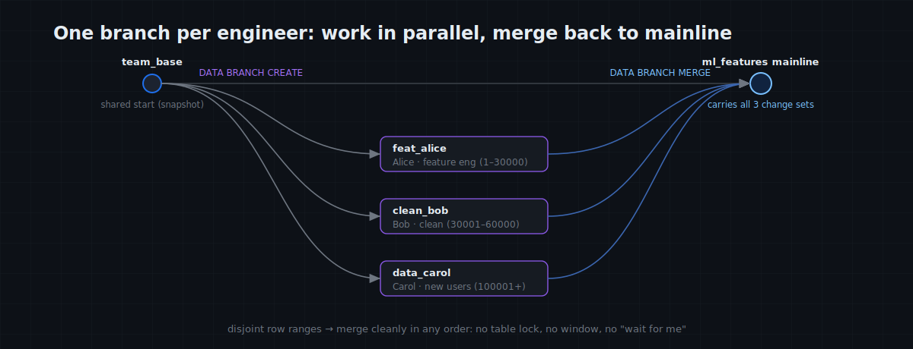
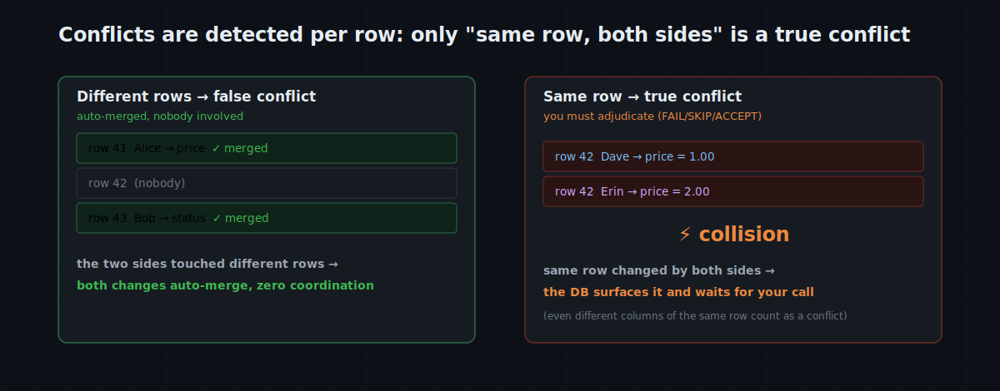
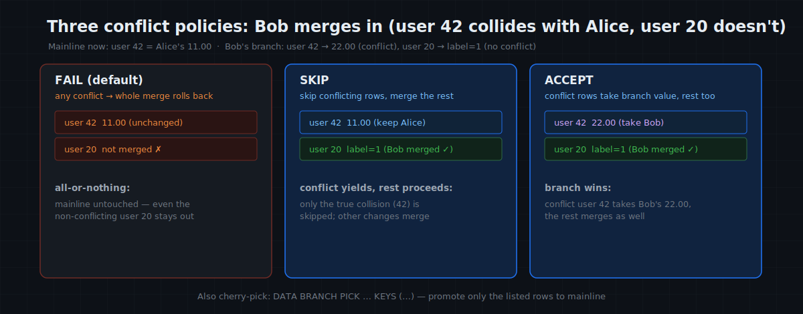

# MatrixOne Git4Data Deep Dive (Part 6) · Data Operations in Practice — Collaborative Data Development: Merge Data the Way You Merge Code

The last article was about one person rescuing one accident. This one is about something more everyday, and easy to underrate: **a team editing the same data at the same time.**

But where does "data collaboration" actually show up? This article first lays out the situations where it happens, then walks the moves end to end in the one that fits best to illustrate. Every statement is verified on MatrixOne `4.0.0-rc3`.

> 📦 All SQL runs as one script: [matrixorigin/git4data-tutorial](https://github.com/matrixorigin/git4data-tutorial), under `06-collaborative-dev/`. Environment: `docker run -d -p 6001:6001 --name matrixone matrixorigin/matrixone:4.0.0-rc3`.

---

## Where does collaborative data development show up?

More often than you'd think — **the moment a team directly owns and frequently hand-edits the same dataset, data collaboration is already happening**; the only choice is whether you do it the Git way or the old way (a pile of copies + coordinating in a group chat). For example:

- **A small ML / data team raising a shared feature table / training set**: people adding features, filling labels, ingesting new data at once;
- **A retail / e-commerce team doing a bulk repricing or a campaign push**: ops, pricing, and catalog all editing the same products table before a deadline;
- **An analytics team co-maintaining a canonical metrics table**: each tweaks their own definitions, aligned before publish;
- **Several people cleaning or labeling a batch of data together**: each takes a part, all merged at the end.

What they share, in one line: **several people and several change sets must move forward at once, then come together safely.** So "whose change wins" becomes a daily question — and the smaller the team, the more often they edit, the more they reach straight for SQL and notebooks, the sharper it gets.

Below we take the most representative of these — **a three-person ML team iterating on one shared feature table** — and walk the moves end to end. The other scenarios use the same set: branch, self-review, merge, adjudicate conflicts.

---

## The starting point: one shared feature table, one branch per person

Three people are building a churn model on a shared feature table `ml_features` (one row per user: a few feature columns + a label, on the order of 100,000 rows). For two weeks, all three need to edit it at once:

- **Alice does feature engineering**: recompute and calibrate a feature (say, rescale `monetary`);
- **Bob does data cleaning**: fill missing values, fix outliers, label the unlabeled;
- **Carol brings new data**: ingest a fresh batch of already-labeled users from a new source.

Without version control, this leaves two painful paths: serialize by schedule (you finish before I start — there isn't time), or each makes an `ml_features_alice_copy` and reconciles by hand at the end (a great way to silently clobber each other's work).

git4data's way: pin a shared starting point, and each person forks their own branch to work **completely invisible to and independent of the others**.

```sql
CREATE SNAPSHOT team_base FOR TABLE collab_demo ml_features;   -- the team's shared start

DATA BRANCH CREATE TABLE feat_alice FROM ml_features;   -- Alice · feature engineering
DATA BRANCH CREATE TABLE clean_bob  FROM ml_features;   -- Bob   · data cleaning
DATA BRANCH CREATE TABLE data_carol FROM ml_features;   -- Carol · new data
```

All three branches appear **instantly** (Part 3: a branch copies object references, not data — milliseconds, the same for 100K rows or 600M). From now on nobody has to ask "who's holding the table right now."



---

## Three people edit in parallel: own a slice, self-review, then merge

```sql
-- Alice · feature engineering (owns users 1–30000): recompute / calibrate `monetary`
UPDATE feat_alice SET monetary = round(monetary * 1.10, 2)
WHERE user_id <= 30000 AND monetary IS NOT NULL;

-- Bob · data cleaning (owns 30001–60000): fill missing monetary, label the unlabeled
UPDATE clean_bob SET monetary = 0 WHERE monetary IS NULL AND user_id BETWEEN 30001 AND 60000;
UPDATE clean_bob SET label    = 0 WHERE label    IS NULL AND user_id BETWEEN 30001 AND 60000;

-- Carol · new data (owns 100001+): ingest a fresh batch of already-labeled users
INSERT INTO data_carol
SELECT result + 100000, result % 90, result % 50, round(rand()*500, 2), result % 365, result % 2
FROM generate_series(1, 2000) g;
```

> ⚠ **A practical rule: split the work by ROW, not by COLUMN.** git4data detects conflicts at the **row** level — even if Alice changes a user's `monetary` and Bob changes the same user's `label` (different columns), the merge still counts it as a conflict (we hit this exact trap writing this piece). So have each person own a **disjoint user_id range**, and merges stay clean.

Before merging, each person runs DIFF for a row-level self-review — like glancing at your own diff before opening a PR:

```sql
DATA BRANCH DIFF feat_alice AGAINST ml_features OUTPUT SUMMARY;   -- UPDATED 27000: how many rows did I recompute? Right scope?
DATA BRANCH DIFF clean_bob  AGAINST ml_features OUTPUT SUMMARY;   -- UPDATED  6857: how many missing / unlabeled did I fill?
DATA BRANCH DIFF data_carol AGAINST ml_features OUTPUT SUMMARY;   -- INSERTED 2000: how many new users came in?
```

Note Carol's is **INSERTED 2000** — DIFF doesn't only see "which rows changed"; it tells inserts and deletes apart too. All good — merge them in turn. Because the ranges don't overlap, the three branches **merge cleanly in any order**, with zero coordination:

```sql
DATA BRANCH MERGE feat_alice INTO ml_features;
DATA BRANCH MERGE clean_bob  INTO ml_features;
DATA BRANCH MERGE data_carol INTO ml_features;
-- Verified: mainline is 102000 rows after the merge (Carol's 2000 new users came in),
-- and the missing values in Bob's range are filled (0 left).
```

The whole thing: **no table lock, no maintenance window, no "wait for me to merge first."** Three people genuinely push forward in parallel.

> 🎯 **A bonus for ML teams**: each branch *is* a **complete, reproducible dataset version.** Alice can train a model straight off `feat_alice` to see whether her recomputed feature actually helps, and **merge it back only once it does** — instead of overwriting in place and having nobody able to say which step caused a regression. A branch turns "change a feature" from a gamble into "validate first, then merge."

---

## A big change: recompute one feature table-wide, while the current set keeps serving

> The team decides to recompute a feature across the board — say, bucket `recency` into 30-day buckets. This isn't one or two statements; it's several iterations, plus checking the effect on the model, spanning days. The catch: **the current training set still has to be usable** the whole time (the online model uses it, others run experiments off it).

git4data's way is the same as the last article's migration: open a branch, tinker on it, while **mainline stays in use, none the wiser**:

```sql
DATA BRANCH CREATE TABLE feat_recompute FROM ml_features;

-- Iterate the recompute logic on the branch (hours/days); mainline ml_features is untouched.
UPDATE feat_recompute SET recency = (recency DIV 30) * 30;   -- bucket recency into 0 / 30 / 60

-- Acceptance: before cutover, DIFF to confirm the scope is exactly what you expect.
DATA BRANCH DIFF feat_recompute AGAINST ml_features OUTPUT SUMMARY;   -- UPDATED 102000 (whole table)

-- All clear — cut over in one atomic, second-scale step.
DATA BRANCH MERGE feat_recompute INTO ml_features;
```

The branch is your sandbox: tinker however you like inside; the people using mainline feel nothing; the cutover (the merge) is a **seconds-long** step. If the recomputed feature turns out to *hurt* the model after it ships? `RESTORE TABLE … {SNAPSHOT = team_base}` rolls back to before the change.

> Boundary note: this row-level diff/merge **requires both sides to share a schema**. If your change **adds a new feature column** (alters the structure), the order must be "**add the column on mainline first, then branch to fill that column's values**," not alter the structure on a branch and merge it back (Part 4 covered this).

---

## Before it enters the canonical set: have a teammate review it

> The training set is the team's source of truth; nobody wants it quietly changed one day with no one the wiser and no way to reproduce it. So the team sets a rule: **any change to the canonical set is made on a branch, and reviewed before it merges.**

This is git4data's most natural use — turning each person's change into a **reviewable, recorded PR**:

```sql
-- Author: work on a branch, never touch the canonical set directly
DATA BRANCH CREATE TABLE feat_review FROM ml_features;
UPDATE feat_review SET label = 1 WHERE user_id <= 2000 AND label = 0;   -- fix a systematically mislabeled slice

-- Reviewer treats the branch as a PR: scope, then row by row, then export a patch for the record
DATA BRANCH DIFF feat_review AGAINST ml_features OUTPUT SUMMARY;   -- UPDATED 858: how much, what kind
DATA BRANCH DIFF feat_review AGAINST ml_features OUTPUT LIMIT 20;  -- exactly what changed
DATA BRANCH DIFF feat_review AGAINST ml_features OUTPUT FILE '/tmp';  -- a .sql patch: who changed what, when
```

This is the **same action** as opening a PR on GitHub and reading the diff line by line — only it's data. After the review:

```sql
DATA BRANCH MERGE feat_review INTO ml_features;   -- approve: merge into mainline
-- or reject: DROP TABLE feat_review; — the canonical set was never touched
```

Three points map straight onto "a trustworthy dataset": the change is **invisible to the canonical set until the merge**; the review is grounded in **row-level fact (DIFF)**, not a verbal summary; and the `OUTPUT FILE` `.sql` patch can be **archived** — which sample was changed to what, by whom, and when, all reproducible later.

---

## When two people collide: both touch the same user

Even clear division of labor has accidents. While recomputing features, Alice tweaked **user #42's** `monetary` — and while cleaning, Bob **happened to "fix" #42 too**. #42 collides — a **true conflict**. First, the one rule:

> **It's a true conflict only when two branches independently changed the SAME row.** Different rows → a false conflict, auto-merged with nobody involved; and even two people changing different columns of the same row counts as a true conflict (row-level detection).



```sql
DATA BRANCH CREATE TABLE feat_alice2 FROM ml_features;
DATA BRANCH CREATE TABLE clean_bob2  FROM ml_features;
UPDATE feat_alice2 SET monetary = 11.00 WHERE user_id = 42;   -- Alice: user 42
UPDATE clean_bob2  SET monetary = 22.00 WHERE user_id = 42;   -- Bob:   user 42 (collision)
UPDATE clean_bob2  SET label    = 1     WHERE user_id = 20;   -- Bob-only, no conflict

DATA BRANCH MERGE feat_alice2 INTO ml_features;     -- Alice lands first; mainline #42 monetary = 11.00
```

Now Bob merges and #42 collides. Three policies, each behaving differently (confirmed in testing):

```sql
-- ① FAIL (default): on ANY conflict, the whole merge aborts and rolls back.
DATA BRANCH MERGE clean_bob2 INTO ml_features WHEN CONFLICT FAIL;
--   Error: conflict on pk(42); mainline untouched — even Bob's non-conflicting #20 did NOT merge.
--   FAIL is all-or-nothing: it puts the conflict on the table for you to resolve.

-- ② SKIP: skip only the conflicting row; merge the rest.
DATA BRANCH MERGE clean_bob2 INTO ml_features WHEN CONFLICT SKIP;
--   Result: #42 keeps mainline's value (Alice's 11.00); #20 merges in (Bob's label=1).

-- ③ ACCEPT: conflicting row takes the branch value; the rest merge too.
DATA BRANCH MERGE clean_bob2 INTO ml_features WHEN CONFLICT ACCEPT;
--   Result: #42 becomes Bob's 22.00.
```



In this scenario it's concrete: if **Bob's cleaning is more trustworthy**, `ACCEPT` his branch; if you only want **a few verified users** promoted to mainline rather than the whole branch, cherry-pick:

```sql
DATA BRANCH CREATE TABLE feat_pick FROM ml_features;
UPDATE feat_pick SET recency = 999 WHERE user_id IN (50, 51, 52);
-- Promote only users 50 and 51 to mainline, nothing else (PICK needs a primary key)
DATA BRANCH PICK feat_pick INTO ml_features KEYS (50, 51) WHEN CONFLICT FAIL;
--   Verified: only 50 and 51 merge in; even though 52 was changed on the branch, mainline keeps its value.
```

Two easily-missed but crucial points:

1. **The database surfaces the conflict explicitly, instead of silently letting the later write overwrite the earlier one.** "Later write silently overwrites earlier" is the classic source of incidents without version control (the lost update) — when several people edit one feature table, it means someone's painstakingly-labeled data gets quietly wiped by another person's merge.
2. **Only the genuinely-colliding row needs adjudication.** Bob's other legitimate changes merge automatically under SKIP/ACCEPT — the only thing a human decides is those few true collisions.

> Back to the thread Part 5 planted: the "hand-rolled `UPDATE … JOIN` to restore the damaged rows and keep the new orders" from incident rescue is, at heart, exactly the three-way merge `DATA BRANCH MERGE` does automatically — against a common ancestor, telling true from false conflicts. There we ran the principle by hand; here we hand it back to the database.

---

## A few practices that mean fewer conflicts

- **Split the work by user_id range / partition** so people's changes naturally don't overlap — the cheapest "no conflict."
- **Small, frequent merges**: merging small branches back often beats hoarding two weeks of work for one big-bang merge.
- **Fix one base snapshot for the team** (`team_base`) and branch everyone off it — clean lineage, and merges take the incremental fast path from Part 3.
- **Adding a new feature column (a schema change)? Change it on mainline first, then branch to fill values** — don't alter the structure on a branch and merge it back.

---

## This is the Pull Request, for data

Pull the moves out and map them to GitHub — nearly one-to-one:

| GitHub | git4data |
|---|---|
| fork / branch | `DATA BRANCH CREATE TABLE … FROM …` |
| read your / someone's diff | `DATA BRANCH DIFF … AGAINST … OUTPUT SUMMARY / LIMIT / FILE` |
| merge PR | `DATA BRANCH MERGE … INTO …` |
| resolve conflicts | `WHEN CONFLICT FAIL / SKIP / ACCEPT` |
| cherry-pick | `DATA BRANCH PICK … INTO … KEYS (…)` |
| go back to the fork point | `RESTORE TABLE … {SNAPSHOT = team_base}` |

Only one difference: GitHub merges code files; this merges a **table of hundreds of thousands — even billions — of rows** — and branch and merge are both second-scale, independent of how big the table is.

---

## Cost and boundaries

- **Branches are free, merges are seconds** — independent of table size or how many people work at once: measured before, a 600M-row table with 4 people each forking and changing a million rows, every merge **in seconds**. Whether it's a three-person team or a larger data org, git4data isn't the bottleneck.
- **Conflict adjudication is row-level, not cell-level**: different columns of the same row still count as a conflict (Part 4; cell-level auto-merge is future work).
- **diff/merge requires a shared schema**, and the incremental fast path needs lineage (Part 3).
- **`FAIL` is all-or-nothing**: for a "partial merge," use `SKIP` / `ACCEPT`, or `PICK` to promote exact rows.

---

## Closing

Collaborative data development isn't an abstract capability — it's the **infrastructure a team reaches for every day once they raise a dataset together**: branches free, merges in seconds, conflicts explicit and only the true collisions adjudicated. The people it wins over first are usually the small squads "feeding one model together" — no mature pipeline to lean on, changing features, filling labels, ingesting new data all by hand, where "whose change wins" used to mean shouting in a group chat, and is now as natural as merging code.

But one question this article hasn't answered: who guards the **quality** of what gets merged into the canonical set? What if a branch merges in dirty data? Next time, the answer from the release side: **Write-Audit-Publish** — new data lands on a staging branch, passes an SQL audit gate, then publishes atomically, so the canonical set **never sees** data that didn't pass.

> 📎 Runnable SQL: [github.com/matrixorigin/git4data-tutorial](https://github.com/matrixorigin/git4data-tutorial) ｜ Source & community: [github.com/matrixorigin/matrixone](https://github.com/matrixorigin/matrixone)
