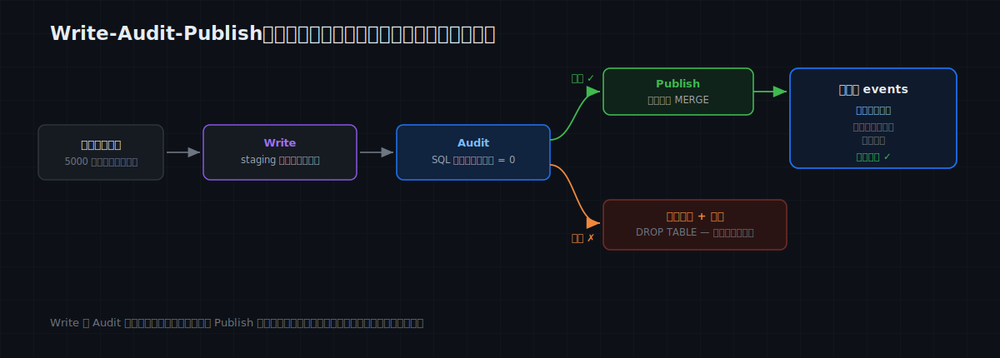
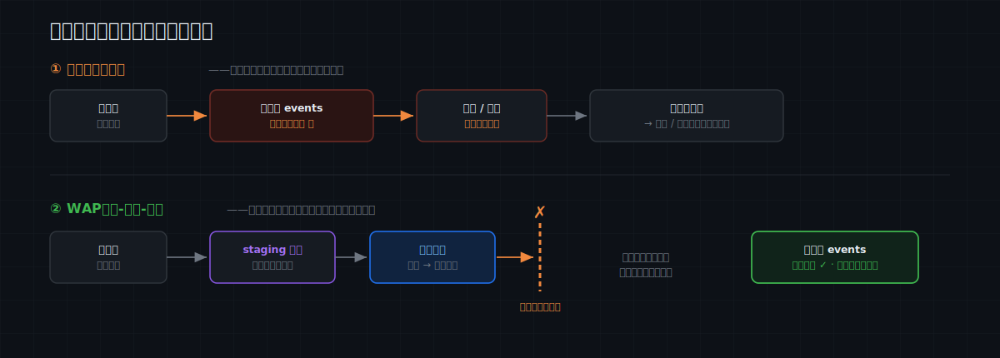

# MatrixOne Git4Data 技术详解（七）·数据运维实践篇：Write-Audit-Publish——给数据流水线装一道发布门禁

数据流水线有一个老大难问题：**上游来的数据，质量不归你管，但出了事算你的。**

凌晨三点，定时 ETL 把昨天的一批新数据灌进生产表 `events`——报表、看板、下游作业、特征管道全都在读它。这批数据里混着上游常见的脏东西：空 `user_id`、负数金额、一眼假的离群值、对不上维表的用户。等白天有人发现时，晨会看板已经算错、下游作业已经跑完、模型已经拿它训了一轮。然后是更难的部分：**脏数据和好数据已经混在同一张表里**，事后把它摘干净，比当初挡在门外难十倍——那又回到了第五篇的事故救援。

软件工程对这类问题的标准答案是 **CI 门禁**：代码得先过测试，才能合进主干。数据世界的对应物，叫 **Write-Audit-Publish（WAP）**——新数据先写进隔离区、通过审计、再发布。过去要搭这套，得靠 Iceberg / lakeFS 这类"湖上"工具；在 **MatrixOne** 里，靠内建的 git4data 能力，它就是分支的一个基本用法。这一篇我们把它写细：**什么时候需要它、三步怎么落地、以及别的方案为什么不好使**。SQL 全部在 MatrixOne `4.0.0-rc3` 上实测过。

> 📦 本文 SQL 整体可跑：[matrixorigin/git4data-tutorial](https://github.com/matrixorigin/git4data-tutorial) 的 `07-write-audit-publish/`。环境：`docker run -d -p 6001:6001 --name matrixone matrixorigin/matrixone:4.0.0-rc3`。

---

## 什么时候你会需要 WAP？

WAP 不是每张表都要上——它专治的是 **ETL（数据管道）** 里的一类处境：**一张有下游消费者的表，被管道定期灌入来自你不完全信任的来源的新数据。** 下面这些**都是 ETL 场景**，本质是同一件事——你在跑一条数据管道，往一张被人读的表里灌数：

- **每天 / 每小时的 ETL 批量入库**：一张被报表、看板、下游作业持续读的表，凌晨批量灌数。一次坏批次，早上整个公司看到的都是错的。
- **接入你不掌控的外部数据源**：合作方的数据 feed、第三方 API、爬来的数据、用户上传——质量参差，今天好好的，明天上游改了个字段就全乱。
- **给训练 / 特征管道供数**：脏数据不会报错，它只会**静默地把模型训歪**（上一篇那张特征表，最怕这个）。
- **发布一张很多人依赖的口径表 / 指标表**：一处口径错，下游一片跟着错。
- **回流数据到业务系统（Reverse ETL）**：把算好的结果推回生产库、推给营销 / 风控系统——一次错误推送是有真实后果的。

这些 ETL 场景的共同点：**问题数据一旦进了生产表，伤害就已经发生了**（下游读到了、决策做了、模型训了），再去补救就是事故。WAP 的整个价值，就是把"发现问题"这件事，从"生产之后"提前到"发布之前"——相当于给你的 ETL 管道加一道发布前的门禁。

---

## WAP 三步：Write → Audit → Publish

下面用一张真实语境的表把三步走完。生产表 `events` 有 10 万行昨天的干净数据，下游持续在读；另有一张维表 `dim_users`，事实表的 `user_id` 必须能对上它。

### Write：新数据永远先落在 staging 分支

今天的新批次**绝不直接碰生产表**。先给它开一条 staging 分支——毫秒级、零拷贝（第三篇讲过原理），再把批次灌进这条分支：

```sql
DATA BRANCH CREATE TABLE events_stage FROM events;   -- staging 分支，毫秒级

-- 今天的批次 5000 行，落到 staging。里面混着真实上游常见的脏数据：
-- 空 user_id、对不上维表的用户、负数金额、离谱离群值
INSERT INTO events_stage
SELECT 200000 + result,
       CASE WHEN result % 97 = 0 THEN NULL
            WHEN result % 89 = 0 THEN 999999          -- 维表里没有的用户
            ELSE result % 5000 END,
       CASE WHEN result % 250 = 0 THEN -1.00
            WHEN result % 333 = 0 THEN 999999.99
            ELSE round(rand()*500 + 1, 2) END,
       'paid', '2026-06-30'
FROM generate_series(1, 5000) g;
```

此刻生产表 `events` 一行未动，下游读到的还是昨天那份干净数据。脏数据被关在 staging 里——这就是 WAP 的第一性原理：**先隔离，再谈质量。**

### Audit：SQL 就是质量门禁

审计就是一组跑在 staging 上的 SQL 断言——**每一条都应该返回 0**，只要有一条不为 0，门禁就不放行。一套像样的审计通常覆盖这几类检查：

```sql
-- ① 完整性 + 取值域 + 业务规则：关键字段非空、金额合理、状态合法
SELECT
  SUM(CASE WHEN user_id IS NULL THEN 1 ELSE 0 END)  AS null_user,
  SUM(CASE WHEN amount  < 0     THEN 1 ELSE 0 END)  AS negative_amount,
  SUM(CASE WHEN amount  > 10000 THEN 1 ELSE 0 END)  AS outlier_amount,
  SUM(CASE WHEN status NOT IN ('paid','refunded','void') THEN 1 ELSE 0 END) AS bad_status
FROM events_stage WHERE ts = '2026-06-30';

-- ② 参照完整性：批次里的 user_id 必须都能在维表里找到
SELECT COUNT(*) AS orphan_users
FROM events_stage s LEFT JOIN dim_users d ON s.user_id = d.user_id
WHERE s.ts = '2026-06-30' AND s.user_id IS NOT NULL AND d.user_id IS NULL;

-- ③ 体量：今天批次的行数要落在合理区间（防上游双灌、防空跑）
SELECT COUNT(*) AS batch_rows FROM events_stage WHERE ts = '2026-06-30';
```

实测这批脏数据，门禁一条条把问题抓了出来：

| 检查 | 结果 |
|---|---|
| `null_user`（空用户） | **51** ✗ |
| `negative_amount`（负数金额） | **20** ✗ |
| `outlier_amount`（离群值） | **15** ✗ |
| `orphan_users`（对不上维表） | **56** ✗ |
| `batch_rows`（体量） | 5000 ✓ |

**门禁不放行。** 这里还能顺手加更多检查——**唯一性**（主键 / 自然键无重复：`GROUP BY key HAVING COUNT(*) > 1`）、**新鲜度**（`MAX(ts)` 得是今天）、**分布漂移**（这批的空值率 / 金额均值，和历史比有没有突变）。它们都只是 SQL，想加就加。

### 门禁不过怎么办：直接拒收，生产零感知

关键就在这一步：**门禁没过，你什么都不用对生产做——因为生产从头到尾就没碰过这批数据。** 把 staging 分支一扔即可：

```sql
DROP TABLE events_stage;                                -- 拒收这一批
SELECT COUNT(*) FROM events;                            -- 还是 100000，一行没动
SELECT COUNT(*) FROM events WHERE ts = '2026-06-30';    -- 0，这批根本没进来
```

实测：拒收之后生产表还是 **10 万行**，今天这批脏数据**一行都没进生产**。接下来就是排查上游、修好、重跑——而不是在生产上做事故救援。

> 想留现场 debug？**别 DROP，留着这条 staging 分支就行**——它就是一份完整、隔离的事故现场，你可以慢慢查上游到底发了什么，期间完全不影响生产。

### Publish：通过审计，一次原子发布

换成修好后的干净批次，审计全绿（`null_user / negative / outlier / orphan` 全 0、`MAX(ts)` 是今天）。发布前，再用 DIFF 看一眼这批**究竟**会给生产带来什么——行级、确切：

```sql
DATA BRANCH DIFF events_stage AGAINST events OUTPUT SUMMARY;   -- INSERTED 5000：确切就是这 5000 行
```

确认无误，一次原子合并：

```sql
DATA BRANCH MERGE events_stage INTO events;
```

这一步是**原子**的：下游读者要么看到完整的、已审计的整批 5000 行，要么（在这条语句之前）一行也看不到——**不存在"发布到一半"的中间状态**。实测：

```sql
SELECT COUNT(*) FROM events;                                                    -- 105000
SELECT COUNT(*) FROM events WHERE user_id IS NULL OR amount < 0 OR amount > 10000;  -- 0
```

生产表从 10 万变 10.5 万，而且从头到尾**没出现过一行脏数据**。



---

## 别的方案怎么做？带上数据库选型，逐个对比

"不就是灌数前先检查一下嘛？" 最朴素的做法——**直接灌进生产、事后再查**——也最常见、最痛：等检查发现问题，脏数据早已在生产表里、被下游读走了（这就是"先发布，再祈祷"）。WAP 就是为了避免这一幕。但**真要落地 WAP，做法取决于你手上是什么系统**。分三类看：

### 一、湖上的 git 式方案：Iceberg 分支、lakeFS（WAP 的发源地，真能做）

- **Apache Iceberg（分支）**：写进一条 audit 分支（`spark.wap.branch`）、在分支上跑质量检查、通过就 `fast_forward` 到 `main`。分支零拷贝、fast-forward 是纯元数据操作且原子——**思路和 MatrixOne 的做法几乎一样**，因为 WAP 本就发源于此。差异在**落点**：Iceberg 是**对象存储上的表格式**，自己不执行查询，得靠 Spark / Trino / Flink 这类外部引擎来读写、跑审计；它面向**分析（AP）**，"生产表"是湖上给分析读的数据集，**不是一个还在对外服务点查 / 事务的库**。要跑 WAP，得配 engine（Spark 的 WAP 模式）、catalog 和一整套 lake 栈。
- **lakeFS**：给整个数据湖做 git——branch 整个 repo、写到分支、用 **pre-merge hooks（`actions.yaml`）** 当审计门禁、通过才 merge 到 `main`。merge 是 repo 级原子，**天然多表 / 多文件一致**。差异：lakeFS 版本化的是**对象存储里的文件 / 路径**，不是数据库表；它挡在 S3 前面，你仍要用外部引擎（Spark / Trino / DuckDB）在版本化路径上查数；审计逻辑跑在 webhook / Airflow 里（另一套编排）。

这两者**确实把 WAP 做对了**，**MatrixOne 和它们走的是同一条路**（git4data 不是独立产品，而是 MatrixOne 内建的这套 git 式能力）。区别在**落点**：它们保护的是**湖 / 数仓里给分析读的数据集**，需要"存储格式 + 外部引擎 + catalog / hooks"一整套栈；而 MatrixOne 把**同一套 git 式 WAP 直接做进它自己这个还在对外服务的 HTAP 数据库**——审计是同库里的普通 SQL，发布是库内的原子 MERGE，读的人就是这个库的消费者。

### 二、传统数仓 / 数据库上"凑"WAP（没有 git 分支，只能靠交换）

- **Snowflake**：零拷贝 `CLONE` 出 staging、灌 + 审计，再 `ALTER TABLE prod SWAP WITH staging`（两条 RENAME 在一个事务里、原子、连权限一起换）。clone 零拷贝这点很像分支。差异：**SWAP 是整表替换、且是单表**——要"只追加今天 5000 行"，你得 clone→insert→swap 一整张表，每次都在**换掉全表**；多表要原子得自己拼；且 Snowflake 是数仓（AP），不服务在线点查。
- **PostgreSQL / MySQL**：没有分支。可行的近似是**分区交换**——把新批次灌进一张单独的表、校验，再 `ALTER TABLE … ATTACH PARTITION`（PG）/ `EXCHANGE PARTITION`（MySQL）挂上去；或者 staging 表 + `RENAME` 交换、外面用事务包住。差异：分区交换只适用于**按分区键（如日期）追加**、挂载要拿锁、还要过 CHECK 约束扫描；RENAME 交换有前面说的多表不原子、句柄 / 索引 / 权限重建问题；事务包住则长事务持锁、拖垮在线表。
- **BigQuery**：没有分支。staging 表 + 事务里 `MERGE` / `CREATE OR REPLACE TABLE` / 分区覆写，或表快照 + 覆盖。形态同上：要么整表 / 整分区替换，要么大 MERGE 有中间态和成本。

这类系统**都在"绕过没有分支"这件事**——用整表 / 整分区的**交换**来近似原子发布。代价是：只能整块换（不适合行级增量 upsert）、多表难原子、换的过程要么锁表、要么重建一堆附属对象。

### 三、数据质量工具：dbt tests / Great Expectations / Soda

它们是**审计的定义层，不是存储的门禁层**。写检查很在行，但**执行时机**常常是"数据已经落进目标表之后再测"（`dbt build` 先 build 进目标、再 test）——门禁和存储是两回事，中间那道缝里脏数据可能已被读走。要做成真门禁，底层仍要靠第一 / 二类的 branch 或 swap。它们和 MatrixOne 不是竞争，而是**互补**：用它们定义 checks，用 MatrixOne 的分支 + 原子 MERGE（即 git4data 能力）做那道真正拦得住的门。

| 方案 | 隔离机制 | 发布机制 | 增量追加 | 多表原子 | 需外部引擎 | 能服务在线读 |
|---|---|---|---|---|---|---|
| Iceberg 分支 | 零拷贝分支 | fast-forward（元数据，原子） | 支持 | 弱（表级） | 是（Spark/Trino） | 否（湖上 AP） |
| lakeFS | repo 分支 | merge（原子，带 hooks 门禁） | 支持 | **强（repo 级）** | 是 | 否（文件层） |
| Snowflake | 零拷贝 clone | SWAP（整表交换，原子） | **整表换** | 弱 | 否（自带） | 否（数仓 AP） |
| PG / MySQL | staging 表 / 分区 | ATTACH / EXCHANGE / RENAME | 按分区 | 弱 | 否 | 是（但要锁 / 重建） |
| dbt / GE / Soda | —（只定义检查） | 依赖底层 | — | — | 取决于底层 | — |
| **MatrixOne（git4data 能力）** | **零拷贝分支** | **原子 MERGE（行级增量）** | **原生** | **库级快照兜底** | **否（同引擎 SQL）** | **是（HTAP，直接服务）** |

一句话总结：WAP 这套 git 式门禁，过去要么在**湖上**做（Iceberg / lakeFS——但那不是能对外服务的库，还得配一套引擎栈），要么在**数仓 / 库**上用"整表交换"硬凑（Snowflake SWAP、PG 分区交换——粒度粗、多表难原子）。MatrixOne 是少见的把它做进**一个还在对外服务的 HTAP 数据库、且发布是行级增量原子 MERGE** 的方案（git4data 就是它内建的这套能力）——审计就是同一个库里的 SQL，不用再搭一套。



---

## 多表要一起发布？用库级快照兜底

如果一次发布要同时更新事实表和多张维表，想要"要么全发、要么全不发"，可以在发布前给整个库打一个快照，再逐表 `MERGE`；任何一步审计 / 合并出问题，就 `RESTORE DATABASE db {SNAPSHOT = s}` 把整库一起拨回发布前——多表的原子性，用第五篇讲过的**库级快照**来兜底（单条 `DATA BRANCH MERGE` 本身是表级的）。

---

## 把它接进流水线：数据的 CI/CD

这套流程天生适合自动化，挂到调度器 / CI 里，每天的批次自动走一遍：

1. **Write**：批次到达 → 自动 `DATA BRANCH CREATE` 一条当天的 staging 分支，灌入。
2. **Audit**：自动跑那组审计 SQL，任一条 > 0 → 判定失败。
3. **Publish / Reject**：全绿 → `DATA BRANCH MERGE` 发布；有红 → **不发布、告警、并保留 staging 分支当现场**。

心智模型的变化才是关键：

> 没有 WAP：生产表 = 数据的**入口**，质量问题进来了再说。
> 有了 WAP：生产表 = 数据的**出口**，只有通过审计的数据才配进来。

这就是**数据的 CI/CD**：门禁不过，坏数据连生产的门都进不来。

---

## 成本与边界

- **门禁几乎免费**：staging 分支毫秒级、零拷贝；审计就是普通 SQL；发布是一次秒级 MERGE，与表多大无关。这道门禁不会成为流水线的瓶颈。
- **审计的强度 = 你写的检查的强度**：WAP 给的是"**能可靠地拦住**"这个机制，拦什么得你用 SQL 定义。机制再好，也替不了你想清楚"这批数据怎样才算合格"。
- **分支 / 快照会占存储直到释放**：被 staging 分支或快照钉住的历史对象不会被后台 GC，拒收后记得 `DROP`（留作现场的也要有清理策略）。
- **多表原子发布**靠库级快照兜底（见上）。
- **行级 diff / merge 要求两边 schema 一致**（第四篇的边界）：批次要新增列，先在主线改 schema，再灌值。

---

## 结语

至此，数据运维三部曲收官：**个人的安全网**（第五篇，出事能秒级回退）、**团队的并行**（第六篇，分支与合并）、**生产的门禁**（本篇，脏数据进不来）。三件事共用同一套原语——snapshot、branch、diff、merge——这正是"把版本控制装进数据库"的意义：不是多了一个功能，而是多了一种工作方式。

下一篇起，进入 **AI 训练** 主题。第一站是最经典的一个问题：数据每天都在变，凭什么每次都全量重训？用 DIFF 把"变了的那部分"精确取出来，**只训增量**。

> 📎 可运行 SQL：[github.com/matrixorigin/git4data-tutorial](https://github.com/matrixorigin/git4data-tutorial) ｜ 源码与社区：[github.com/matrixorigin/matrixone](https://github.com/matrixorigin/matrixone)
