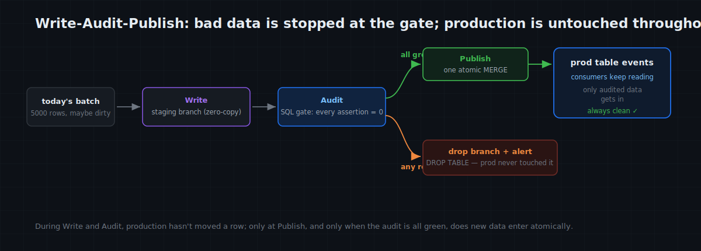
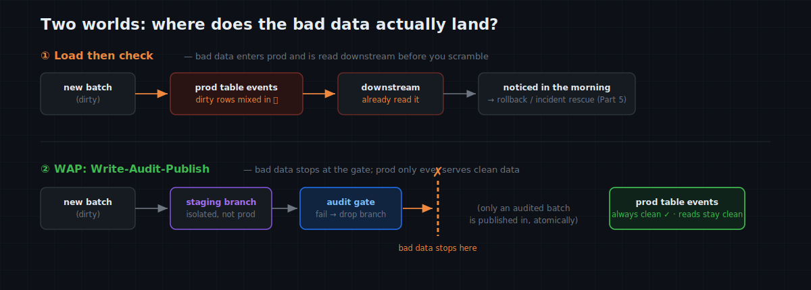

# MatrixOne Git4Data Deep Dive (Part 7) · Data Operations in Practice — Write-Audit-Publish: A Release Gate for Your Data Pipeline

Data pipelines have a perennial problem: **you don't control upstream data quality, but you own the fallout.**

3 a.m. A scheduled ETL pours yesterday's fresh batch into the production table `events` — which reports, dashboards, downstream jobs, and a feature pipeline all read. The batch is laced with what upstream loves to produce: null `user_id`s, negative amounts, absurd outliers, users that don't exist in the dimension. By the time someone notices in the morning, the standup dashboard has computed wrong numbers, downstream jobs have run on it, a model has trained a round on it. Then the harder part: **the dirty rows are now mixed into the same table as the good ones**, and picking them back out is ten times harder than blocking them would have been — that's Part 5's incident rescue all over again.

Software engineering's standard answer to this class of problem is the **CI gate**: code must pass tests before it merges to main. The data world's counterpart is **Write-Audit-Publish (WAP)** — new data lands in isolation, passes an audit, then publishes. It used to take lake-side tooling (Iceberg, lakeFS) to build; in MatrixOne, via its built-in git4data capability, it's just a basic use of branches. This article does it in detail: **when you need it, how the three steps land, and why the alternatives don't hold up.** Every statement is verified on MatrixOne `4.0.0-rc3`.

> 📦 All SQL runs as one script: [matrixorigin/git4data-tutorial](https://github.com/matrixorigin/git4data-tutorial), under `07-write-audit-publish/`. Environment: `docker run -d -p 6001:6001 --name matrixone matrixorigin/matrixone:4.0.0-rc3`.

---

## When do you actually need WAP?

WAP isn't for every table — it treats one situation: **a table with downstream consumers that receives new data from a source you don't fully trust.** Meet those two conditions and it wants a gate. Typical cases:

- **A daily / hourly ETL batch load**: a table that reports, dashboards, and downstream jobs read continuously, loaded in bulk overnight. One bad batch and the whole company sees wrong numbers in the morning.
- **Ingesting an external source you don't control**: a partner feed, a third-party API, scraped data, user uploads — quality varies, and fine today can be broken tomorrow when upstream renames a field.
- **Feeding a training / feature pipeline**: dirty data doesn't error out; it just **silently trains the model crooked** (exactly what last article's feature table dreads).
- **Publishing a canonical metrics table many people depend on**: one wrong definition and a whole tree of consumers is wrong with it.
- **Reverse ETL back into operational systems**: pushing computed results back to a production DB, to marketing / risk systems — a bad push has real consequences.

What they share: **once the problem data is in the production table, the damage is already done** (consumers read it, decisions were made, the model trained). WAP's whole value is moving "catch the problem" from *after* production to *before* publish.

---

## The three steps: Write → Audit → Publish

Let's walk all three on a real table. Production `events` holds 100k rows of yesterday's clean data, read continuously downstream; a dimension `dim_users` exists that the fact's `user_id` must stay consistent with.

### Write: new data always lands on a staging branch

Today's batch **never touches production directly**. Open a staging branch off it — milliseconds, zero-copy (Part 3 explained why) — and load the batch onto that branch:

```sql
DATA BRANCH CREATE TABLE events_stage FROM events;   -- staging branch, milliseconds

-- Today's 5000-row batch lands on staging, laced with what upstream really produces:
-- null user_ids, users absent from the dimension, negatives, absurd outliers
INSERT INTO events_stage
SELECT 200000 + result,
       CASE WHEN result % 97 = 0 THEN NULL
            WHEN result % 89 = 0 THEN 999999          -- a user not in dim_users
            ELSE result % 5000 END,
       CASE WHEN result % 250 = 0 THEN -1.00
            WHEN result % 333 = 0 THEN 999999.99
            ELSE round(rand()*500 + 1, 2) END,
       'paid', '2026-06-30'
FROM generate_series(1, 5000) g;
```

Right now `events` hasn't moved a row; downstream still reads yesterday's clean data. The dirty data is quarantined on staging — WAP's first principle: **isolation before quality.**

### Audit: SQL is the quality gate

The audit is a set of SQL assertions run against staging — **each should return 0**; if any is non-zero, the gate doesn't open. A decent audit covers a few classes of check:

```sql
-- 1) Completeness + domain + business rules: key fields non-null, sane amounts, valid status
SELECT
  SUM(CASE WHEN user_id IS NULL THEN 1 ELSE 0 END)  AS null_user,
  SUM(CASE WHEN amount  < 0     THEN 1 ELSE 0 END)  AS negative_amount,
  SUM(CASE WHEN amount  > 10000 THEN 1 ELSE 0 END)  AS outlier_amount,
  SUM(CASE WHEN status NOT IN ('paid','refunded','void') THEN 1 ELSE 0 END) AS bad_status
FROM events_stage WHERE ts = '2026-06-30';

-- 2) Referential integrity: every user_id in the batch must exist in the dimension
SELECT COUNT(*) AS orphan_users
FROM events_stage s LEFT JOIN dim_users d ON s.user_id = d.user_id
WHERE s.ts = '2026-06-30' AND s.user_id IS NOT NULL AND d.user_id IS NULL;

-- 3) Volume: today's batch size must sit in a sane band (guards double-load / empty run)
SELECT COUNT(*) AS batch_rows FROM events_stage WHERE ts = '2026-06-30';
```

Measured against this dirty batch, the gate catches the problems one by one:

| Check | Result |
|---|---|
| `null_user` | **51** ✗ |
| `negative_amount` | **20** ✗ |
| `outlier_amount` | **15** ✗ |
| `orphan_users` (not in the dimension) | **56** ✗ |
| `batch_rows` (volume) | 5000 ✓ |

**The gate does not open.** You can bolt on more checks here — **uniqueness** (no dup primary / natural key: `GROUP BY key HAVING COUNT(*) > 1`), **freshness** (`MAX(ts)` must be today), **distribution drift** (this batch's null rate / mean amount vs history). They're all just SQL; add what you need.

### When the gate fails: reject it, production none the wiser

Here's the crux: **when the gate fails, you do nothing to production — because production never touched this batch.** Just throw the staging branch away:

```sql
DROP TABLE events_stage;                                -- reject this batch
SELECT COUNT(*) FROM events;                            -- still 100000, not a row moved
SELECT COUNT(*) FROM events WHERE ts = '2026-06-30';    -- 0, this batch never got in
```

Measured: after the rejection production is still **100k rows**, and today's dirty batch put **zero rows** into production. Next you go debug upstream, fix it, and re-run — instead of doing incident rescue on a live table.

> Want to debug the scene? **Don't DROP — just keep the staging branch.** It's a complete, isolated crime scene; you can pore over exactly what upstream sent, with zero impact on production.

### Publish: passes the audit, one atomic publish

Swap in the fixed, clean batch — the audit is all green now (`null_user / negative / outlier / orphan` all 0, `MAX(ts)` is today). Before publishing, use DIFF for one last look at what this batch will *actually* do to production — row-level, exact:

```sql
DATA BRANCH DIFF events_stage AGAINST events OUTPUT SUMMARY;   -- INSERTED 5000: exactly these 5000 rows
```

All confirmed — one atomic merge:

```sql
DATA BRANCH MERGE events_stage INTO events;
```

This step is **atomic**: downstream readers see either the whole audited batch of 5000 rows, or (before this statement) none of it — **there is no "half-published" state**. Measured:

```sql
SELECT COUNT(*) FROM events;                                                    -- 105000
SELECT COUNT(*) FROM events WHERE user_id IS NULL OR amount < 0 OR amount > 10000;  -- 0
```

Production went from 100k to 105k, and not one dirty row ever appeared in it.



---

## How the alternatives do it — by system, and where each differs

"Isn't this just checking before you load?" The naive baseline — **load straight into production, check afterward** — is the most common and the most painful: by the time the check finds the problem, the dirty data is already in production and read downstream ("publish, then pray"). WAP exists to avoid exactly that. But *how* you build a real WAP depends on the system you're on. Three families:

### 1) Git-style, on the lake: Iceberg branches, lakeFS (where WAP was born)

- **Apache Iceberg (branches).** Write to an audit branch (`spark.wap.branch`), run quality checks on it, and on pass `fast_forward` it to `main`. The branch is zero-copy and the fast-forward is a metadata-only, atomic operation — **essentially the same idea as MatrixOne's approach**, because WAP originated here. The difference is the setting: Iceberg is a **table format on object storage** that doesn't execute queries itself — you need an external engine (Spark / Trino / Flink) to read, write, and run the audit; it's **analytics-oriented**, and the "production table" is a lake dataset for readers, not a database still serving point reads / transactions. WAP needs engine support (Spark's WAP mode), a catalog, and a lake stack.
- **lakeFS.** Git for the whole data lake — branch the repo, write on the branch, use **pre-merge hooks (`actions.yaml`)** as the audit gate, and merge to `main` only on pass; the merge is atomic across the whole repo, so it's **naturally multi-table / multi-file consistent.** The difference: lakeFS versions **files / paths in object storage**, not database tables; it sits in front of S3, and you still query the versioned paths with an external engine (Spark / Trino / DuckDB); the audit runs in webhooks / Airflow (another orchestration layer).

Both genuinely do WAP right — **MatrixOne takes the same path** (git4data isn't a separate product; it's this git-style capability built into MatrixOne). The distinction is **where it lands**: they protect a **lake/warehouse dataset read by analytics**, and need a "format + external engine + catalog / hooks" stack; MatrixOne brings the **same git-style WAP into its own live HTAP database that is still serving reads** — the audit is ordinary SQL in the same database, the publish is an atomic MERGE inside it, and the readers are that database's consumers.

### 2) On a warehouse / OLTP DB without branches: swap your way there

- **Snowflake.** Zero-copy `CLONE` a staging table, load + audit, then `ALTER TABLE prod SWAP WITH staging` (two RENAMEs in one transaction — atomic, grants carried over). The zero-copy clone is branch-like. But **SWAP replaces the whole table, single-table**: to append just today's 5000 rows you clone → insert → swap the entire table each run; multi-table atomicity you assemble yourself; and Snowflake is a warehouse (AP), not an online point-read server.
- **PostgreSQL / MySQL.** No branches. The closest approach is **partition exchange** — load the batch into a separate table, validate, then `ALTER TABLE … ATTACH PARTITION` (PG) / `EXCHANGE PARTITION` (MySQL); or a staging table + `RENAME` swap wrapped in a transaction. But partition exchange only fits **append-by-partition-key (e.g. date)** loads, takes a lock on attach, and scans to validate a CHECK constraint; RENAME swap brings the multi-table / handle / index / permission-rebuild problems; wrapping in a transaction means a long-held lock that drags a live table.
- **BigQuery.** No branches. Staging table + `MERGE` / `CREATE OR REPLACE TABLE` / partition overwrite in a transaction, or a table snapshot + overwrite. Same shape: whole-table / whole-partition replacement, or a big MERGE with a mid-state and cost.

The theme: these systems all **work around not having branches**, approximating atomic publish by **swapping** a whole table or partition. The price: you can only swap in blocks (no row-level incremental upsert), multi-table is hard to make atomic, and the swap either locks the table or rebuilds a pile of attached objects.

### 3) Data-quality tools: dbt tests / Great Expectations / Soda

These are the **check-definition layer, not a storage gate.** They're great at expressing checks, but the default timing is often "test *after* the data has landed in the target" (`dbt build` builds into the target, then tests) — the gate and the storage are separate, and in that gap dirty data may already have been read. To become a true gate they still need family 1 or 2 underneath. They aren't competitors to MatrixOne but **complements**: define the checks with them, and make the gate that actually blocks with MatrixOne's branch + atomic MERGE (its git4data capability).

| Approach | Isolation | Publish | Incremental append | Multi-table atomic | Needs external engine | Serves online reads |
|---|---|---|---|---|---|---|
| Iceberg branches | zero-copy branch | fast-forward (metadata, atomic) | yes | weak (per-table) | yes (Spark/Trino) | no (lake, AP) |
| lakeFS | repo branch | merge (atomic, + hook gate) | yes | **strong (repo-level)** | yes | no (file layer) |
| Snowflake | zero-copy clone | SWAP (whole-table, atomic) | **whole-table** | weak | no (built-in) | no (warehouse, AP) |
| PG / MySQL | staging table / partition | ATTACH / EXCHANGE / RENAME | by partition | weak | no | yes (but locks / rebuilds) |
| dbt / GE / Soda | — (defines checks only) | depends on substrate | — | — | depends | — |
| **MatrixOne (git4data capability)** | **zero-copy branch** | **atomic MERGE (row-level delta)** | **native** | **db-snapshot backstop** | **no (SQL, same engine)** | **yes (HTAP, serves directly)** |

In one line: this git-style gate used to live either **on the lake** (Iceberg / lakeFS — but that's not a database that serves reads, and needs an engine stack) or was **faked with whole-table swaps** on a warehouse / DB (Snowflake SWAP, PG partition exchange — coarse-grained, multi-table hard). MatrixOne is the uncommon case that puts it **inside a live HTAP database, with a row-level incremental atomic MERGE as the publish** (git4data is its built-in capability) — and the audit is just SQL in that same database, no second stack to stand up.



---

## Publishing several tables together: a database snapshot as the backstop

If one release has to update the fact table and several dimensions and you want "all or nothing," snapshot the whole database before publishing, then `MERGE` table by table; if any step's audit or merge goes wrong, `RESTORE DATABASE db {SNAPSHOT = s}` rolls the entire database back to before the release — multi-table atomicity backstopped by the **database-level snapshot** from Part 5 (a single `DATA BRANCH MERGE` is itself table-level).

---

## Wiring it into the pipeline: CI/CD for data

This flow is built to automate — hang it on your scheduler / CI and every daily batch runs the loop:

1. **Write**: batch arrives → auto `DATA BRANCH CREATE` a staging branch for the day, load it.
2. **Audit**: auto-run the audit SQL; any assertion > 0 → fail.
3. **Publish / Reject**: all green → `DATA BRANCH MERGE` to publish; any red → **don't publish, alert, and keep the staging branch as the scene**.

The mental-model shift is the real point:

> Without WAP: the production table is data's **entry point**; quality problems get handled after they're in.
> With WAP: the production table is data's **exit point**; only data that passed the audit earns its way in.

That's **CI/CD for data**: fail the gate, and bad data doesn't even reach production's door.

---

## Cost and boundaries

- **The gate is nearly free**: the staging branch is milliseconds and zero-copy; the audit is plain SQL; the publish is one second-scale MERGE, independent of table size. This gate won't be your pipeline's bottleneck.
- **The audit is only as strong as the checks you write**: WAP gives you the mechanism to *reliably block*; *what* to block is yours to express in SQL. A good mechanism is no substitute for thinking through what "good enough to ship" means for this data.
- **Branches / snapshots hold storage until released**: objects pinned by a staging branch or snapshot aren't reclaimed by background GC; `DROP` after a rejection (and have a cleanup policy for scenes you keep).
- **Multi-table atomic publish** rests on a database snapshot (above); a single `DATA BRANCH MERGE` is table-level.
- **Row-level diff/merge requires a shared schema** (Part 4's boundary): if the batch adds a column, change the schema on mainline first, then load.

---

## Closing

That completes the data-operations trilogy: **a personal safety net** (Part 5 — you can always roll back in seconds), **team parallelism** (Part 6 — branch and merge), and **a production gate** (this part — dirty data can't get in). All three run on the same primitives — snapshot, branch, diff, merge — which is the whole point of "version control inside the database": not one more feature, but a different way of working.

Next, the series turns to **AI training.** First stop, the classic: the data changes every day, so why retrain on all of it? Use DIFF to extract exactly the part that changed, and **train only the delta.**

> 📎 Runnable SQL: [github.com/matrixorigin/git4data-tutorial](https://github.com/matrixorigin/git4data-tutorial) ｜ Source & community: [github.com/matrixorigin/matrixone](https://github.com/matrixorigin/matrixone)
