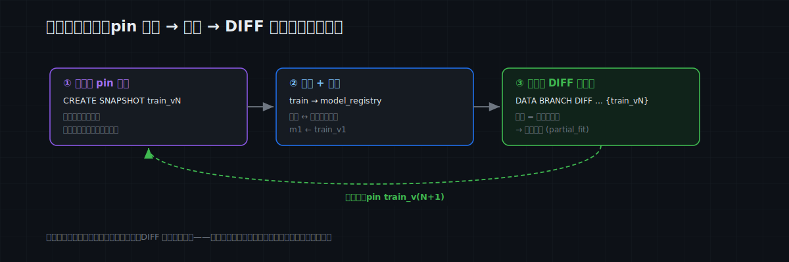
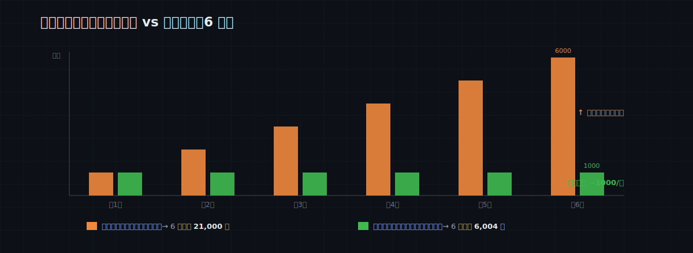

# MatrixOne Git4Data 技术详解（八）·AI 训练实践篇：ML 持续学习——只训练"变了的那部分"

从这一篇起，进入 **AI 训练** 主题。先从一个所有 ML 工程师都熟的循环说起：

> 数据每天都在变——新样本进来、旧标签被修正。于是每周（甚至每天）把**全量**数据重新喂给模型，从头训一遍。数据涨到千万级后，这个循环越来越贵、越来越慢，但你不敢省——因为你**说不清这周到底哪些数据变了**。

问题的根源不在训练，在数据侧：**缺一个"上次训练之后，数据动了哪些"的精确答案。** 而这，恰好就是 MatrixOne 的 git4data 能力最擅长的一件事。这一篇我们把这套循环写细，并**逐个对比别的做法卡在哪**。SQL 全部在 MatrixOne `4.0.0-rc3` 上实测过。

> 📦 本文 SQL 整体可跑：[matrixorigin/git4data-tutorial](https://github.com/matrixorigin/git4data-tutorial) 的 `08-ml-incremental/`。环境：`docker run -d -p 6001:6001 --name matrixone matrixorigin/matrixone:4.0.0-rc3`。

---

## 什么时候会做持续学习？

**只要一个模型的训练数据在持续增长、而你在按周期重训，你就在做持续学习**——区别只在于你是"每次全量重训"，还是"只训增量"。典型场景：

- **风控 / 反欺诈**：每天有新交易、新标注的欺诈样本进来，模型天天要跟着更新；
- **推荐 / CTR**：曝光点击数据源源不断，特征和标签每天在变；
- **内容审核 / 分类器**：质检不断修正误标、补充新类别；
- **任何"标注集在长大"的监督学习任务**：新样本追加、旧标签订正，是常态。

数据小的时候，全量重训无所谓，几分钟的事。**痛点从"表涨到千万/上亿行 + 重训是每天的事"开始**：一次全量重训要几小时、烧一大笔算力，而其中 99% 的数据和上一轮**一模一样**。你想只训那 1% 的变化，却缺一个可靠的答案——**到底哪些行变了？** 下面这套三步循环，就是把这个答案变成一条 SQL。

---

## 三步循环：pin → train → diff 出增量

训练集是一张 `samples` 表，旁边放一张模型注册表 `model_registry`。

### 第一步：训练前，pin 一个版本

```sql
CREATE SNAPSHOT train_v1 FOR TABLE mltrain_demo samples;   -- 毫秒级、近零成本
-- （训练器读全表，训出模型 m1 …）
INSERT INTO model_registry VALUES ('m1', 'train_v1', 0.9012);
```

这一步毫秒级、几乎不占空间（第三篇讲过原理），但它把"模型 m1 是用什么数据训的"从一句口头描述，变成了一个**可执行的事实**——任何时候 `SELECT … FROM samples {SNAPSHOT='train_v1'}` 都能逐位复原 m1 的训练集。

### 第二步：一周后，数据动了——但动了哪些？

一周的真实生活：新批次进来 3000 行，质检又修正了 200 个标签：

```sql
INSERT INTO samples SELECT 100000 + result, … FROM generate_series(1, 3000) g;  -- 新数据
UPDATE samples SET label = 1 - label WHERE sample_id BETWEEN 500 AND 699;       -- 标签修正
```

现在问那个关键问题——**相对 m1 的训练集，数据到底变了哪些？** 一条 DIFF：

```sql
DATA BRANCH DIFF samples AGAINST samples {SNAPSHOT='train_v1'} OUTPUT SUMMARY;
--   INSERTED = 3000   (新批次)
--   UPDATED  =  200   (被修正的标签)
--   DELETED  =    0
```

答案精确到行：**变更就是这 3200 行，其余 10 万行一行没动。** 把这批增量取出来（新增 + 改动的行），喂给 `partial_fit`（scikit-learn）或你的增量训练逻辑：

```sql
-- 增量训练集 = 相对 train_v1「新增或改过」的行（按值比对，净变化）
SELECT * FROM samples cur
WHERE NOT EXISTS (
    SELECT 1 FROM samples {SNAPSHOT='train_v1'} base
    WHERE base.sample_id = cur.sample_id
      AND base.f1 = cur.f1 AND base.f2 = cur.f2 AND base.label = cur.label
);
--   实测返回 3200 行；而全量重训要处理的是整张 103000 行的表。
```

全量重训要碰 **103000** 行，增量只碰 **3200** 行——一轮就省了 97%。（`DATA BRANCH DIFF … OUTPUT FILE '/某目录'` 也能把这批增量直接导成一份 `.sql`，喂给下游管道。）

### 第三步：训练完，再 pin 一个

```sql
CREATE SNAPSHOT train_v2 FOR TABLE mltrain_demo samples;
INSERT INTO model_registry VALUES ('m2', 'train_v2', 0.9145);
```

于是注册表里积累出一条**模型 ↔ 数据的对应链**：

```
m1 ← train_v1 (100,000 行)
m2 ← train_v2 (103,000 行) = train_v1 + 3000 新增 + 200 修正
```

这条链解锁了几个平时做不到的动作：

- **精确复现**：三个月后审计问"m1 是用什么训的"，`SELECT … {SNAPSHOT='train_v1'}` 一查便知，逐位一致（实测 10 万行原样复原）；
- **归因调试**：m2 比 m1 差了？把两个快照 DIFF 一下，可疑变更就是那 3200 行，而不是在 10 万行里大海捞针；
- **数据回退**：发现修正的标签本身是错的，`RESTORE TABLE … {SNAPSHOT = train_v1}` 回到上一版，重新来过。



---

## 这笔账省多少？

我们在配套实验里量化过：同一个持续学习场景跑 **6 轮**，每轮新增约 1000 行、偶有几处标签订正。结果——

- **全量重训**：每轮都要处理**当前整张表**，6 轮累计处理 **21,000** 行；
- **只训增量**：每轮只处理该轮的变化，6 轮累计只处理 **6,004** 行。

关键不在这一次的 3.5 倍，而在**趋势**：全量重训的累计成本随轮数**二次增长**（表越积越大，每轮都从头再来），增量始终只看本轮变化、近似**线性**。**这套循环跑得越久、数据越大，相对全量省得越多**——实测里每一轮的增量都稳定在"约 1000 行"，哪怕那时整张表已经是它的 6 倍。



---

## 别的方案怎么做？问题在哪？

"不就是找出变了的行嘛，加个时间戳不就行了？" 值得把常见做法摆出来看——每一种都能凑合，但都在某个地方卡住。

**方案 A：每次全量重训（基线）。** 最简单，也最贵：每轮 O(N)、随数据无限增长，反馈越来越慢。数据小的时候没问题，大了就是纯烧钱。

**方案 B：`updated_at` 水位线。** 给表加个 `updated_at`，记住"上次训练到哪个时刻"，下轮 `WHERE updated_at > 水位线`。听起来够用，坑不少：**漏删除**（DELETE 掉的行，水位线查不出来）；**依赖全链路纪律**——任何一条不更新 `updated_at` 的批量回填 / 订正都会被漏掉；**水位线是移动指针，不是版本**——你没法"复现上次训练的确切集合"，也没法 diff 任意两个历史版本；一行改了又改回，它照样算你头上。

**方案 C：CDC / binlog 流（Debezium + Kafka）。** 把每行变更实时流出去、下游消费增量。问题：**基建重**（Kafka + Debezium + 消费者一整套）；你拿到的是**变更事件的洪流**，不是"相对某个训练版本的净增量"；要对齐"m1 到底是哪个版本训的"，得去回放 offset；精确一次消费很折腾；一行改 5 次就给你 5 条事件。为了知道"变了啥"，先养一条流处理管道。

**方案 D：自己存两份全量 + `EXCEPT` / 反连接。** 留一份上次训练的全量副本，`SELECT … EXCEPT …` 算差集。问题：**每个训练版本一份全量副本 → N 倍存储**；算差集是**两份全量的全表扫**（O(N)——为了找出那点增量，又把所有数据碰了一遍）；版本一多就撑不住。

**方案 E：数据版本化工具。**
- **DVC**：版本化的是**文件**——任何改动都产生一个新数据文件、重算 hash；能比文件版本，但**不是行级**的"哪些行变了"，粒度是整个文件。
- **lakeFS**：版本化对象存储里的文件 / 路径，diff 是**对象 / 文件级**，不是行级。
- **Delta Lake（time travel + Change Data Feed）**：这个**真能**给出版本间的**行级**变更，是这里最接近的一个。差异：要**显式开启 CDF**（额外写一批 change 文件）、经 Spark 消费、面向湖 / 分析；它给的是**变更事件**（可能含中间态），而不是"相对某个快照的净 diff"；而且它不是一个还在对外服务点查的库。

| 方案 | 捕获 增/改/删 | 相对指定版本的行级净增量 | 算增量的成本 | 额外基建 / 存储 | 能逐位复现训练集 | 能 diff 任意两版 |
|---|---|---|---|---|---|---|
| A 全量重训 | —（不区分） | — | 每轮 O(N) | 无 | 否 | 否 |
| B updated_at 水位 | 增 / 改（**漏删**） | 否（只有"之后改过"） | O(增量) | 要维护列 + 纪律 | 否 | 否 |
| C CDC / binlog 流 | 增 / 改 / 删 | 否（是事件流，非净差） | 流式 | **重（Kafka+CDC）** | 难 | 难 |
| D 双副本 + EXCEPT | 增 / 改 / 删 | 是 | **O(N) 全表扫** | **N 倍存储** | 是（存了副本） | 副本在才行 |
| E1 DVC / lakeFS | 文件 / 对象级 | 否（非行级） | 文件级 | 另一套工具 | 是（文件版本） | 文件级 |
| E2 Delta CDF | 增 / 改 / 删 | 事件（可能含中间态） | Spark 消费 | 开 CDF + Spark | 是（time travel） | 版本级 |
| **MatrixOne（git4data 能力）** | **增 / 改 / 删** | **是，一条 `DATA BRANCH DIFF … {SNAPSHOT}`** | **只随变更量** | **无（就是 SQL）** | **是（快照逐位复现）** | **是（任意两快照）** |

一句话：别的方案要么**只能近似**（水位线漏删、DVC 非行级）、要么**代价大**（双副本 N 倍存储、CDC 一套流处理），要么**在湖上、要另配引擎**（Delta CDF）。MatrixOne 把它收成一条 SQL——相对任意 pin 过的版本，`DATA BRANCH DIFF` 直接给出**行级净增量**，成本只随变更量走、不随表大小；而且同一个快照既是"增量的基准"，也是"可逐位复现的训练集版本"。这就是 git4data 这套能力落在一个 HTAP 数据库里的好处：**版本、增量、复现，是同一件事的三个面。**

---

## 成本与边界

- **快照毫秒级、与数据量无关**（第三篇原理）；**DIFF 只随变更量走**，不扫全表。所以这套循环跑得越久、表越大，相对全量省得越多。
- **DIFF 报的是"自快照以来被动过的行"**（按是否改过算，不做值比对）：拿来喂增量训练**正合适**——被碰过的行本就该重训。若你要的是"当前值和上一版不同"的**净变化**，就用上面那条**按值反连接**的 SQL（它会自然排除"改了又改回"的行）。
- **要能复现，就别急着删快照**：被快照钉住的历史版本会占存储，直到 `DROP SNAPSHOT`。给每个上线模型的 `train_vN` 长期保留、给废弃的中间版本设清理策略。
- **行级 DIFF 要求 schema 一致**（第四篇边界）：训练集要加特征列，先在主线改 schema、再继续。

---

## 结语

这一篇的全部内容，其实就是一个三步循环：

```
①  CREATE SNAPSHOT train_vN            -- 训练前，钉住数据版本
②  训练 → 注册 (model, train_vN)        -- 模型与数据版本绑定
③  下一轮：DIFF 现状 AGAINST train_vN   -- 增量 = 确切的变更行 → partial_fit
```

它省的不只是算力，还有你平时**根本拿不到**的三样东西：模型的**可复现**、退步的**可归因**、脏数据的**可回退**。

下一篇换到 LLM 的语境：**SFT 数据策展**——几十万条指令数据的去重、过滤、去污染，全用 SQL 原地完成，而且每一刀都有 DIFF 作为"收据"，删了什么、为什么删、能不能撤，都说得清。

> 📎 可运行 SQL：[github.com/matrixorigin/git4data-tutorial](https://github.com/matrixorigin/git4data-tutorial) ｜ 源码与社区：[github.com/matrixorigin/matrixone](https://github.com/matrixorigin/matrixone)
