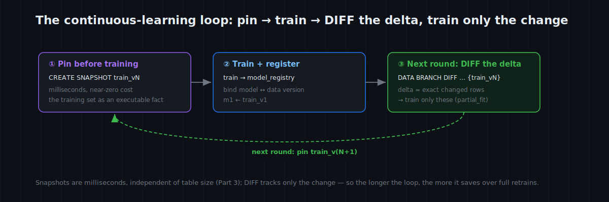
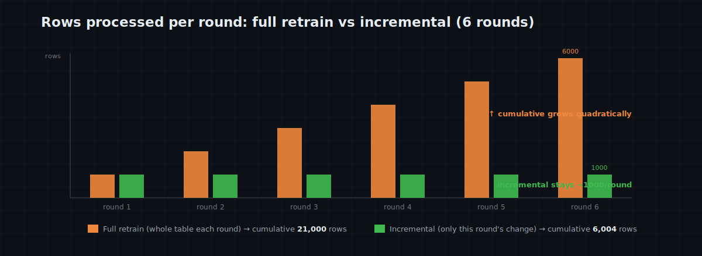

# MatrixOne Git4Data Deep Dive (Part 8) · AI Training in Practice — Machine Learning Continuous Learning: Incremental or Full Retrain, First See What Changed

With this part the series enters **AI training.** Start with a loop every machine-learning engineer knows:

> The data changes every day — new samples arrive, old labels get corrected. So every week (or every day) you feed the **entire** dataset back into the model and retrain from scratch. Once the data reaches the tens of millions, the loop gets ever more expensive and slow — but you don't dare skip it, because **you can't say precisely which data changed this week.**

Let's be clear up front, because it's easy to oversell: **this article does not claim incremental training always beats a full retrain.** Incremental training has scenarios it fits and scenarios it doesn't (spelled out below). What *is* universal — and usually missing — is a more upstream answer: **"since the last run, what exactly moved in the data?"** With that, you can decide "train incrementally when it fits, retrain fully when it doesn't," and you can reproduce, attribute, and roll back. Turning that answer into one SQL statement is exactly what MatrixOne's git4data capability is best at. Every statement is verified on MatrixOne `4.0.0-rc3`.

> 📦 All SQL runs as one script: [matrixorigin/git4data-tutorial](https://github.com/matrixorigin/git4data-tutorial), under `08-ml-incremental/`. Environment: `docker run -d -p 6001:6001 --name matrixone matrixorigin/matrixone:4.0.0-rc3`.

---

## First, cold water: when is incremental training right, and when must you retrain fully?

"Data changed, so train only the changed part" sounds efficient — but **incremental training is a technique with clear limits, not a universal switch.** Let's settle the trade-off.

**Incremental training (online / `partial_fit` / warm-start) fits when:**

- **the model supports incremental updates** — SGD-family linear models, Naive Bayes, continued training / fine-tuning of some neural nets;
- **the distribution is fairly stationary** — new data extends the same distribution, so updates converge smoothly;
- **the data is large and retraining is frequent** — full retrains are prohibitively expensive and each round's change is a tiny fraction;
- **it's just "a batch of new samples"** — pure appends, with no large-scale corrections or deletions of old data.

**But plenty of the time you genuinely need a full retrain — forcing incremental will burn you:**

- **Catastrophic forgetting**: updating on new data only, a neural net tends to **forget old knowledge** and regress on the old distribution. Pure "train the delta" can make the model worse overall.
- **Distribution shift (concept drift)**: if the distribution really changed, the right move is often to retrain on the **full set (or resample / down-weight old data)**, not just append new data.
- **Deletes / corrections to old data**: the most overlooked one. **Deleting a row from the dataset does not delete its influence on an already-trained model** — this is the "machine unlearning" problem. When an old label is proven wrong, or samples must be deleted for compliance, usually **only a retrain** truly removes their effect; incremental can't.
- **Non-incremental algorithms**: tree models like random forests and XGBoost mostly don't support incremental updates — you retrain by nature.
- **Changed features / hyperparameters / architecture**: any of these demands a full retrain.
- **Wanting a clean, reproducible, auditable model**: a path-dependent incrementally-updated model is sometimes worse than one clean full retrain.

In one line: **incremental vs full is a training decision that depends on the scenario — neither is "always better."** So the real subject of this article isn't "make you go incremental"; it's the **prerequisite both choices need** — what changed.

---

## Whichever you pick, you first have to answer "what changed?"

Once you've thought the trade-off through, both paths hit the **same prerequisite**:

- **Going incremental?** You must get the exact "rows added / changed this round" to feed only those to `partial_fit`;
- **Going full retrain?** You first need "how much and what changed" to **decide whether to retrain at all** (small append → incremental is enough; big drift, lots of corrections / deletions → trigger a full retrain), and the retrain needs an **exact, reproducible** training-set version.

That prerequisite — "what moved relative to the last run" — is exactly what most teams lack and struggle to get reliably. The three-step loop below turns it into one SQL statement.

---

## The three-step loop: pin → train → DIFF the change

The training set is a `samples` table; next to it, a model registry `model_registry`.

### Step 1: pin a version before training

```sql
CREATE SNAPSHOT train_v1 FOR TABLE mltrain_demo samples;   -- milliseconds, near-zero cost
-- (the trainer reads the table, fits model m1 …)
INSERT INTO model_registry VALUES ('m1', 'train_v1', 0.9012);
```

Milliseconds, almost no space (Part 3's mechanics), but it turns "what data trained m1" from a verbal claim into an **executable fact**: at any time, `SELECT … FROM samples {SNAPSHOT='train_v1'}` reconstructs m1's training set, bit for bit.

### Step 2: a week later — the data moved, but where?

A week of real life: a 3000-row batch arrives, and QA corrects 200 labels:

```sql
INSERT INTO samples SELECT 100000 + result, … FROM generate_series(1, 3000) g;  -- new data
UPDATE samples SET label = 1 - label WHERE sample_id BETWEEN 500 AND 699;        -- label fixes
```

Now the key question — **relative to m1's training set, what exactly changed?** One DIFF:

```sql
DATA BRANCH DIFF samples AGAINST samples {SNAPSHOT='train_v1'} OUTPUT SUMMARY;
--   INSERTED = 3000   (the new batch)
--   UPDATED  =  200   (the corrected labels)
--   DELETED  =    0
```

Row-precise: **the change is these 3,200 rows; the other 100,000 didn't move.** With that answer in hand, the next move is **your training decision**:

- If the scenario fits incremental (pure append, stationary) → pull the change and feed `partial_fit`:

  ```sql
  -- The incremental training set = rows new or changed vs train_v1 (net, by value)
  SELECT * FROM samples cur
  WHERE NOT EXISTS (
      SELECT 1 FROM samples {SNAPSHOT='train_v1'} base
      WHERE base.sample_id = cur.sample_id
        AND base.f1 = cur.f1 AND base.f2 = cur.f2 AND base.label = cur.label
  );
  --   Measured: 3200 rows (a full retrain would process the whole 103000-row table).
  ```

- If those 200 fixes are actually a **large-scale relabel**, or the data **drifted** → don't force incremental; **retrain fully** on the new version. And DIFF's "how much / what changed" is exactly what grounds that call.

Either way, DIFF puts the decision on facts, not on "feels like not much changed this week."

### Step 3: after training, pin again

```sql
CREATE SNAPSHOT train_v2 FOR TABLE mltrain_demo samples;
INSERT INTO model_registry VALUES ('m2', 'train_v2', 0.9145);
```

The registry accumulates a **model ↔ data chain** (whose value holds **regardless** of incremental vs full):

```
m1 ← train_v1 (100,000 rows)
m2 ← train_v2 (103,000 rows) = train_v1 + 3000 new + 200 corrected
```

It unlocks moves you normally can't make:

- **Exact reproduction**: three months on, an audit asks "what trained m1?" — `SELECT … {SNAPSHOT='train_v1'}` answers, bit for bit (measured: the full 100k restored intact);
- **Attributable debugging**: m2 worse than m1? DIFF the two snapshots — the suspect set is those 3,200 rows, not a needle in 100k;
- **Data rollback**: the label "corrections" turn out wrong? `RESTORE TABLE … {SNAPSHOT = train_v1}` and start over.



---

## When incremental *does* fit, how much does it save?

**Given that incremental fits** (pure append, stationary, model supports it), we quantified it: the same scenario over **6 rounds**, each adding ~1000 rows plus a few label corrections —

- **Full retrain**: each round processes the **whole current table** → **21,000** rows over 6 rounds;
- **Train only the delta**: each round processes only that round's change → **6,004** rows over 6 rounds.

The point isn't this round's 3.5×, it's the **trend**: full-retrain cost grows **quadratically** with rounds, incremental stays roughly **linear**. In the experiment each round's delta stayed at "about 1000 rows" even when the whole table was already 6× that.

> But remember the cold water: **if a round drifts, or old data was deleted/changed so you must retrain, this "compute saving" doesn't hold** — that round you should honestly retrain in full. Snapshot + DIFF still give you reproduction, attribution, and rollback there; they just don't save the compute. Whether you save is scenario-dependent; being able to say *what changed* and to reproduce is what's universal.



---

## How do the alternatives get "what changed" — and where do they break?

Whether you end up incremental or full, you first need the answer "what moved relative to the last run." Here are the common approaches — each works, and each gets stuck somewhere.

**Approach A: full retrain, no change-tracking (the baseline).** Never ask "what changed," just start over at O(N) each round. Fine when small, pure burn when big — and you still have no reproduction / attribution.

**Approach B: an `updated_at` watermark.** Add `updated_at`, remember "last trained up to time T," next round `WHERE updated_at > T`. Traps: **misses deletes** (a DELETEd row won't show past a watermark); **depends on end-to-end discipline** — any bulk backfill / correction that doesn't bump `updated_at` is silently missed; **a watermark is a moving pointer, not a version** — you can't reproduce the exact set the last run used, nor diff two arbitrary past versions; and a row changed and reverted still counts.

**Approach C: CDC / binlog streaming (Debezium + Kafka).** Stream every row change out and consume it. Problems: **heavy infra** (Kafka + Debezium + consumers); you get a **firehose of change events**, not "the net delta relative to a chosen training version"; aligning "which version trained m1" means replaying offsets; exactly-once is fiddly; a row changed 5× gives you 5 events.

**Approach D: keep two full copies + `EXCEPT` / anti-join.** Keep a full copy of last-train data for the difference. Problems: **a full copy per training version → N× storage**; the diff is a **full scan of both copies** (O(N) — you touch all the data again just to find the delta); it doesn't scale as versions accumulate.

**Approach E: data-versioning tools.**
- **DVC**: versions **files** — any change makes a new file and re-hashes it; you can diff file versions, but **not row-level** "which rows changed" — the grain is the whole file.
- **lakeFS**: versions files / paths in object storage; the diff is **object / file-level**, not rows.
- **Delta Lake (time travel + Change Data Feed)**: this one **can** give **row-level** changes between versions — the closest analog. Differences: you must **enable CDF** (which writes extra change files), consume via Spark, lake / analytics-oriented; it gives **change events** (possibly intermediate states), not "the net diff vs a chosen snapshot"; and it isn't a live database still serving point reads.

| Approach | Captures ins/upd/del | Row-level net delta vs a chosen version | Cost to compute delta | Extra infra / storage | Reproduce training set bit-for-bit | Diff any two versions |
|---|---|---|---|---|---|---|
| A full retrain | — (no distinction) | — | O(N) each round | none | no | no |
| B updated_at watermark | ins / upd (**misses del**) | no (only "changed since") | O(delta) | maintain column + discipline | no | no |
| C CDC / binlog stream | ins / upd / del | no (event stream, not a net diff) | streaming | **heavy (Kafka+CDC)** | hard | hard |
| D two copies + EXCEPT | ins / upd / del | yes | **O(N) full scan** | **N× storage** | yes (kept a copy) | only if copies survive |
| E1 DVC / lakeFS | file / object level | no (not row-level) | file-level | another tool | yes (file versions) | file-level |
| E2 Delta CDF | ins / upd / del | events (may include intermediate) | Spark consume | enable CDF + Spark | yes (time travel) | version-level |
| **MatrixOne (git4data capability)** | **ins / upd / del** | **yes — one `DATA BRANCH DIFF … {SNAPSHOT}`** | **only the change volume** | **none (just SQL)** | **yes (snapshot, bit-for-bit)** | **yes (any two snapshots)** |

In one line: the others are either **only approximate** (watermark misses deletes, DVC isn't row-level), or **costly** (two full copies at N× storage, CDC's whole stream stack), or **on the lake needing a separate engine** (Delta CDF). MatrixOne collapses it into one SQL statement — relative to any pinned version, `DATA BRANCH DIFF` yields the **row-level net delta**, at a cost that tracks the change, not the table; and the same snapshot is both "the baseline for the delta" and "a bit-for-bit reproducible training-set version." That's what this capability buys inside an HTAP database: **versioning, the delta, and reproduction are three faces of one thing.**

---

## Cost and boundaries

- **Snapshots are milliseconds, independent of data size** (Part 3); **DIFF tracks only the change volume**, never a full scan.
- **The database won't absorb incremental training's own hazards**: catastrophic forgetting, drift, and unlearning are **training-side** problems — git4data gives you "the exact change + a reproducible version," but **whether and how to train is your call.** Don't mistake "I can get the delta" for "I should train on only the delta."
- **DIFF reports "rows touched since the snapshot"** (by *was it changed*, not by value): fine for feeding incremental training; if you specifically want the **net value change**, use the **value anti-join** above (it naturally excludes rows changed-and-reverted).
- **To reproduce, don't rush to drop snapshots**: a snapshot pins historical objects and holds storage until `DROP SNAPSHOT`. Keep each shipped model's `train_vN` long-term; set a cleanup policy for discarded intermediate versions.
- **Row-level DIFF requires a shared schema** (Part 4's boundary): to add a feature column, change the schema on mainline first, then continue.

---

## Closing

In one line: **know exactly what changed first, then decide incremental or full retrain.** The three-step loop —

```
①  CREATE SNAPSHOT train_vN             -- pin the data version before training
②  train → register (model, train_vN)   -- bind model to data version
③  next round: DIFF now AGAINST train_vN  -- the change = exact rows → decide incremental / full
```

What it saves isn't necessarily compute (that depends on whether the scenario fits incremental), but it always hands you three things you normally **just can't get**: a model's **reproducibility**, a regression's **attributability**, and dirty data's **rollback**.

Next, the LLM context: **SFT data curation** — dedup, filtering, and decontamination over hundreds of thousands of instructions, all done in place with SQL, with a DIFF "receipt" for every cut: what was removed, why, and whether it can be undone.

> 📎 Runnable SQL: [github.com/matrixorigin/git4data-tutorial](https://github.com/matrixorigin/git4data-tutorial) ｜ Source & community: [github.com/matrixorigin/matrixone](https://github.com/matrixorigin/matrixone)
