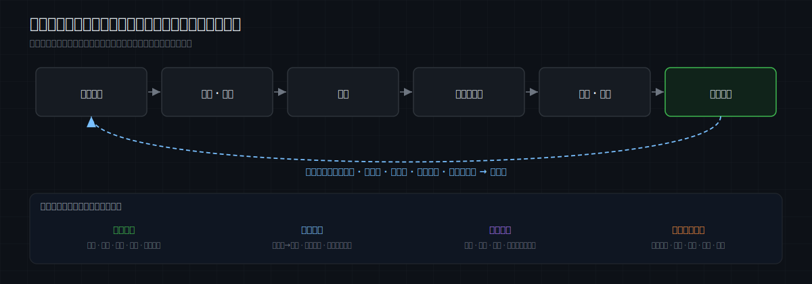
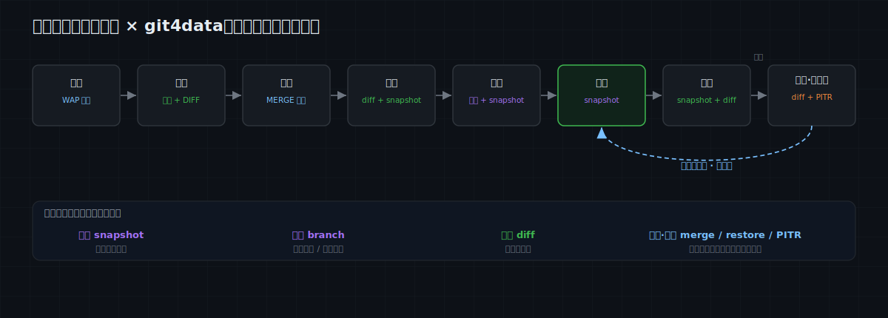
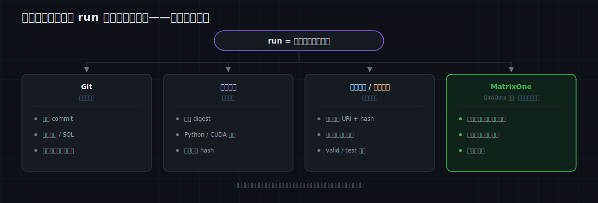
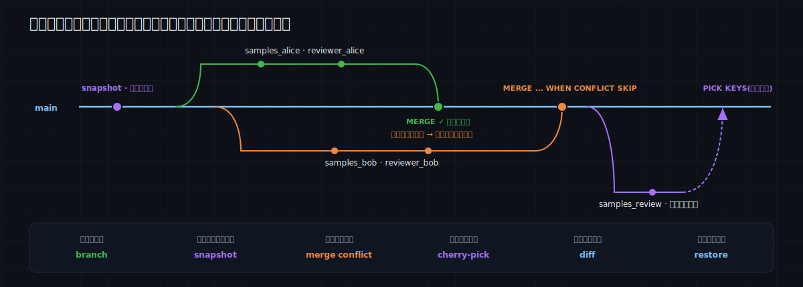
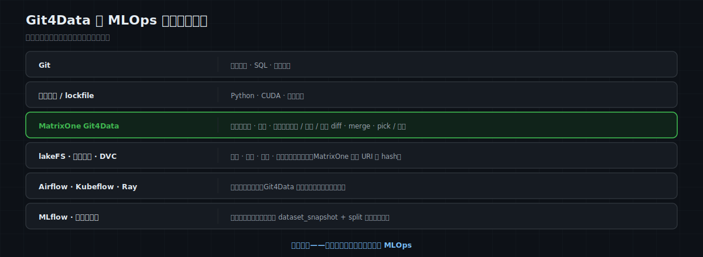

# MatrixOne Git4Data 技术详解（八）·AI 训练实践篇：从数据进入到模型迭代——Git4Data 如何贯穿机器学习全流程

这个系列已经写了七篇了，主要做了两件事。前四篇建立了 Git4Data 的技术坐标：[为什么海量数据需要 Git 式版本控制](https://github.com/matrixorigin/matrixorigin-blog/blob/main/matrixorigin/git4data-part1-data-at-scale-zh/index.md)，MatrixOne 的 [snapshot / branch / diff / merge / cherry-pick / restore 怎么用](https://github.com/matrixorigin/matrixorigin-blog/blob/main/matrixorigin/git4data-part2-hands-on-zh/index.md)、[为什么快](https://github.com/matrixorigin/matrixorigin-blog/blob/main/matrixorigin/git4data-part3-under-the-hood-zh/index.md)，以及它和 DVC、lakeFS、Dolt、Snowflake 等方案[分别站在哪一层](https://github.com/matrixorigin/matrixorigin-blog/blob/main/matrixorigin/git4data-part4-landscape-zh/index.md)。第五到第七篇主要介绍了数据运维相关的能力：[误操作怎么救](https://github.com/matrixorigin/matrixorigin-blog/blob/main/matrixorigin/git4data-part5-incident-rescue-zh/index.md)，[多人怎么并行改数据](https://github.com/matrixorigin/matrixorigin-blog/blob/main/matrixorigin/git4data-part6-collaborative-dev-zh/index.md)，ETL 怎么用 [Write-Audit-Publish](https://github.com/matrixorigin/matrixorigin-blog/blob/main/matrixorigin/git4data-part7-write-audit-publish-zh/index.md) 把坏批次挡在生产门外。

从这一篇开始，我们进入 **AI 训练的场景**。AI 训练是 Git4Data 应用的一个非常核心的场景——训练过程中的数据组织、管理、变更和协作都非常频繁，Git4Data 的能力在这里非常实用。

AI 训练本身是一个很大的范畴：从传统机器学习，到深度学习，再到大模型的预训练与精调（SFT、RLHF 等），每一类的数据形态、规模和组织方式都不一样。**本篇先聚焦其中最基础的一类——基于结构化数据的传统机器学习**；深度学习与大模型相关的数据管理，留到系列后续再展开。

机器学习是一个环节很多、链条很长的场景。我们先不下钻某一个具体环节，而是先把整张地图摊开：机器学习从数据进入到模型迭代，每一个环节的真实数据难题是什么、分别该用 Git4Data 的哪个能力。

要先破除一个常见的误解：**"数据版本控制"常被当成训练前的一个准备动作**——把数据整理好、存个版本、然后开训。但一个模型从数据接入、清洗、标注、构建，到训练、评估、上线，再到持续迭代，是**一条贯穿始终的数据链**；版本控制是这条链上每一步都在用的底座，而不是某一步的一次性操作。

真正难管的，也常常不是某一次训练，而是这一连串问题：

- 这个线上模型，到底用了哪一版样本、标签和特征？
- 它在哪一版验证集上被选中，又在哪一版测试 / 评估集上得到最终指标？
- 两次训练之间，数据究竟变了什么？
- 新数据还没通过检查，能不能先别让生产样本主线看到？
- 两位标注员改了同一批样本，哪里一致、哪里冲突？
- 新特征带来提升，还是那批被修正的标签带来提升？
- 模型掉点之后，能不能把当时的数据状态完整复原？
- 数据只增加了 1%，这轮应该增量更新，还是必须全量重训？

这些问题背后其实是同一个缺口：**机器学习已经有了代码版本、模型版本和实验记录，却经常缺少一套真正作用在数据本身之上的版本语义。**

这正是 Git4Data 在机器学习流程里的位置。这一篇先把这张全流程地图建立起来；后续各篇再沿着其中几个最典型的节点逐一深入。

> 📦 本系列配套 SQL 与实验代码见 [matrixorigin/git4data-tutorial](https://github.com/matrixorigin/git4data-tutorial)。本文先建立全流程框架；后续各篇会对 SFT 策展、标注协作、RLHF 偏好数据和多模态数据逐一深入。文中 SQL 以 MatrixOne `4.1.0` 为准。

---

## 先纠正一个常见错觉：机器学习流程不是流水线，而是反馈环

教科书里的机器学习流程常被画成一条直线：

```text
采集数据 → 清洗标注 → 特征工程 → 训练 → 评估 → 部署
```

真实系统却更像一个环：



每绕一圈，至少有四类状态在变化：

1. **样本在变**：新增、删除、去重、纠错、合规下架；
2. **标签在变**：弱标签变成人工标签，争议样本被改判，延迟真值终于到达；
3. **特征在变**：窗口、口径、填充方式、编码方式被重新定义；
4. **训练决策在变**：切分规则、超参、代码、运行环境和模型架构不断迭代。

代码的变化可以交给 Git，训练运行可以交给 Airflow、Kubeflow 或其他调度系统，模型文件可以放在对象存储，实验指标可以交给实验跟踪系统。但“某个时刻，这几张大表里的哪些行构成了训练数据”并不会自动变成一个可复现、可比较、可合并的版本。

把这个缺口补上以后，机器学习流程才有一条完整的证据链。

---

## 一张总图：机器学习的每个关键环节，分别匹配什么 Git4Data 能力

先给结论。Git4Data 覆盖的是机器学习数据的完整生命周期——从数据接入、清洗与标注、特征构建、数据集发布，到训练评估、上线监控与反馈回流，每一个环节都有对应的版本能力可用，而且它们共用同一套 snapshot / branch / diff / merge 语义，可以在同一个库里连成一条完整的证据链。



| 机器学习环节 | 真实问题 | Git4Data 能力 | 得到的价值 |
|---|---|---|---|
| 数据接入 | 新批次质量未知，又不能污染主表 | `DATA BRANCH CREATE`、`DIFF`、`MERGE` | 先隔离、后审计、通过才原子发布，即 WAP |
| 原始数据留档 | 清洗后还想回看原貌 | `CREATE SNAPSHOT`、时间旅行 | 给原始池建立低成本、可命名的基线 |
| 清洗与策展 | 去重、过滤、纠错到底动了什么 | 分支、行级 `DIFF`、`RESTORE` | 每一刀都有收据，错误清洗可撤回 |
| 多人标注 | 并行写标签、意见冲突、需要复审 | 每人一条分支、`MERGE` 冲突、`PICK` | 分歧自动暴露，只把裁决过的行挑回主线 |
| 特征工程 | 新口径要试验，但不能破坏当前训练集 | 分支、跨版本 SQL、`DIFF`、`MERGE` | 在完整数据上隔离试验，通过评估再晋升 |
| 训练 / 验证 / 测试集发布 | 必须冻结训练内容、调参依据和最终评估基准 | 库级快照 + 切分清单 | 三个集合在同一版本中一致发布，成员关系可复现 |
| 训练与评估 | 模型结果要和数据切分、代码、环境绑定 | 快照 + 模型注册表 | 建立 `model → dataset snapshot → split → code/env` 血缘 |
| 候选集比较 | 指标变化来自哪批数据 | 快照间 / 分支间 `DIFF` + SQL | 把模型差异缩小到确切的样本与标签变化 |
| 上线与回滚 | 新版本退化，需定位或恢复 | 快照、`RESTORE`、PITR | 复原训练现场；数据事故可退回确定状态 |
| 监控与反馈 | 新数据累积，何时触发下一轮训练 | SQL 统计 + 版本基线 + `DIFF` | 漂移判断有稳定参照，精确取得训练增量 |
| 持续学习 | 增量还是全量重训 | `DIFF`、新快照 | 先知道增/改/删，再按模型和数据性质决策 |

这里有一个很重要的分工：

> **SQL 负责判断数据是否合格、分布是否变化、指标是否过门槛；Git4Data 负责给这些判断提供隔离的工作区、稳定的版本锚点和可执行的变更集。**

Git4Data 不会替你定义“异常值是多少”“AUC 至少提升多少”“什么程度算概念漂移”。它解决的是另一层问题：让这些规则可以在正确的数据版本上运行，让通过规则的改动可控地进入主线，让失败的试验可以被丢弃或回退。

下面用一个完整案例把这张表跑通。

---

## 贯穿全文的案例：一个每周迭代的交易风控模型

假设我们在维护一个交易风险模型。每天有新交易进入；部分交易要过几天才知道是否欺诈；标注团队会修正旧标签；特征团队不断调整统计窗口。模型每周评估一次，满足条件才上线。

为了把重点放在版本工作流上，案例把训练样本简化成一张表：

```sql
CREATE DATABASE risk_ml;
USE risk_ml;

CREATE TABLE samples (
    sample_id      BIGINT PRIMARY KEY,
    event_time     DATETIME,
    amount         DECIMAL(12,2),
    txn_count_7d   INT,
    amount_sum_30d DECIMAL(14,2),
    label          TINYINT,        -- 0=正常，1=欺诈，NULL=真值尚未回来
    label_source   VARCHAR(32),    -- rule / reviewer / chargeback
    source_batch   VARCHAR(32)
);

CREATE TABLE dataset_membership (
    sample_id   BIGINT PRIMARY KEY,
    split_name  VARCHAR(16),     -- train / valid / test
    split_rule  VARCHAR(128)
);

CREATE TABLE model_registry (
    model_version   VARCHAR(32) PRIMARY KEY,
    dataset_snapshot VARCHAR(64),
    code_commit     VARCHAR(64),
    feature_version VARCHAR(32),
    image_digest    VARCHAR(128),
    artifact_uri    VARCHAR(512),
    valid_auc       DOUBLE,
    test_auc        DOUBLE,
    status          VARCHAR(16)
);
```

这三张表承担不同职责：

- `samples` 是会持续演进的数据主线；
- `dataset_membership` 明确记录每条样本属于训练、验证还是测试集；
- `model_registry` 不保存模型二进制，只保存模型版本和数据集、切分、代码、特征、运行环境、产物地址之间的绑定。

一份真正可复现的训练记录至少应该长这样：



**只有数据快照还不等于完整复现。** 但没有数据快照，这个等式一定缺最关键的一项。

### 第一站：数据接入——分支先做隔离区

星期一凌晨，上游送来一批新样本。传统做法是直接写入 `samples`，然后再跑质量检查；一旦检查失败，脏数据已经混进主线。第七篇讲过的 WAP 在这里可以直接复用：

```sql
DATA BRANCH CREATE TABLE samples_stage FROM samples;

-- 新批次只进入 staging 分支
INSERT INTO samples_stage VALUES (...);

-- 完整性、取值域、重复、参照关系、批次体量等门禁
SELECT COUNT(*) FROM samples_stage
WHERE source_batch = '2026w29'
  AND (amount < 0 OR txn_count_7d < 0);

-- 看清这次发布会新增、修改、删除多少行
DATA BRANCH DIFF samples_stage AGAINST samples OUTPUT SUMMARY;

-- 只有全部门禁通过才发布
DATA BRANCH MERGE samples_stage INTO samples;
```

于是生产样本主线从“数据的入口”变成了“通过质量门禁后的出口”。门禁失败时，直接丢弃或保留 `samples_stage` 排查即可，主线一行没动。

这一环节 Git4Data 提供的不是新的质量算法，而是**质量检查之前的隔离**和**通过之后的原子晋升**。

### 第二站：清洗与标注——把修改变成可评审的变更集

新数据进入后，标注团队收到延迟真值：3000 条新交易有了标签，同时抽检发现旧数据里有 200 条标签错误。

先给清洗前的状态打一个快照：

```sql
CREATE SNAPSHOT risk_before_review FOR TABLE risk_ml samples;
```

两位标注员可以各自开分支，不必在同一张表上互相覆盖：

```sql
DATA BRANCH CREATE TABLE samples_alice FROM samples;
DATA BRANCH CREATE TABLE samples_bob   FROM samples;

UPDATE samples_alice SET label = ..., label_source = 'reviewer_alice'
WHERE sample_id BETWEEN ...;

UPDATE samples_bob SET label = ..., label_source = 'reviewer_bob'
WHERE sample_id BETWEEN ...;
```

重叠标注区的一致率直接用 SQL 计算；两人意见不同且都改了同一行时，三方合并会把它识别为真正的行级冲突：

```sql
DATA BRANCH MERGE samples_alice INTO samples;
DATA BRANCH MERGE samples_bob INTO samples WHEN CONFLICT SKIP;
```

`SKIP` 先保留主线已有裁决，其余不冲突的标签照常合入。资深评审员在 review 分支上完成改判后，只把争议样本挑回主线：

```sql
DATA BRANCH PICK samples_review INTO samples
  KEYS (SELECT sample_id FROM review_queue)
  WHEN CONFLICT ACCEPT;
```

这套映射非常自然：



标注平台仍然负责界面、任务分发、权限和计件；Git4Data 负责的是底层数据的并行修改、冲突语义和版本证据。

### 第三站：特征工程——不是复制一张大表，而是拉一条试验分支

特征团队发现 `txn_count_7d` 的事件去重口径不够准确，想用新口径重算这个 7 天窗口特征。直接重算主表风险太高：现有模型和其他训练任务还在读取当前口径；复制一张亿级表又慢又贵。

更合适的方式是在分支上做完整试验：

```sql
DATA BRANCH CREATE TABLE samples_feat_candidate FROM samples;

-- 在分支上重新计算特征；主线继续服务现有训练与查询
UPDATE samples_feat_candidate SET txn_count_7d = ...;

-- 检查影响范围、空值率、分布以及泄漏风险
DATA BRANCH DIFF samples_feat_candidate AGAINST samples OUTPUT SUMMARY;
SELECT ... FROM samples_feat_candidate;
```

候选特征可以在分支上训练并评估。如果没有提升，丢掉分支；如果提升稳定，再把它合回主线，或者把这条分支直接作为一个候选数据集版本保留。

这里尤其要区分两件事：

- **数值重算**：schema 不变，只改变行值，适合分支、DIFF、MERGE；
- **新增 / 删除特征列**：属于 schema 演进。MatrixOne 当前要求参与行级 DIFF / MERGE 的两边 schema 完全一致，因此应先统一 schema，再开分支试验，不能让两条分支各自随意改列定义后还期待自动合并。

这也是 Git4Data 的边界之一：它能很好地管理“同一结构下的数据演进”，但 schema 设计本身仍要走受控的迁移流程。

### 第四站：训练、验证、测试集发布——不仅要冻结数据，还要冻结“谁属于哪一集”

数据接入、标签复审和特征验证都完成后，才真正到了数据集发布的时刻。这里不能只说“训练集”，因为一次可信的模型开发至少有三种不同职责的数据：

| 集合 | 用途 | 可以怎样使用 | 最容易犯的错 |
|---|---|---|---|
| **训练集（train）** | 拟合模型参数 | 反复读取、采样和训练 | 把未来数据或同一实体的近重复样本混进来 |
| **验证 / 评估集（valid / eval）** | 选择特征、超参、阈值和候选模型 | 开发期间可以反复评估 | 反复调到最好后，却把它的分数当最终泛化能力 |
| **测试 / 留出集（test / holdout）** | 候选方案锁定后的最终无偏评估 | 应尽量少看，不能继续据此调参 | 测完不满意又回头调，测试集事实上变成了验证集 |

有些团队还会维护一份长期稳定的 **golden evaluation set**：覆盖关键人群、罕见风险和业务底线，用于跨模型版本回归。它可以被看作额外的受控测试集，但同样不能被悄悄拿回训练。

因此，版本化对象不能只有样本内容，还必须包括**切分成员关系与切分规则**。在案例里，我们把它显式写进 `dataset_membership`。风控数据通常按时间切分，模拟“用过去预测未来”：

```sql
INSERT INTO dataset_membership
SELECT sample_id,
       CASE
         WHEN event_time <  '2026-06-01' THEN 'train'
         WHEN event_time <  '2026-06-15' THEN 'valid'
         WHEN event_time <  '2026-07-01' THEN 'test'
       END,
       'time_split:v1:2026-06-01/06-15/07-01'
FROM samples
WHERE label IS NOT NULL AND event_time < '2026-07-01';
```

时间边界只是第一层。实际切分还要同时防止几类泄漏：

- 同一用户、设备或商户的高度相关样本跨到 train 和 test，导致模型“见过同一个人”；
- 同一原始事件的重复记录或增强样本被拆到不同集合；
- 在全量数据上先做标准化、目标编码或缺失值拟合，再切分——预处理参数已经偷看了验证 / 测试集；
- 标签产生时间晚于特征截点，却被错误地当作当时可获得的信息。

所以切分清单应保存的不只是 `train / valid / test` 三个词，还应保存时间截点、分组键、去重规则、随机种子或哈希规则。预处理器也只能在 train 上拟合，再原样应用到 valid 和 test。

现在 `samples` 与 `dataset_membership` 必须作为一个整体发布。给单表分别打快照可能落在不同时间点；这里更适合使用库级快照：

```sql
CREATE SNAPSHOT risk_dataset_v1 FOR DATABASE risk_ml;
```


训练、验证和最终测试都显式从同一个数据集版本读取，只改变 `split_name`：

```sql
-- 训练器读取 train
SELECT s.*
FROM samples {SNAPSHOT='risk_dataset_v1'} s
JOIN dataset_membership {SNAPSHOT='risk_dataset_v1'} m
  ON s.sample_id = m.sample_id
WHERE m.split_name = 'train';

-- 调参和模型选择读取 valid；最终锁定后才读取 test
SELECT m.split_name, COUNT(*)
FROM dataset_membership {SNAPSHOT='risk_dataset_v1'} m
GROUP BY m.split_name;
```

这条库级快照不是物理复制整个数据库，而是给当时各表的一致状态建立一个命名版本。前面第三篇已经解释过：MatrixOne 的不可变对象与元数据目录让快照成本近乎与数据量无关。

至此，可复现的不只是“有哪些样本”，还包括“每条样本在这次实验中扮演什么角色”。如果后来修正了测试标签、加入新的困难样本或调整切分边界，应该发布 `risk_dataset_v2`，并让新的评估结果明确绑定 v2；不能覆盖 v1 后继续沿用旧指标。

新版本发布前，样本内容和切分成员关系要分别 review：

```sql
-- 样本或标签变了什么
DATA BRANCH DIFF samples
AGAINST samples {SNAPSHOT='risk_dataset_v1'} OUTPUT SUMMARY;

-- 哪些样本从一个 split 移到了另一个 split，或新进入了评估集合
DATA BRANCH DIFF dataset_membership
AGAINST dataset_membership {SNAPSHOT='risk_dataset_v1'} OUTPUT SUMMARY;
```

这两个 DIFF 能区分“模型变了”与“尺子变了”：如果 test 的成员、标签或评估协议发生变化，v2 的测试分数仍然有效，但它已经不是和 v1 完全同口径的直接对比。跨版本趋势应优先在未变化的固定测试 / golden set 上比较，同时把新时间窗口作为另一条独立指标报告。

### 第五站：训练与评估——模型版本必须能反向找到数据版本

MatrixOne 不负责替你跑 PyTorch、XGBoost 或 scikit-learn。训练仍发生在训练框架里，模型权重仍写到对象存储或模型仓库。但训练完成后，应把完整绑定写进注册表：

```sql
INSERT INTO model_registry VALUES (
  'risk_m1',
  'risk_dataset_v1',
  '8f31c2...',
  'feature_v7',
  'sha256:4b7...',
  's3://models/risk_m1/model.bin',
  0.9430,
  0.9412,
  'candidate'
);
```

现在，“risk_m1 用了什么训练数据”不再是一份可能过期的文档，而是一个可以执行的关系：

```text
risk_m1
  ├── dataset = risk_dataset_v1
  ├── split   = time_split:v1
  ├── code    = 8f31c2...
  ├── feature = feature_v7
  ├── runtime = sha256:4b7...
  ├── valid   = AUC 0.9430
  ├── test    = AUC 0.9412
  └── artifact= s3://models/risk_m1/model.bin
```

三个月后复现模型时，代码从 Git checkout，运行环境按镜像 digest 拉起，train / valid / test 都从 `risk_dataset_v1` 的切分清单读取，模型产物再用 hash 校验。**Git4Data 补的是这条链上过去最容易丢失的“数据现场与评估现场”。**

### 第六站：候选评估与上线——先解释差异，再讨论指标

第二轮模型 `risk_m2` 在验证集上胜出，锁定特征、超参和阈值之后，才允许在测试集上做最终评估；测试 AUC 从 0.9412 提升到 0.9470。这个数字仍不能单独回答最重要的问题：提升来自哪里？

如果 `m1` 和 `m2` 分别绑定 `risk_dataset_v1`、`risk_dataset_v2`，先看两版样本主线：

```sql
DATA BRANCH DIFF samples
AGAINST samples {SNAPSHOT='risk_dataset_v1'}
OUTPUT SUMMARY;
-- 示例：INSERTED 3000 / UPDATED 200 / DELETED 0
```

这样，评审者知道这次不是“神秘地换了一份数据”，而是：新增了 3000 条延迟真值，修正了 200 个错误标签，其他样本未动。再结合代码 commit、特征版本和超参记录，就能判断实验是否只改变了预期变量。

上线门禁也不应只有一个总 AUC。风控模型至少还要看时间外测试集、长期 golden set、不同人群切片、召回率、误杀率、校准度和延迟。每个指标必须同时记录 **数据集快照、split、指标口径和评估代码版本**。Git4Data 不定义这些标准，但可以让所有评估都指向稳定的候选数据版本，并保留“为什么批准上线”的证据。

如果测试集结果不理想，团队当然可以继续开发，但下一轮使用测试反馈调出的模型不能再声称仍在同一个“未见测试集”上做无偏评估。此时应保留旧结果，另建新的候选轮次，并在条件允许时用新的时间窗口或独立留出集做最终确认。

通过门禁后，把 `model_registry.status` 从 `candidate` 改为 `production`。这只是模型发布元数据；真正的服务部署仍由模型服务平台完成。

### 第七站：上线监控——版本基线让漂移判断不再悬空

模型上线后会遇到两种不同的“变化”：

1. **数据本身被改了**：新增样本、修正标签、删除记录；
2. **数据分布变了**：新流量与训练期相比，金额、类别、人群比例等统计特征发生偏移。

第一种变化适合用行级 DIFF 回答；第二种变化要靠 SQL 或专门的漂移指标比较两个窗口的统计分布。不要把二者混为一谈。

```sql
-- 数据内容发生了多少增 / 改 / 删
DATA BRANCH DIFF samples
AGAINST samples {SNAPSHOT='risk_dataset_v1'}
OUTPUT SUMMARY;

-- 分布是否漂移：示意，真实系统可计算 PSI、KS、JS divergence 等指标
SELECT source_batch,
       COUNT(*) AS n,
       AVG(amount) AS avg_amount,
       AVG(txn_count_7d) AS avg_txn_count
FROM samples
GROUP BY source_batch;
```

Git4Data 在这里的价值是提供**稳定基线**：开发时的训练、验证、测试版本不会随着主表更新而消失；监控结果可以明确写成“当前 2026w29 批次相对 `risk_dataset_v1` 的变化”，而不是相对某份已经被覆盖的临时表。

### 第八站：反馈与持续学习——先知道变了什么，再决定怎么训

一周后，主表相对 `risk_dataset_v1` 多了 3000 条样本，并修正了 200 个标签。现在才轮到持续学习里最常被讨论的核心问题：应该只训增量，还是全量重训？

这个决策不能只看“变化行数少”。

**适合增量训练的情形：**

- 模型本身支持 `partial_fit`、continued training 或可靠的 warm start；
- 新数据主要是同分布下的追加；
- 变化占比小、训练频率高，全量重训成本确实成为瓶颈；
- 老数据没有大规模删除或标签订正。

**更适合全量重训的情形：**

- 特征定义、模型架构或超参数变了；
- 出现明显概念漂移，需要重新采样或重新加权；
- 大量旧标签被纠正，或旧样本因合规要求被删除；
- 模型不支持可靠的增量更新；
- 需要消除增量训练的路径依赖，得到一个干净、可复现的发布模型。

尤其要注意：**从训练表删除一行，并不会自动消除它对已训练模型的影响。** 这属于 machine unlearning 问题，很多场景仍然必须重训。Git4Data 能告诉你哪些行被删了，却不会替模型“忘掉”它们。

所以更稳妥的工作流是：

```text
① DIFF 当前数据 AGAINST 上次训练快照
② 检查变化类型、规模、分布漂移和合规要求
③ 决定增量更新 / 窗口重训 / 全量重训
④ 训练完成后再打新快照，并绑定新模型版本
```

当增量训练确实适用时，原实验的数字依然很有说服力：连续 6 轮、每轮新增约 1000 行，偶有标签订正，全量重训累计处理 21,000 行，而只处理每轮变化累计为 6,004 行。随着轮次增加，全量方案的累计处理量近似二次增长，增量方案近似线性。

但这组数字应该放在正确的位置上理解：**“省算力”是有条件的收益；“知道数据变了什么、能复现每轮训练、能定位模型退化”才是普适收益。**

准备训练 `risk_m2` 前，要先按 v2 的时间窗口重新生成并审计 `dataset_membership`：确认 train / valid / test 的规模、时间边界和实体交叉都符合预期。然后把样本、标签和三份切分清单一起钉成新的数据库版本：

```sql
CREATE SNAPSHOT risk_dataset_v2 FOR DATABASE risk_ml;

INSERT INTO model_registry VALUES (
  'risk_m2', 'risk_dataset_v2', 'b710aa...', 'feature_v7',
  'sha256:4b7...', 's3://models/risk_m2/model.bin',
  0.9491, 0.9470, 'candidate'
);
```

模型与数据的演进链就清楚了：

```text
risk_m1 ← risk_dataset_v1 (train / valid / test v1)
             │
             ├── +3000 新增样本
             └──  200 标签修正
                         ↓
risk_m2 ← risk_dataset_v2 (train / valid / test v2)
```

如果 `risk_m2` 上线后退化，排查范围不再是整张表，而是这条明确的变化集，再加上代码、特征和配置的版本差异。

---

## 把所有原语放回机器学习语境

走完案例后，再看 Git4Data 的几个原语，会发现它们各自承担的是不同职责。

### Snapshot：不是“备份一下”，而是发布一个可引用的数据版本

快照最有价值的时点不是每条数据写入之后，而是**语义边界**：

- 原始批次通过接入门禁；
- 一轮清洗或标注完成；
- 一版训练 / 验证 / 测试数据集正式发布；
- 一个模型被批准上线；
- 一次高风险数据迁移之前。

快照过密会增加保留成本和命名混乱；快照过少又会失去关键现场。正确策略不是“逢写必拍”，而是围绕可审计、可复现的发布节点建立版本。

### Branch：不是多存一份数据，而是隔离一个尚未被证明正确的假设

分支适合承载：

- 未经验证的新批次；
- 一轮数据清洗；
- 一位标注员的结果；
- 一套新特征口径；
- 一个数据重采样或类别平衡方案；
- 一个候选数据集及其切分。

这些工作共同的特点是：**要在完整数据上下文里计算，但在通过评审之前不能影响主线。**

### Diff：不只是“拿增量”，更是模型变化的解释入口

DIFF 可以回答：

- 这轮清洗删掉了哪些样本？
- 新旧标签集差了哪 200 行？
- 候选特征表影响了多少用户？
- `m2` 相对 `m1` 的训练数据变量是什么？
- 线上反馈回流后，新增、修改、删除各有多少？

所以 DIFF 既服务计算优化，也服务审计、归因和 review。只把它理解成“增量训练的数据源”，会低估它在整个流程里的价值。

### Merge 与 Pick：把“验证通过”变成受控的数据晋升

`MERGE` 适合把一整条已审计分支的有效改动原子并回主线；`PICK` 适合只晋升一组明确主键，例如复审通过的争议标签、人工确认的难例或某批高价值样本。

这让训练数据也能形成类似代码 PR 的流程：

```text
开分支 → 修改 → SQL 检查 → DIFF review → 评估 → MERGE / PICK → 打快照
```

### Restore 与 PITR：一个恢复“版本”，一个恢复“时间点”

`RESTORE` 适合回到某个已命名、已知正确的数据集版本；PITR 适合处理“我们不知道是哪一笔写坏了，但知道大约从星期三下午开始异常”的事故。

它们首先是数据恢复能力。在机器学习流程里，额外的价值是：恢复后可以重新跑训练与评估，判断数据事故对模型造成了什么影响。

---

## Git4Data 在 MLOps 技术栈里到底站哪一层

一篇完整的文章也必须讲清它不负责什么。更准确的分工如下：



| 对象 | 更适合的版本 / 管理方式 | Git4Data 的角色 |
|---|---|---|
| 训练代码、SQL、特征定义 | Git | 在注册表里记录 commit，与数据快照绑定 |
| 结构化样本、标签、特征值 | **MatrixOne Git4Data** | 快照、分支、行级 diff / merge / pick、恢复 |
| 图片、音频、视频、模型权重等大字节 | lakeFS、对象存储版本、DVC 等 | MatrixOne 保存目录、标签、URI、commit/hash；不冒充管理字节内容 |
| Python / CUDA / 系统依赖 | 容器镜像、lockfile | 记录 image digest 或环境 hash |
| 训练调度与资源 | Airflow、Kubeflow、Ray、云训练平台等 | 提供稳定的数据版本输入，不替代调度器 |
| 实验指标与模型注册 | MLflow 或现有实验平台，也可落表 | 用 `dataset_snapshot + split + metric protocol` 补全数据与评估血缘 |
| 在线部署、灰度、回滚 | 模型服务与发布平台 | 保存发布记录与数据版本关联，不直接替代模型 serving |

一句话概括：

> **Git 管代码，镜像管环境，模型仓库管产物，调度器管执行；Git4Data 管的是机器学习过程中不断演进的“结构化数据状态”，并把它与其他版本连接起来。**

这比“用一个工具包办 MLOps”更现实，也更容易落地。

---

## 哪些数据应该进入 MatrixOne，哪些不应该

Git4Data 最契合的是满足以下条件的数据：

1. 以行、表和主键为基本语义；
2. 会被反复清洗、订正、标注、合并；
3. 需要在不同版本上直接做 SQL、JOIN、聚合或向量计算；
4. 需要知道“哪些记录发生了变化”；
5. 需要与模型、批次、标注员、规则或外部对象建立血缘。

典型对象包括样本目录、标签、偏好对、特征值、数据质量结果、数据集切分 manifest、模型注册元数据和反馈记录。

而图像、音频、视频、超大语料文件与模型权重等不可解析字节，更适合交给对象存储、lakeFS 或 DVC。MatrixOne 的 `datalink` 能版本化 URL / 引用，但如果外部对象在同一个 URL 下被覆盖，数据库快照不会替你保存旧字节。多模态场景要把“字节版本”和“目录版本”一起 pin：

```text
model
  └── MatrixOne catalog snapshot
         └── lakeFS commit / object version
                └── image / audio / video bytes
```

这会是后续多模态篇的主题。

---

## 落地时最容易踩的八个坑

### 1. 只给模型编号，不绑定训练数据

`model_v17` 如果只对应一个文件名，没有数据集快照、切分清单、代码 commit、特征版本和环境 digest，就不是一个可复现版本，只是一个标签。

### 2. 训练任务仍然读取不断变化的主表

即使训练前打了快照，训练器却继续 `SELECT FROM samples`，长任务执行期间看到的数据边界仍可能与预期不一致。训练、验证和测试任务都必须显式引用同一个已发布快照及对应 split。

### 3. 把随机切分当成可复现切分

快照相同，不代表随机切分相同。时间边界、哈希规则或随机种子也必须保存；时间序列、风控等场景还要防止未来信息泄漏。

### 4. 把验证集和测试集混成一套“评估集”

验证集可以参与模型选择，测试集负责选择完成后的最终确认。每看一次测试结果再回头调参，都会把测试信息泄漏进开发过程。应分别记录 valid 与 test 指标，并把二者绑定到明确的快照和切分版本。

### 5. 把 DIFF 等同于漂移检测

DIFF 回答记录发生了哪些增、改、删；漂移检测回答统计分布或条件关系是否变化。后者仍需 PSI、KS、JS divergence、性能切片等统计与业务判断。

### 6. 看到变化少，就默认可以增量训练

200 条标签订正可能比 20 万条同分布新增更值得全量重训。训练策略取决于变化**性质**、模型能力、遗忘风险和合规要求，不只是数量。

### 7. 忘记快照与分支也有保留成本

快照和零拷贝分支创建很轻，但被它们引用的历史对象不能被 GC。应区分长期保留的上线版本、短期保留的候选版本和任务结束即清理的临时分支。

### 8. 合规删除与长期快照策略互相打架

如果个人数据必须被彻底删除，仍长期保留包含该数据的历史快照可能不符合要求。数据保留、快照 TTL、访问权限、删除证明和模型重训 / 遗忘策略必须一起设计。Git4Data 提供版本能力，但不会自动替组织完成合规判断。

---

## 一个可以直接采用的最小闭环

如果不想一开始就建设一套宏大的 MLOps 平台，可以先从下面这个最小闭环开始：

```text
1. 新批次进入 staging 分支
2. SQL 质量门禁通过后 MERGE 到样本主线
3. 清洗、标注、特征变更都在分支完成，DIFF 后再合入
4. 生成并审计 train / valid / test 切分清单，用库级 CREATE SNAPSHOT 一起发布
5. 注册模型时强制写入 dataset_snapshot + split_rule + valid/test 指标 + code_commit + image_digest
6. 线上反馈回流后，DIFF AGAINST 上次数据集快照
7. 根据变化类型和漂移指标决定增量或全量重训
8. 新模型通过门禁后，生成新快照并更新模型血缘
```

它不要求一次替换所有已有工具，只要求确立三个纪律：

- **未经审计的数据不直接进主线；**
- **没有数据集快照和切分清单的训练不进入模型注册表；**
- **说不清两版数据与评估基准差异的模型，不进入生产。**

一旦这三个纪律形成，快照、分支、DIFF、MERGE 就不再是零散 SQL，而会变成机器学习团队共同的工作语言。

---

## 结语：模型的生命周期，本质上也是数据状态的生命周期

回看整个流程，Git4Data 没有替你训练模型，也没有替你判断模型好坏。它做的是更基础的一层：

- 数据进入前可以隔离；
- 被修改时可以并行、评审和合并；
- 被训练时可以冻结并引用；
- 模型变化时可以解释数据变量；
- 出现事故时可以复原和回退；
- 反馈回来时可以精确知道下一轮从哪里开始。

所以 Git4Data 对机器学习最大的价值，不只是“增量训练省了多少算力”，而是把一条原本依靠文件名、时间戳和口头约定维系的流程，变成一条**可执行、可审计、可复现的数据版本链**。

这篇建立的是 AI 训练实践篇的总地图。接下来我们会沿着其中几个最典型的节点逐一深入：

- **SFT 数据策展**：几十万条指令数据怎样原地去重、过滤、去污染，而且每一刀都有 DIFF 收据；
- **标注协作**：如何把并行标注、分歧发现和资深评审映射成 branch / conflict / cherry-pick；
- **RLHF 偏好数据**：共识、争议、改判和奖励模型版本怎样形成完整谱系；
- **多模态训练集**：lakeFS 管字节，MatrixOne 管目录、标签和行级演进，两个版本世界怎样拼成一个可复现整体。

当这些环节共用同一套版本原语时，Git4Data 才真正从一个数据库功能，变成 AI 数据工程的工作方式。

> 📎 可运行 SQL：[github.com/matrixorigin/git4data-tutorial](https://github.com/matrixorigin/git4data-tutorial) ｜ 前七篇文章：[github.com/matrixorigin/matrixorigin-blog](https://github.com/matrixorigin/matrixorigin-blog) ｜ 源码与社区：[github.com/matrixorigin/matrixone](https://github.com/matrixorigin/matrixone)
