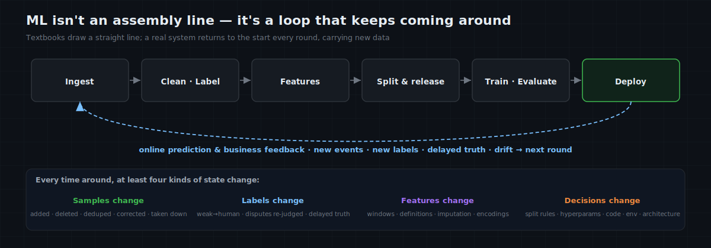
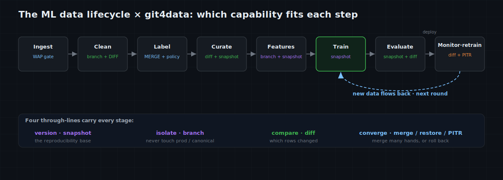
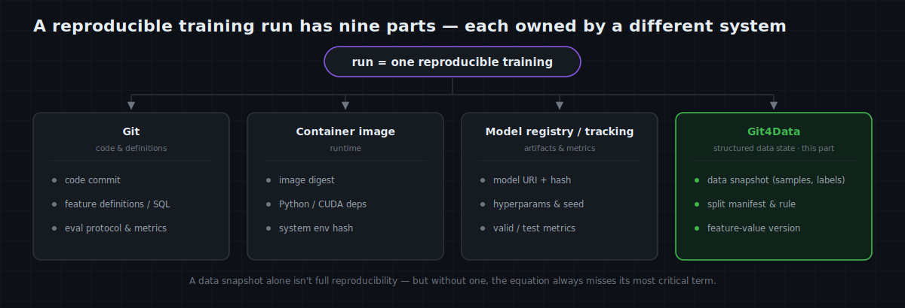
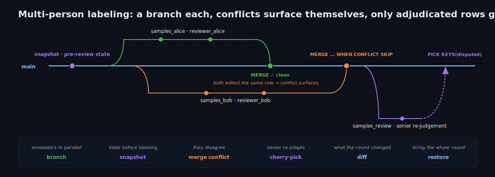
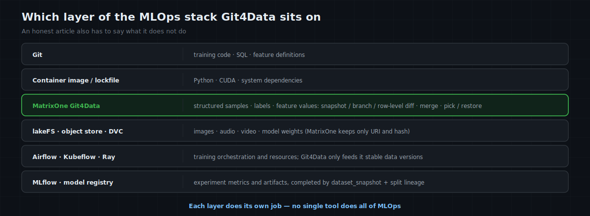

# MatrixOne Git4Data Deep Dive (Part 8) · AI Training in Practice — From Data Arriving to Model Iteration: How the Git4Data Capability Runs Through the Whole ML Pipeline

This series is seven parts in, and they did two things. The first four built Git4Data's coordinate system: [why data at scale needs Git-style version control](https://github.com/matrixorigin/matrixorigin-blog/blob/main/matrixorigin/git4data-part1-data-at-scale/index.md), how MatrixOne's [snapshot / branch / diff / merge / cherry-pick / restore work](https://github.com/matrixorigin/matrixorigin-blog/blob/main/matrixorigin/git4data-part2-hands-on/index.md) and [why they're fast](https://github.com/matrixorigin/matrixorigin-blog/blob/main/matrixorigin/git4data-part3-under-the-hood/index.md), and [where it sits](https://github.com/matrixorigin/matrixorigin-blog/blob/main/matrixorigin/git4data-part4-landscape/index.md) versus DVC, lakeFS, Dolt, and Snowflake. Parts five through seven covered the data-operations capabilities: [rescuing a fat-finger accident](https://github.com/matrixorigin/matrixorigin-blog/blob/main/matrixorigin/git4data-part5-incident-rescue/index.md), [many people editing data in parallel](https://github.com/matrixorigin/matrixorigin-blog/blob/main/matrixorigin/git4data-part6-collaborative-dev/index.md), and how ETL uses [Write-Audit-Publish](https://github.com/matrixorigin/matrixorigin-blog/blob/main/matrixorigin/git4data-part7-write-audit-publish/index.md) to keep a bad batch out of production.

From this part on, we enter the **AI training** scenario. AI training is one of the most central applications of the Git4Data capability — data organization, management, change, and collaboration all happen constantly during training, and the capability MatrixOne builds in is genuinely useful here.

AI training is itself a broad territory: from classical machine learning, to deep learning, to large-model pretraining and fine-tuning (SFT, RLHF, and so on), each with its own data shapes, scale, and organization. **This part focuses first on the most foundational of them — classical machine learning on structured data**; data management for deep learning and large models is left for later in the series.

Machine learning is a scenario with many stages and a long chain. Rather than drilling into one specific stage first, let's lay out the whole map: from data arriving to model iteration, what the real data problem is at each stage, and which Git4Data capability fits it.

First, a common misconception to clear up: **"data versioning" is often treated as one prep step before training** — tidy the data, save a version, then train. But a model — from ingestion, cleaning, labeling, and build, to training, evaluation, deployment, and continuous iteration — is **one data chain running end to end**; version control is the foundation every step of that chain stands on, not a one-off at any single step.

What's truly hard to manage is often not any single training run, but this chain of questions:

- This live model — which version of samples, labels, and features did it actually use?
- On which version of the validation set was it chosen, and on which version of the test / eval set did it get its final numbers?
- Between two runs, what exactly changed in the data?
- New data hasn't passed its checks yet — can we keep the production sample mainline from seeing it?
- Two annotators edited the same batch of samples — where do they agree, where do they conflict?
- Did the new feature bring the lift, or was it those corrected labels?
- After the model regresses, can we fully reconstruct the data state at the time?
- The data grew by just 1% — should this round be an incremental update, or a full retrain?

Behind all of these is the same gap: **machine learning already has code versions, model versions, and experiment tracking, but it often lacks a version semantic that acts on the data itself.**

That is exactly the gap MatrixOne's Git4Data capability fills in the ML pipeline. This part builds that whole-pipeline map first; later parts go deep along a few of its most typical stops.

> 📦 Companion SQL and experiment code for this series live in [matrixorigin/git4data-tutorial](https://github.com/matrixorigin/git4data-tutorial). This article builds the whole-pipeline framework first; later parts go deep on SFT curation, collaborative labeling, RLHF preference data, and multimodal data. **The code blocks in this article are illustrative excerpts (elided for readability)**; the companion repo has a runnable script — verified end to end on MatrixOne `4.1.0`, covering the core path (ingest → split release → model registration → cross-version DIFF) — and the row counts and metrics quoted here come from its actual output.

---

## First, correct a common illusion: the ML pipeline isn't an assembly line, it's a feedback loop

Textbooks often draw the ML pipeline as a straight line:

```text
collect data → clean & label → feature engineering → train → evaluate → deploy
```

A real system is more like a loop:



Every time around, at least four kinds of state change:

1. **Samples change**: added, deleted, deduped, corrected, taken down for compliance;
2. **Labels change**: weak labels become human labels, disputed samples get re-judged, delayed ground truth finally arrives;
3. **Features change**: windows, definitions, imputation, and encodings get redefined;
4. **Training decisions change**: split rules, hyperparameters, code, runtime, and model architecture keep iterating.

Code changes go to Git; training runs go to Airflow, Kubeflow, or another scheduler; model files sit in object storage; experiment metrics go to a tracking system. But "at a given moment, which rows in these big tables constitute the training data" does not automatically become a reproducible, comparable, mergeable version. Close that gap, and the ML pipeline finally has a complete chain of evidence.

---

## One master map: which Git4Data capability each key ML stage matches

The conclusion first. With the Git4Data capability, MatrixOne covers the full lifecycle of machine-learning data — from ingestion, cleaning and labeling, feature building, and dataset release, through training and evaluation, to production monitoring and feedback flowing back. Every stage has a capability that fits it, and they all share one set of snapshot / branch / diff / merge semantics, forming a single chain of evidence inside one database.



| ML stage | The real problem | Git4Data capability | What you get |
|---|---|---|---|
| Ingestion | new batch, quality unknown, mustn't poison the main table | `DATA BRANCH CREATE`, `DIFF`, `MERGE` | isolate, audit, publish atomically only on pass — i.e. WAP |
| Raw-data archival | want to look back at the original after cleaning | `CREATE SNAPSHOT`, time travel | a cheap, named baseline for the raw pool |
| Cleaning & curation | what did dedup / filter / fix actually touch | branch, row-level `DIFF`, `RESTORE` | a receipt for every cut; a bad clean is reversible |
| Multi-person labeling | parallel writes, conflicting opinions, review needed | one branch per person, `MERGE` conflicts, `PICK` | disagreement surfaces itself; only adjudicated rows are picked back |
| Feature engineering | a new definition to trial, without breaking the current set | branch, cross-version SQL, `DIFF`, `MERGE` | trial in isolation on full data, promote after it passes evaluation |
| Train / valid / test release | must freeze training content, tuning basis, and final benchmark | database snapshot + split manifest | all three sets released consistently in one version, membership reproducible |
| Training & evaluation | results must bind to split, code, environment | snapshot + model registry | build `model → dataset snapshot → split → code/env` lineage |
| Candidate comparison | which batch of data caused the metric change | snapshot-to-snapshot / branch-to-branch `DIFF` + SQL | narrow the model diff down to exact sample and label changes |
| Deploy & rollback | a new version regresses, must locate or restore | snapshot, `RESTORE`, PITR | reconstruct the training scene; roll a data incident back to a known state |
| Monitoring & feedback | new data accumulates, when to trigger the next run | SQL stats + version baseline + `DIFF` | drift judged against a stable reference; pull the exact training delta |
| Continuous learning | incremental or full retrain | `DIFF`, new snapshot | know inserts/updates/deletes first, then decide by model and data nature |

There's an important division of labor here:

> **SQL decides whether the data is valid, whether the distribution shifted, whether metrics clear the bar; the Git4Data capability provides the isolated workspace, the stable version anchors, and the executable change sets those judgments run on.**

Git4Data won't define "what counts as an outlier," "how much AUC lift is enough," or "what degree counts as concept drift." It solves a different layer: letting those rules run on the correct data version, letting passing changes enter the mainline in a controlled way, and letting failed trials be discarded or rolled back.

Below, one complete case runs this table end to end.

---

## The case that runs through the article: a transaction-risk model iterated weekly

Say we maintain a transaction-risk model. New transactions arrive daily; some take days to reveal whether they were fraud; the labeling team corrects old labels; the feature team keeps tuning statistical windows. The model is evaluated weekly and only ships when it clears the bar.

To keep the focus on the version workflow, the case simplifies the training samples into one table:

```sql
CREATE DATABASE risk_ml;
USE risk_ml;

CREATE TABLE samples (
    sample_id      BIGINT PRIMARY KEY,
    event_time     DATETIME,
    amount         DECIMAL(12,2),
    txn_count_7d   INT,
    amount_sum_30d DECIMAL(14,2),
    label          TINYINT,        -- 0=normal, 1=fraud, NULL=truth not back yet
    label_source   VARCHAR(32),    -- rule / reviewer / chargeback
    source_batch   VARCHAR(32)
);

CREATE TABLE dataset_membership (
    sample_id   BIGINT PRIMARY KEY,
    split_name  VARCHAR(16),     -- train / valid / test
    split_rule  VARCHAR(128)
);

CREATE TABLE model_registry (
    model_version    VARCHAR(32) PRIMARY KEY,
    dataset_snapshot VARCHAR(64),
    code_commit      VARCHAR(64),
    feature_version  VARCHAR(32),
    image_digest     VARCHAR(128),
    artifact_uri     VARCHAR(512),
    artifact_digest  VARCHAR(128),   -- weights content hash / immutable object version
    valid_auc        DOUBLE,
    test_auc         DOUBLE,
    status           VARCHAR(16)
);
```

The three tables carry different duties:

- `samples` is the continuously-evolving data mainline;
- `dataset_membership` records explicitly whether each sample belongs to train, valid, or test;
- `model_registry` stores no model binary — only the binding between a model version and its dataset, split, code, feature, runtime, artifact location, and **artifact content hash**.

A truly reproducible training record should look at least like this:



**A data snapshot alone isn't full reproduction.** But without a data snapshot, that equation is always missing its most important term.

### Stop 1: Ingestion — a branch as the isolation zone

Monday, 3 a.m., upstream delivers a new batch of samples. The traditional way writes them straight into `samples`, then runs quality checks; once a check fails, the dirty data is already in the mainline. The WAP from Part 7 is directly reusable here:

```sql
DATA BRANCH CREATE TABLE samples_stage FROM samples;

-- The new batch only enters the staging branch
INSERT INTO samples_stage VALUES (...);

-- Gates for completeness, domain, duplicates, referential relations, batch volume
SELECT COUNT(*) FROM samples_stage
WHERE source_batch = '2026w29'
  AND (amount < 0 OR txn_count_7d < 0);

-- See exactly how many rows this publish will insert / update / delete
DATA BRANCH DIFF samples_stage AGAINST samples OUTPUT SUMMARY;

-- Publish only if all gates pass
DATA BRANCH MERGE samples_stage INTO samples;
```

So the production sample mainline goes from "the entry point for data" to "the exit after passing the quality gate." When a gate fails, just drop `samples_stage` or keep it to debug — the mainline hasn't moved a row.

What Git4Data provides here isn't a new quality algorithm, but **isolation before the check** and **atomic promotion after it passes.**

### Stop 2: Cleaning & labeling — turn edits into a reviewable change set

After the new data lands, the labeling team receives delayed ground truth: 3,000 new transactions now have labels, and spot checks find 200 wrong labels in the old data.

First, snapshot the state before the review:

```sql
CREATE SNAPSHOT risk_before_review FOR TABLE risk_ml samples;
```

Two annotators can each open a branch, without overwriting each other on the same table:

```sql
DATA BRANCH CREATE TABLE samples_alice FROM samples;
DATA BRANCH CREATE TABLE samples_bob   FROM samples;

UPDATE samples_alice SET label = ..., label_source = 'reviewer_alice'
WHERE sample_id BETWEEN ...;

UPDATE samples_bob SET label = ..., label_source = 'reviewer_bob'
WHERE sample_id BETWEEN ...;
```

The agreement rate on the overlapping region is computed directly in SQL; when two people disagree and both changed the same row, the three-way merge recognizes it as a genuine row-level conflict:

```sql
DATA BRANCH MERGE samples_alice INTO samples;
DATA BRANCH MERGE samples_bob INTO samples WHEN CONFLICT SKIP;
```

`SKIP` keeps the mainline's existing verdict for now and merges the rest of the non-conflicting labels as usual. After a senior reviewer finishes the re-judgment on a review branch, only the disputed samples are picked back to the mainline:

```sql
DATA BRANCH PICK samples_review INTO samples
  KEYS (SELECT sample_id FROM review_queue)
  WHEN CONFLICT ACCEPT;
```

The mapping is very natural:



The labeling platform still handles the UI, task dispatch, permissions, and piecework; the underlying data's parallel edits, conflict semantics, and version evidence are handled by MatrixOne's Git4Data capability.

### Stop 3: Feature engineering — not copying a big table, but pulling a trial branch

The feature team finds `txn_count_7d`'s event-dedup definition inaccurate and wants to recompute this 7-day window feature with a new definition. Recomputing the main table directly is too risky: the current model and other training jobs are still reading the current definition; copying a billion-row table is slow and expensive.

A better way is to run the full trial on a branch:

```sql
DATA BRANCH CREATE TABLE samples_feat_candidate FROM samples;

-- Recompute the feature on the branch; the mainline keeps serving current training and queries
UPDATE samples_feat_candidate SET txn_count_7d = ...;

-- Check the affected scope, null rate, distribution, and leakage risk
DATA BRANCH DIFF samples_feat_candidate AGAINST samples OUTPUT SUMMARY;
SELECT ... FROM samples_feat_candidate;
```

The candidate feature can be trained and evaluated on the branch. No lift? Drop the branch. Stable lift? Merge it back to the mainline, or keep the branch itself as a candidate dataset version.

One distinction matters especially here:

- **Value recompute**: schema unchanged, only row values change — fits branch, DIFF, MERGE;
- **Adding / dropping a feature column**: that's schema evolution. MatrixOne currently requires both sides of a row-level DIFF / MERGE to share an identical schema, so unify the schema first, then branch to trial — you can't have two branches each freely change column definitions and still expect an automatic merge.

That's one of Git4Data's boundaries: it manages "data evolution under the same structure" well, but schema design itself still goes through a controlled migration process.

### Stop 4: Train / valid / test release — freeze not just the data, but "who belongs to which set"

Only after ingestion, label review, and feature validation are done does the real dataset-release moment arrive. Here you can't just say "the training set," because a trustworthy model development has at least three data sets with distinct duties:

| Set | Purpose | How it may be used | The easiest mistake |
|---|---|---|---|
| **Training set (train)** | fit model parameters | read, sample, and train on it repeatedly | mixing in future data or near-duplicate samples of the same entity |
| **Validation / eval set (valid / eval)** | select features, hyperparameters, thresholds, candidate models | evaluate repeatedly during development | tuning to the best on it, then treating that score as final generalization |
| **Test / holdout set (test / holdout)** | final unbiased evaluation after candidates are locked | look as little as possible, don't keep tuning on it | test, dislike the result, go back and tune — the test set has effectively become a validation set |

Some teams also keep a long-stable **golden evaluation set**: covering key cohorts, rare risks, and business red lines, for regression across model versions. Think of it as an extra controlled test set — likewise, it must never be quietly pulled back into training.

So the versioned object can't be only sample content; it must include **split membership and the split rule.** In the case, we write it explicitly into `dataset_membership`. Risk data is usually split by time, simulating "use the past to predict the future":

```sql
INSERT INTO dataset_membership
SELECT sample_id,
       CASE
         WHEN event_time <  '2026-06-01' THEN 'train'
         WHEN event_time <  '2026-06-15' THEN 'valid'
         WHEN event_time <  '2026-07-01' THEN 'test'
       END,
       'time_split:v1:2026-06-01/06-15/07-01'
FROM samples
WHERE label IS NOT NULL AND event_time < '2026-07-01';
```

The time boundary is only the first layer. A real split must also guard against several leaks:

- highly-correlated samples of the same user, device, or merchant crossing into both train and test, so the model "has seen the same person";
- duplicate records or augmented samples of the same raw event split into different sets;
- standardization, target encoding, or missing-value fitting done on the full data *before* the split — the preprocessing parameters have already peeked at valid / test;
- a label produced later than the feature cutoff, wrongly treated as information available at the time.

So the split manifest should store not just the three words `train / valid / test`, but the time cutoffs, grouping keys, dedup rules, and random seed or hashing rule. The preprocessor may only be fit on train, then applied as-is to valid and test.

Now `samples` and `dataset_membership` must be released as one whole. Snapshotting single tables separately may land at different moments; a database-scope snapshot fits better here:

```sql
CREATE SNAPSHOT risk_dataset_v1 FOR DATABASE risk_ml;
```


Training, validation, and the final test all explicitly read from the same dataset version, changing only `split_name`:

```sql
-- The trainer reads train
SELECT s.*
FROM samples {SNAPSHOT='risk_dataset_v1'} s
JOIN dataset_membership {SNAPSHOT='risk_dataset_v1'} m
  ON s.sample_id = m.sample_id
WHERE m.split_name = 'train';

-- Tuning and model selection read valid; only after locking do you read test
SELECT m.split_name, COUNT(*)
FROM dataset_membership {SNAPSHOT='risk_dataset_v1'} m
GROUP BY m.split_name;
```

This database snapshot isn't a physical copy of the whole database, but a named version over the tables' consistent state at that moment. As Part 3 explained: MatrixOne's immutable objects and metadata catalog make a snapshot's cost nearly independent of data size.

By now, what's reproducible isn't just "which samples," but "what role each sample plays in this experiment." If later you fix a test label, add hard samples, or adjust the split boundary, you should release `risk_dataset_v2` and bind the new evaluation explicitly to v2 — you can't overwrite v1 and keep using the old numbers.

Before a new version releases, sample content and split membership are reviewed separately:

```sql
-- What changed in samples or labels
DATA BRANCH DIFF samples
AGAINST samples {SNAPSHOT='risk_dataset_v1'} OUTPUT SUMMARY;

-- Which samples moved from one split to another, or newly entered an eval set
DATA BRANCH DIFF dataset_membership
AGAINST dataset_membership {SNAPSHOT='risk_dataset_v1'} OUTPUT SUMMARY;
```

These two DIFFs distinguish "the model changed" from "the ruler changed": if the test set's members, labels, or eval protocol changed, v2's test score is still valid, but it's no longer a same-definition, apples-to-apples comparison with v1. Cross-version trends should be compared first on an unchanged fixed test / golden set, reporting the new time window as a separate metric.

### Stop 5: Training & evaluation — a model version must trace back to a data version

MatrixOne won't run PyTorch, XGBoost, or scikit-learn for you. Training still happens in the framework; weights still land in object storage or a model registry. But once training finishes, write the full binding into the registry:

```sql
INSERT INTO model_registry VALUES (
  'risk_m1',
  'risk_dataset_v1',
  '8f31c2...',
  'feature_v7',
  'sha256:4b7...',
  's3://models/risk_m1/model.bin',
  'sha256:weights-m1...',
  0.9430, 0.9412,
  'candidate'
);
```

Now "what training data did risk_m1 use" is no longer a doc that may be stale, but an executable relation:

```text
risk_m1
  ├── dataset = risk_dataset_v1
  ├── split   = time_split:v1
  ├── code    = 8f31c2...
  ├── feature = feature_v7
  ├── runtime  = sha256:4b7...            (image digest)
  ├── valid    = AUC 0.9430
  ├── test     = AUC 0.9412
  ├── artifact = s3://models/risk_m1/model.bin
  └── digest   = sha256:weights-m1...     (weights content hash / immutable object version)
```

Three months later, to reproduce the model: check out the code from Git, bring up the runtime by image digest, read train / valid / test from `risk_dataset_v1`'s split manifest, and verify the artifact against the `artifact_digest` in the registry (for weights kept in object storage / lakeFS, that maps to an immutable object / commit version). **What Git4Data supplies is the link that used to be lost most easily: the data scene and the evaluation scene.**

### Stop 6: Candidate evaluation & shipping — explain the difference first, then discuss metrics

Round-two model `risk_m2` wins on the validation set; only after locking features, hyperparameters, and thresholds is the final test-set evaluation allowed, and test AUC rises from 0.9412 to 0.9470. That number still can't answer the most important question alone: where did the lift come from?

If `m1` and `m2` bind `risk_dataset_v1` and `risk_dataset_v2`, first look at the two sample mainlines:

```sql
DATA BRANCH DIFF samples
AGAINST samples {SNAPSHOT='risk_dataset_v1'}
OUTPUT SUMMARY;
-- e.g.: INSERTED 3000 / UPDATED 200 / DELETED 0
```

Now the reviewer knows this wasn't "a mysterious swap of data," but: 3,000 delayed-truth rows added, 200 wrong labels fixed, everything else untouched. Combined with the code commit, feature version, and hyperparameter record, you can judge whether the experiment changed only the intended variable.

The shipping gate shouldn't be a single overall AUC either. A risk model must also watch an out-of-time test set, a long-term golden set, cohort slices, recall, false-positive rate, calibration, and latency. Each metric must record the **dataset snapshot, split, metric definition, and evaluation code version** together. Git4Data doesn't define these standards, but it lets every evaluation point at a stable candidate data version and keeps the evidence for "why it was approved to ship."

If the test result disappoints, the team can of course keep developing — but the next model, tuned using test feedback, can no longer claim an unbiased evaluation on the same "unseen test set." Keep the old result, start a new candidate round, and where possible do the final confirmation on a new time window or an independent holdout.

After passing the gate, flip `model_registry.status` from `candidate` to `production`. That's just release metadata; the actual serving deployment is still done by the model-serving platform.

### Stop 7: Production monitoring — a version baseline keeps drift judgment from floating

After a model ships it meets two different kinds of "change":

1. **The data itself was edited**: new samples, corrected labels, deleted records;
2. **The distribution shifted**: new traffic differs from the training period in amount, category, cohort ratios, and other statistics.

The first fits a row-level DIFF; the second needs SQL or dedicated drift metrics comparing the statistics of two windows. Don't conflate them.

```sql
-- How many inserts / updates / deletes happened to the data content
DATA BRANCH DIFF samples
AGAINST samples {SNAPSHOT='risk_dataset_v1'}
OUTPUT SUMMARY;

-- Did the distribution drift: illustrative; a real system computes PSI, KS, JS divergence, etc.
SELECT source_batch,
       COUNT(*) AS n,
       AVG(amount) AS avg_amount,
       AVG(txn_count_7d) AS avg_txn_count
FROM samples
GROUP BY source_batch;
```

Git4Data's value here is a **stable baseline**: the train / valid / test versions from development don't vanish as the main table updates; monitoring results can be stated precisely as "the change of the current 2026w29 batch relative to `risk_dataset_v1`," not relative to some temporary table that's already been overwritten.

### Stop 8: Feedback & continuous learning — know what changed first, then decide how to train

A week later, the main table has 3,000 more samples than `risk_dataset_v1` and 200 fixed labels. Only now comes the core question most discussed in continuous learning: train only the delta, or retrain in full?

This decision can't be based only on "few rows changed."

**When incremental training fits:**

- the model supports `partial_fit`, continued training, or a reliable warm start;
- the new data is mostly same-distribution appends;
- the change fraction is small, training is frequent, and full retrains have genuinely become the bottleneck;
- no large-scale deletion or label correction of old data.

**When a full retrain fits better:**

- feature definitions, model architecture, or hyperparameters changed;
- clear concept drift appears, needing resampling or reweighting;
- many old labels were corrected, or old samples deleted for compliance;
- the model can't do a reliable incremental update;
- you need to remove the path-dependence of incremental training and get a clean, reproducible release model.

Note especially: **deleting a row from the training table does not automatically erase its influence on an already-trained model.** That's the machine-unlearning problem, and many settings still require a retrain. Git4Data can tell you which rows were deleted, but it won't make the model "forget" them.

So the safer workflow is:

```text
① DIFF the current data AGAINST the last training snapshot
② check change type, scale, distribution drift, and compliance requirements
③ decide incremental update / windowed retrain / full retrain
④ after training, take a new snapshot and bind the new model version
```

When incremental training genuinely applies, the original experiment's numbers still hold up: over 6 rounds, each adding ~1,000 rows with occasional label fixes, full retrains process a cumulative 21,000 rows, while processing only each round's change is a cumulative 6,004. As rounds grow, the full approach's cumulative processing is roughly quadratic; incremental is roughly linear.

But put those numbers in their proper place: **"saving compute" is a conditional benefit; "knowing what the data changed, being able to reproduce each run, being able to locate a regression" is the universal one.**

Before training `risk_m2`, regenerate and audit `dataset_membership` for v2's time window: confirm the sizes, time boundaries, and entity crossovers of train / valid / test all match expectations. Then pin samples, labels, and the three split manifests together as a new database version:

```sql
CREATE SNAPSHOT risk_dataset_v2 FOR DATABASE risk_ml;

INSERT INTO model_registry VALUES (
  'risk_m2', 'risk_dataset_v2', 'b710aa...', 'feature_v7',
  'sha256:4b7...', 's3://models/risk_m2/model.bin', 'sha256:weights-m2...',
  0.9491, 0.9470, 'candidate'
);
```

Now the model-and-data evolution chain is clear:

```text
risk_m1 ← risk_dataset_v1 (train / valid / test v1)
             │
             ├── +3000 new samples
             └──  200 label fixes
                         ↓
risk_m2 ← risk_dataset_v2 (train / valid / test v2)
```

If `risk_m2` regresses after shipping, the search space is no longer the whole table, but this explicit change set plus the version diffs of code, features, and config.

---

## Putting every primitive back in the ML context

Having walked the case, look again at Git4Data's primitives and you'll see each carries a distinct duty.

### Snapshot: not "make a backup," but publish a referenceable data version

A snapshot's most valuable moment isn't after every row is written, but at a **semantic boundary**:

- a raw batch passes the ingestion gate;
- a round of cleaning or labeling finishes;
- a train / valid / test dataset version is formally released;
- a model is approved to ship;
- before a high-risk data migration.

Too many snapshots raise retention cost and naming chaos; too few lose key scenes. The right strategy isn't "snapshot on every write," but versioning around auditable, reproducible release points.

### Branch: not storing another copy, but isolating a hypothesis not yet proven correct

A branch fits:

- an unvalidated new batch;
- a round of data cleaning;
- one annotator's results;
- a new feature definition;
- a resampling or class-balancing scheme;
- a candidate dataset and its split.

What they share: **they must be computed in the full data context, but must not affect the mainline until they pass review.**

### Diff: not just "get the delta," but the entry point to explaining model change

DIFF can answer:

- which samples did this cleaning round delete?
- which 200 rows differ between the old and new label sets?
- how many users did the candidate feature table affect?
- what are the training-data variables of `m2` relative to `m1`?
- after online feedback flows back, how many inserts, updates, deletes?

So DIFF serves both compute optimization and audit, attribution, and review. Understanding it only as "the data source for incremental training" undersells its value across the whole pipeline.

### Merge & Pick: turning "passed review" into a controlled data promotion

`MERGE` fits atomically merging a whole audited branch's valid changes back to the mainline; `PICK` fits promoting only a set of explicit primary keys — e.g. re-reviewed disputed labels, human-confirmed hard cases, or a batch of high-value samples.

This gives training data a code-PR-like flow:

```text
branch → edit → SQL check → DIFF review → evaluate → MERGE / PICK → snapshot
```

### Restore & PITR: one restores a "version," one restores a "point in time"

`RESTORE` fits returning to a named, known-good dataset version; PITR fits an incident where "we don't know which write broke it, but we know things went wrong around Wednesday afternoon."

They're data-recovery capabilities first. In the ML pipeline, the extra value is: after restoring, you can re-run training and evaluation to judge what a data incident did to the model.

---

## Which layer does MatrixOne actually sit at in the MLOps stack

A complete article must also say what it does *not* do. A more precise division of labor:



| Object | Better-suited version / management | MatrixOne's role |
|---|---|---|
| Training code, SQL, feature definitions | Git | record the commit in the registry, bound to a data snapshot |
| Structured samples, labels, feature values | **MatrixOne Git4Data** | snapshot, branch, row-level diff / merge / pick, restore |
| Large bytes: images, audio, video, model weights | lakeFS, object-store versioning, DVC, etc. | MatrixOne keeps the catalog, labels, URI, commit/hash; doesn't pretend to manage byte content |
| Python / CUDA / system deps | container images, lockfiles | record the image digest or environment hash |
| Training scheduling & resources | Airflow, Kubeflow, Ray, cloud training, etc. | supply a stable data-version input, not replace the scheduler |
| Experiment metrics & model registry | MLflow or an existing platform, or a table | complete data-and-eval lineage via `dataset_snapshot + split + metric protocol` |
| Online deploy, canary, rollback | model serving & release platform | keep the release-record ↔ data-version link, not replace serving |

In one line:

> **Git manages code, images manage the environment, the model registry manages artifacts, the scheduler manages execution; MatrixOne, through Git4Data, manages the continuously-evolving "structured data state" of the ML process, and connects it to the other versions.**

That's more realistic — and easier to adopt — than "one tool does all of MLOps."

---

## Which data should go into MatrixOne, and which shouldn't

MatrixOne fits best the data that:

1. has rows, tables, and primary keys as its basic semantics;
2. is repeatedly cleaned, corrected, labeled, merged;
3. needs SQL, JOINs, aggregation, or vector compute directly across versions;
4. needs to know "which records changed";
5. needs lineage to models, batches, annotators, rules, or external objects.

Typical objects: sample catalogs, labels, preference pairs, feature values, data-quality results, dataset split manifests, model-registry metadata, and feedback records.

Unparseable bytes — images, audio, video, huge corpus files, model weights — are better left to object storage, lakeFS, or DVC. A MatrixOne snapshot freezes the stored **value** of these URI / reference fields (e.g. a lakeFS commit, an object version, or a stage path), but what it keeps is the pointer, not the bytes themselves — if the external object is overwritten at the same address, the database snapshot won't preserve the old bytes for you. (Note: the `datalink` type in v4.1.0 only parses `file://` / `hdfs://` / `stage://`, not `s3://`; so S3 / lakeFS objects should be stored as a stage path or an immutable object / commit version, rather than relying on `datalink` to parse an arbitrary URL.) A multimodal setting pins the "byte version" and the "catalog version" together:

```text
model
  └── MatrixOne catalog snapshot
         └── lakeFS commit / object version
                └── image / audio / video bytes
```

That will be the topic of the later multimodal part.

---

## The eight most common pitfalls in practice

### 1. Numbering models without binding the training data

`model_v17`, if it only maps to a filename with no dataset snapshot, split manifest, code commit, feature version, and environment digest, isn't a reproducible version — just a label.

### 2. Training jobs still reading a changing main table

Even with a snapshot before training, if the trainer keeps `SELECT FROM samples`, a long job's data boundary can still diverge from expectations mid-run. Training, validation, and test jobs must all explicitly reference the same published snapshot and its split.

### 3. Treating a random split as a reproducible split

Same snapshot doesn't mean same random split. Time boundaries, hashing rules, or a random seed must be saved too; time-series and risk settings must also prevent future-information leakage.

### 4. Merging validation and test into one "eval set"

The validation set can participate in model selection; the test set does the final confirmation after selection is done. Every peek at the test result followed by re-tuning leaks test information into development. Record valid and test metrics separately, bound to explicit snapshots and split versions.

### 5. Equating DIFF with drift detection

DIFF answers which records were inserted, updated, deleted; drift detection answers whether the statistical distribution or conditional relationship changed. The latter still needs PSI, KS, JS divergence, performance slices, and business judgment.

### 6. Seeing little change, defaulting to incremental training

200 label fixes may deserve a full retrain more than 200k same-distribution appends. The training strategy depends on the **nature** of the change, model ability, forgetting risk, and compliance — not just the count.

### 7. Forgetting that snapshots and branches have retention cost

Snapshots and zero-copy branches are cheap to create, but the historical objects they reference can't be GC'd. Distinguish long-retained shipped versions, short-retained candidates, and temporary branches cleaned up at job end.

### 8. Compliance deletion fighting a long-term snapshot policy

If personal data must be fully deleted, keeping long-term historical snapshots that contain it may violate requirements. Data retention, snapshot TTL, access control, deletion proof, and model-retrain / unlearning policy must be designed together. Git4Data provides the version capability, but won't make the compliance judgment for the organization.

---

## A minimal loop you can adopt directly

If you don't want to build a grand MLOps platform from day one, start with this minimal loop:

```text
1. New batch enters a staging branch
2. After SQL quality gates pass, MERGE to the sample mainline
3. Cleaning, labeling, feature changes all happen on branches; DIFF, then merge
4. Generate and audit train / valid / test manifests, release together with a DB-level CREATE SNAPSHOT
5. On model registration, mandate dataset_snapshot + split_rule + valid/test metrics + code_commit + image_digest
6. After online feedback flows back, DIFF AGAINST the last dataset snapshot
7. Decide incremental or full retrain by change type and drift metrics
8. After the new model passes the gate, take a new snapshot and update model lineage
```

It doesn't require replacing all existing tools at once — only three disciplines:

- **unaudited data doesn't enter the mainline directly;**
- **training with no dataset snapshot and split manifest doesn't enter the model registry;**
- **a model whose data and eval-baseline diff can't be explained doesn't go to production.**

Once these three take hold, snapshot, branch, DIFF, and MERGE stop being scattered SQL and become the ML team's shared working language.

---

## Closing: a model's lifecycle is, at heart, the lifecycle of a data state

Looking back over the whole flow, the Git4Data capability didn't train the model for you, nor judge whether the model is good. It does a more foundational layer:

- before data enters, it can be isolated;
- while it's edited, it can be parallelized, reviewed, merged;
- while it's trained, it can be frozen and referenced;
- when the model changes, the data variables can be explained;
- when an incident happens, it can be reconstructed and rolled back;
- when feedback returns, you know exactly where the next round starts.

So Git4Data's biggest value to ML isn't only "how much compute incremental training saved," but turning a pipeline once held together by filenames, timestamps, and verbal agreements into an **executable, auditable, reproducible chain of data versions.**

This part built the master map of the AI-training arc. Next, we go deep along a few of its most typical stops:

- **SFT data curation**: how hundreds of thousands of instructions get deduped, filtered, and decontaminated in place, with a DIFF receipt for every cut;
- **Collaborative labeling**: how parallel labeling, disagreement discovery, and senior review map to branch / conflict / cherry-pick;
- **RLHF preference data**: how consensus, dispute, re-judgment, and reward-model versions form a complete lineage;
- **Multimodal training sets**: lakeFS for bytes, MatrixOne for the catalog, labels, and row-level evolution — how the two version worlds stitch into one reproducible whole.

When these stops share one set of version primitives, Git4Data truly turns from a database feature into a way of working for AI data engineering.

> 📎 Runnable SQL: [github.com/matrixorigin/git4data-tutorial](https://github.com/matrixorigin/git4data-tutorial) ｜ Prior seven parts: [github.com/matrixorigin/matrixorigin-blog](https://github.com/matrixorigin/matrixorigin-blog) ｜ Source & community: [github.com/matrixorigin/matrixone](https://github.com/matrixorigin/matrixone)


---

## References

- MLflow — experiment tracking & model registry: <https://mlflow.org/docs/latest/tracking.html>, <https://mlflow.org/docs/latest/model-registry.html>
- Apache Airflow — workflow scheduling: <https://airflow.apache.org/docs/>
- scikit-learn — data leakage & common pitfalls: <https://scikit-learn.org/stable/common_pitfalls.html#data-leakage>
- lakeFS — data version control over object storage: <https://docs.lakefs.io/>
- Bourtoule et al., *Machine Unlearning*, IEEE S&P 2021: <https://arxiv.org/abs/1912.03817>
- Companion runnable script (verified on MatrixOne 4.1.0): [`08-ml-lifecycle/ml_lifecycle_demo.sql`](https://github.com/matrixorigin/git4data-tutorial/blob/8207ec6d958baf5bfc4378d64e1e41902b2245f3/08-ml-lifecycle/ml_lifecycle_demo.sql)
