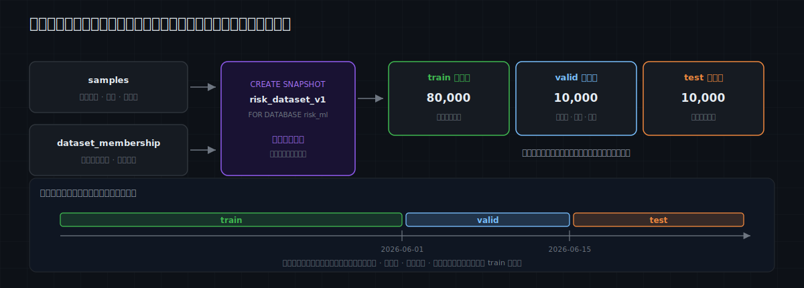

# MatrixOne Git4Data 技术详解（九）·AI 训练实践篇：数据集发布与泄漏——别让离线指标骗了你

在机器学习里，一个模型上线前值不值得信，几乎全靠**离线评估**来回答：这一版比上一版好吗？这个特征有没有用？阈值调到多少合适？能不能上线？——所有这些决定，背后都是同一件事：在一批模型**没见过**的数据上，量出它真实的表现。

而“没见过”这三个字，全靠数据集切分来保证。训练前，我们把数据分成三份各司其职的集合：**训练集（train）**拟合模型参数，**验证集（valid）**用来选特征、调超参、比候选模型，**测试集（test）**在方案锁定后给出一次尽量无偏的最终估计。这三份怎么切、边界画在哪，直接决定了后面每一个指标能不能信。

问题是，这一步偏偏常常是整个流程里最被随手对待的一环——一句 `train_test_split(random_state=42)` 就翻篇了。于是有了下面这个很多机器学习工程师都经历过的场景。

离线评估 AUC 0.94，兴冲冲上线，一周后线上表现掉到 0.78。回头排查：模型没动、特征没动、代码没改——问题出在最不起眼的那一步，训练集和测试集是怎么切的。

当初切分用的是一句随手的 `train_test_split(random_state=42)`：同一个用户的多笔交易被随机分到了 train 和 test，模型其实“见过”测试集里的人；标准化又是在切分之前对全量数据做的，均值和方差早偷看了测试集。更麻烦的是，那份切出 0.94 的数据集现在**复现不出来了**——当时的 notebook 早关了，`samples` 表这一周又新增、修正了几千行，同样的 `random_state=42` 作用在一张已经变了的表上，切出来的根本不是同一批行。

离线指标是模型上线前唯一的“体检报告”。**切分错了，这份报告就是假的**——它不会报错，只会给你一个好看的数字，然后在生产环境里翻车。

这一篇就讲这一步：为什么训练 / 验证 / 测试的切分不是一句 `ORDER BY RAND()`，而是决定离线评估可不可信的关键一步；以及怎么用 MatrixOne 的 Git4Data 能力，把它做成可复现、可审计、可回退的版本化对象。

> 本篇承接上一篇[《AI 训练实践篇·总览》](https://github.com/matrixorigin/matrixorigin-blog/blob/main/matrixorigin/git4data-part8-ml-lifecycle-zh/index.md)第四站，沿用同一个风控案例往深里钻。仍然聚焦基于结构化数据的传统机器学习。文中 SQL 全部在 MatrixOne `4.1.0` 上实测，可跑版本见 [matrixorigin/git4data-tutorial](https://github.com/matrixorigin/git4data-tutorial) 的 `09-dataset-release/`。

---

## 一次切分，其实同时定义了三件事

“把数据切成 train / valid / test”听起来是一个动作，其实它同时定义了三件事：

1. **谁属于哪一集（membership）**——每一条样本，是训练、验证还是测试；
2. **按什么规则切（rule）**——时间截点？实体哈希？随机种子？去重键？
3. **切在哪一版数据上（version）**——这份切分，作用在“哪一个时刻的 `samples`”上。

大多数团队只版本化了第 2 条里的一小部分——代码里的 `random_state`——却几乎从不版本化第 1 条和第 3 条。于是“可复现的切分”成了一句空话：只要底层表动过，同一个种子切出来的就是另一批行；而“哪一条样本当时属于哪一集”这个最关键的事实，根本没被任何东西记住。

真正要冻结的，是 **membership + 规则 + 它作用的那一版数据**，三者一起。这恰好是 Git4Data 能钉住的东西。下面先把切分做错，看看错在哪；再把这三样一起钉稳。

---

## 五类泄漏，逐个上手

这里的“泄漏（leakage）”是机器学习里的专门术语，**指训练时用到了上线时根本拿不到的信息**——它和“数据被泄露出去”那种安全意义上的数据外泄（data breach）完全是两回事，说的是训练数据里混进了本不该被模型提前看到的信息。它的典型症状就是开头那一幕——离线虚高、上线滑坡。先把案例的数据准备出来。

相比总览，这里给 `samples` 加了三列做泄漏检测必需的键：`user_id`（实体键，同一个人有多笔交易）、`event_key`（去重键，同一底层事件及其增强副本）、`label_time`（真值何时可知，晚于事件时间）。

```sql
CREATE TABLE samples (
    sample_id    BIGINT PRIMARY KEY,
    event_time   DATETIME,       -- 交易发生时间，也是特征截点
    user_id      BIGINT,         -- 实体键：同一个人可能有多笔
    event_key    VARCHAR(64),    -- 去重键：同一笔底层事件 / 其增强副本
    amount       DECIMAL(12,2),
    txn_count_7d INT,
    label        TINYINT,        -- 0=正常, 1=欺诈, NULL=真值未到
    label_time   DATETIME,       -- 标签何时可知（晚于 event_time）
    label_source VARCHAR(32)
);
```

案例数据：10 万笔交易、2 万个用户（人均约 5 笔），时间跨度 121 天（`2026-03-01` 到 `2026-06-29`），欺诈真值在事件 3 天后回来。再加 2000 条**增强近重复**样本，和原始样本共享同一个 `event_key`。以“现在是 `2026-07-01`”为界，`label_time` 还没到的最近样本，真值尚未回来。实测共 **102,000** 行，其中 **101,158** 行有标签、**842** 行是“真值未回”的最近样本。

### 先看反面教材：一次朴素的随机切分

```sql
INSERT INTO membership_rand
SELECT sample_id,
       CASE WHEN rand() < 0.8 THEN 'train'
            WHEN rand() < 0.5 THEN 'valid'
            ELSE 'test' END
FROM samples
WHERE label IS NOT NULL;
--   实测 train 80999 / valid 10196 / test 9963，比例看着很正常。
```

比例没问题，但下面三条检测器会让它原形毕露。

### 泄漏一：时间泄漏（把未来喂给了过去）

风控、推荐、风险这类业务有强时间性：你要用**过去**预测**未来**。随机切分却把不同时间的样本打散，`train` 里混进了比 `test` 更晚的交易——相当于让模型提前看了未来。

```sql
-- train 里有多少样本，比 test 最早的那条还晚？
SELECT COUNT(*) AS train_rows_from_the_future
FROM samples s JOIN membership_rand m ON s.sample_id = m.sample_id
WHERE m.split_name = 'train'
  AND s.event_time > (SELECT MIN(s2.event_time)
                      FROM samples s2 JOIN membership_rand m2 ON s2.sample_id = m2.sample_id
                      WHERE m2.split_name = 'test');
--   实测 80316。train 的 8 万行里几乎全都晚于 test 的起点——彻底穿越。
```

还有一层更隐蔽的时间泄漏在**标签**上：`label_time`（chargeback 几天后才回来）晚于特征截点 `event_time`，但被当成“事件当时就知道的信息”。风控里“这笔后来被拒付了”正是最强的特征，也正是上线当下**拿不到**的。所以切分不仅要管样本的时间，还要保证：进入训练的每条样本，它的标签在特征截点时确实已经可知。

### 泄漏二：实体泄漏（同一个人跨集）

同一个 `user_id` 的多笔交易被逐行随机切分，一部分进 train、一部分进 test。模型于是学到了“这个人”，而不是“这类行为”。离线看着很准，一上线遇到全新用户就崩。

```sql
-- 有多少用户同时出现在 train 和 test？
SELECT COUNT(*) AS users_in_train_and_test FROM (
  SELECT s.user_id
  FROM samples s JOIN membership_rand m ON s.sample_id = m.sample_id
  WHERE m.split_name IN ('train', 'test')
  GROUP BY s.user_id
  HAVING COUNT(DISTINCT m.split_name) = 2
) t;
--   实测 8213。两万用户里超四成横跨 train 和 test。
```

### 泄漏三：重复 / 增强泄漏（同一事件被拆开）

同一笔底层事件的重复记录、或数据增强产生的近重复样本，被随机拆到不同集合。测试集里于是躺着训练集样本的“双胞胎”。

```sql
-- 有多少 event_key 被切到了不止一个集合？
SELECT COUNT(*) AS event_keys_across_splits FROM (
  SELECT s.event_key
  FROM samples s JOIN membership_rand m ON s.sample_id = m.sample_id
  GROUP BY s.event_key
  HAVING COUNT(DISTINCT m.split_name) > 1
) t;
--   实测 688。那 2000 条增强样本，有 688 组和它们的原件分了家。
```

一次随机切分，三条检测器全部亮红。而这三条，都是**能用 SQL 在切分清单上直接查出来**的结构性泄漏。还有两类泄漏不在 membership 里，但同样致命。

### 泄漏四：预处理泄漏（统计量偷看了验证 / 测试集）

在**全量**数据上先做标准化、目标编码、缺失值拟合，再切分——预处理器的均值、方差、类别频率里，已经含了验证集和测试集的信息。正确顺序是反过来的：**只在 train 上 `fit`，再原样 `transform` 到 valid 和 test**。

这一步不是 membership 能查的，是流程纪律。但版本化切分能给它一个可靠前提：因为 train 是从一个**确定的快照**、按 `split_name='train'` 读出来的，你能保证“预处理器 fit 用的就是 train 这批行、而且这批行日后可逐位复现”，而不是某次 notebook 里飘忽的一个子集。

### 泄漏五：目标泄漏（特征里混进了答案）

特征里混进了与标签强相关、但上线时拿不到的字段。风控里最典型的就是拿“是否已拒付 / 人工审核结论”去预测欺诈——这些是**结果**，不是**事前特征**。症状是某个特征重要性高得离谱、离线 AUC 好得不真实。

它同样超出 membership 的范围，属于特征来源审计。但这正是[第七篇 Write-Audit-Publish](https://github.com/matrixorigin/matrixorigin-blog/blob/main/matrixorigin/git4data-part7-write-audit-publish-zh/index.md) 的用武之地：某个“好得可疑”的特征列是什么时候、由谁加进主表的，配合 `DATA BRANCH DIFF` 一查便知，而不是靠回忆。

---

## 把切分改对：时间切分，再让检测器归零

对这个风控案例，正确的主切分方式是**按时间切**——训练用早期数据，验证和测试用后面的时间窗口，模拟“用过去预测未来”。切分规则连同时间截点一起，显式写进 `dataset_membership`。

```sql
INSERT INTO dataset_membership
SELECT sample_id,
       CASE WHEN event_time <  '2026-06-05' THEN 'train'
            WHEN event_time <  '2026-06-17' THEN 'valid'
            ELSE 'test' END,
       'time_split:v1 cutoffs=2026-06-05/2026-06-17; feature_cutoff=event_time; label_ready<=2026-07-01'
FROM samples
WHERE label IS NOT NULL;          -- “真值未回”的最近样本，本轮先不进任何集合
--   实测 train 80950 / valid 10104 / test 10104，约 80 / 10 / 10。
```

注意两件事：切分规则里**存下了时间截点、特征截点和标签可用条件**，不只是 train/valid/test 三个词；而“真值未回”的 842 行被显式排除，不会因为“凑数”混进训练。

现在把前面那两条结构性检测器重新跑一遍：

```sql
-- 时间泄漏：归零
--   train_rows_from_the_future = 0    （train 全部早于 test 的起点）
-- 重复泄漏：归零
--   event_keys_across_splits    = 0   （同 event_key 共享 event_time，天然落进同一集）
```

时间切分把“时间”和“重复”两类泄漏一起解决了。但**实体重叠这条，诚实地说，并没有归零**：

```sql
-- 时间切分下，仍有多少用户跨 train 和 test？
--   users_in_train_and_test = 9912
```

这不是 bug，而是一个要讲清楚的取舍。按时间切分时，一个“回头客”早期的交易在 train、后期的交易在 test，本来就会横跨边界。**对风控这种业务，这恰恰是真实的**——线上你就是会反复遇到老用户，让模型见过他们的历史并不算作弊。所以这里的正确做法不是消灭它，而是**报告并接受它**。

只有当任务本身要求“实体不相交”时（比如按用户做留一评估、或严禁模型记住个体），才改用**按实体哈希**切分：让同一个用户的所有行整体落进同一集。

```sql
INSERT INTO membership_entity
SELECT sample_id,
       CASE WHEN user_id % 10 < 8 THEN 'train'
            WHEN user_id % 10 = 8 THEN 'valid'
            ELSE 'test' END
FROM samples WHERE label IS NOT NULL;
--   此时 users_in_train_and_test = 0，但代价是牺牲了严格的时间顺序。
```

**时间切分**和**实体切分**往往不能兼得，选哪个取决于你的业务里“未来会不会遇到老用户”。Git4Data 不替你做这个判断——它保证的是：无论你选哪种规则，这份 membership 都会被完整、可复现地钉住，而且发布前能被逐条审计。

---

## 发布前的审计门：一份全是 SQL 的切分 checklist

[第七篇的 Write-Audit-Publish](https://github.com/matrixorigin/matrixorigin-blog/blob/main/matrixorigin/git4data-part7-write-audit-publish-zh/index.md) 是把坏数据挡在生产门外；同样的思路可以直接套在**切分**上：切分清单先在工作区里过一遍审计，全绿了才发布成一个命名版本。审计项每一条都是 SQL，每一条都必须通过：

```sql
-- ① 时间单调：train 不得晚于 test 起点        → 期望 0
-- ② 实体重叠：按业务要求，为 0 或“已知可接受值”  → 记录在案
-- ③ 重复不跨集：同 event_key 只在一个集合        → 期望 0
-- ④ 标签不来自未来：labeled 行的 label_time ≤ 截点 → 期望 0
SELECT COUNT(*) AS label_from_future
FROM samples s JOIN dataset_membership m ON s.sample_id = m.sample_id
WHERE s.label IS NOT NULL AND s.label_time > '2026-07-01';   -- 实测 0

-- ⑤ 三集规模与占比在合理带内（防呆：空集 / 比例失衡）
SELECT m.split_name, COUNT(*) AS n,
       ROUND(100.0 * COUNT(*) / (SELECT COUNT(*) FROM dataset_membership), 1) AS pct
FROM dataset_membership m GROUP BY m.split_name;
--   实测 train 80.0% / valid 10.0% / test 10.0%

-- ⑥ 每个集合都要有正样本（防呆：某一集没有欺诈样本，指标没意义）
SELECT m.split_name, AVG(s.label) AS pos_rate
FROM samples s JOIN dataset_membership m ON s.sample_id = m.sample_id
GROUP BY m.split_name;
--   实测三集 pos_rate 均为 0.5，均衡
```

再加一条流程约定（第 4 类泄漏）：**预处理器只在 `train` 上 `fit`**。全部通过，才进入发布。任何一条亮红，就回到 `dataset_membership` 修规则，主线一行不动。

---

## 发布：把样本和切分冻结成同一个版本

样本内容和切分清单必须作为**一个整体**发布——给两张表分别打快照，可能落在不同时刻，对不齐。这里用库级快照，一次冻结整个 `risk_ml`：

```sql
CREATE SNAPSHOT risk_dataset_v1 FOR DATABASE risk_ml;
```



之后训练、调参、最终测试，都从**同一个数据集版本**读取，只改 `split_name`：

```sql
-- 训练器读 train（验证 / 测试同理，只换 split_name）
SELECT s.*
FROM samples {SNAPSHOT='risk_dataset_v1'} s
JOIN dataset_membership {SNAPSHOT='risk_dataset_v1'} m ON s.sample_id = m.sample_id
WHERE m.split_name = 'train';
--   实测 train 80950 行。
```

这条库级快照不是物理复制整个库，而是给当时各表的一致状态建立一个命名版本——[第三篇](https://github.com/matrixorigin/matrixorigin-blog/blob/main/matrixorigin/git4data-part3-under-the-hood-zh/index.md)讲过，MatrixOne 的不可变对象加元数据目录，让快照成本几乎与数据量无关。至此，可复现的不只是“有哪些样本”，还包括“每条样本在这次实验里扮演什么角色”。三个月后要复现，`SELECT ... {SNAPSHOT='risk_dataset_v1'}` 一句话，逐位一致。

---

## 版本演进：区分“尺子变了”还是“模型变了”

后来发现测试集缺少一批困难样本，要把 500 条挪进 test。正确做法不是覆盖 v1，而是发布 `risk_dataset_v2`，并让新指标明确绑定 v2：

```sql
UPDATE dataset_membership SET split_name = 'test',
       split_rule = 'time_split:v2 + 500 hard cases moved to test'
WHERE sample_id IN (SELECT sample_id FROM dataset_membership WHERE split_name = 'train' LIMIT 500);

-- 相对已发布的 v1，切分到底动了什么？
DATA BRANCH DIFF dataset_membership
  AGAINST dataset_membership {SNAPSHOT='risk_dataset_v1'} OUTPUT SUMMARY;
--   实测 UPDATED = 500（INSERTED 0 / DELETED 0）——正好是挪动的那 500 条。

CREATE SNAPSHOT risk_dataset_v2 FOR DATABASE risk_ml;
```

这一条 DIFF 能把一个总被含糊带过的问题说清楚：模型指标变了，到底是**模型变了**还是**尺子变了**？如果 test 的成员、标签或评估协议动过，v2 的分数仍然有效，但它已经不是和 v1 完全同口径的直接对比。所以跨版本的趋势，应该优先在**没变过的固定测试集 / golden set** 上比，同时把新的时间窗口作为另一条独立指标报告。而 v1 始终原样可查、可回退：

```sql
-- 各自在自己的语句里查（每个快照一条语句）
SELECT split_name, COUNT(*) FROM dataset_membership {SNAPSHOT='risk_dataset_v1'} GROUP BY split_name;
--   test 10104 / train 80950 / valid 10104   ← v1 逐位不变
SELECT split_name, COUNT(*) FROM dataset_membership {SNAPSHOT='risk_dataset_v2'} GROUP BY split_name;
--   test 10604 / train 80450 / valid 10104   ← v2 反映了挪动
```

映射到原语上，切分的整个生命周期非常自然：

```text
一次切分         = 一份 dataset_membership + 规则
把切分钉成版本   = snapshot（库级，连样本一起冻结）
读某一集         = SELECT … {SNAPSHOT} WHERE split_name = …
切分改了什么     = DATA BRANCH DIFF（尺子变了 vs 模型变了）
切分整轮作废     = RESTORE 回上一版
```

---

## golden set 的纪律

除了随每轮迭代变化的 test，很多团队还会维护一份长期稳定的 **golden evaluation set**：覆盖关键人群、罕见风险和业务底线，专门用于跨模型版本的回归。它的价值全在“稳定”二字——**永不回训、尽量不变**。

用快照管它最合适：golden set 钉成一个长期保留的命名版本，谁都不能把它偷偷拿回训练。真到了必须更新的那天（比如补充新型欺诈手法），那就是一次显式的 `golden_v2` 发布 + 重建基线，而不是在原地悄悄改几行——否则你会发现“模型在 golden set 上涨了 2 个点”，其实是 golden set 自己变松了。发布前，同样用一条 DIFF 确认它没有和当前 train 产生交集。

---

## 行业里的其他做法：切分怎么管、泄漏怎么防，各自卡在哪

把切分做成“可复现、可审计、可回退的版本”，业内其实有好几种做法，每一种都解决了一部分，也都在某处卡住。用同一把尺子量：**membership 冻不冻结、和数据版本是否一体、能不能行级看清“谁在集合间移动”、泄漏检查在哪做、要不要额外的副本或系统。**

**做法一：notebook 里 `train_test_split(random_state=42)`。** 最常见，也是开头翻车的那种。切分逻辑写在代码里，`random_state` 固定的只是“怎么抽”，membership 和它作用的数据版本都没被记住。表一变，同一个种子就是另一批行；默认还是随机切，实体 / 时间泄漏全靠人自觉。复现、审计、回退，一样都没有。

**做法二：存一列 `split`，或每次重跑一段切分 SQL。** 比如 `WHERE hash(id) % 10 < 8`。给定同一张表它是确定的，比随机切进步很多。但它仍然**不和数据版本绑定**——重跑在变了的表上，membership 就变了；也没有“任意两版切分之间谁移动了”的行级视图；泄漏检查得自己另写。

**做法三：把切分物化成文件（`train.parquet` / `test.parquet`，丢进 DVC / lakeFS / S3）。** membership 确实被冻住了，这是它的优点。代价是：每个版本一份数据副本（N 倍存储）；切分从此和“活的表”脱钩，想 JOIN 当前数据、或用 SQL 复算某个统计，都得先把文件读回来；版本比对是**文件 / 对象级**，不是“哪些样本从 train 挪到了 test”的行级差异；泄漏检查依旧是文件上的一次性脚本。

**做法四：特征平台的训练集快照（Feast、Tecton 等）。** 这类平台的强项是 **point-in-time 正确性**——按事件时间做特征关联，能很好地防住“未来特征”这一类时间泄漏，这一点值得肯定。但它们聚焦的是特征，切分 membership 的治理与审计通常在平台之外；而且这是又一套要引入的系统。

**做法五：数据版本工具（DVC / lakeFS / Delta Lake time travel）。** 它们能把数据集钉成一个可回到的版本，这是共同的价值。但“某条样本属于 train 还是 test”是一个**建模概念**，不是它们建模的对象；泄漏检测也不归它们管；diff 是文件 / 对象 / 表版本级，看不到“样本在集合之间的移动”。

**做法六：实验跟踪记录切分（MLflow / W&B）。** 把切分当作 artifact 或 dataset digest 记下来，解决了“这次用的是哪一份”的追溯问题。但记下来的是一个**死文件**：不能直接和活的库 JOIN、不能对两版切分做行级 diff、泄漏检查还是另一套。

放进一张表里：

| 做法 | 冻结 membership | 与数据版本一体 | 行级看“谁在集合间移动” | 泄漏检查在哪 | 额外副本 / 系统 |
|---|---|---|---|---|---|
| 随机切分（notebook） | 否 | 否 | 否 | 全靠自觉 | 无 |
| 存一列 / 重跑 SQL 切 | 否（表一变就变） | 否 | 否 | 自己另写 | 无 |
| 物化切分文件（DVC/lakeFS/S3） | 是 | 半（和表脱钩） | 否（文件级） | 文件上的脚本 | **N 倍副本** |
| 特征平台训练集快照（Feast/Tecton） | 部分 | 部分 | 否 | 强于时间泄漏，其余在外 | **另一套系统** |
| 数据版本工具（DVC/lakeFS/Delta） | 是 | 是（但非 membership） | 否（对象 / 版本级） | 不归它管 | 另一套工具 |
| 实验跟踪记 artifact（MLflow/W&B） | 是（死文件） | 否 | 否 | 另一套 | 记录系统 |
| **MatrixOne（Git4Data 能力）** | **是** | **是（库级快照连样本一起冻结）** | **是（`DATA BRANCH DIFF` 行级）** | **就在版本化数据集上跑 SQL** | **无（同一个库）** |

一句话概括：其他做法要么只冻结了 membership 却和活数据脱钩（物化文件、实验跟踪），要么能版本化数据却不理解“切分成员”这个概念（数据版本工具），要么强在某一类泄漏却把治理留在系统之外（特征平台）。MatrixOne 的不同，是把这几件事收在同一个库里——**membership 是一张表、和样本一起被库级快照冻结、泄漏检查就是在这个版本上跑 SQL、跨版本还能行级看清谁动了**。切分于是不再是流程里最没人管的一环，而是和数据同源、可查询、可回退的一等公民。

---

## 边界与适用范围

- **随机切分不是原罪**。如果数据本身独立同分布、既没有实体结构也没有时间结构（很多纯表格任务就是如此），随机切分完全够用。泄漏来自“数据有结构，切分却假装它没有”。

- **`random_state` 固定不了一切**。它只固定“怎么抽”，固定不了“从哪一版表抽”。底层表一变，同一个种子就是另一批行——所以真正的可复现，靠的是把数据版本一起钉住，而不只是记一个种子。

- **快照有保留成本**。被钉住的历史版本会占存储，直到 `DROP SNAPSHOT`。给每个上线模型对应的 `dataset_vN` 长期保留，给废弃的中间版本设清理策略。

- **行级操作要求 schema 一致**（[第四篇](https://github.com/matrixorigin/matrixorigin-blog/blob/main/matrixorigin/git4data-part4-landscape-zh/index.md)的边界）：给训练集加特征列，先在主线走受控的 schema 迁移，再继续。

---

## 结语

切分是离线评估的地基。`random_state` 给你的，是“看起来可复现”；真正可复现、可信的切分，是把 **membership、规则、数据版本**三者一起钉住，发布前逐条审计，出问题能回退。

MatrixOne 用 Git4Data 能力，把这三样一起放进数据库里——切分清单和样本、标签在同一个版本里一致发布，每一次改动都留下 DIFF 作为收据，每一个历史版本都能逐位复原。评估这份“体检报告”能不能信，从此有了确定的答案。

下一篇，我们离开结构化表格，进入大模型的语境：**SFT 数据策展**——几十万条指令数据的去重、过滤、去污染，怎么全用 SQL 原地完成，而且每一刀都有 DIFF 作为收据。

> 📎 可运行 SQL：[github.com/matrixorigin/git4data-tutorial](https://github.com/matrixorigin/git4data-tutorial) ｜ 源码与社区：[github.com/matrixorigin/matrixone](https://github.com/matrixorigin/matrixone)
