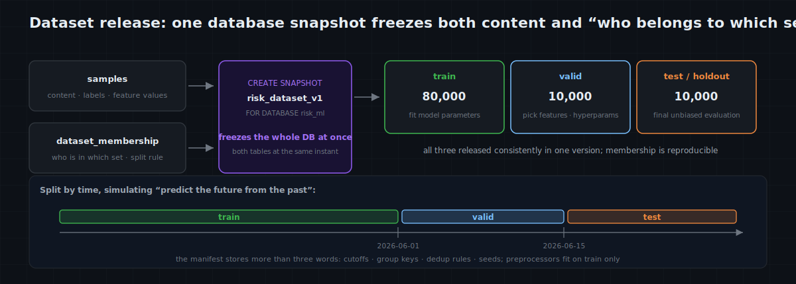

# MatrixOne Git4Data Deep Dive (Part 9) · AI Training in Practice — Dataset Release & Leakage: Don't Let Your Offline Metrics Fool You

A scene many people have lived through.

Offline AUC 0.94, ship it with confidence, and a week later production drops to 0.78. You go back and check: the model didn't change, the features didn't change, the code didn't change — the problem was in the most overlooked step of all, how the train and test sets were split.

The split was a casual `train_test_split(random_state=42)`: the same user's multiple transactions got randomly scattered across train and test, so the model had actually "seen" the people in the test set; and standardization was fit on the full data *before* the split, so its mean and variance had already peeked at the test set. Worse, the dataset that produced 0.94 **can no longer be reproduced** — the notebook is long closed, the `samples` table has had a few thousand rows added and corrected this week, and the same `random_state=42` on a table that has changed gives you a different set of rows entirely.

Offline metrics are the model's only "medical exam" before it ships. **Get the split wrong and that exam is fake** — it won't throw an error, it just hands you a good-looking number and then falls over in production.

This part is about that step: why a train / valid / test split isn't a throwaway `ORDER BY RAND()`, but the step that decides whether your offline evaluation can be trusted at all; and how to use MatrixOne's Git4Data capability to make it a reproducible, auditable, reversible versioned object.

> This part continues Stop 4 of the previous [AI Training in Practice · Overview](https://github.com/matrixorigin/matrixorigin-blog/blob/main/matrixorigin/git4data-part8-ml-lifecycle/index.md), drilling deeper into the same risk-model case. Still focused on classical machine learning over structured data. All SQL is verified on MatrixOne `4.1.0`; the runnable version lives in [matrixorigin/git4data-tutorial](https://github.com/matrixorigin/git4data-tutorial) under `09-dataset-release/`.

---

## One split actually defines three things at once

"Splitting data into train / valid / test" sounds like one action, but it defines three things at once:

1. **Who belongs to which set (membership)** — for every sample, is it train, valid, or test;
2. **By what rule you split (rule)** — a time cutoff? an entity hash? a random seed? a dedup key?
3. **On which version of the data you split (version)** — which *moment* of `samples` this split applies to.

Most teams version only a sliver of rule #2 — the `random_state` in code — and almost never version #1 and #3. So "a reproducible split" becomes an empty phrase: the moment the underlying table changes, the same seed produces a different set of rows; and the most critical fact — "which sample belonged to which set at the time" — was never remembered by anything.

What you actually need to freeze is **membership + rule + the version of data it ran on**, all three together. That happens to be exactly what Git4Data can pin down. Below we first get the split wrong, see where it breaks, then pin all three down solidly.

---

## Five kinds of leakage, hands-on

Leakage means: **using, at training time, information you won't have at serving time.** Its classic symptom is the opening scene — inflated offline, sliding online. First, set up the case data.

Compared with the overview, `samples` here gains three keys that leakage detection needs: `user_id` (entity key — one person, many transactions), `event_key` (dedup key — one underlying event and its augmented copies), and `label_time` (when the truth became known, later than the event time).

```sql
CREATE TABLE samples (
    sample_id    BIGINT PRIMARY KEY,
    event_time   DATETIME,       -- when the transaction happened; also the feature cutoff
    user_id      BIGINT,         -- entity key: one person may have many
    event_key    VARCHAR(64),    -- dedup key: one underlying event / its augmented copies
    amount       DECIMAL(12,2),
    txn_count_7d INT,
    label        TINYINT,        -- 0=normal, 1=fraud, NULL=truth not back yet
    label_time   DATETIME,       -- when the label became known (later than event_time)
    label_source VARCHAR(32)
);
```

Case data: 100,000 transactions, 20,000 users (~5 each), spanning 121 days (`2026-03-01` to `2026-06-29`), with fraud truth returning 3 days after the event. Plus 2,000 **augmented near-duplicates** sharing an `event_key` with the originals. Taking "now = `2026-07-01`" as the cutoff, the most recent samples whose `label_time` hasn't arrived have no truth yet. Measured: **102,000** rows total, of which **101,158** are labeled and **842** are the recent "truth-not-back" rows.

### First, the anti-pattern: a naive random split

```sql
INSERT INTO membership_rand
SELECT sample_id,
       CASE WHEN rand() < 0.8 THEN 'train'
            WHEN rand() < 0.5 THEN 'valid'
            ELSE 'test' END
FROM samples
WHERE label IS NOT NULL;
--   measured: train 80999 / valid 10196 / test 9963 — the proportions look fine.
```

The proportions are fine, but the three detectors below expose it.

### Leakage 1: temporal leakage (feeding the future to the past)

Fraud, recommendation, and risk are strongly temporal: you predict the **future** from the **past**. A random split scatters samples from different times, so `train` ends up with transactions later than those in `test` — letting the model peek at the future.

```sql
-- How many train rows are later than the earliest row in test?
SELECT COUNT(*) AS train_rows_from_the_future
FROM samples s JOIN membership_rand m ON s.sample_id = m.sample_id
WHERE m.split_name = 'train'
  AND s.event_time > (SELECT MIN(s2.event_time)
                      FROM samples s2 JOIN membership_rand m2 ON s2.sample_id = m2.sample_id
                      WHERE m2.split_name = 'test');
--   measured: 80316. Nearly all of train's 80k rows are later than test's start — total time travel.
```

There's a subtler temporal leak in the **label**: `label_time` (chargeback returns days later) is after the feature cutoff `event_time`, yet gets treated as "information known at the event." In fraud, "this one was later charged back" is the strongest feature — and exactly what you *don't* have at serving time. So a split must govern not just the sample's time but also guarantee: for every sample entering training, its label was genuinely knowable at the feature cutoff.

### Leakage 2: entity leakage (the same person across sets)

The same `user_id`'s multiple transactions get split row by row, some into train, some into test. The model then learns "this person" rather than "this kind of behavior." Looks accurate offline, collapses the moment a brand-new user shows up online.

```sql
-- How many users appear in BOTH train and test?
SELECT COUNT(*) AS users_in_train_and_test FROM (
  SELECT s.user_id
  FROM samples s JOIN membership_rand m ON s.sample_id = m.sample_id
  WHERE m.split_name IN ('train', 'test')
  GROUP BY s.user_id
  HAVING COUNT(DISTINCT m.split_name) = 2
) t;
--   measured: 8213. Over 40% of the 20k users straddle train and test.
```

### Leakage 3: duplicate / augmentation leakage (one event torn apart)

Duplicate records of one underlying event, or near-duplicates from augmentation, get randomly torn into different sets. The test set now holds the "twins" of training samples.

```sql
-- How many event_keys landed in more than one split?
SELECT COUNT(*) AS event_keys_across_splits FROM (
  SELECT s.event_key
  FROM samples s JOIN membership_rand m ON s.sample_id = m.sample_id
  GROUP BY s.event_key
  HAVING COUNT(DISTINCT m.split_name) > 1
) t;
--   measured: 688. Of the 2000 augmented samples, 688 groups got separated from their originals.
```

One random split, all three detectors red. And all three are **structural leaks you can find with SQL directly on the split manifest**. Two more kinds of leakage live outside membership, but are just as fatal.

### Leakage 4: preprocessing leakage (statistics that peeked at valid / test)

Fitting standardization, target encoding, or missing-value imputation on the **full** data before splitting — the preprocessor's means, variances, and category frequencies already contain information from valid and test. The correct order is the reverse: **`fit` on train only, then `transform` valid and test unchanged.**

This isn't something membership can check; it's process discipline. But a versioned split gives it a reliable footing: because train is read from a **fixed snapshot** by `split_name='train'`, you can guarantee "the preprocessor was fit on exactly these train rows, and these rows are bit-for-bit reproducible later" — not on some drifting subset from one notebook run.

### Leakage 5: target leakage (the answer sneaks into the features)

A field that correlates strongly with the label but isn't available at serving time sneaks into the features. In fraud, the classic is using "already charged back / manual-review verdict" to predict fraud — those are **outcomes**, not **prior features**. The symptom is one feature with absurdly high importance and an offline AUC that's too good to be true.

This too is outside membership; it's feature-provenance auditing. And that's exactly where [Part 7 Write-Audit-Publish](https://github.com/matrixorigin/matrixorigin-blog/blob/main/matrixorigin/git4data-part7-write-audit-publish/index.md) helps: when and by whom a "suspiciously good" feature column entered the main table is one `DATA BRANCH DIFF` away, not a matter of memory.

---

## Getting the split right: time-based, then drive the detectors to zero

For this risk case, the correct primary split is **by time** — train on earlier data, validate and test on later windows, modeling "predict the future from the past." The split rule, together with the time cutoffs, is written explicitly into `dataset_membership`.

```sql
INSERT INTO dataset_membership
SELECT sample_id,
       CASE WHEN event_time <  '2026-06-05' THEN 'train'
            WHEN event_time <  '2026-06-17' THEN 'valid'
            ELSE 'test' END,
       'time_split:v1 cutoffs=2026-06-05/2026-06-17; feature_cutoff=event_time; label_ready<=2026-07-01'
FROM samples
WHERE label IS NOT NULL;          -- the recent "truth-not-back" rows enter no set this round
--   measured: train 80950 / valid 10104 / test 10104, about 80 / 10 / 10.
```

Note two things: the rule **stores the time cutoffs, the feature cutoff, and the label-availability condition** — not just the three words train/valid/test; and the 842 "truth-not-back" rows are explicitly excluded, never slipped into training to pad the count.

Now re-run the two structural detectors:

```sql
-- Temporal leakage: zero
--   train_rows_from_the_future = 0    (all of train is earlier than test's start)
-- Duplicate leakage: zero
--   event_keys_across_splits    = 0   (same event_key shares event_time -> same set)
```

The time split resolves the "temporal" and "duplicate" leaks together. But **entity overlap, honestly, is not zero**:

```sql
-- Under the time split, how many users still straddle train and test?
--   users_in_train_and_test = 9912
```

This isn't a bug; it's a tradeoff worth spelling out. Under a time split, a "returning customer" with early transactions in train and later ones in test naturally straddles the boundary. **For a business like fraud, this is exactly realistic** — online you *do* keep meeting returning users, and letting the model see their history isn't cheating. So the right move here isn't to eliminate it, but to **report and accept it**.

Only when the task itself requires "entity disjointness" (e.g. leave-one-user-out evaluation, or a hard ban on the model memorizing individuals) do you switch to an **entity-hash** split: send all of a user's rows into the same set.

```sql
INSERT INTO membership_entity
SELECT sample_id,
       CASE WHEN user_id % 10 < 8 THEN 'train'
            WHEN user_id % 10 = 8 THEN 'valid'
            ELSE 'test' END
FROM samples WHERE label IS NOT NULL;
--   now users_in_train_and_test = 0, at the cost of strict time ordering.
```

**Time split** and **entity split** often can't both be had; which you pick depends on whether your business meets returning users in the future. Git4Data doesn't make that call for you — what it guarantees is that whichever rule you choose, this membership is pinned down completely and reproducibly, and can be audited row by row before release.

---

## The release gate: a split checklist that's all SQL

[Part 7's Write-Audit-Publish](https://github.com/matrixorigin/matrixorigin-blog/blob/main/matrixorigin/git4data-part7-write-audit-publish/index.md) keeps bad data out of production; the same idea applies directly to **splits**: audit the split manifest in a workspace first, and only publish it as a named version once it's all green. Every check is SQL, and every one must pass:

```sql
-- ① time monotonic: train must not be later than test's start   -> expect 0
-- ② entity overlap: 0 or a "known acceptable value" per the task -> recorded
-- ③ no duplicate across sets: an event_key in only one set       -> expect 0
-- ④ no label from the future: labeled rows' label_time <= cutoff -> expect 0
SELECT COUNT(*) AS label_from_future
FROM samples s JOIN dataset_membership m ON s.sample_id = m.sample_id
WHERE s.label IS NOT NULL AND s.label_time > '2026-07-01';   -- measured 0

-- ⑤ set sizes and proportions within a sane band (guards empty set / imbalance)
SELECT m.split_name, COUNT(*) AS n,
       ROUND(100.0 * COUNT(*) / (SELECT COUNT(*) FROM dataset_membership), 1) AS pct
FROM dataset_membership m GROUP BY m.split_name;
--   measured train 80.0% / valid 10.0% / test 10.0%

-- ⑥ every set has positives (guards a set with no fraud samples -> metrics meaningless)
SELECT m.split_name, AVG(s.label) AS pos_rate
FROM samples s JOIN dataset_membership m ON s.sample_id = m.sample_id
GROUP BY m.split_name;
--   measured pos_rate 0.5 in all three sets, balanced
```

Plus one process convention (leakage #4): **the preprocessor is fit on `train` only.** All green, then release. Any red, and you go back to `dataset_membership` and fix the rule — the mainline doesn't move a row.

---

## Release: freeze the samples and the split into one version

The sample content and the split manifest must be released as **one whole** — snapshotting the two tables separately could land at different moments and misalign. Here we use a database-scope snapshot to freeze all of `risk_ml` at once:

```sql
CREATE SNAPSHOT risk_dataset_v1 FOR DATABASE risk_ml;
```



Afterward training, tuning, and final testing all read from the **same dataset version**, changing only `split_name`:

```sql
-- the trainer reads train (valid / test the same, just change split_name)
SELECT s.*
FROM samples {SNAPSHOT='risk_dataset_v1'} s
JOIN dataset_membership {SNAPSHOT='risk_dataset_v1'} m ON s.sample_id = m.sample_id
WHERE m.split_name = 'train';
--   measured train 80950 rows.
```

This database-scope snapshot doesn't physically copy the whole database; it establishes a named version of the tables' consistent state at that moment — as [Part 3](https://github.com/matrixorigin/matrixorigin-blog/blob/main/matrixorigin/git4data-part3-under-the-hood/index.md) explained, MatrixOne's immutable objects plus a metadata catalog make snapshot cost nearly independent of data size. Now what's reproducible isn't only "which samples exist," but "what role each sample played in this experiment." To reproduce three months later, `SELECT ... {SNAPSHOT='risk_dataset_v1'}` in one line, bit-for-bit identical.

---

## Version evolution: is it the ruler that changed, or the model?

Later you find the test set is short on hard samples and want to move 500 into test. The right move isn't to overwrite v1, but to release `risk_dataset_v2` and bind the new metrics explicitly to v2:

```sql
UPDATE dataset_membership SET split_name = 'test',
       split_rule = 'time_split:v2 + 500 hard cases moved to test'
WHERE sample_id IN (SELECT sample_id FROM dataset_membership WHERE split_name = 'train' LIMIT 500);

-- relative to the released v1, what exactly did the split change?
DATA BRANCH DIFF dataset_membership
  AGAINST dataset_membership {SNAPSHOT='risk_dataset_v1'} OUTPUT SUMMARY;
--   measured UPDATED = 500 (INSERTED 0 / DELETED 0) — exactly the 500 moved rows.

CREATE SNAPSHOT risk_dataset_v2 FOR DATABASE risk_ml;
```

This one DIFF settles a question that's usually waved away: the metric moved — was it the **model** that changed, or the **ruler**? If test's membership, labels, or evaluation protocol changed, v2's score is still valid, but it's no longer a like-for-like comparison with v1. So cross-version trends should be compared first on an **unchanged fixed test set / golden set**, while the new time window is reported as a separate metric. And v1 remains queryable and reversible, untouched:

```sql
-- query each in its OWN statement (see one 4.1.0 note under "Boundaries")
SELECT split_name, COUNT(*) FROM dataset_membership {SNAPSHOT='risk_dataset_v1'} GROUP BY split_name;
--   test 10104 / train 80950 / valid 10104   <- v1 unchanged, bit-for-bit
SELECT split_name, COUNT(*) FROM dataset_membership {SNAPSHOT='risk_dataset_v2'} GROUP BY split_name;
--   test 10604 / train 80450 / valid 10104   <- v2 reflects the move
```

Mapped onto the primitives, the whole life of a split is natural:

```text
one split          = one dataset_membership + rule
pin a split        = snapshot (database-scope, freezing samples along with it)
read a set         = SELECT … {SNAPSHOT} WHERE split_name = …
what the split did  = DATA BRANCH DIFF (ruler-changed vs model-changed)
discard a split    = RESTORE to the previous version
```

---

## The discipline of the golden set

Besides the test set that changes every iteration, many teams keep a long-lived **golden evaluation set**: covering key cohorts, rare risks, and business red lines, used specifically for regression across model versions. Its whole value is in "stable" — **never retrained on, changed as little as possible.**

A snapshot manages it best: pin the golden set as a long-retained named version that nobody can quietly pull back into training. The day it truly must be updated (e.g. adding a new fraud pattern), that's an explicit `golden_v2` release plus a re-baselining, not a few silent edits in place — otherwise you'll find "the model gained 2 points on the golden set" was really the golden set loosening on its own. Before release, one DIFF likewise confirms it hasn't intersected the current train.

---

## The industry's other approaches: how they manage splits and prevent leakage, and where each gets stuck

Making a split "a reproducible, auditable, reversible version" has several approaches in practice; each solves a part, and each gets stuck somewhere. Measured by one yardstick: **is membership frozen, is it one with the data version, can you see row-level "who moved between sets," where do leakage checks run, and does it need extra copies or systems.**

**Approach 1: `train_test_split(random_state=42)` in a notebook.** The most common, and the one that fell over at the start. The split logic lives in code; `random_state` fixes only "how to sample," while membership and the data version it ran on aren't remembered. Change the table and the same seed is a different set of rows; the default is still random, so entity / temporal leakage rides on discipline. Reproduce, audit, roll back — none of them.

**Approach 2: store a `split` column, or re-run a split query each time.** Say `WHERE hash(id) % 10 < 8`. Given the same table it's deterministic, a big step up from random. But it still **isn't bound to the data version** — re-run on a changed table and membership changes; there's no row-level view of "who moved between any two split versions"; and leakage checks are yours to write.

**Approach 3: materialize the split into files (`train.parquet` / `test.parquet`, into DVC / lakeFS / S3).** Membership is indeed frozen — that's its upside. The cost: one data copy per version (N× storage); the split is now divorced from the "live table," so to JOIN current data or recompute a statistic in SQL you must read the files back; version comparison is **file / object level**, not the row-level "which samples moved from train to test"; and leakage checks are still one-off scripts over files.

**Approach 4: a feature platform's training-set snapshot (Feast, Tecton, etc.).** These platforms shine at **point-in-time correctness** — feature joins by event time, which handles "future feature" temporal leakage well, and that deserves credit. But they focus on features; split-membership governance and auditing usually sit outside; and this is yet another system to bring in.

**Approach 5: data version-control tools (DVC / lakeFS / Delta Lake time travel).** They can pin a dataset to a version you can return to — the shared value. But "does a sample belong to train or test" is a **modeling concept**, not what they model; leakage detection isn't theirs either; and diff is at the file / object / table-version level, blind to "a sample's movement between sets."

**Approach 6: log the split in an experiment tracker (MLflow / W&B).** Recording the split as an artifact or dataset digest solves "which one did this run use." But what's recorded is a **dead file**: it can't JOIN the live database directly, can't row-diff two split versions, and leakage checks are still a separate thing.

Put in one table:

| Approach | Freezes membership | One with data version | Row-level "who moved between sets" | Where leakage checks run | Extra copies / systems |
|---|---|---|---|---|---|
| Random split (notebook) | No | No | No | on discipline | none |
| Stored column / re-run SQL | No (changes with the table) | No | No | write your own | none |
| Materialized split files (DVC/lakeFS/S3) | Yes | Half (divorced from the table) | No (file level) | scripts over files | **N× copies** |
| Feature-platform training snapshot (Feast/Tecton) | Partial | Partial | No | strong on temporal, rest outside | **another system** |
| Data version tools (DVC/lakeFS/Delta) | Yes | Yes (but not membership) | No (object / version level) | not their job | another tool |
| Experiment-tracker artifact (MLflow/W&B) | Yes (dead file) | No | No | separate | tracking system |
| **MatrixOne (Git4Data capability)** | **Yes** | **Yes (a database snapshot freezes it with the samples)** | **Yes (`DATA BRANCH DIFF`, row-level)** | **SQL right on the versioned dataset** | **none (the same database)** |

In one line: the other approaches either freeze membership but divorce it from live data (materialized files, trackers), or version data but don't understand the concept of "split membership" (data-version tools), or excel at one class of leakage but leave governance outside the system (feature platforms). What's different about MatrixOne is that it gathers these into one database — **membership is a table, frozen with the samples by a database snapshot, leakage checks are SQL run on that version, and cross-version you can see row by row who moved.** The split stops being the most unmanaged step in the pipeline and becomes a first-class citizen: co-versioned with the data, queryable, reversible.

---

## Boundaries and applicability

- **Random splitting isn't the original sin.** If the data is genuinely i.i.d. with neither entity structure nor temporal structure (many pure tabular tasks are), a random split is perfectly fine. Leakage comes from "the data has structure, but the split pretends it doesn't."

- **`random_state` doesn't fix everything.** It only fixes "how to sample," not "which version of the table to sample from." Change the underlying table and the same seed is a different set of rows — so true reproducibility comes from pinning the data version too, not just recording a seed.

- **Snapshots have retention cost.** A pinned historical version occupies storage until `DROP SNAPSHOT`. Retain the `dataset_vN` for each shipped model long-term, and set a cleanup policy for abandoned intermediate versions.

- **Row-level operations require a consistent schema** (the boundary from [Part 4](https://github.com/matrixorigin/matrixorigin-blog/blob/main/matrixorigin/git4data-part4-landscape/index.md)): to add a feature column to the training set, do a controlled schema migration on the mainline first, then continue.

- **One 4.1.0 note**: don't read **two snapshots of the same table** via scalar subqueries in one `SELECT` (measured: it returns the first snapshot's value for both columns). Put each snapshot in its own statement, or use `DATA BRANCH DIFF` — the latter's diff is accurate.

---

## Closing

The split is the foundation of offline evaluation. What `random_state` gives you is "looks reproducible"; a split that's truly reproducible and trustworthy pins **membership, rule, and data version** together, audits each item before release, and can roll back when something goes wrong.

MatrixOne, through its Git4Data capability, puts these three into the database — the split manifest is released consistently with the samples and labels in one version, every change leaves a DIFF as its receipt, and every historical version can be reconstructed bit-for-bit. Whether that "medical exam" can be trusted finally has a definite answer.

Next, we leave structured tables for the world of large models: **SFT data curation** — how to dedup, filter, and decontaminate hundreds of thousands of instruction records entirely in SQL, with a DIFF as the receipt for every cut.

> 📎 Runnable SQL: [github.com/matrixorigin/git4data-tutorial](https://github.com/matrixorigin/git4data-tutorial) ｜ Source & community: [github.com/matrixorigin/matrixone](https://github.com/matrixorigin/matrixone)
