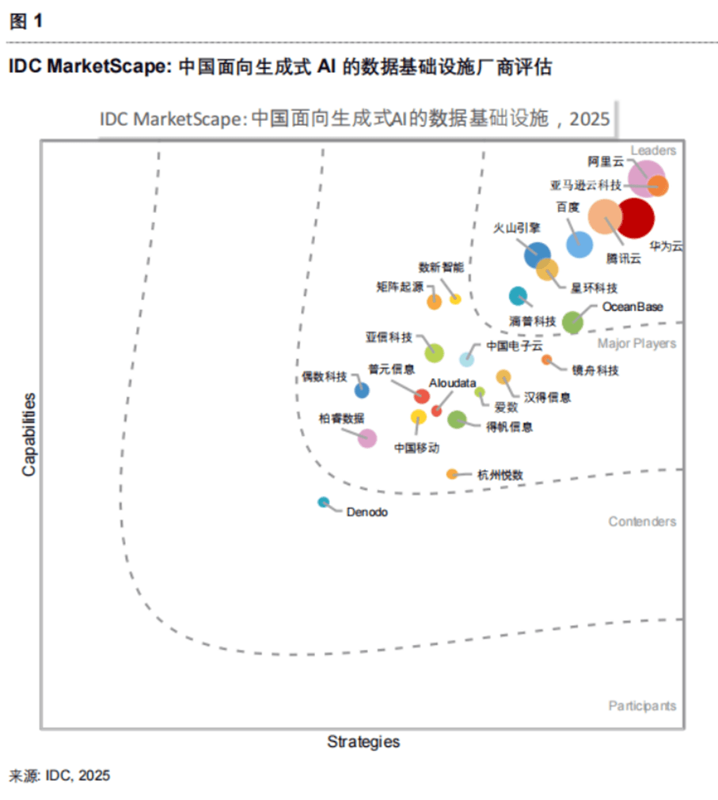

Recently, IDC, a leading global IT market research and consulting firm, released the report *IDC MarketScape: China Data Infrastructure for Generative AI 2025 Vendor Assessment*. MatrixOrigin was successfully selected and named a Major Player for its innovative technical strength in AI-native multimodal data intelligence.

## Driven by Technological Innovation

### Building a New Data Intelligence Foundation for the AI Era

In the wave of generative AI, enterprises face many challenges, including complex data management and difficult AI implementation. MatrixOrigin's MatrixOne Intelligence platform provides enterprises with a complete solution from data preparation to intelligent invocation through its original technical architecture.

The platform adopts an original technical architecture featuring storage-compute separation, read-write separation, and hot-cold separation. It can support multiple workloads such as OLTP, OLAP, AI, and time-series on a unified platform, enabling elastic resource scaling and efficient utilization. At the same time, the platform's original hallucination detection and correction algorithm, combined with a full-link AI-Ready data processing framework, fundamentally improves the accuracy and reliability of AI applications. Through the built-in MatrixPipeline tool, the platform supports intelligent access and governance for multimodal data such as video, audio, and text, effectively breaking enterprise data silos.

## Significant Business Value

### Supporting Enterprise Intelligent Transformation

As the IDC report points out, MatrixOrigin has excellent operators, process standards, and suite support in data integration, parsing, and AI-oriented services. The platform has been implemented in multiple industries including Internet, finance, energy, manufacturing, education, and healthcare. It helps customers reduce hardware and O&M costs by 70%, improve AI application development efficiency by 3-5 times, and achieve multiple times higher performance under the same hardware investment.

## Open-Source and Open Ecosystem

### Promoting Joint Industry Development

MatrixOrigin actively embraces open-source and open principles, taking the lead in supporting frontier open standards such as MCP (Model Context Protocol) and contributing to interoperability across the AI ecosystem. Through support for the MCP protocol, MatrixOrigin's data intelligence platform can seamlessly integrate with various AI models and tools, breaking traditional technical barriers and allowing enterprises to flexibly choose and combine different AI services.

As a recognized national high-tech enterprise and a specialized, refined, distinctive, and innovative enterprise in both Shanghai and Shenzhen, MatrixOrigin also ranked first among 2024 Shanghai high-growth software and information technology enterprises, and its products have passed the "Xinchuang" testing and certification of the China Academy of Information and Communications Technology.

This selection in IDC MarketScape is full recognition from the industry of MatrixOrigin's technical strength and market value. Looking ahead, MatrixOrigin will continue to deepen Data + AI fusion innovation, build more intelligent, efficient, and reliable data infrastructure for enterprises, accelerate AI application implementation, and empower enterprises in digital-intelligence transformation and upgrading.
