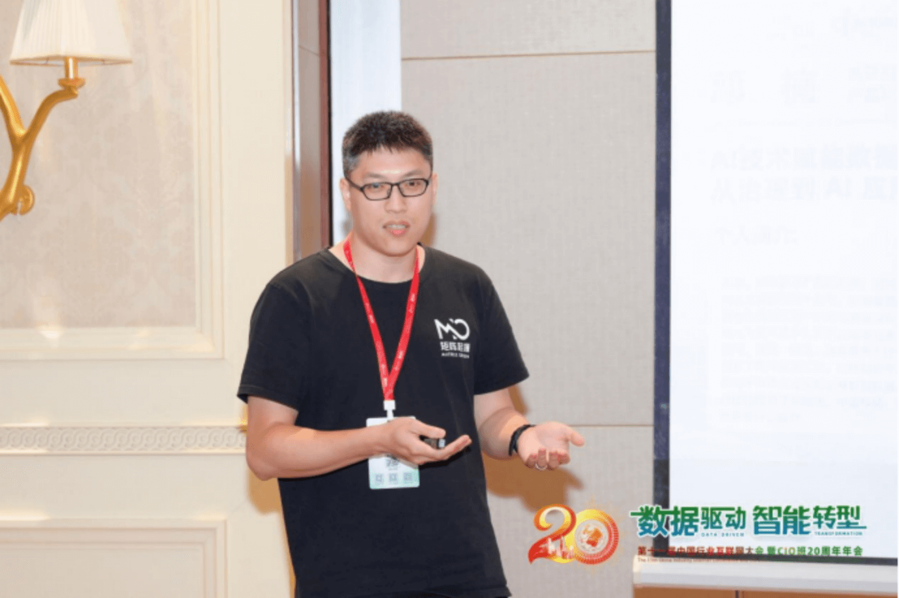
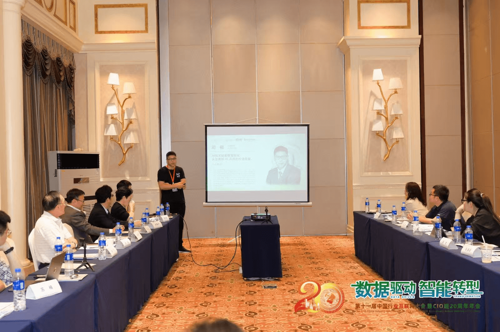

### MatrixOrigin Product VP Deng Nan Appears at China Industry Internet Conference, Unveiling a New Paradigm for AI-Native Data Engineering

**June 14, 2025, Huangshan, Anhui** - At the AI session of "Data-Driven Intelligent Transformation | The 11th China Industry Internet Conference and CIO Class 20th Anniversary Annual Meeting," MatrixOrigin Product VP Deng Nan delivered a keynote speech titled "AI Technology Empowering Data Transformation: Value Mining from Governance to AI Applications." He shared experience in using AI technology to connect the closed loop from data governance to applications and unlock business value across multiple scenarios.

Deng Nan cited industry data and pointed out that "currently, 80% of enterprise data is unstructured, including videos, documents, and images, and continues to grow at an annual rate of 60%." This data contains key business insights, but is difficult to use because multimodal processing workflows are complex. Through multiple traditional industry cases, he revealed the common challenges enterprises face when implementing AI: there is a technical gap between raw data and AI-usable data. The one-stop data engineering solution provided by MatrixOne Intelligence can help enterprises turn proprietary data into AI-Ready data, support scenarios such as document intelligence automation, multimodal RAG applications, and large model fine-tuning, and help enterprises cross this data gap to implement AI and improve business value.

For the challenges of hybrid multimodal data governance, Deng Nan systematically introduced the value of the MatrixOne Intelligence platform:

> MatrixOne Intelligence is a data intelligence platform for GenAI. It includes a complete multimodal data pipeline that can automatically access, govern, and augment different types of multimodal data, such as documents, images, audio, and video. The platform can efficiently support application scenarios such as document intelligence, Agentic RAG, and large model fine-tuning. Its unified cloud-native and compute-storage separation architecture ensures flexible deployment across public cloud, private cloud, Kubernetes, or bare metal, while achieving efficient scalability.

From unstructured data governance to AI service implementation, enterprises need to build an end-to-end intelligent data engineering system. MatrixOrigin will continue deepening the capabilities of the MatrixOne Intelligence platform, helping enterprises release the value of unstructured data and build core competitiveness in the data intelligence era.
