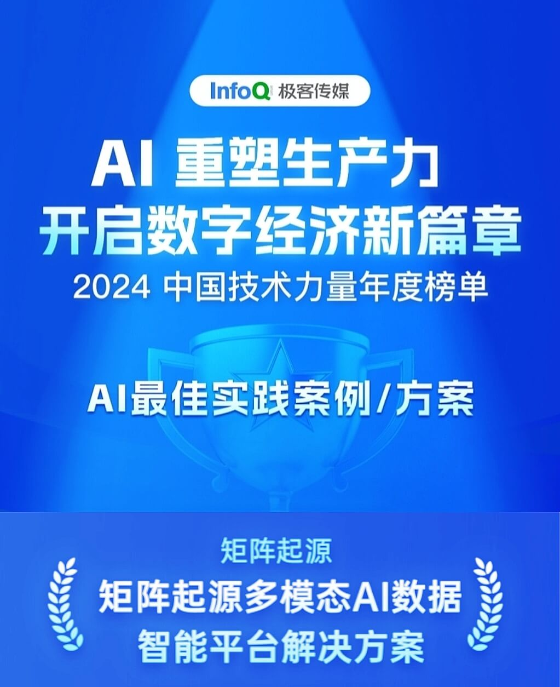
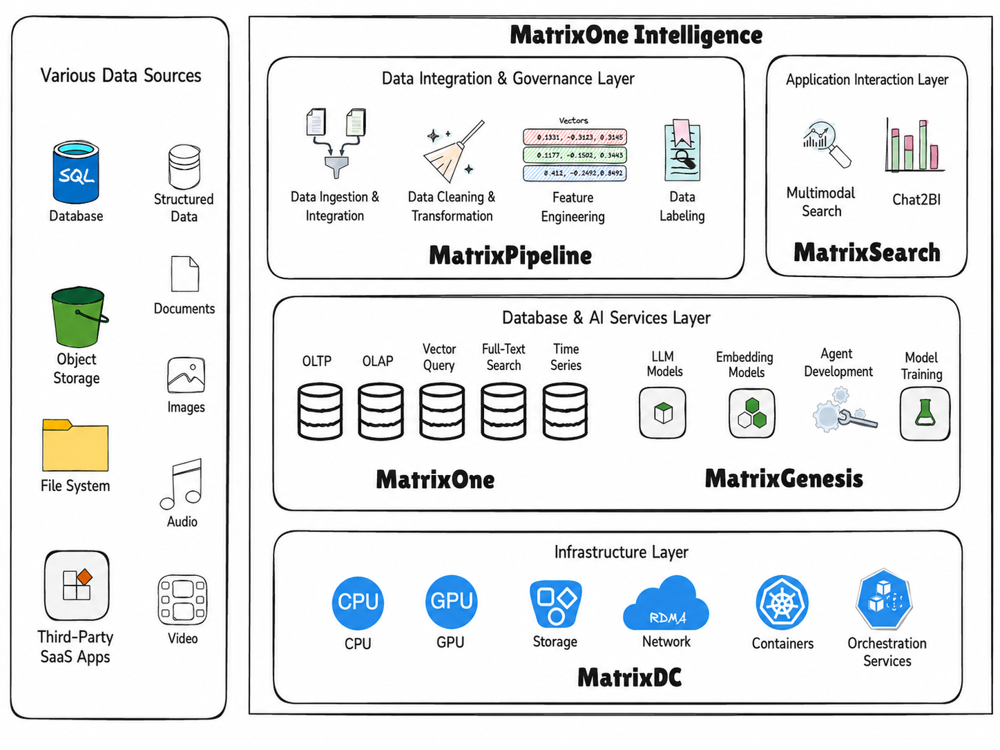

Recently, the **InfoQ 2024 China Technology Power Annual List** was announced. MatrixOrigin stood out from many participating projects with its "Multimodal AI Data Intelligence Platform Solution" and won the "AI Best Practice Case/Solution" award. This honor not only demonstrates MatrixOrigin's outstanding strength in technological innovation, but also highlights its significant results in industrial practice.

In today's era, generative artificial intelligence (Generative AI, or GenAI) is sweeping the world at unprecedented speed and has become an important force driving technological progress and industrial transformation. From the emergence of ChatGPT to the broad application of various large models, GenAI has not only achieved breakthroughs at the technical level, but has also had far-reaching impact at the business and social levels. From text generation and image creation to video production, GenAI application scenarios are becoming increasingly rich, bringing unprecedented opportunities and challenges to all industries.

In the GenAI architecture, data processing plays an especially critical role. The close relationship between AI technology and data is clear: massive datasets train powerful AI models, and those models can in turn further optimize data processing. Even so, while the industry has already explored the capabilities and technical solutions of the compute layer, model layer, and application layer in the GenAI technology stack in depth, the data-processing layer still receives insufficient attention. As general foundation models become increasingly widespread, the mining and utilization of enterprises' own data will become the most critical factor in bringing GenAI into enterprise-grade applications.

**Industry Challenge: Unstructured Data Inside Enterprises Becomes a "Dormant Asset"**

According to Gartner, more than 80% of the world's data is unstructured. However, because it is difficult to parse and has low value density, unstructured data has long been regarded as a liability for enterprises. This situation has begun to change with the rapid development of GenAI technology. Starting with ChatGPT, the entire industry has witnessed the remarkable capabilities of AI and large-model technologies in processing unstructured data. In real-world applications, however, many difficulties remain:

- **Data silos are hard to break**: Enterprise unstructured data is scattered across different systems and devices, with no unified management.

- **Data parsing is complex**: The governance chain for multimodal data is complex, and enterprise technical capabilities often cannot cover it end to end.

- **Search efficiency is low**: Traditional vector search performs poorly in exact-search scenarios.

- **Compute resources are a bottleneck**: High-cost, high-threshold GPU compute scheduling has become a major challenge.

**MatrixOrigin: A Multimodal AI Data Intelligence Platform for One-Stop AI-Ready Data Processing**

MatrixOrigin has launched an integrated multimodal AI data intelligence platform. Centered on efficient coordination among data, AI models, compute power, and applications, the platform connects the full application chain for unstructured data, including enterprise access, cleaning, storage, governance, vectorization, and search.

Its overall architecture is shown below:

The multimodal AI data intelligence platform includes five core components. They correspond to different layers in the solution architecture and together form a complete technical system. Through coordinated operation, these products seamlessly connect infrastructure, data integration, governance, storage, analysis, and interaction capabilities, providing a one-stop, end-to-end multimodal data intelligence solution. With these components working together, MatrixOrigin helps enterprises achieve:

- **Unified access and governance for heterogeneous data**: Break data silos and build integrated data storage.

- **AI-driven parsing and search**: Use large models and search engines to improve data utilization efficiency.

- **Resource optimization and improved cost efficiency**: Provide compute services through on-demand scheduling to lower the threshold and cost of compute power.

**Successful Practices: Full-Scenario Implementation from Media to Manufacturing**

MatrixOrigin's multimodal AI data platform has already been implemented in multiple industries and achieved significant results:

1.  **Newspaper and media company**

A traditional media company used the platform to centrally manage tens of petabytes of historical materials scattered across network disks and hard drives. Through AI-powered automatic tagging and retrieval, content creation efficiency increased by 10 times. At the same time, large-model-assisted generation improved the accuracy of edited content by 20%.

2.  **Industrial manufacturing company**

An electronics manufacturer used the platform to deeply parse multimodal data from its production lines, improving quality-inspection coverage by 20 times and increasing production yield by 2 percentage points, directly generating economic benefits at the hundred-million-yuan level.

3.  **AI algorithm company**

An AI algorithm company used the platform to build a multimodal data and feature platform, greatly improving AI algorithm development efficiency. Data access efficiency increased by 60%, and multimodal data integration and management became more standardized. Feature reuse increased by 70%, avoiding wasted resources caused by repeated feature development.

**Leading the Future: An Industry Benchmark for AI Data Practice**

In the wave of rapid GenAI development, multimodal data has become a core driver of enterprise intelligent transformation. With its innovation, practical value, and high cost-effectiveness, MatrixOrigin's multimodal AI data intelligence platform has become a model case for helping industries build their own AI data flywheels. MatrixOrigin also hopes to realize the vision of **"Your Data for Your AI"**, enabling enterprises' own data to become a solid foundation for GenAI applications and a source of unique competitiveness. We look forward to moving with you toward a future where data intelligence and GenAI are deeply integrated.
