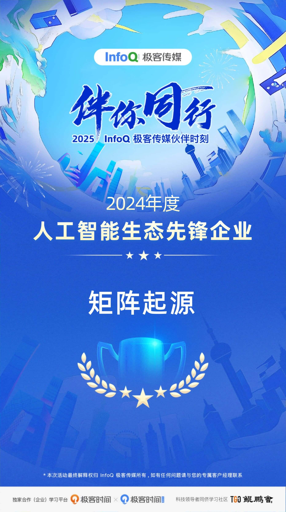

On January 9, the 2025 InfoQ Geek Media Partner Moment, themed "Walking with You," concluded successfully. This event is an annual program of Geekbang Technology, created to recognize companies, teams, and individuals that made outstanding contributions to the development of the technology ecosystem over the past year.

Among them, MatrixOrigin won the **"2024 AI Ecosystem Pioneer Enterprise"** award for its outstanding contributions to the artificial intelligence industry. The award recognizes companies that play a pioneering and exemplary role in the development of artificial intelligence, demonstrating exceptional capabilities in leading technological innovation, promoting industrial upgrading, and creating social value.

As a company that actively embraces AI, MatrixOrigin continues to invest resources in R&D, constantly innovates its own technologies, and strives to maintain focus and depth in a rapidly changing environment. It has played an important role in promoting the wider adoption of AI.

MatrixOrigin's goal is to build and use world-class data intelligence infrastructure technologies and products, helping enterprises transform and upgrade from informatization and digitization to intelligence. MatrixOrigin has core competitiveness in cloud computing, databases, big data, and artificial intelligence, as well as broad industry and international vision and strong forward-looking capabilities. It can quickly and effectively apply advanced technologies in different fields and scale them in practice.

MatrixOrigin's Data + AI multimodal data intelligence platform and hyper-converged database help enterprises centrally manage heterogeneous data for GenAI scenarios, while enabling efficient data management and governance in an AI-driven way. MatrixOrigin has also joined forces with multiple partners to provide end-to-end Data + AI solutions for various industries, helping enterprises rapidly achieve data- and intelligence-driven transformation and upgrading.

As a news website and technical community with strong influence among technical professionals, InfoQ has for many years promoted the dissemination of knowledge and innovation in software development and related fields. It focuses on early-stage technical innovation practices as well as the deep integration of mature technologies with thousands of industries. Its overall reach covers more than 5 million technical professionals. Geekbang Technology is committed to providing neutral, practitioner-led technical information and conferences, becoming a bridge between China's high-end technology communities and mainstream international technology communities, promoting the all-round development of digital and intelligent talent, and supporting the early realization of Digital China.
