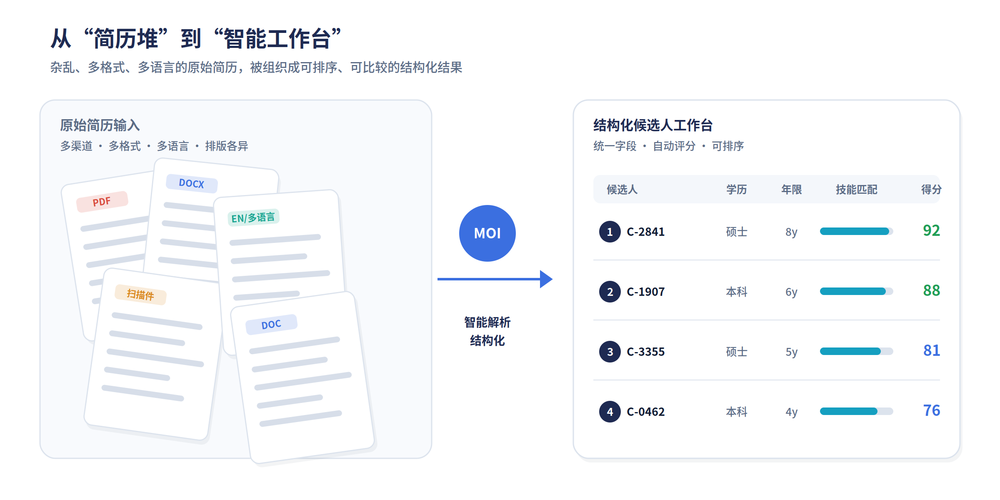
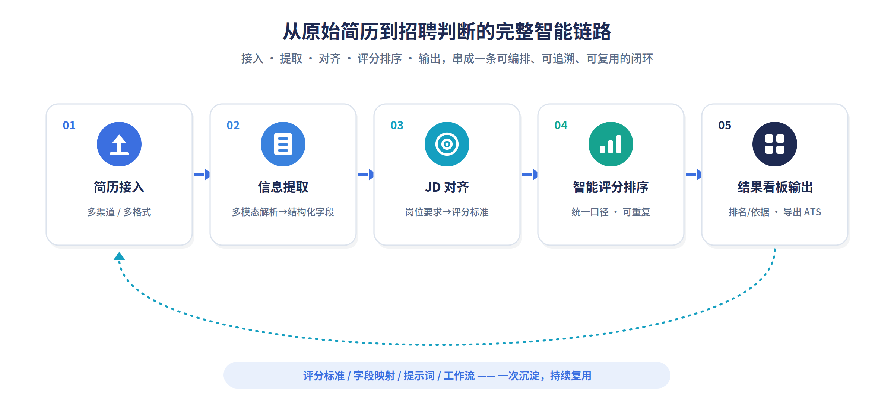
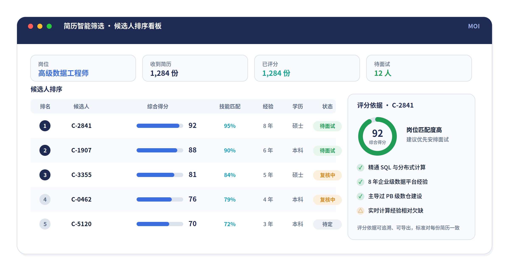

# 当简历筛选不再靠“人肉海选”，MOI 如何把招聘初筛变成一条完整智能链路

> **摘要**：介绍 MOI 简历智能筛选方案如何打通招聘初筛全链路，解决简历格式杂、信息难结构化、筛选口径不一致、结果难复用等痛点，通过多模态解析、JD 对齐、智能评分与排序、结果看板输出，实现简历筛选的高效化、标准化、可沉淀，帮助企业在大批量招聘场景下提升初筛的效率与质量。

*从“简历堆”到“智能工作台”，简历筛选真正的难点从来不只是简历太多，而是简历无法被快速组织和利用。*

在很多企业里，简历筛选是一件“看起来简单、做起来很重”的工作。一个岗位的招聘启动后，HR 往往要先面对一堆来自不同渠道、不同格式、不同语言的简历：有 PDF、有 Word，也有扫描件和图片；有排版清晰的，也有结构混乱的。岗位热门时，单个职位收到成百上千份简历是常态；而在招聘旺季，几百个岗位、几十万份简历同时涌入也并不少见。

问题从来不是简历太少，而是简历太杂、太散、太难比较。真正消耗团队时间的，往往不是最后那个“录用谁”的判断，而是判断之前那一长串重复、琐碎、容易出错的阅读和整理工作：把每份简历的关键信息一条条看出来、抄下来，再对着岗位要求一份份比对、打分、排序。整个过程高度依赖个人经验，强依赖人力投入，结果也很难稳定复用。

## 客户真正遇到的问题，不只是“简历太多”

如果把简历筛选拆开来看，这类业务通常会卡在四个层面。

第一，简历难以快速结构化。简历大多是 PDF、Word、扫描件，甚至夹杂图片，排版千差万别，还经常多语言混排。教育背景、工作年限、技能、项目经历、过往公司这些关键信息，分散在不同段落、不同版式里，人工逐份提取既慢又容易漏。

第二，简历信息虽多，但难以统一比较。每一份简历的结构都不一样，天然不在同一个视图里，也没有天然形成一套可以直接和岗位要求对齐的字段。HR 想横向比较一批候选人时，缺的不是简历，而是一套“可比较”的结构化结果。

第三，筛选过程缺乏一致性。不同 HR 筛同一个岗位，关注点、口径、判断标准可能完全不同；甚至同一个人，今天和明天看同一批简历，结论也可能漂移。如果直接用自由问答式的 AI 来做初筛，这个问题会更明显——同一个问题问两次，答案可能都不一样，很难作为正式的筛选依据。

第四，结果产出慢，而且复用性弱。大量时间被花在“读简历”和“整理信息”上，真正用于判断的时间反而被压缩。即使这一轮筛完了，里面用到的筛选标准、打分口径、字段映射也很难沉淀下来，下一次招聘还得从头再来一遍。

## 难点的本质，是简历筛选没有形成一条完整链路

从表面上看，这是文档解析问题、信息提取问题、打分排序问题；但从业务本质上看，它是一个“从原始简历到招聘判断”的链路问题。只解决其中一个点，并不能真正把简历筛选做轻。

如果只做文档解析，把简历读成了文本，HR 还是要自己继续对着岗位要求逐条比对；如果只做打分，但前面的信息没提取准，打分的依据就是错的；如果只产出一个排名，而提取规则、岗位标准、数据链路没有打通，这个排名也很容易沦为“看起来整齐、依据却不稳”的结果。

这里还有一个容易被忽略的选择题：到底要不要把它做成“自由问答”的形式。自由的自然语言简历问答（比如“有海外名校背景的都有哪些人”）看起来很酷，但在真正大批量、要对结果负责的招聘初筛里，它会面临结果一致性差、准确率不稳、响应慢三个现实问题。相比之下，把岗位要求拆成明确的评分标准、对每一份简历做结构化的评分和排序，反而更可控、更可解释、也更可复用。

所以，企业真正需要的，不是一两个孤立功能，而是一套把简历接入、信息提取、结构对齐、智能评分、排序输出串成闭环的能力。

*对招聘团队来说，真正有价值的不是某一个单点功能，而是“从简历文件到结构化字段，再到岗位对齐与评分排序，最后到结果输出”的完整闭环。*

## MOI 给出的解法：把简历筛选变成一个可编排、可追溯、可复用的智能流程

MOI（MatrixOne Intelligence）是矩阵起源的 AI 原生多模态数据智能平台。它的切入点，不是简单做一个“会聊天的招聘助手”，而是把简历筛选这件事拆成可落地的业务环节，再把这些环节重新组织成一条完整的智能流程。

1. **先把非结构化简历变成结构化输入**

简历批量接入后，MOI 通过多模态文档解析能力，自动识别教育背景、工作年限、技能、证书、项目经历等关键字段，并按统一的字段维度整理出来——无论原始文件是 PDF、Word 还是扫描件，也无论是哪种语言。提取出来的字段用户可以继续修正和确认，保证后续评分建立在正确的信息基础之上。

2. **把岗位要求（JD）和简历拉到同一条分析链路里**

MOI 不会停留在“把简历读出来”。它会把岗位描述同样解析成一组明确的筛选标准（必备技能、经验年限、学历门槛、加分项等），作为分析主线，再把每一份简历的结构化字段对齐进来，形成一套面向当前岗位、可直接比较的分析视图。

3. **用评分规则和智能体能力做真正的评估与排序**

MOI 会围绕岗位标准，对每一份简历做多维度的评估打分——而且是结构化、可重复的打分，而不是一次一个样的自由回答。结合大模型的语义理解和明确的评分口径，系统对一个岗位收到的所有简历统一评分、统一排序，并给出每一名候选人的得分与命中/未命中要点。

4. **把结果组织成业务真正能用的输出**

最终，HR 看到的不是一堆散乱的简历，而是一份结构清晰、结论明确的候选人排序看板：每个岗位下的候选人按得分排序，附带评分依据、关键亮点和风险提示，既可以继续人工复核，也可以直接导出到下游招聘系统（如 ATS / HR 系统）继续走流程。

## MOI 在其中发挥的作用，不只是“做评分”，更是把能力组织起来

很多人理解 AI 应用时，容易把它看成一个最终回答问题的模型。但在简历筛选这种企业级场景里，真正重要的不是模型会不会答，而是整个平台能不能把数据、规则和智能能力组织起来，形成稳定可落地的业务过程。这恰恰是 MOI 的价值所在。

MOI 既承担了数据入口的角色，也承担了智能编排的平台角色。一方面，它通过连接器接住来自各招聘渠道的 JD 和简历文件，把文档、表格、图片里的信息转成结构化输入；另一方面，它把信息提取、评分、排序、结果导出等能力，编排成一条由触发机制驱动的工作流——有新简历进来就自动触发提取，应用层一调用就执行评分和导出，让每一步都有明确的输入、处理逻辑和输出。

更关键的是，MOI 让这个过程具备了可追溯和可复用的能力。一次招聘筛选结束之后，留下的不只是一份排名，而是一整套可以复用的评分标准、字段映射、提示词逻辑和工作流。随着使用次数增加，企业沉淀下来的不只是更多的筛选结果，而是越来越成熟的招聘初筛智能能力。

*当简历、岗位、规则和评分被组织到一起，最终呈现的就不再只是“一堆简历”，而是可直接支撑面试决策的候选人排序结果。*

## 对客户来说，最直接的收益是什么？

第一，是效率提升。原来需要 HR 一份份翻阅、抄录、比对的工作，现在可以在统一入口里自动完成。尤其在招聘旺季，面对短时间内涌入的海量简历，自动化的提取、评分、排序能把初筛时间大幅压缩。

第二，是筛选质量更稳定。MOI 把字段提取、评分口径、排序规则标准化之后，不再过度依赖个别 HR 的经验和状态，同一套标准被一致地应用到每一份简历上，输出结果的一致性和完整性会明显提升。

第三，是决策依据更充分。过去很多初筛停留在“凭感觉觉得这个人还行”，现在可以更清晰地回答：为什么这个候选人排在前面、他满足了哪些岗位要求、又在哪些维度上有欠缺、评分基于哪些信息。每一个结论都可追溯。

第四，是能力可以沉淀。对企业来说，最有价值的不只是少翻几千份简历，而是把原本靠个人经验完成的筛选过程，逐步沉淀成平台能力、规则能力和数据能力。这意味着下一次招聘类似岗位时，团队可以跑得更快、判断得更稳。

## 写在最后

简历筛选从来不是一个单纯的“看简历”动作，而是一项横跨文档理解、岗位解读、多维评估、一致性把控和结果输出的复杂工作。越是大批量，越不能依赖“人肉海选”；越是关键岗位，越需要一条真正打通的智能链路。

MOI 的意义，就在于把这条链路搭起来：让简历不再只是文件，让评分不再只是数字，让排名不再只是结果，而是让整个招聘初筛过程真正变成企业可持续复用的智能能力。

当简历筛选从“一个人埋头翻很多简历”，变成“平台组织数据和智能能力来协同完成”，企业得到的也就不只是更快的一份候选人名单，而是更强的一套招聘判断系统。
