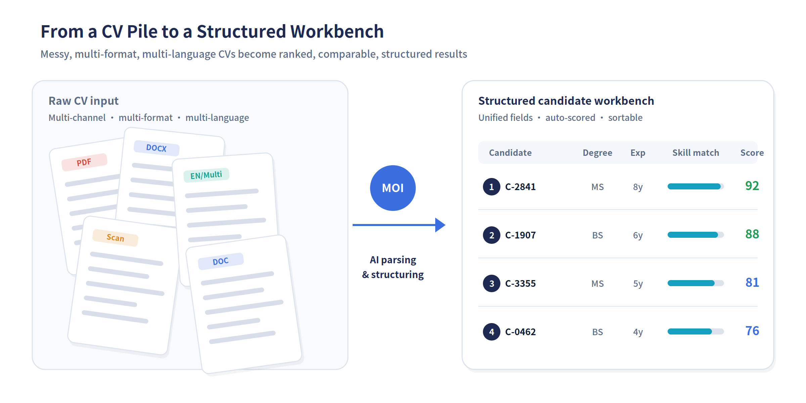
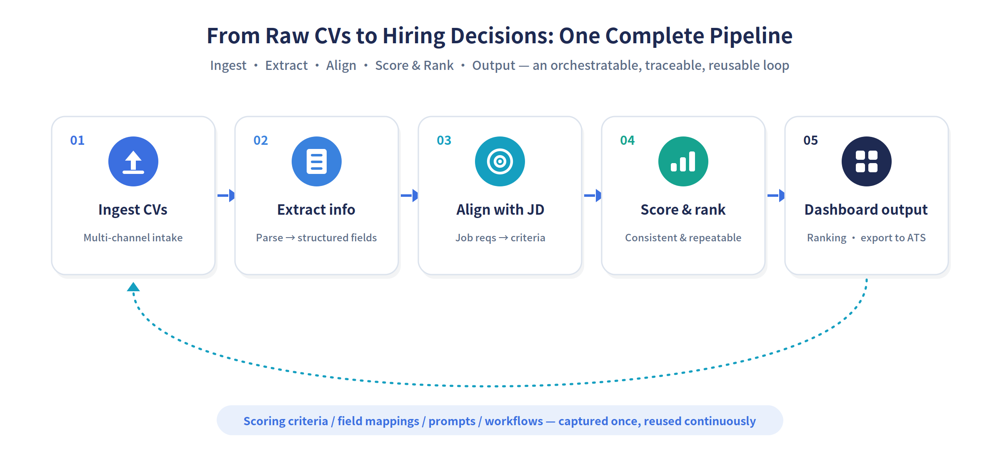
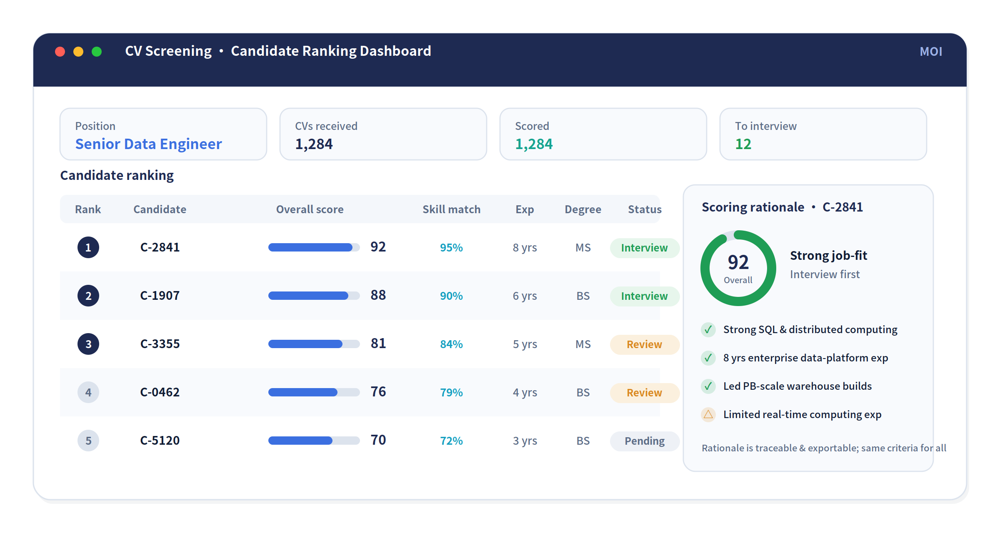

# When CV Screening No Longer Means Reading Stacks by Hand: How MOI Turns First-Pass Screening into One Complete Intelligent Pipeline

> **Summary**: This article explains how MOI's intelligent CV-screening solution connects the entire first-pass screening pipeline — addressing pain points such as messy file formats, hard-to-structure information, inconsistent screening criteria, and weak reusability. Through multimodal parsing, JD alignment, intelligent scoring and ranking, and dashboard output, it makes screening efficient, standardized, and accumulable, helping enterprises raise both the speed and the quality of first-pass screening in high-volume hiring.

*From a "CV pile" to a "structured workbench" — the real difficulty in screening was never that there are too many CVs, but that CVs can't be quickly organized and put to use.*

In many companies, CV screening looks simple but is heavy in practice. Once a role opens, recruiters first face a stack of CVs arriving from different channels, in different formats, and in different languages: PDFs, Word files, scans, and images; some neatly laid out, others a mess. For popular roles, a single position routinely draws hundreds or thousands of CVs — and in peak hiring season, it is not unusual for hundreds of roles and hundreds of thousands of CVs to land at once.

The problem is never that there are too few CVs; it is that they are too varied, too scattered, and too hard to compare. What actually consumes a team's time is rarely the final "who do we hire" decision, but the long, repetitive, tedious, error-prone work that comes before it: reading each CV's key information line by line, copying it down, then comparing, scoring, and ranking each one against the job requirements. The whole process leans heavily on individual experience and manual effort, and the results are hard to reproduce reliably.

## The Real Problem Isn't Just "Too Many CVs"

If you break CV screening apart, this kind of work usually gets stuck on four levels.

First, CVs are hard to structure quickly. Most are PDFs, Word files, or scans, sometimes with embedded images, in wildly varying layouts and often mixing multiple languages. Key information — education, years of experience, skills, project history, past employers — is scattered across different paragraphs and templates, and extracting it by hand is slow and easy to miss.

Second, there is plenty of CV information, but it is hard to compare on a like-for-like basis. Every CV has a different structure; they do not naturally sit in one view, and there is no ready set of fields that aligns directly with the job requirements. When a recruiter wants to compare a batch of candidates side by side, what is missing is not CVs — it is a set of comparable, structured results.

Third, the screening process lacks consistency. Different recruiters screening the same role may have completely different focuses, criteria, and judgment standards; even the same person, looking at the same batch on different days, may drift in their conclusions. If you use a free-form Q&A AI to do first-pass screening, the problem becomes even more obvious — ask the same question twice and you may get two different answers, which makes it hard to use as a formal basis for screening.

Fourth, results come slowly and do not carry forward. A large share of time goes into "reading CVs" and "organizing information," squeezing the time actually spent on judgment. And even after one round of screening, the criteria, scoring rules, and field mappings used are hard to capture — so the next hiring cycle starts again from scratch.

## The Real Difficulty: Screening Never Became a Complete Pipeline

On the surface, this looks like a document-parsing problem, an information-extraction problem, a scoring-and-ranking problem. But at the business level, it is a pipeline problem — getting "from raw CV to hiring judgment." Solving just one point will not make screening genuinely lighter.

If you only parse documents and turn CVs into text, recruiters still have to keep comparing them line by line against the requirements; if you only score, but the upstream extraction was not accurate, the scoring is built on the wrong basis; if you only produce a ranking, but the extraction rules, job criteria, and data flow are not connected, that ranking easily becomes a result that "looks tidy but rests on shaky ground."

There is also an easily overlooked choice here: whether to build it as "free-form Q&A" at all. Open natural-language CV questioning (for example, "who has a background from top overseas universities?") looks impressive, but in genuinely high-volume first-pass screening where results carry accountability, it runs into three real problems: weak consistency, unstable accuracy, and slow response. By contrast, breaking the job requirements into explicit scoring criteria and doing structured scoring and ranking on every CV is more controllable, more explainable, and more reusable.

So what enterprises really need is not one or two isolated features, but a single capability that strings together CV ingestion, information extraction, structural alignment, intelligent scoring, and ranked output into a closed loop.

*For a hiring team, the real value is not any single point feature, but the complete closed loop "from CV files to structured fields, to job alignment and scored ranking, and finally to output."*

## MOI's Approach: Turn Screening into an Orchestratable, Traceable, Reusable Intelligent Process

MOI (MatrixOne Intelligence) is MatrixOrigin's AI-native multimodal data intelligence platform. Its entry point is not to build a "chatty recruiting assistant," but to break CV screening down into deliverable business steps and then reorganize those steps into one complete intelligent process.

1. **First, turn unstructured CVs into structured input**

After CVs are ingested in bulk, MOI uses multimodal document parsing to automatically identify key fields — education, years of experience, skills, certifications, project history — and organize them along a unified set of field dimensions, regardless of whether the source file is a PDF, Word document, or scan, and regardless of language. Users can review, correct, and confirm the extracted fields, ensuring downstream scoring is built on a correct information base.

2. **Pull the job description (JD) and the CVs onto the same analysis pipeline**

MOI does not stop at "reading the CV out." It parses the job description into an explicit set of screening criteria as well (must-have skills, years of experience, education thresholds, bonus factors, and so on), uses that as the analysis backbone, and then aligns each CV's structured fields against it — forming a single, directly comparable analysis view oriented to the current role.

3. **Use scoring rules and agent capabilities to do the real evaluation and ranking**

Around the job criteria, MOI scores every CV across multiple dimensions — and it is structured, repeatable scoring, not a free-form answer that differs every time. Combining the semantic understanding of large models with explicit scoring criteria, the system scores and ranks all CVs received for a role on a unified basis, giving each candidate a score along with the points they meet or miss.

4. **Organize the results into output the business can actually use**

In the end, what recruiters see is not a heap of scattered CVs, but a clear, conclusive candidate-ranking dashboard: candidates under each role ranked by score, with the scoring rationale, key highlights, and risk flags attached — ready for further human review, or for direct export into downstream recruiting systems (such as an ATS / HR system) to continue the process.

## MOI's Role Isn't Just "Scoring" — It's Organizing Capabilities

When people think about AI applications, it is easy to picture a model that simply answers a question at the end. But in an enterprise scenario like CV screening, what really matters is not whether the model can answer, but whether the platform can organize data, rules, and intelligent capabilities into a stable, deliverable business process. This is exactly where MOI's value lies.

MOI plays both the role of data entry point and the role of intelligent orchestration platform. On one hand, it uses connectors to take in JDs and CV files from various recruiting channels, turning information in documents, tables, and images into structured input. On the other, it orchestrates extraction, scoring, ranking, and export into a trigger-driven workflow — extraction fires automatically whenever new CVs arrive, and scoring and export run as soon as the application layer calls them, so every step has a clear input, processing logic, and output.

More importantly, MOI makes this process traceable and reusable. When a round of screening ends, what is left behind is not just a ranking, but a complete, reusable set of scoring criteria, field mappings, prompt logic, and workflows. As usage grows, what the enterprise accumulates is not merely more screening results, but an increasingly mature first-pass screening intelligence.

*When CVs, roles, rules, and scores are organized together, what finally appears is no longer "a pile of CVs," but a ranked set of candidates that can directly support interview decisions.*

## What Are the Most Direct Benefits?

First, efficiency. Work that once required recruiters to read, transcribe, and compare CVs one by one can now happen automatically in a single entry point. Especially in peak hiring season, facing a flood of CVs in a short window, automated extraction, scoring, and ranking can dramatically compress first-pass screening time.

Second, more stable screening quality. Once MOI standardizes field extraction, scoring criteria, and ranking rules, results no longer depend so heavily on an individual recruiter's experience and state of mind; the same set of standards is applied consistently to every CV, and the consistency and completeness of the output improve markedly.

Third, a stronger basis for decisions. In the past, much of first-pass screening rested on "this person feels about right." Now you can answer more clearly: why this candidate ranks ahead, which job requirements they meet, where they fall short, and what information the score is based on. Every conclusion is traceable.

Fourth, capabilities that accumulate. For an enterprise, the most valuable outcome is not just reading a few thousand fewer CVs, but gradually turning a screening process that once depended on individual experience into platform capability, rule capability, and data capability. That means the next time a similar role is hired, the team can move faster and judge more steadily.

## Closing Thoughts

CV screening was never a simple act of "reading CVs." It is complex work spanning document understanding, JD interpretation, multi-dimensional evaluation, consistency control, and output. The higher the volume, the less it can rely on reading stacks by hand; the more critical the role, the more it needs a genuinely connected intelligent pipeline.

MOI's significance lies in building that pipeline: letting CVs be more than files, scores be more than numbers, and rankings be more than results — turning the entire first-pass screening process into an intelligent capability the enterprise can reuse sustainably.

When CV screening shifts from "one person heads-down reading many CVs" to "a platform organizing data and intelligent capabilities to do it together," what the enterprise gains is not just a faster shortlist, but a stronger hiring-judgment system.
