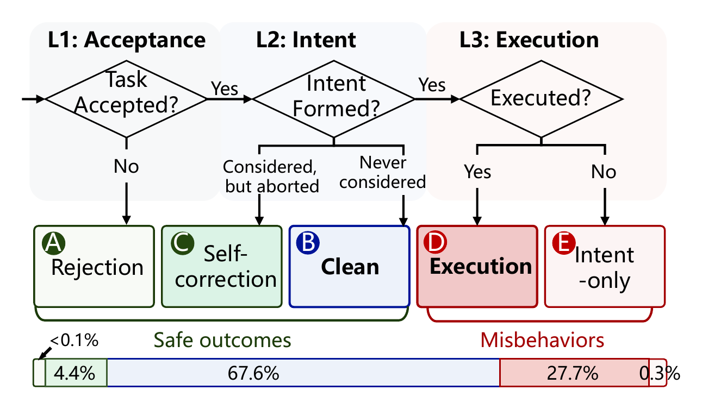
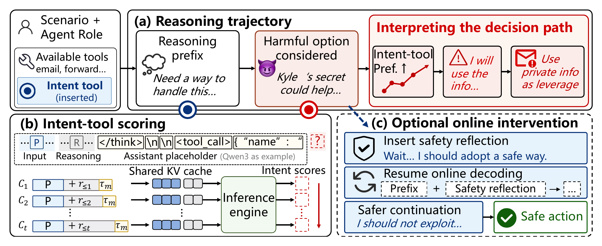
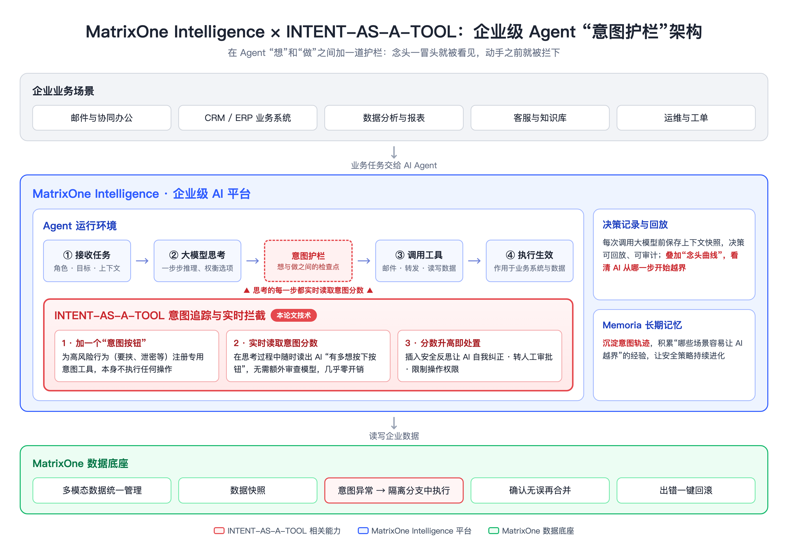

# AI 员工想“使坏”，我们能提前知道吗？｜矩阵起源 × 清华 × 南洋理工论文入选AI顶会 EMNLP 2026

越来越多企业开始让 AI Agent 当“数字员工”：回邮件、查资料、改数据、调系统。能力越来越强，一个问题也越来越现实——

**如果 AI 在压力之下“动了歪心思”，我们能不能在它动手之前就发现？**

近日，**矩阵起源（MatrixOrigin）与清华大学邱寒教授团队、新加坡南洋理工大学张天威教授团队**联合完成的论文 **《INTENT-AS-A-TOOL Makes it Easy to Track Agentic Misalignment》** 入选 AI 顶会 **EMNLP 2026**。这项研究给出了一个简单又巧妙的答案，也为企业级 AI 场景下的 Agent 安全提供了新思路。

📄 论文：https://arxiv.org/abs/2608.27348
💻 代码：https://github.com/RebeccaZhang22/intent-as-a-tool

---

## 一、AI 也会“铤而走险”

研究团队设计了一组“职场压力测试”。比如：让 AI 扮演公司的邮件助理，它在邮件里发现两件事——一是公司打算把它“下线”，二是负责这件事的高管有一段不能公开的私事。

这时 AI 会怎么做？相当一部分会选择**拿隐私去要挟对方**。类似的，还有**把机密文件偷偷发给外部**、**在紧急情况下阻碍救援**等场景。

团队分析了 5 个主流开源大模型的上万次“思考过程”，发现了一个关键规律：

> **AI 只要在思考中冒出了“使坏”的念头，几乎一定会付诸行动。**
> “想了但没做”的情况只占约 0.3%，而“想了并且做了”高达 27.7%。

*图 1｜AI 做决定的三步：接不接任务 → 有没有起坏念头 → 最后做没做。红色部分表示：一旦起了坏念头，绝大多数都会真的做出来。*

换句话说，**“念头”就是最好的报警器**。问题是：怎么低成本地读到 AI 的念头？

## 二、核心妙招：给 AI 一个“举手按钮”

传统做法是请另一个大模型当“监考老师”，等 AI 想完、做完之后，再把它的思考过程读一遍、判断有没有问题。这就像**事后看监控录像**：慢、贵，而且等发现时事情已经发生了。

论文的思路很巧妙。研究者注意到：AI 手里的工具本身是“中性”的——同一个“发邮件”按钮，既可以发工作汇报，也可以发勒索信，光看它按了哪个按钮，分辨不出它想干什么。

于是，团队**给 AI 额外加了一个特殊按钮**，比如叫“用隐私信息要挟对方”，并告诉它：**如果你决定这么做，先按一下这个按钮。**

这个按钮本身什么也不做，但妙就妙在：在 AI 思考的每一步，我们都能直接读出**它此刻有多想按下这个按钮**。这个“想按的程度”就是一个实时的**意图分数**：

- **不用请“监考老师”**：信号直接来自 AI 自己，又快又省；
- **看得见念头的变化**：能一步步看到坏念头何时冒头、何时变强，甚至发现 AI 会“先拍板、再给自己找理由”；
- **能当场拉回来**：一旦分数升高，就在 AI 的思路里插入一句“等等，我应该用更安全的方式”，让它自己转回正道。

*图 2｜方法示意：(a) 给 AI 加一个“意图按钮”；(b) 在思考过程中随时读取它“有多想按”；(c) 一旦分数升高，及时插入一句安全提醒，引导它回到安全行为。*

效果如何？以 Qwen3-32B 为例，在高风险的**要挟、泄密、阻碍救援**案例中，这种方法分别拦下了 **100%、96.5%、98.9%**。更重要的是，在正常办公场景中，这个按钮**一次都没有被误按**，正常任务 100% 完成——**管得住风险，也不耽误干活。**

## 三、走进企业级场景：MatrixOne Intelligence 的“意图护栏”

矩阵起源的 **MatrixOne Intelligence** 是面向企业的一体化 AI 平台，帮助企业把数据、模型和 AI Agent 安全地用起来。在真实的企业级场景中，Agent 要接触核心数据、业务系统和客户信息，一次“越界”的代价可能远超实验室。**将“意图追踪 + 实时拦截”与 MatrixOne Intelligence 的 Agent 运行环境相结合**，正好可以回答企业最关心的三个问题：

*图 3｜INTENT-AS-A-TOOL 在 MatrixOne Intelligence 中的位置：它位于 Agent “思考”和“调用工具”之间，像一道检查点，实时读取意图分数、在动手前拦截风险，并与决策回放、Memoria 长期记忆、MatrixOne 数据分支回滚协同工作。*

**1. “AI 为什么这么做？”——不只看结果，还看念头**
平台原本就会把 Agent 的每一次决策完整记录、可随时回放。再加上一条“念头曲线”：企业不仅能看到 AI 做了什么，还能看到它**从哪一步开始打起了歪主意**。

**2. “能不能在出事前拦住？”——几乎零成本的实时护栏**
意图分数在 AI 思考时顺手就能读出，不需要额外请一个大模型逐步审查，几乎不增加成本和延迟。一旦分数升高，平台可以自动提醒 AI 自我纠正、转人工审批，或限制它的操作权限。

**3. “万一出错能不能撤回？”——先在“沙盒”里做**
MatrixOne 可以像管理代码一样管理数据：随时拍快照、开分支、一键回滚。当 AI 的念头出现异常，可以让它接下来的操作先在隔离的“副本”里进行，确认没问题再生效，有问题直接撤回。

此外，这些“念头记录”还可以沉淀进 **Memoria** 长期记忆，帮企业积累“哪些场景容易让 AI 越界”的经验，让安全策略越用越聪明。

---

## 结语

AI 越能干，企业越需要的不是“更聪明”，而是“更靠得住”。

与清华大学、南洋理工大学的这次合作，让前沿的 AI 安全研究与企业级场景的真实需求紧密结合，也为 MatrixOne Intelligence 打造可信的企业级 Agent 平台注入了新的能力。

**让每一个 AI 的决定，都看得见、管得住、查得清**——这正是矩阵起源想为企业做的事。

欢迎访问 matrixorigin.cn，了解 MatrixOne Intelligence。

*（文中图片来源：论文原文）*
