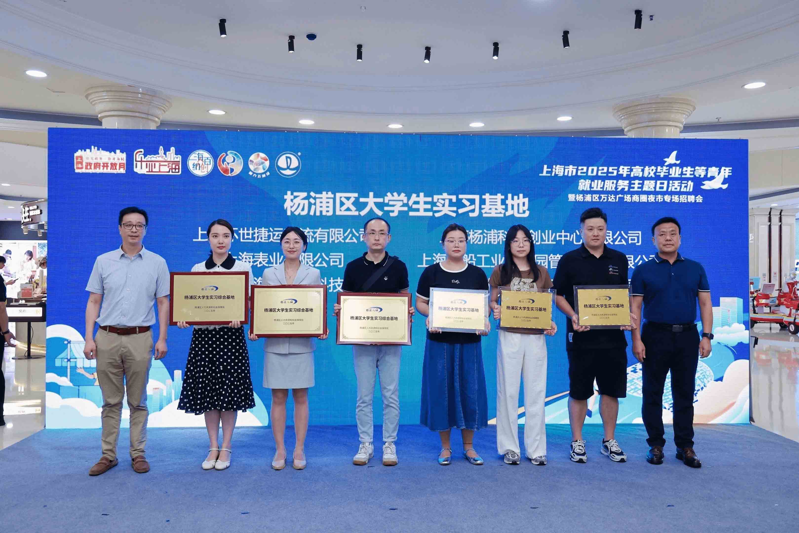
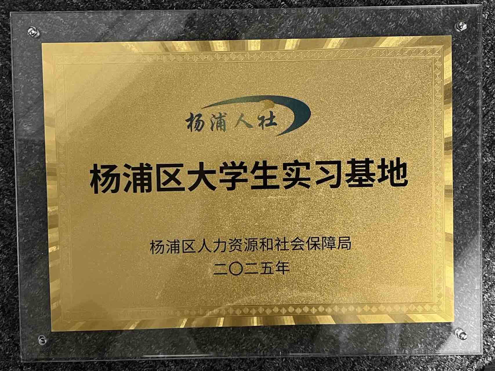

On August 23, 2025, MatrixOrigin (Shanghai) Information Technology Co., Ltd., as a representative key enterprise in Yangpu District, was invited to participate in the Employment Service Theme Day event and was officially awarded the bronze plaque of "Yangpu District Internship Base." This honor is not only strong recognition of our technical capabilities in AI and databases, but also full affirmation of our continued efforts to promote industry-university-research integration and empower the development of future technology talent.

#### Deeply Committed to Technology, and Even More to Talent

Since its founding, MO has always adhered to a development strategy driven by both technology and talent. We have not only built an efficient multimodal data intelligence platform, but also formed a technical team composed of engineers from leading companies and graduates from well-known universities. With this recognition as an internship base, we will further open technical resources and project practice opportunities, providing university students with real-world scenario training to help them grow through practice.

#### Working with Universities to Build an Ecosystem

MatrixOrigin has established partnerships with many well-known universities in China and around the world, jointly promoting educational innovation and scientific research breakthroughs in artificial intelligence and databases. Looking ahead, we will continue to expand the breadth and depth of university-enterprise cooperation, giving back to education and empowering talent through lectures, competitions, joint curriculum development, and other forms.

#### Internship Base: Not Only Practice, but Incubation

In MO's internship program, students will have the opportunity to participate in frontier projects such as database kernel development, AI algorithms, and cloud-native architecture; receive one-on-one guidance from technical mentors and gain an in-depth understanding of system design and engineering practice; and experience modern R&D culture such as agile development and open-source collaboration, comprehensively improving their overall capabilities. Through this platform, we hope not only to provide students with opportunities to improve their skills, but also to inspire their passion and creativity for basic software and AI technologies.

#### Message for the Future

Founder and CEO Wang Long said: Talent is the most valuable asset of a technology company. We are honored to become an internship base. This is both a responsibility and a motivation. We will continue investing resources to help more young people achieve self-breakthroughs in real technology scenarios and grow together with China's basic software ecosystem.

If you are also passionate about AI, databases, cloud-native technologies, and related fields, you are welcome to join MatrixOrigin's internship program and build the foundation of the intelligent era with us.

Internship positions are actively recruiting:

1. Algorithm Intern - Shanghai
2. Testing Intern - Shanghai
3. DevOps Intern - Shanghai
4. Frontend Intern - Beijing

To submit your resume, please contact: hr@matrixorigin.com
