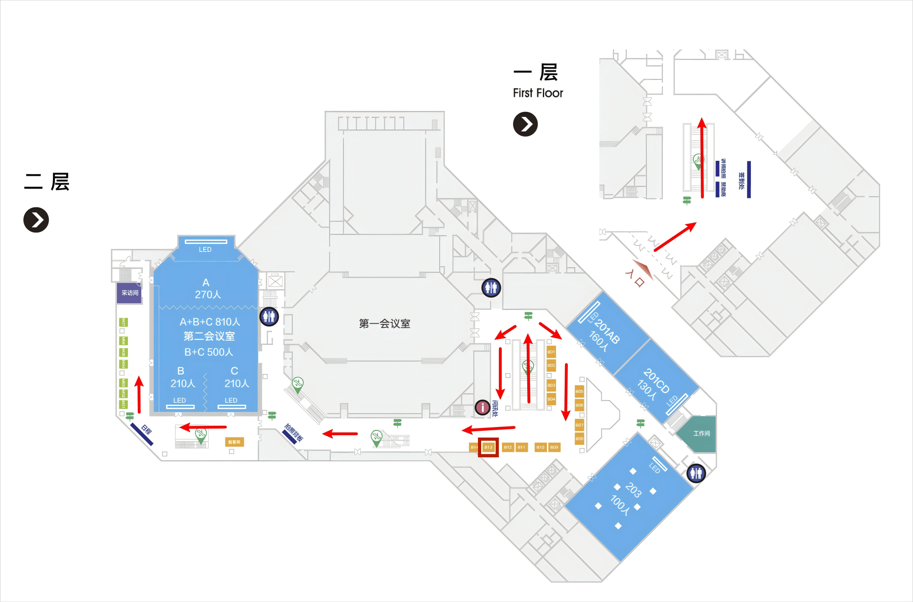
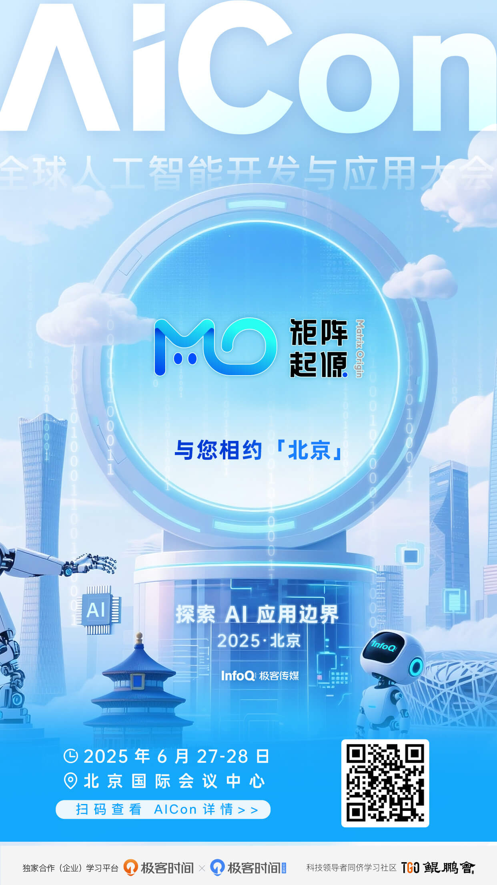

As GenAI and various AI Agents become increasingly embedded in enterprise business scenarios, high-quality proprietary enterprise data has become indispensable for improving the accuracy with which general-purpose large models solve industry-specific business problems. This is true whether organizations adapt general models to industry needs through fine-tuning, or extend model knowledge through RAG architectures. On June 27-28, the AICon Global Artificial Intelligence Development and Application Conference Beijing will open at the Beijing International Convention Center.

MatrixOrigin cordially invites you to visit **Booth B13 on the second floor** from **June 27 to June 28, 2025 (Friday-Saturday)**, marked by the red box in the image below. We look forward to discussing how enterprises can unlock the value of their massive internal data assets and turn GenAI into business value in real-world scenarios.

### Booth Highlights

- **Product preview**: An end-to-end live demonstration of MatrixOne Intelligence, an AI-native multimodal data intelligence platform
- **On-site expert consultation**: One-on-one discussions with MatrixOrigin product experts for tailored solution recommendations
- **Exclusive benefits**: Booth visitors will have the opportunity to receive MatrixOrigin exclusive technical materials and premium gifts

