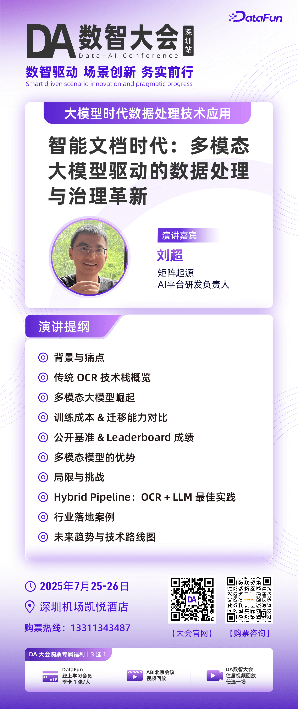
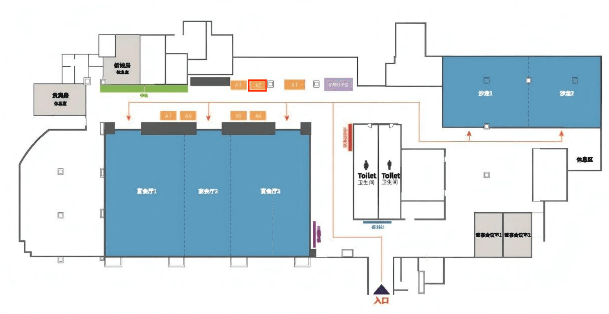

OCR technology has rapidly become popular in recent years and is widely used in scenarios such as document scanning, express tracking number recognition, license plate recognition, and everyday translation, greatly improving convenience. Each technology has its own strengths and weaknesses in specific scenarios: traditional OCR is suitable for real-time scenarios, deep-learning OCR offers high accuracy but depends on large amounts of data, and large-model OCR has strong generalization capability but high training cost.

The 2025 DA Conference Shenzhen stop will be held at **Hyatt Regency Shenzhen Airport from July 25 to 26**. MatrixOrigin invites you to join us in interpreting new data processing methods driven by multimodal large models.

### 01 Session Preview

At **14:55-15:40 on July 25 in Grand Ballroom 2 (Data Processing Technology Applications in the Large Model Era track)**, MatrixOrigin **Head of AI Platform R&D Liu Chao** will deliver a keynote speech titled **"The Era of Intelligent Documents: Data Processing and Governance Innovation Driven by Multimodal Large Models."** The session will focus on the evolution of data processing technologies in the "large model era" and share MatrixOrigin's core technology iteration process. Through a systematic comparison between traditional OCR solutions and multimodal large models (Vision-Language Models, VLMs), combined with the latest benchmark data and implementation cases, the speech will help the audience fully understand:

- Differences in "training cost and migration applicability"
- Breakthroughs of multimodal models in "structured information extraction"
- Best practices for hybrid pipelines (OCR + LLM)
- Future technical implementation roadmap for private deployment, Agent orchestration, multimodal RAG, and more

### 02 Booth Interaction

**From July 25 to 26, at booth A02 on the summit site (marked by the red box in the figure below)**, you can experience our AI-native multimodal data intelligence platform on site. MatrixOne Intelligence helps users integrate fragmented internal enterprise data through a one-stop approach, quickly build GenAI applications connected to business processes, mine the value of their massive data, and allow GenAI to truly create value in business scenarios. In addition, you can participate in interactive booth activities to learn more about product capabilities and advantages, communicate face to face with the MatrixOrigin team, discuss frontier topics in data intelligence, and have the chance to win customized gifts.

Scan the QR code below to register with one click. We look forward to seeing you at the DA Digital Intelligence Conference.

