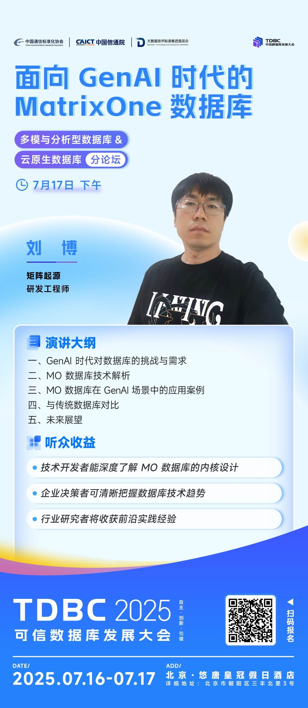

In the era of artificial intelligence, massive multimodal data is reshaping the boundaries of data infrastructure, and the integrated management of heterogeneous data such as text, images, audio, and video has become a key challenge. On the afternoon of Thursday, July 17, 2025, the Trusted Database Development Conference's Multimodal and Analytical Databases & Cloud-Native Databases Subforum will be held at Crowne Plaza Beijing U-Town.

MatrixOrigin R&D engineer Liu Bo will deliver a keynote speech titled **"MatrixOne Database for the GenAI Era"** from **16:00 to 16:20 on July 17** at the **Multimodal and Analytical Databases & Cloud-Native Databases Subforum (Ballroom 3)**. He will analyze the core changes and challenges in database requirements in the GenAI era, share MatrixOne's technical architecture, core features, and application cases in GenAI scenarios, and present innovative applications combining vector retrieval and full-text search.

**Audience Benefits**

- Technical developers can gain an in-depth understanding of the MO database kernel design.
- Enterprise decision-makers can clearly grasp database technology trends.
- Industry researchers will gain frontier practical experience.

We sincerely invite you to join the discussion and exchange.

