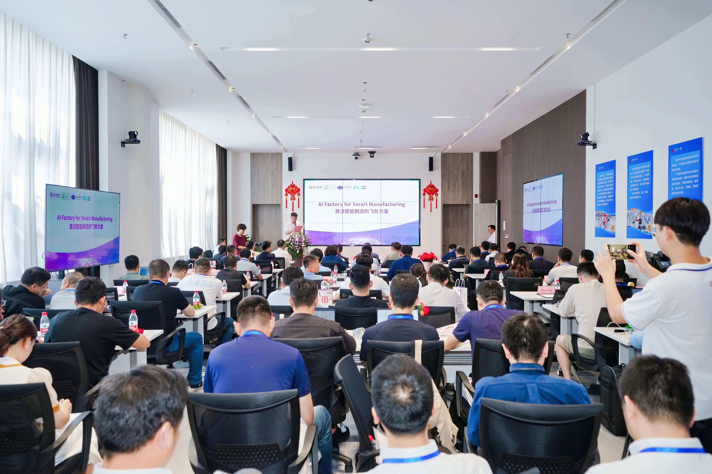
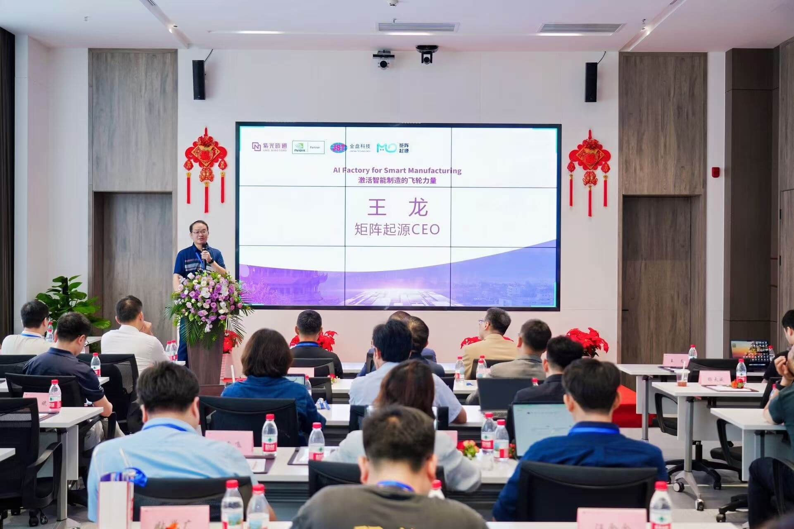
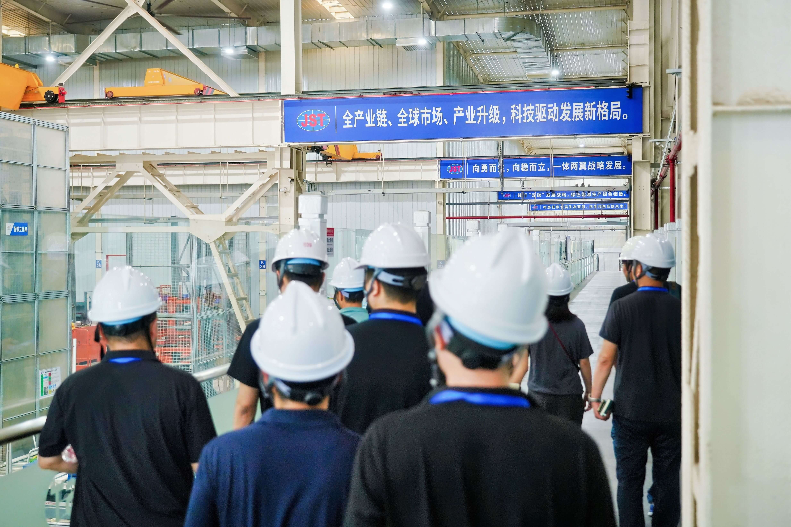

At the "AI Factory" ecosystem partner conference held in Wuhan on September 5, Jinpan Technology announced its full move into a new era of intelligent manufacturing centered on artificial intelligence. MatrixOrigin, together with ecosystem partners including iSoftStone, is jointly driving the comprehensive upgrade of Jinpan's digital factory into intelligent manufacturing, creating a new industry benchmark.

## Strategic Breakthrough: Jinpan Technology Fully Embraces the AI Era

As a global leader in power equipment, Jinpan Technology's energy solutions have served leading data centers including Baidu, Huawei, and Alibaba. Now, in the wave of comprehensive intelligence, MatrixOrigin is working with iSoftStone and other ecosystem partners to build a new-generation AI platform and Agents, accelerating Jinpan Technology's transformation from a digital pioneer into a paradigm setter for intelligent manufacturing.

## Intelligent Flywheel: Activating Private-Domain Data and Reshaping Core Business

To support Jinpan Technology's intelligent transformation, MatrixOrigin, together with iSoftStone and other partners, created a tailored AI data solution for Jinpan Technology. By breaking through system silos and reshaping business processes, the solution turns data into real enterprise productivity. Based on this solution, Jinpan Technology can efficiently extract, govern, and apply massive business data, providing solid support for AI implementation in core scenarios.

In the intelligent bid-document project that has already been implemented, previously inefficient manual processes were completely transformed. Key information extraction accuracy jumped from less than 50% to 95%. Cross-department searches for performance evidence were shortened from several days to 5 minutes. Bid-document preparation, which originally took 3 to 7 days, can now complete 80% of the work in 1 hour. Overall efficiency improved nearly 50 times, allowing Jinpan to truly release intelligent dividends from its data challenges.

## Ecosystem Co-Creation: Opening a New Era of Intelligent Manufacturing

With MatrixOrigin's AI solution, Jinpan Technology has successfully leapt from a traditional digital factory to an intelligent manufacturing factory, establishing a new industry benchmark in the 14th Five-Year Plan strategy and continuously strengthening its core competitiveness. Standing at the new starting point of the 15th Five-Year Plan, we see a hopeful future: one in which every piece of data creates value and every collaboration drives industrial progress. MatrixOrigin will continue to deepen cooperation with the manufacturing industry, jointly accelerate the intelligent flywheel, and help industry move toward a new height of sustainable development.

## About MatrixOrigin

MatrixOrigin is an industry-leading provider of Data & AI platform technologies and services. Its core team comes from well-known technology companies in China and abroad and has broad industry and international vision. MatrixOrigin's core product, MatrixOne Intelligence, is an AI-native multimodal data intelligence platform for enterprises. It uses artificial intelligence technologies, including large models, and an innovative hyper-converged data foundation to help enterprises centrally manage and govern multimodal data and turn private-domain data into AI-Ready data assets. It has already served leading enterprises across industries, including StoneCastle, China Mobile IoT, Amway Nutrilite, Jiangxi Copper, and XCMG Hanyun, helping enterprises transform and upgrade from informatization and digitization to intelligence.
