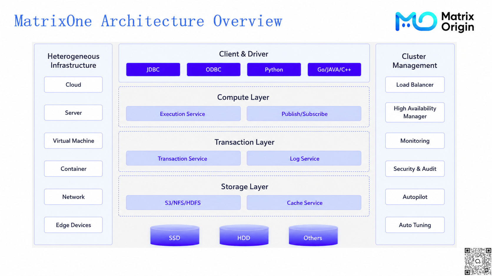
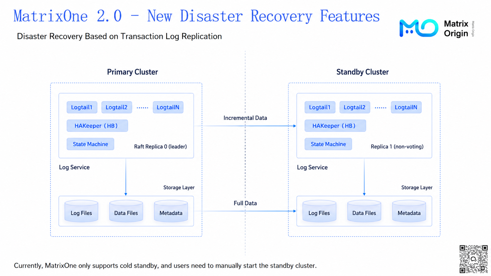
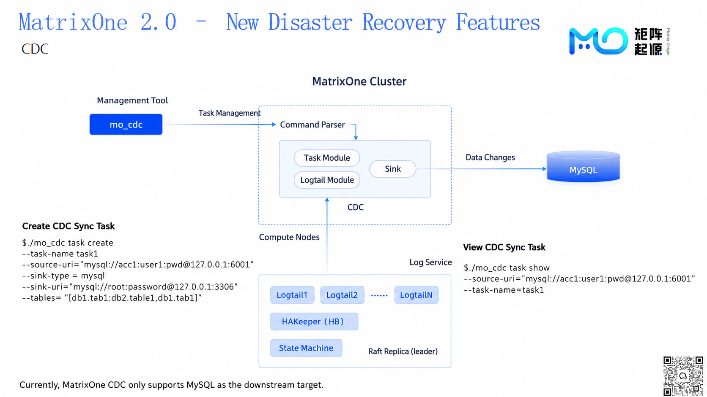
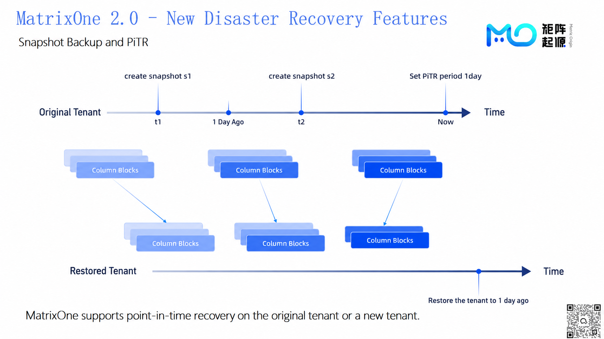
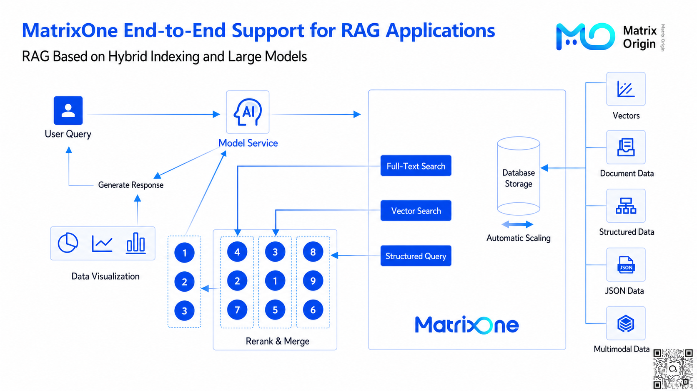
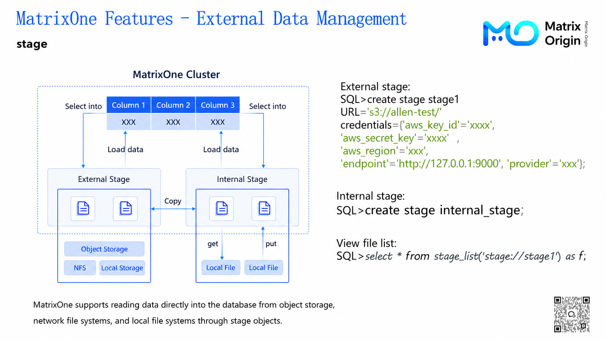
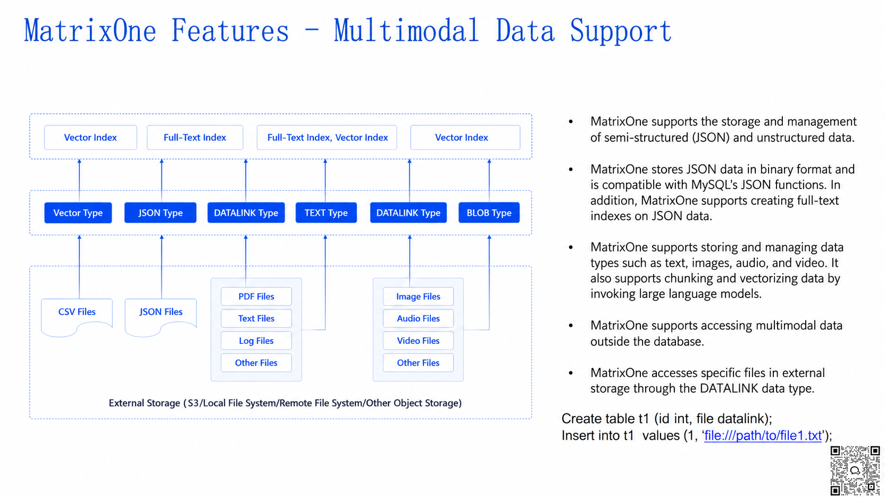
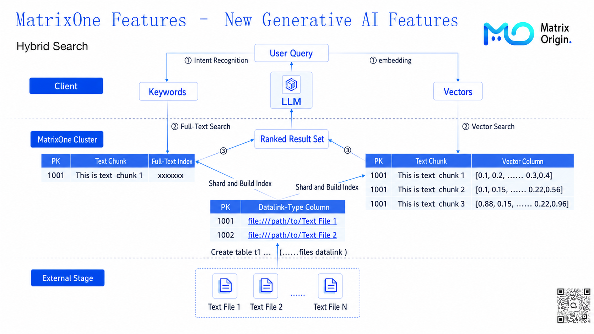
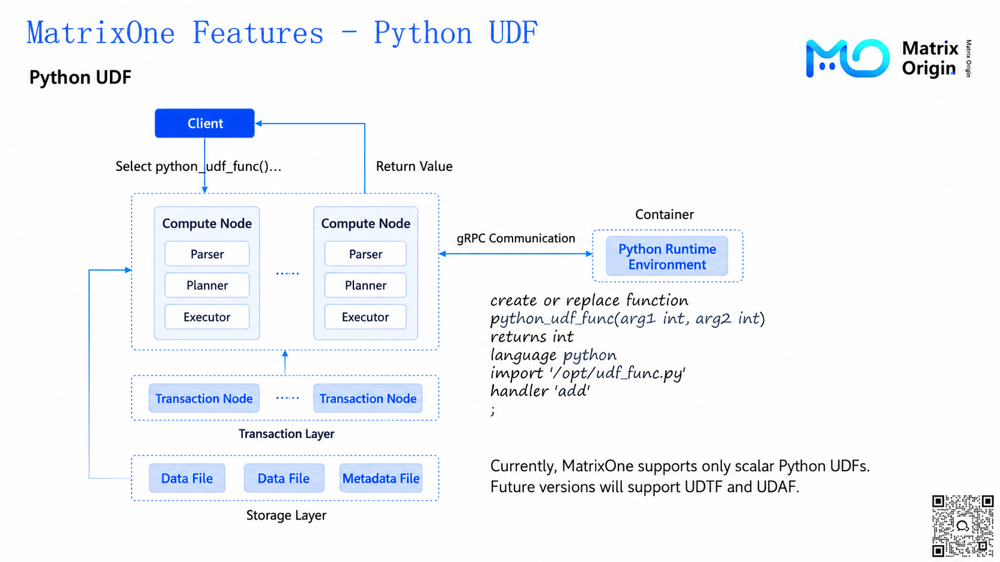

## MatrixOne 2.0.0 New Features Explained

MatrixOne 2.0.0 is an AI-driven cloud-native hyper-converged database. It uses a compute-storage separation architecture and comprehensively improves cloud resource utilization. MatrixOne is compatible with the MySQL protocol and syntax, supports mixed workload scenarios, and combines vector data types, full-text search, and other features to provide powerful data management and retrieval support for generative AI applications.

### Architecture and Deployment Flexibility

MatrixOne's architecture is divided into the compute layer, transaction layer, and storage layer:

- **Compute layer** includes execution services and SQL runtime for efficient SQL query processing.

- **Transaction layer** provides transaction services and ACID support to ensure data consistency and reliability.

- **Storage layer** is built on S3, supports multiple storage options, and integrates caching services to optimize access performance.

MatrixOne can be flexibly deployed on cloud platforms, physical machines, virtual machines, containers, and edge devices, adapting to a wide range of scenarios.

### Optimized for Generative AI

MatrixOne 2.0.0 performs exceptionally well in generative AI scenarios, especially in the following key areas:

1. **Vector retrieval and keyword retrieval**

Vector retrieval: through vector data types and vector indexes, it enables efficient vector distance retrieval to meet the needs of large-scale datasets.

Keyword retrieval: through full-text indexes, it improves retrieval accuracy for short words and short phrases and is suitable for fast querying of text and JSON data.

2. **Multimodal data management**

**Data Link and Stage features**: support direct access to external storage, such as S3 buckets, and file systems, simplifying unified management of multimodal data. Users can directly retrieve and manage text, image, audio, and video data through SQL statements.

3. **AI model integration capabilities**

MatrixOne provides vector indexes and **Python UDFs**, supporting integration with most large models to perform vectorization, feature extraction, and label generation.

4. **Multi-tenancy and data sharing**

MatrixOne supports multi-tenant environments for collaboration scenarios, making it easier for developers to share data and feature libraries and speeding up the development and iteration of generative AI applications.

### Data Security and Disaster Recovery

MatrixOne 2.0.0 provides complete data security and disaster recovery capabilities:

- **Disaster recovery based on transaction log replication**: supports active-passive clusters and log replication to ensure business continuity.

- **CDC**: data changes are captured from MatrixOne compute nodes and passed through the CDC pipeline to a MySQL database.

- **Snapshot recovery and PiTR**: supports data snapshots and point-in-time recovery to keep data safe and controllable.

## Quickly Building RAG Applications on MatrixOne

In today's technical environment, RAG (Retrieval-Augmented Generation), an application framework combining information retrieval and generative models, is gradually becoming a core direction for large-model applications. By combining retrieval and generation, RAG can not only provide contextual information for user queries, but also generate higher-quality and more targeted output. It has been widely used in intelligent Q&A, content creation, multimodal analysis, and other fields, showing strong practical value.

MatrixOne, as an AI-driven hyper-converged database, provides comprehensive and flexible support for building and deploying RAG applications efficiently.

### Core Requirements of RAG Applications

Building a RAG application depends on the following key capabilities:

1. **Fast data management and retrieval** to ensure relevant documents can be accessed and used efficiently.

2. **Context enhancement for generative models** to provide reliable semantic support through precise retrieval.

3. **Scalability and flexibility** to adapt from small prototypes to large production environments.

MatrixOne combines powerful data management, retrieval, and generation support capabilities to provide developers with a one-stop solution from underlying architecture to upper-layer applications.

### MatrixOne Core Features Supporting RAG Applications

**1. Efficient data management and external data access**

MatrixOne supports direct connection to external storage, such as S3 buckets and network file systems, through **Stage features**, and manages them using SQL statements. Users can easily access JSON files, multimodal data such as images, videos, and audio, providing rich content sources for applications.

In addition, through the **Data Link** data type, MatrixOne can directly associate external files with database records, supporting one-stop operations and greatly reducing preprocessing time and complexity.

**2. The perfect combination of full-text indexing and vector retrieval**

MatrixOne has hybrid capabilities for both full-text indexing and vector retrieval. Users can quickly locate documents through keywords and also achieve semantic-level retrieval through vector matching, or even combine the two to handle complex queries.

This two-pronged capability provides seamless information retrieval for RAG applications. Especially in multimodal scenarios, it can significantly improve retrieval accuracy and the relevance of generated results.

**3. Flexible data processing and generation support**

MatrixOne supports **Python UDFs**, allowing users to run custom scripts directly in the database for complex data processing tasks. For example, users can generate embeddings through vector models or perform segmented analysis on multimodal data. On the generation-model side, MatrixOne also supports invoking large language models through built-in database mechanisms, enabling efficient collaboration from data retrieval to content generation.

**4. Automated and scalable design**

MatrixOne's built-in auto-scaling and distributed architecture enables it to dynamically respond to different workload sizes. Whether for lightweight applications built by individual developers or large-scale enterprise deployments, MatrixOne consistently provides stable and reliable performance support.

### Practical RAG Applications Built on MatrixOne

MatrixOne provides a complete toolchain for RAG applications. For example, users can manage external data by creating tables and leverage vector and full-text indexes in the kernel to quickly implement data retrieval.

For intelligent Q&A scenarios, MatrixOne can decide whether to use keyword retrieval or vector retrieval based on user requirements, or even perform hybrid retrieval. After ranking the results, it combines them with large-model generation to provide precise answers. In multimodal scenarios, MatrixOne can unify text, image, and video retrieval. In content creation, user-provided summaries can be expanded into full articles or distilled into key takeaways by the system.

RAG applications are moving toward higher efficiency and flexibility. With MatrixOne's architectural support, developers can quickly build systems that mix indexing or content in powerful ways to meet a wide range of complex business needs. From automatic retrieval and ranking to large-model-assisted generation, MatrixOne provides a high-performance, low-barrier solution that makes precise and efficient user interaction easy to achieve.

Through MatrixOne's full-stack capabilities, RAG applications not only improve retrieval efficiency, but also significantly enhance the accuracy and usability of the final generated results.

## 10-Minute Rapid Demo for Building Large-Model Applications

Watch the video: [10-Minute Rapid Demo for Building Large-Model Applications](https://www.bilibili.com/video/BV1Y2DGYoEXz/?spm_id_from=333.999.0.0)

This livestream showed how to use the **MatrixOne database** and **MinIO** to quickly build a document assistant demo. Using just a laptop, the team completed the entire process from environment setup to system development, demonstrating the huge potential of combining large models with databases. The core flow is outlined below:

### **Environment Setup and System Preparation**

1. **Basic environment configuration**

   a. Install the MatrixOne database and build a 5-node virtual machine cluster through virtualization.

   b. Configure MinIO as the object storage system for managing and processing PDF files.

2. **Frontend presentation framework**

   a. Use **Streamlit** to develop a simple front-end interface that supports users entering questions and receiving retrieval results in real time.

### **Core Document Processing Features**

1. **PDF file processing**

   a. Users upload PDF files through the frontend, and the files are stored in MinIO.

   b. PDF files are converted to TXT files and then **segmented** into chunks and sentences to optimize retrieval.

   c. The segmented text data is stored in the MatrixOne database together with metadata.

2. **Data vectorization and storage**

   a. The **Qwen model** is used to vectorize the text chunk data and generate feature vectors.

   b. Text and vector data are stored in the database, laying the foundation for subsequent retrieval.

### **Data Retrieval and Result Presentation**

1. **Hybrid retrieval technology**

   a. Use **L2-distance vector retrieval** to quickly find document fragments related to user questions.

   b. Build **full-text indexes** on text and JSON data to perform keyword retrieval.

   c. Combine vector and keyword retrieval results through ranking and merging to generate the final answer.

2. **Frontend interaction**

   a. The system returns retrieval results to the Streamlit frontend, where users can view relevant documents and answers.
