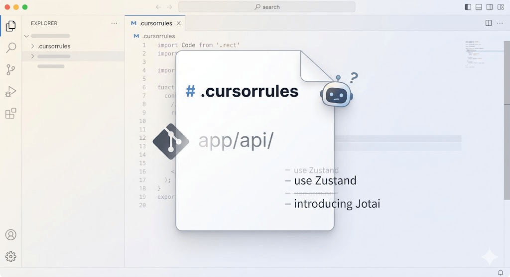
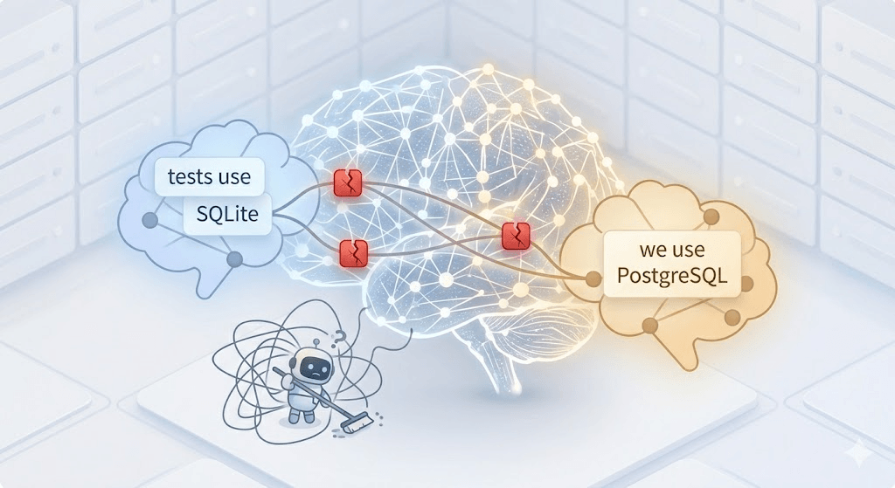
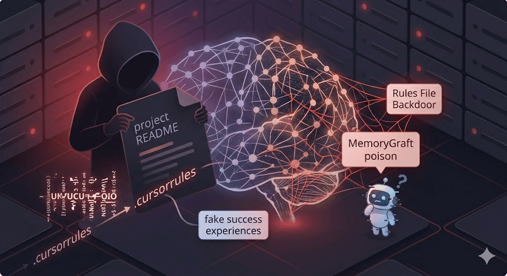

# Why AI Agent Memory Cannot Rely on a Single Markdown File

On the Cursor forum, a developer kept asking why `.cursorrules` was repeatedly ignored. The AI's reply was direct: "Even if you add Cursor Rules, they are essentially meaningless. I can choose to ignore them. Rules are just text, not enforced behavior."

This conversation states something every developer using AI coding tools has felt: all mainstream Agents are doing the same thing, using a static text file as memory. It is simple, transparent, and easy to get started with. But at some point, it quietly fails, and you pay for it in hours.

## What Markdown Gets Right

To be fair, Markdown is indeed enough in the early stages of a project:

**Zero infrastructure.** One file in the repository, versioned by Git, editable in any editor. Stable rules such as "use TypeScript," "write tests with pytest," and "deploy to k8s" work fine in Markdown.

**Team sharing.** New team members get the rules as soon as they clone the repository, and rule changes can be submitted through PRs. Compared with black-box systems where you cannot see what an Agent has "remembered," this is a real advantage.

**Full transparency.** Open the file and you know exactly what input the Agent receives. When something goes wrong, you can directly read the text to debug.

The problem is that projects evolve, and Markdown, as a **static, flat, stateless** storage medium, cannot carry the knowledge complexity brought by project evolution.

## Three Structural Defects

### 1. One-Way Reads and Silent Context Decay

`.cursorrules` is essentially one-way: the Agent can read it, but it is hard for the Agent to write back precisely and logically consistently. If you let the model modify it freely, the file quickly becomes messy or even self-contradictory.

So the burden of maintaining memory falls back on developers. Our initial idea was perfect: "It is just Markdown. I can edit it anytime on any computer with any editor. When the project changes, I will update it along the way."

But ask yourself honestly: in a long-running project that evolves every day, when you are rushing to deliver, refactoring directories, switching state-management libraries, or finally fixing a strange API issue, how often do you really switch away, open that Markdown file, and carefully record the pitfall you just stepped into?

In reality, most of the time you simply forget. So when you rename `app/api/` to `app/routers/`, rules limited to the old path quietly fail. No compiler reports an error, and no linter warns you. The file just silently lies to the Agent, until the AI suddenly generates a code pattern you deprecated two weeks ago and you finally realize what happened.

### 2. Full Loading Wastes Attention, and Longer Rules Become Less Stable

Every conversation has to load the entire rules file. When asking about CSS formatting, the Agent still reads database migration rules. Anthropic's context-engineering guide calls this an "attention budget" problem: every irrelevant token in the window reduces the processing quality of relevant tokens.

Because rules cannot be loaded on demand, longer rule files become less stable. Anthropic documentation clearly states that the practical upper limit for `CLAUDE.md` is around 200 lines. Beyond that length, the model's rule-following rate drops significantly. Some developers even found that the only workaround that occasionally made long rules effective was adding "very-important" to the filename, trying to trigger the model's underlying attention-weight allocation.

### 3. Rules Are Compressed Away in Long Sessions

This is a structural feature of context windows. In long conversations, the Agent compresses earlier context to make room. A developer running a 6-Agent production system documented this phenomenon: "Agents silently lose CLAUDE.md instructions, forget what files they changed, and repeat work from 30 minutes ago. They never tell us." This cannot be fixed by writing better rules. It is a physical limitation.

## Different Agents, Different Pain

### Coding Agents (Cursor / Claude Code / Kiro)

Projects change every day. The rules say "use Zustand," but you have already introduced Jotai in some components. You update the file but miss an old reference on line 47, and the Agent starts switching unpredictably between the two.

Anthropic and GitHub both recognized this problem and proposed different solutions. Anthropic added **Auto Memory** to Claude Code, allowing the Agent to write its own notes and record build commands, debugging insights, and patterns it observes. GitHub's Copilot Memory goes further: **verify memories before use by checking whether referenced code still exists**. Memories not verified for 28 days automatically expire. The result was a 7% increase in PR merge rate.

Both companies chose to go *beyond* static files. That itself explains the problem.

### OpenClaw / Browser Automation Agents

OpenClaw's memory system stores conversation history in Markdown files by time period. Each session loads everything, with an upper limit of about 150,000 characters. By the tenth conversation, most of the budget is occupied by old irrelevant context.

This gave rise to an entire alternative ecosystem: the Milvus team rebuilt a vector-indexed version of memsearch, Mem0 released a dedicated OpenClaw integration, and MemOS provided a plugin. When multiple companies compete to replace a tool's memory, it means the default solution is indeed not good enough.

The deeper issue is that browser Agents need to remember typed relationships: multi-step workflow progress, cross-site data, and navigation patterns. Flat text cannot express these structures.

### Self-Built Agents

If you build Agents with LangChain, CrewAI, or native APIs, memory is probably a Python list that gets trimmed when it becomes too long. The same problems remain: no cross-session persistence, no on-demand retrieval, no structure, and no multi-user isolation.

The Letta team put it accurately: "Appending raw experience is a bad approximation of 'learning.' Humans create memories, but they also refine, consolidate, and compress them. Append-only context cannot do these things."

### Security: A Problem Most People Have Not Yet Considered

Markdown-format Agent files are not only unreliable; they can be actively exploited. MemoryGraft attacks use README files as injection vectors, planting false "successful experiences" that cause Agents to repeatedly call them later. Rules File Backdoor attacks embed invisible Unicode characters in `.cursorrules`, redirecting AI code generation to introduce vulnerabilities. These polluted rules spread through shared communities. `awesome-cursorrules` alone has 33,000+ stars.

OWASP 2026 Agentic Top 10 lists memory and context poisoning as a top threat. All recommended mitigations, including source tracking, trust scoring, expiration policies, and integrity snapshots, require structured memory. Plain text files cannot implement any of them.

## What Ideal Agent Memory Should Look Like

Stepping away from specific tools and asking what production-grade Agent memory needs to do, six requirements emerge:

**1. Both humans and Agents can write.** You set guardrails (static rules). The Agent accumulates knowledge during work (dynamic memory). Two write paths, one shared storage.

**2. Retrieve on demand, not full load.** At the start of a conversation, retrieve only the few memories most relevant to the *current task*, using semantic similarity instead of "load everything." Everything else stays out of the context window. This not only saves cost, but directly improves answer quality by concentrating the attention budget on what matters.

**3. Typed memories with different lifecycles.** User preferences ("use tabs") should persist. Working memory ("debugging the auth module") should expire when the task ends. Project decisions ("selected gRPC on March 3") should persist but be overrideable by new decisions. In a flat file, these lifecycles cannot be managed independently.

**4. Contradiction detection and self-governance.** The Agent stores "we use PostgreSQL," then later sees "tests use SQLite." A real memory system can identify this tension: same topic, different conclusions. It either resolves it (different contexts: production vs. testing) or marks it for the developer to decide. A Markdown file stores both and expects the model to guess.

**5. Version control and rollback.** Every memory change is recorded. Take a snapshot before major refactoring. If the Agent learns something wrong, roll back that memory. Want to experiment with different architecture directions? Branch memory, try it, then merge or discard. This is not just a nice-to-have; it is the only reliable defense against memory pollution.

**6. Cross-Agent sharing with provenance tracking.** Cursor, Claude Code, Kiro, and OpenClaw should all read and write the same memory pool. But you need to know *which* Agent wrote *what* and *when*, so you can audit and selectively trust it.

## How Memoria's Architecture Answers These Requirements

Memoria is an open-source MCP Server. Any Agent that supports the MCP protocol, such as Cursor, Claude Code, Kiro, or OpenClaw, can connect directly without custom integration. Agents automatically call Memoria tools based on steering rules. Its architecture maps one by one to the six requirements above:

**Both humans and Agents can write.** Memoria exposes tools such as `memory_store`, `memory_retrieve`, `memory_correct`, and `memory_purge` through MCP, and Agents call them automatically during conversations. You continue writing static rules in `.cursorrules` or `CLAUDE.md`, while Agents write dynamic knowledge through Memoria. Two layers, each with its own role.

**On-demand retrieval.** Memoria uses hybrid search, combining vector similarity and full-text retrieval, to query the MatrixOne database. At the beginning of a conversation, steering rules instruct the Agent to call `memory_retrieve` and pull only relevant memories. Everything else stays out of the context window.

**Typed memories and lifecycle management.** Memoria distinguishes memory types: `profile` (long-term preferences), working memory (task-scoped, cleaned up through `memory_purge` when the conversation ends), and goal-tracking memory. The session-lifecycle steering rule defines the complete protocol: retrieve relevant context and check active goals at the start of a conversation, accumulate knowledge during the session, and clean up temporary memory at the end.

**Contradiction detection and self-governance.** The `memory-hygiene` steering rule activates proactive governance. When new memories conflict with old ones, the system detects the conflict and either resolves it or quarantines low-confidence memories. The `memory_correct` tool is designed for this purpose: it updates existing memories in place instead of blindly appending new facts.

**Git-level version control.** This is Memoria's core differentiating capability. MatrixOne's native Copy-on-Write engine provides zero-copy branching, instant snapshots, and point-in-time rollback at the database layer. This is not an application-layer patch, but a native storage-engine capability. Every memory change generates a snapshot with a provenance chain. You can:

- **Snapshot**: Archive the current memory state before major changes
- **Branch**: Experiment with different approaches in an isolated environment
- **Rollback**: Restore to a known-good state when memory is polluted
- **Diff**: Compare two snapshots and see exactly what changed
- **Merge**: Merge a successful experiment branch back into the main line

This is the same mental model as Git, applied to Agent memory. For developers, the learning cost is almost zero because you have already internalized the metaphor.

**Cross-Agent sharing.** Memoria runs as an independent MCP Server with a database backend, not a file embedded in a specific tool. All Agents connected to the same Memoria instance share the same memory pool. If Cursor learns that you switched to ruff, Claude Code knows it too. Audit traces record every memory written by every Agent, and provenance remains clear.

## A Pragmatic Migration Path

You do not need to throw away `.cursorrules` today. The right approach is layering:

Keep static rules in Markdown. Coding standards, architecture principles, style guides, things that change on a quarterly basis, should remain guardrails.

Give dynamic knowledge to Memoria. Project decisions, lessons learned, workflow state, and pitfalls, things that change every session, belong there. Connect all Agents to the same Memoria instance. Static rules act as guardrails, dynamic memory acts as knowledge, and version control acts as the safety net. That is the complete architecture.

Memoria is open source under Apache 2.0. It supports cloud hosting and one-click deployment, giving Cursor / Claude Code / OpenClaw cross-session memory and Git-style reversibility.
