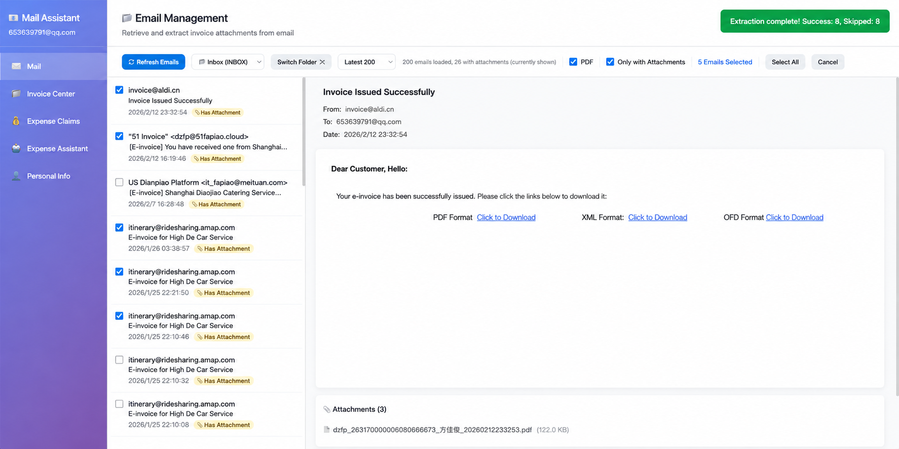
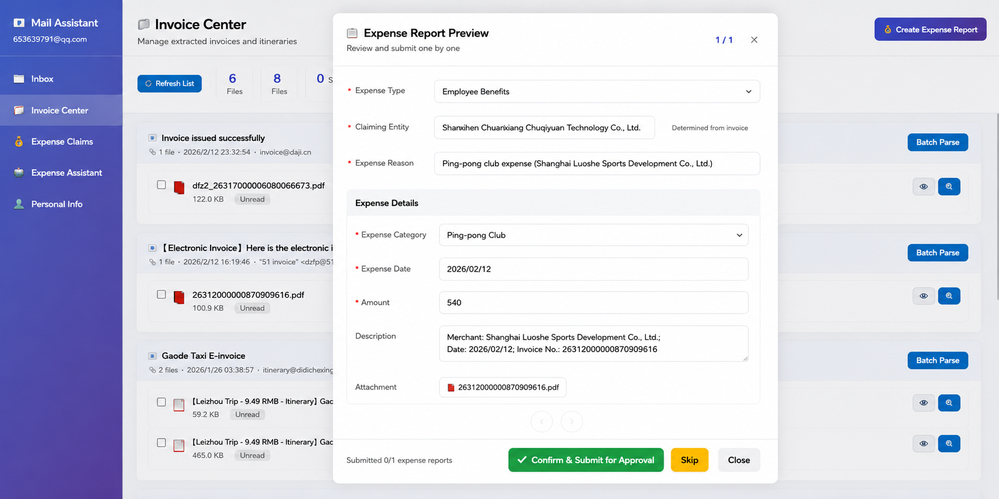
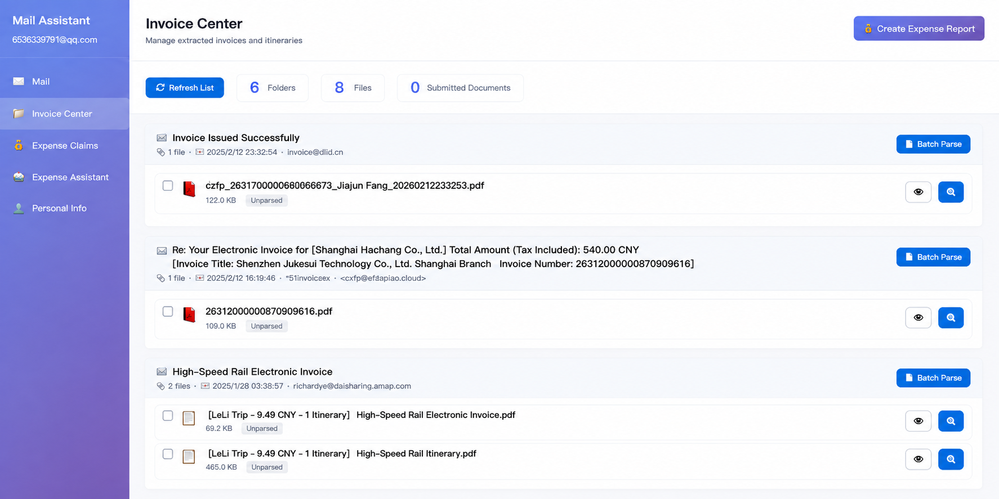
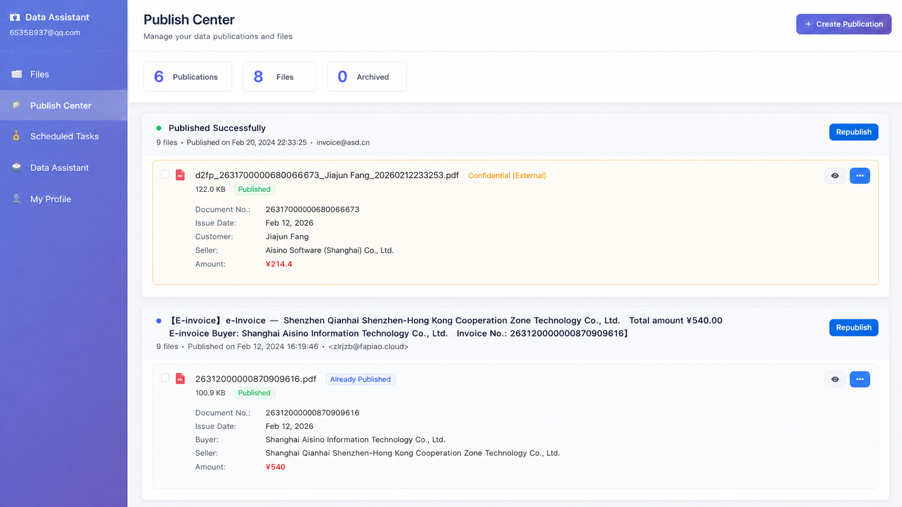
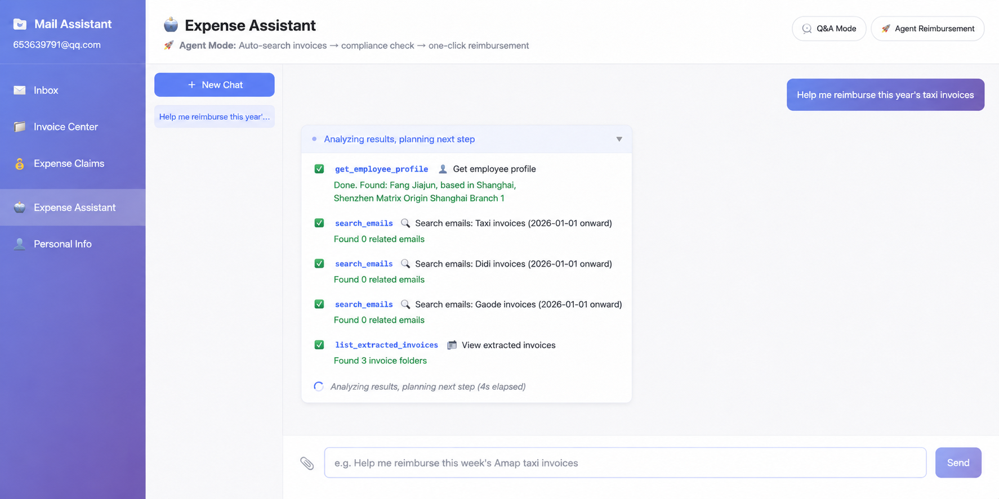

# MOI Practice Vol. 1: I Used AI to Cut Employee Reimbursement from 1 Hour to 5 Minutes

At the end of every month, the same scene plays out in the office:

Sighs rise from desks. Colleagues are repeating the "sacred" reimbursement ritual again: open the mailbox, search through piles of emails for electronic invoices, download them, open them, and then type invoice numbers, amounts, and dates into the reimbursement system character by character.

If it is a taxi invoice, congratulations, the difficulty doubles. You also need to find the corresponding itinerary, compare the amount and locations as if playing spot-the-difference, then quickly search your memory for the reimbursement policy and decide whether the expense should be classified as "local transportation" or "business travel."

For colleagues who travel frequently, completing this whole "ritual" can take long enough for a cup of coffee to go cold. An hour is gone.

The most frustrating part is that you know it will all happen again next month.

---

## Part 1

### How Painful Can Reimbursement Really Be?

**Scenario 1: A dizzying "number game"**
You stare at a PDF invoice and type a long invoice number into the system, afraid of mistyping a single digit. Then you align the decimal point in the amount and check it again and again. After dozens of invoices, your eyes are tired.

**Scenario 2: A test of memory**
"Was this taxi fare to the airport for a business trip or a team-building activity?" "Was this catering invoice for client entertainment or a department meal?" You have to force yourself to remember what happened weeks ago. Every judgment is a small mental burden.

**Scenario 3: An endless loop**
You finally finish filling in all the documents and submit them. Two days later, Finance rejects your application: "Zhang San, the amount on this invoice does not match the itinerary." So the entire process above starts again from scratch.

Reimbursement, a seemingly simple matter, is like a tiny black hole, consuming everyone's time and patience day after day.

---

## Part 2

### What Is the Essence of the Problem?

The pain of reimbursement is not in "filling things in." It is in "finding" and "judging."

- **Finding**: Locate the correct invoices and itineraries from dozens or even hundreds of emails.
- **Judging**: Determine the category of each expense and make sure it complies with complex company reimbursement rules.

In essence, this is highly repetitive physical work with clear rules, but it is extremely tedious. And this is exactly the kind of work AI is best suited to take over.

In the past, machines could not understand invoices inside PDFs and images, and that bottleneck blocked every automation attempt. Now, however, multimodal large models can directly "read" these files, with accuracy that can even exceed tired human eyes.

The technical door is already open.

---

## Part 3

### Our Attempt: Building a "Reimbursement Assistant"

Based on this judgment, we developed an intelligent reimbursement system.

The core idea is simple: hand all repetitive work to AI, and let people only perform the final "confirm" action.

The system consists of four modules:

1. **Batch email extraction**
   Connect to QQ Mail through the IMAP protocol, batch download all emails containing PDF, OFD, or XML attachments with one click, automatically store them by email group, and preserve complete email metadata. Extracting all attachments from one email takes less than 1 second.
   

2. **AI invoice parsing**
   Call SiliconFlow's Qwen3-VL-32B-Instruct multimodal model to recognize each invoice or itinerary. The system automatically determines the document type (invoice or itinerary) and extracts the corresponding fields. For taxi itineraries, it can also parse the start point, endpoint, time, and amount of each trip segment. Parsed results are persistently stored so the API is not called repeatedly.
   

3. **Intelligent classification and matching**

- Taxi invoice + same-city trip -> local transportation expense
- Taxi invoice + cross-city trip -> business travel expense
- Seller name contains keywords such as "fitness" or "sports" -> employee benefits
- Taxi invoices must be matched with itineraries; neither can be missing (compliance validation)

All judgments are completed automatically, with no need for users to manually select categories.

4. **Reimbursement Assistant Agent**
   This is the "smartest" part of the entire system. Users only need to say one sentence in the chat box: "Help me reimburse my recent Amap taxi invoices."

The Agent automatically executes: search emails -> extract attachments -> AI parsing -> compliance validation -> generate reimbursement drafts. Finally, it presents each reimbursement form in a carousel pop-up, waiting for the user to confirm and submit them one by one.

---

## Part 4

### How Effective Is It?

The numbers are the most direct.

| Metric | Traditional Method | System Processing | Improvement |
| ------ | ------------------ | ----------------- | ----------- |
| Complete one month-end reimbursement batch | 45-60 minutes | 5-8 minutes | Saves 85%+ |
| Operation steps | 20+ steps | 5 steps | Simplified by 75% |
| Invoice information entry accuracy | Around 90% (manual, error-prone) | 95%+ (AI recognition) | Improved by 5%+ |
| Reimbursement type judgment | Manual thinking required every time | Automatic | Zero cognitive burden |

Here is a real scenario:

Product manager Zhang San needs to reimburse 15 expenses at the end of the month, involving 30 files.

- Before: He had to spend 55 minutes in a frustrating afternoon of repeated downloading, copying, and pasting.
- Now: He says one sentence, then clicks "confirm" a few times on the results prepared by the AI assistant. The whole process takes less than 6 minutes.

The most important change is that reimbursement has gone from a "work burden" to an "invisible task."

What used to require setting aside a dedicated block of time can now be completed casually during fragmented time between meetings or while waiting for the elevator. And because AI recognition and rule validation are involved, rejections by Finance caused by manually entering the wrong amount or selecting the wrong category have almost disappeared.

---

## Part 5

### Final Thoughts

After building this small tool, our strongest feeling is that AI's greatest strength is not how "smart" it is, but that it never gets tired.

Asking humans to repeatedly process 100 invoices is painful. Asking AI to do it means every invoice is processed as accurately and quickly as the first one. For repetitive work like this, the value of AI is overwhelming.

Reimbursement is only the beginning. Imagine contract approvals, weekly data reports, meeting-minute organization, and all the other repetitive, rule-based office scenarios that consume our creativity. They can all be transformed with the same idea.

Let AI do the repetitive work that machines are good at, and truly free human time and energy for work that requires thinking, creativity, communication, and real value.
