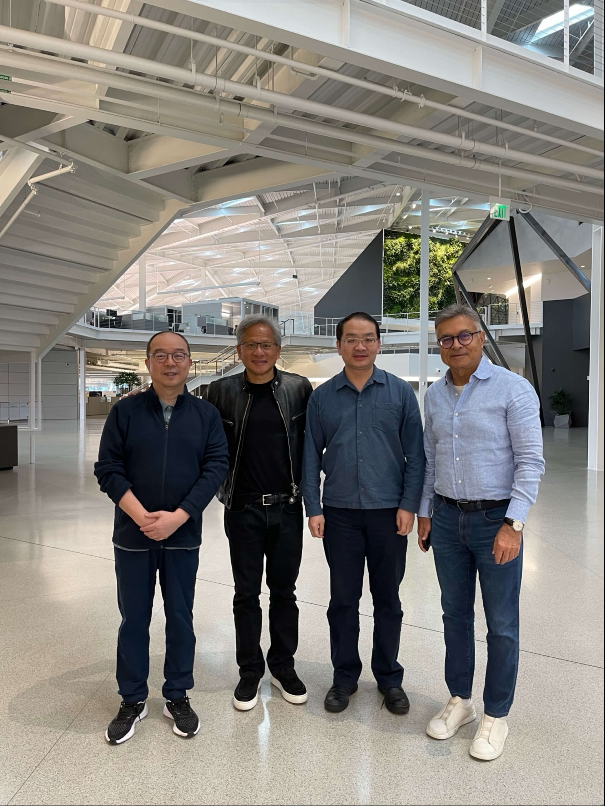
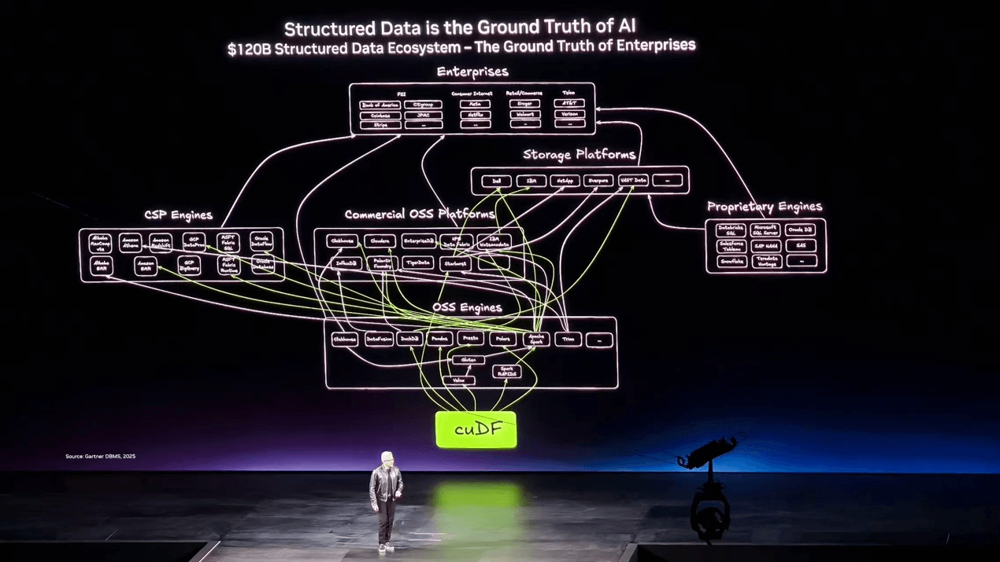
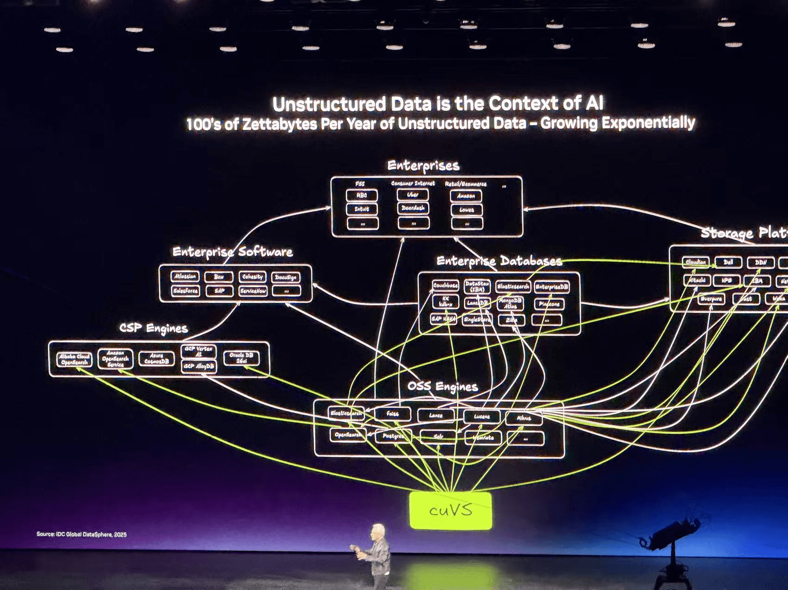
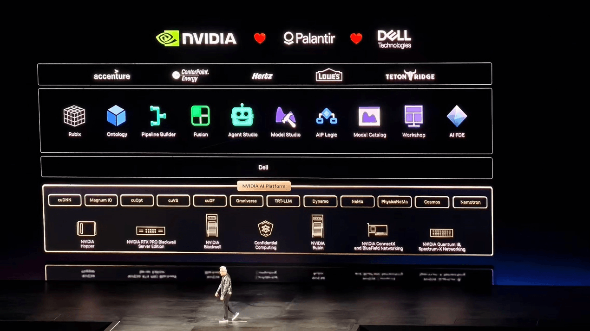

# On the Ground at GTC 2026: What Jensen Huang Spent 20 Minutes Explaining, and Why the AI Data Foundation Matters

Wang Long | CEO of MatrixOrigin, on site at GTC 2026 in San Jose

I have been to GTC many times before. I lived in San Jose for many years and have met Jensen Huang several times. NVIDIA's flagship event has been running for many years, and it has become even more intense in recent years as NVIDIA has been crowned the king of AI. But today was my first time attending on behalf of MatrixOrigin, as a data platform partner in the NVIDIA AI Factory ecosystem. Together with 30,000 people, I listened to Jensen Huang's keynote for more than two hours.

To be honest, the first 20 minutes of the keynote made me extremely excited. **The direction Jensen Huang explained to the world from the main stage was almost exactly aligned with the technology we have been building over the past five years and the problems we have been solving for customers.**

## He Spent 20 Minutes Talking About the Fusion of Structured and Unstructured Data

After taking the stage in his signature leather jacket, Jensen first offered the usual thanks and looked back on CUDA's 20-year history. Then he showed a slide: an architecture diagram densely packed with logos of dozens of data engines, including Apache Spark, Presto, DuckDB, and Polars.

He said these data engines process data frames, which are structured data and the ground truth of business. This is exactly what we have been telling our customers: even in the AI era, structured data remains central because it is the most precise description of an enterprise's current state.

Then he turned to unstructured data. He said that 90% of the world's data is unstructured: PDFs, documents, images, and videos. Enterprises have spent decades collecting and storing this data, and then the story usually stops there, because they cannot index it, query it, or search it effectively.

**But AI changes all of this.**

AI's multimodal capabilities allow machines, for the first time, to "read" a PDF, understand its meaning, and embed it into a structure that can be searched and queried.

Structured data and unstructured data can be combined perfectly: one relies on precise SQL computing engines, while the other relies on the probabilistic engines of Generative AI. Together, they can describe the world more accurately. Structured data is the source of deterministic facts for AI, while unstructured data provides AI with context. Only by combining the two can AI truly solve the problems of accuracy and scenario adaptability in real-world deployment.

## The Fusion of Structured Data and AI Will Repeat Itself Across One Industry After Another

The moment that impressed me most seemed, at first glance, unrelated to data platforms: the release of DLSS 5.

On stage, Jensen demonstrated NVIDIA's new 3D rendering technology. In the past, game rendering relied on ray tracing. It was precise and controllable, but computationally expensive. No matter how much compute was added, CGI still could not completely cross that final gap. DLSS 5 takes a completely different approach: it fuses structured data generated by traditional 3D graphics engines, such as geometry, lighting, and physics simulation, which are the ground truth of virtual worlds, with generative AI models. AI completes the parts of the image that are extremely expensive to render with traditional methods, such as material details, lighting atmosphere, and scene depth. He showed the effect with live gameplay footage from Resident Evil and Hogwarts. The audience was clearly amazed. But what really made me sit up was not the image quality. It was what he said immediately afterward:

**"This concept of fusing structured data with generative AI will repeat itself in one industry after another industry after another industry."**

The fusion of structured data and AI will happen repeatedly across industries. In NVIDIA's gaming scenario, we saw a breakthrough in computer graphics, but in reality this applies to every industry. Its essence is this: AI cannot rely only on large models to "generate." It must be built on the ground truth of structured data. This is true for game rendering, enterprise decision-making, industrial manufacturing, and pharmaceutical R&D. The underlying logic is the same. This is exactly what we are doing today with customers across chip design, industrial manufacturing, transportation, retail, and other sectors.

**Future Agents will need both structured databases and unstructured databases.**

## Why I Could Not Sit Still

When I founded MatrixOrigin in 2021, I had one core judgment: the data infrastructure of the future would not be defined simply by being faster or larger. Its core would be the fusion of structured and unstructured data, and the ability to support future workloads. The development of the industry has gradually confirmed that judgment. Large-scale AI workloads have changed data requirements and reshaped the form of data infrastructure.

Today, Jensen Huang did not explain this as a leader of the data industry, but as the central figure of the AI industry, in front of 30,000 people. Sitting in the audience, I felt that the direction we bet on five years ago has now been truly confirmed by the entire AI industry.

### MatrixOne: The "Ground Truth" Jensen Huang Talked About

MatrixOne is MatrixOrigin's cloud-native hyper-converged database. It is built entirely on a compute-storage separation architecture and supports the management of both structured and unstructured data. It supports OLTP, OLAP, vector, time-series, and search workloads. It is the ground truth of enterprise computing that Jensen pointed to when he showed that densely packed architecture diagram on stage.

But we have taken one critical step beyond that definition: MatrixOne has Git-for-Data capabilities. Data can be branched, snapshotted, and rolled back like code. In the AI Agent era, this is the core infrastructure for Agent memory management. When Jensen talked about Vera Rubin, he repeatedly emphasized that Agents will pound on memory really hard. What Agents need is not an append-only log, but a structured memory system that can branch, trace back, and merge.

https://matrixorigin.cn/matrixone

### MatrixOne Intelligence: Our "AI Data Platform"

When Jensen declared that the AI Data Platform is one of the most important platforms of the future, he was describing exactly what MatrixOrigin has been building.

MatrixOne Intelligence is our AI-native data intelligence platform. Its core idea is to build on MatrixOne and integrate data processing capabilities with AI engines in one platform, enabling AI Agent applications for a wide range of scenarios. At the foundation, we connect the SQL engine for structured data with the RAG engine for unstructured data, and perform fused reasoning inside a single Agent framework.

In the NVIDIA AI Factory architecture, MatrixOne Intelligence is already playing an important role. It allows AI to do more than call a large model to generate text. It enables Agents to query databases directly, connect context, and deliver trustworthy business insights.

https://matrixorigin.cn/matrixone-intelligence

### Memoria: Trusted Memory Infrastructure for Agents

We recently open-sourced Memoria, an Agent memory system positioned as Git for Memory and built on MatrixOne. Jensen said that Agents need high-speed read and write access to KV Cache, structured data, and vector data. This was exactly our core assumption when we designed Memoria: Agent memory needs to be a living system that integrates branch isolation, context snapshots, and semantic retrieval.

https://memoria.matrixorigin.cn/

## What Does It Mean When Dell, IBM, and Oracle All Enter the Field?

In addition to NVIDIA's own announcements, a series of partnerships announced today showed me that industry consensus is forming faster.

Dell released AI Data Platform with NVIDIA, with Michael Dell personally taking the stage and saying it is purpose-built for agentic AI. IBM announced that WatsonX is fully integrated with cuDF acceleration, and Jensen specifically mentioned "IBM, the inventor of SQL." Oracle integrated cuVS into AI Database. Google Cloud integrated cuDF into Dataproc, and Snap used it to reduce daily data processing costs by 76%.

These are not peripheral collaborations. The world's largest IT infrastructure companies are collectively elevating "AI data platform" into a strategic product line. For us, as a company focused on the data foundation within the NVIDIA AI Factory ecosystem, the signal could not be clearer.

## Fusion Is Already Happening at Customer Sites

Jensen's argument is not theoretical. Among our customers, the fusion of structured and unstructured data is already happening every day in real production environments.

At **Jinpan Technology**, the partner presenting with me at GTC today, we are using the full-stack capabilities of NVIDIA AI Enterprise to help build an AI Factory covering production efficiency optimization, quality inspection, and safety management. Every one of these scenarios depends on the fusion of structured MES/ERP data with unstructured industrial vision and document data.

These are not demos. These are systems that are going live and already creating value.

## The Three Things I Most Want to Say Tonight

Walking out of SAP Center, three thoughts kept turning over in my mind:

**First, the data layer has finally moved to center stage.** Over the past two years, everyone has been chasing large models: bigger parameters, stronger reasoning, and longer context. But today, the founder of the world's most influential AI infrastructure company used the opening 20 minutes of a 30,000-person conference to tell everyone that without a good data platform, your Agent can do nothing. For a company deeply focused on data infrastructure, this is strategic confirmation from the highest point of the industry.

**Second, "fusion" is no longer optional.** Structured data is an Agent's working memory. Unstructured data is an Agent's world knowledge. Both are indispensable, and they must be connected inside the same platform. This is the direction we have bet on from day one, and it is also our core value in the NVIDIA AI Factory ecosystem.

**Third, the definition of the database is changing.** It is no longer only a place to store data. In the age of Agentic AI, the database is the Agent's memory system, decision basis, and action support. It needs high-concurrency reads and writes, branch isolation, context snapshots, and semantic retrieval. These capabilities must be built in natively, not assembled from external components.

GTC still has several days to go. This year's AI ecosystem is getting more and more exciting. Industry customers are welcome to find me on site.

Wang Long, CEO of MatrixOrigin, March 17, 2026, on site at GTC 2026 in San Jose
