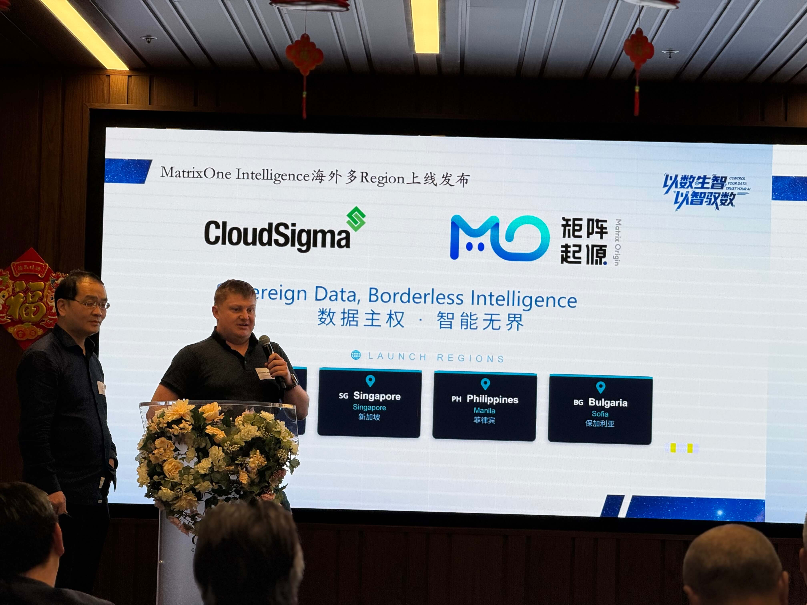
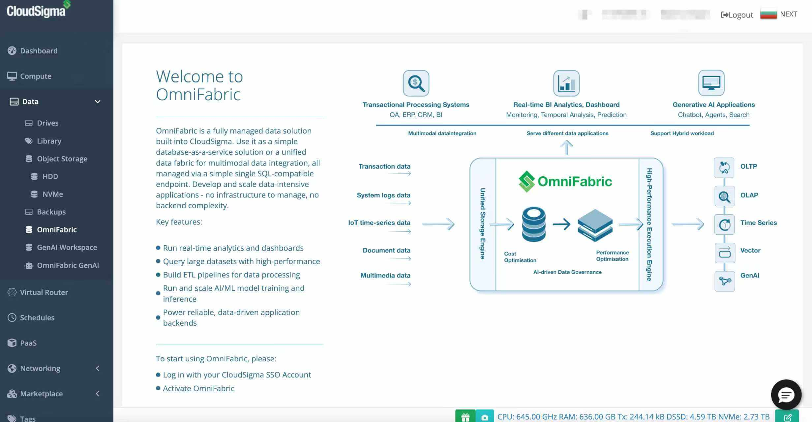

# GTC 2026: MatrixOne Intelligence Officially Launches Across Multiple Overseas Regions, Partnering with CloudSigma to Build the Global Sovereign Cloud DATA + AI Landscape

Data sovereignty, borderless intelligence -- Sovereign Data, Borderless Intelligence

At NVIDIA GTC 2026, MatrixOrigin officially announced that its AI-native multimodal data intelligence platform MatrixOne Intelligence (MOI) has completed deployment across multiple overseas regions, and has reached a strategic partnership with CloudSigma, a global sovereign cloud infrastructure provider. CloudSigma CEO Robert Jenkin attended the event in person and joined the MatrixOrigin team to unveil this milestone release.

This is the first time MatrixOrigin has announced overseas product implementation progress at a top global AI technology conference. It marks MOI's official move from China to the international market, becoming a new force in the global AI infrastructure landscape.

## MatrixOrigin x CloudSigma: When Sovereign Cloud Meets DATA + AI

Founded in 2009 and headquartered in Zurich, Switzerland, CloudSigma is a pioneer in the global Sovereign Cloud field. Its unique Cloud-as-a-Service (CaaS) model enables local service providers in different countries to quickly deploy sovereign cloud services independent of hyperscale cloud vendors on infrastructure within their own countries. It has established cloud nodes in more than 15 countries and regions worldwide, covering Europe, the Middle East, Asia-Pacific, and the Americas.

MatrixOrigin's MatrixOne Intelligence is a new-generation AI-native data intelligence platform built on its self-developed cloud-native hyper-converged database MatrixOne. MOI's core philosophy is "use AI to process data, and use data to support AI." Through an integrated data foundation, it transforms structured, semi-structured, and unstructured data scattered across enterprises into high-quality assets that AI can directly consume, supporting implementation across various AI Agent scenarios.

CloudSigma provides global sovereign cloud infrastructure, while MatrixOne Intelligence provides AI-native data intelligence capabilities. Their combination allows enterprises to obtain world-class DATA + AI platform services while keeping data within national borders.

In this release, MOI first launched in four overseas regions under the independent brand name OmniFabric:

- **Saudi Arabia (Riyadh and Jeddah)**: Covers core Middle East markets and responds to strong demand in the Gulf region for data localization and AI implementation.
- **Singapore**: An Asia-Pacific data hub serving Southeast Asia and broader APAC customers.
- **Philippines (Manila)**: Deeply serves Southeast Asia's emerging digital economy and provides low-latency localized services.
- **Bulgaria (Sofia)**: Reaches Central and Eastern European markets and is also where CloudSigma's technology R&D center is located.

## MOI Overseas Version: Core Capabilities at a Glance

MatrixOne Intelligence deployed in overseas regions provides the same core capabilities as the domestic version, including:

**Unified data foundation**: Based on the MatrixOne hyper-converged database, it natively supports OLTP, OLAP, vector retrieval, and full-text indexing. One engine handles all types of data workloads, eliminating the O&M complexity of multiple systems.

**AI-driven intelligent data pipeline**: Through MatrixPipeline, it automatically completes access, cleaning, governance, annotation, and enhancement for multi-source heterogeneous data, rapidly transforming raw data into AI-Ready assets.

**Multimodal intelligent application platform**: Built-in MatrixCopilot supports out-of-the-box AI capabilities such as multimodal hybrid search, ChatBI, and intelligent Q&A. It also provides an Agent workshop, enabling enterprises to quickly build customized intelligent applications.

**End-to-end trusted data chain**: Through data lineage tracking and quality evaluation mechanisms, it ensures the trustworthiness and explainability of AI application outputs.

**Elastic cloud-native architecture**: Based on containers and a storage-compute separation architecture, it offers strong elastic scalability while combining agility and cost-effectiveness.

## A New DATA + AI Paradigm in the Data Sovereignty Era

Globally, we are witnessing an important trend accelerating: **data sovereignty and AI application implementation are no longer two separate issues, but two sides of the same coin.**

For enterprises to truly realize the value of AI, they must develop and apply AI based on their own high-quality private-domain data. Meanwhile, increasingly strict data protection regulations across countries, whether the EU's GDPR, Saudi Arabia's PDPL, or the Philippines' Data Privacy Act, require data to be stored and processed locally.

This is the deeper logic behind the cooperation between MatrixOne Intelligence and CloudSigma: **It is not simply about deploying a product on overseas servers, but about building a true "local data, local intelligence" solution, where data does not leave the country and AI capabilities are not compromised.**
