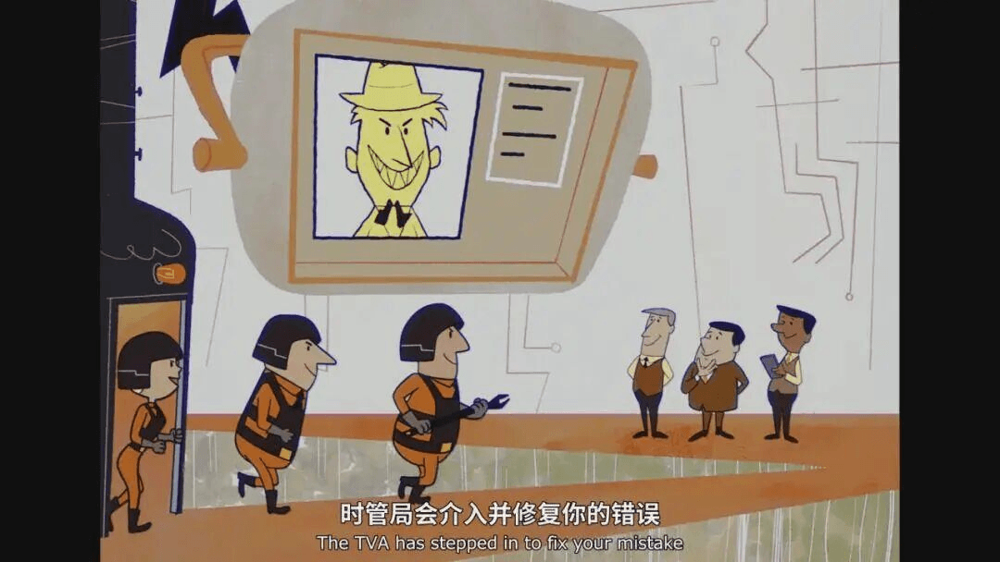

# Multiverse and Time Variance Authority: A Conversation with MatrixOrigin CEO Wang Long on Another Possibility for AI Implementation

At the start of the interview, the interviewee was on his way to the airport.

As the founder of an AI data company spanning China and the United States, Wang Long flies across the Pacific several times a year. His previous experience as an executive in Silicon Valley and at Chinese cloud vendors also gives him a clear view of the latest developments in both AI communities.

So, during one spare hour, we talked about several of today's hottest topics: OpenClaw, AI anxiety, and the "SaaS doomsday theory."

When 10 trillion OpenClaw agents begin to collaborate, will AI give birth to its own multiverse and Time Variance Authority?

You are also welcome to try Memoria, the trusted AI Agent memory framework they just open-sourced at GTC 2026: https://github.com/matrixorigin/Memoria

---

## Part 1: Why Has the OpenClaw Craze Not Appeared in the United States?

**Xianfeng**: Why has the United States not seen the same OpenClaw craze? Is it because Chinese users have stronger AI anxiety?

**Wang Long**: It is not that there is no OpenClaw enthusiasm in the United States. It is just not as intense as in China, where even homemakers and retirees are talking about "raising crawfish."

I think the main reasons are cultural differences and differences in the technology ecosystem.

The U.S. technology community is more concentrated, and its understanding of technology has more continuity. In Silicon Valley culture, professionals and technical experts are highly respected, even worshipped enthusiastically, but that worship is usually limited to their own fields. Non-technical people do not pay much attention to technical discussions or participate heavily in them.

The development of AI tools is a gradual and iterative process. In fact, as early as 2024 and 2025, the key technologies supporting OpenClaw had already emerged and developed rapidly, including tool use and function calling, planning and reflection, memory persistence, and long-horizon tasks. OpenClaw's real value is that it combines these AI capabilities and integrates them, through a message gateway, with the entry points people use in daily work and life, such as Telegram and WhatsApp. This greatly lowers the barrier to using AI on the desktop.

So not long after it appeared last November, the mainstream U.S. technology community, including us, noticed it and found it useful and inspiring. But OpenClaw did not spread beyond the technology circle in the United States.

The situation in China is completely different. To put it sharply, China lacks original AI technology opinion leaders. Many technical innovations are hyped through self-media following overseas trends. Most self-media accounts optimize for traffic, lack technical depth, and can only repeat what others say, amplifying emotions and creating topics. On the one hand, this makes it easier to break out of the technical circle. On the other hand, it can create many potential security problems. This nationwide craze has given many people the illusion that the technology appeared out of nowhere overnight, which makes the experience on the two sides completely different.

In any case, both in China and abroad, AI anxiety does reflect a social mood. K-shaped recovery is a global phenomenon. Today, Silicon Valley is also seeing widespread salary cuts and layoffs. People's lived experience is generally trending downward. Ordinary people cannot see other paths forward, so they need something to place hope in, and AI undoubtedly plays that role.

From a capital perspective, both China and the United States have invested large amounts of money in AI infrastructure, and that money eventually needs returns. If an AI application appears at this moment, lowers the usage threshold, allows ordinary people to participate, and brings endless room for capital imagination, naturally a group of people will rush in with FOMO.

OpenClaw fits these two currents perfectly and finds their greatest common denominator.

From a technical perspective, I do not think OpenClaw has any great technological innovation. It may not bring much practical value to ordinary people at this stage. In the technology community, we know very clearly where its capability boundaries are.

But from a business model perspective, OpenClaw has indeed created more possibilities. It lowers the threshold for ordinary people to participate in technology and further democratizes technology. Liberal arts students appearing on open-source project rankings is proof of that. Based on historical experience, many unexpected model innovations come from cross-industry participation. Let us wait and see.

So I hold a neutral view on the overheating of OpenClaw. In reality, it does have many problems, but from a social perspective, exploration is still worth encouraging.

**Xianfeng**: Many people joke that OpenClaw is essentially a large Trojan horse, except you install it voluntarily. How do you think its security should be solved in the future?

**Wang Long**: At this stage, there is no good solution. If you give it too few permissions, OpenClaw cannot do much. If you give it too many permissions, the risks are very high.

There is an interesting phenomenon: almost nobody uses Doubao Phone, but OpenClaw has gone viral. I think the main reason is that the computer is not the most core carrier of private data today and is relatively less sensitive. But if people were asked to hand over phone permissions to AI, most would instinctively hesitate. Of course, because OpenClaw usually operates the computer through backend CLI or APIs, people can also underestimate its security risks.

Essentially, the first batch of OpenClaw users are taking various data security risks in exchange for improved work efficiency. Personally, I believe judging whether OpenClaw is safe requires people who understand basic technical principles to make different tradeoffs depending on the scenario.

What is clear is that OpenClaw can handle many offline tasks. For example, when you are sleeping or cannot operate the computer, you can let it perform long-chain work. Which tasks require long offline operation and are more convenient on a computer?

One is complex analysis, processing, and organization of multi-source content, such as self-media or intelligence. Another is AI programming. In both cases, OpenClaw's value is obvious.

These two scenarios either do not require extremely high accuracy, or they have efficient evaluation and verification mechanisms that AI can integrate with, such as compilation, execution, tests, clear success or failure signals, and accurate logs.

But for most mobile scenarios, such as asking OpenClaw to call a ride, the task is simple and real-time. A few taps on a phone can finish it, so there is no need to use OpenClaw. As for organizing email folders, a single Agent can also do it.

**Xianfeng**: There is an interesting analogy: OpenClaw is like the early Warcraft editor. Ordinary people could use it to build a simple game and get a strong sense of achievement, but once they posted it to a gaming community, experts would immediately surpass them. After Chenghai 3C and Dota appeared, individual development became less meaningful.

Many social experiments point to the same result: although we all emphasize individuality, people's behavior is actually quite convergent. From this perspective, will future AI tools also become standardized and modularized?

**Wang Long**: OpenClaw offers one possibility for AI applications to land on the desktop. In the 1990s, the first desktop applications such as Office and games drove the adoption of PCs and Windows. OpenClaw may also become the Office or game of the AI era: if you install a computer, you need it. Of course, whether future OpenClaw will look different is hard to say.

On standardization, I am relatively cautious. Based on more than ten years of experience in the AI industry, one of AI's core advantages is that it can provide better personalized services. Rigidly pursuing standardization is laborious, ineffective, and against the direction of the era. We need another way to work with AI. This is also the product philosophy we have been exploring and practicing for years.

Google Brain founder Jeff Dean recently gave an interview titled "In the Era of Probabilistic Execution Agents, Infra Must Be Reshaped." I think he explained it very well: the entire AI industry is actually not ready yet.

For the past 50 years, the entire digital world has been built on determinism. If you buy a GPU, its compute power is already determined at the moment of purchase, and all performance parameters are quantifiable. Software is similar. Oracle's biggest selling point is that it can provide stable servers. Once your data is in its database, it is assumed or expected that it will never go wrong.

In other words, we have always hoped to build an indestructible, 100% reliable system through redundancy and fault-tolerance mechanisms. That was the pursuit of all previous IT architectures, and it also matches the human instinctive need for control.

But everything is different in the AI era. The Transformer architecture is essentially a probabilistic model, and its outputs extend from statistics and probability. This means AI is inherently uncertain and probabilistic.

Of course, you can call this hallucination, but fundamentally it is not a technical defect. It is a core characteristic of AI. If we continue to make determinism the goal, AI may never become reliable.

Some Agent products that exploded this year, such as OpenClaw, are still concentrated in consumer products. The reason is simple: in consumer scenarios, risks are borne by individuals, like drawing cards or playing games, where users pay for emotional value. As individuals, we are willing to tolerate AI uncertainty. Enterprises are different. Their most valuable core processes cannot bear this uncertainty. Even if they can accept it, the multiplicative effect of single-step task accuracy in long-chain tasks can cause exponential growth in Token consumption.

So the problem facing enterprise AI practitioners today is how to build a new IT architecture with uncertainty. If we still use the old way of thinking to imagine future software, we are very likely destined to fail.

I agree with Jeff on this point, though he expressed it better than I can. In fact, this has been the focus of my thinking and work over the past two years.

---

## Part 2: Multiverse and Time Variance Authority: When 100,000 OpenClaw Agents Begin to Collaborate

**Xianfeng**: That smoothly leads us to your product. MatrixOrigin's core technology is called an "AI-native hyper-converged data foundation." Can you describe it in one sentence?

**Wang Long**: We usually have two versions. For non-technical audiences, I say we are building the data foundation for the future of trillion-scale Agents, supporting a new paradigm for AI application development. For technical audiences, I say we are an AI-native multimodal data intelligence platform, MatrixOne Intelligence, integrating storage, compute, and AI capabilities in one system while supporting structured, semi-structured, and unstructured data management, as well as HTAP, streaming, vector, and time-series workloads.

**Xianfeng**: I also asked several AIs to create analogies for your product, and got these answers. Which one do you think is more accurate?

1. Central kitchen: washing, cutting, and processing ingredients in one place, then delivering them to the AI chef
2. Swiss Army knife: one tool for all scenarios
3. Transformer: one vehicle that can become a sedan, truck, bus, sports car, or armored vehicle
4. Smart storage cabinet: unified scheduling and intelligent allocation
5. Shared delivery station: flexible allocation across public cloud, distributed cloud, and edge nodes

**Wang Long**: I think they are all right. They just look at the same thing from different angles and scenarios. In traditional application scenarios, when comparing with other databases, I often say we want to become the iPhone of the database field.

But for Agent development scenarios in today's AI era, my favorite analogy is a management platform for the "multiverse."

Returning to Jeff Dean's article, how do we ensure that probabilistically executing Agents can provide satisfactory decisions? One solution is to try multiple times and find the best answer through competition or voting. Another solution is to make sure every task is traceable, branchable, recoverable, and retryable, so the system can gradually approach the perfect answer without catastrophic consequences.

An Agent's capabilities and performance today are largely determined by the base model plus context. Systems of record (SoR), knowledge bases and memory, prompts, and perhaps chains of thought together form the Agent's core context. In other words, MatrixOne Intelligence, which can natively manage and use context in one place, could become the AI-native foundation for Agent development if it supports these two solution paths. This may be the new IT architecture Jeff Dean was talking about.

Can we, for one request, use 10,000 AIs, ask each AI 10,000 times, and then pick the best answer from all the answers, or let those 10,000 AIs vote for the optimal answer? Finally, we keep the context, or data, on MOI that produced the best answer and discard the other contexts.

Or can we, for one request, have 10,000 AIs execute tasks sequentially, snapshot the current state each time, and then use the first method to find the best next step? If the result is unsatisfactory, we roll back and retry until we are satisfied, then merge.

Traditional systems obviously cannot support this requirement, at least not in terms of cost and time. A new era requires a new system that can record the context corresponding to every result at low cost, high performance, and low latency, and finally select the best one. This is the core idea behind our AI-native MOI platform.

**Xianfeng**: That sounds a bit like Doctor Strange, who saw 14,000,605 possible endings and chose the only one that could win.

**Wang Long**: Yes. If we imagine each Agent and each execution result as a universe, every execution creates a new universe. Context management on MOI is the process of choosing the universe that best fits the current need. Every branch creates a new timeline. Every merge is meant to make the world on the main timeline better.

For example, we have a customer, a major domestic chip company with 20,000 employees. These employees generate all kinds of complex documents every day, such as drawings, tables, and PDFs. The enterprise's requirement is to use AI to identify and organize these documents, automatically generate new documents, and then distribute them downstream.

The problem is that people understand the same document differently in different scenarios. Even within the same scenario, different users, such as design, production, or human resources teams, have different needs for the document. In theory, AI should generate personalized results for each person's needs. That is where its value lies.

But a company with 20,000 employees cannot have AI start from zero and process all documents for every new employee. The cost would be too high. Our approach is to branch across the processing chain, like a multiverse. When a new user comes in, we decide, based on their situation and use case, whether to branch and from which node.

If the new branch is useful, we keep it. If it is similar to another branch, we merge it. If someone thinks the branch is useless, we can delete it. We call this Git for Data, Git for Memory, or Git for State.

Taking one step further, imagine a future enterprise with 1,000 employees, each with 100 AI Agent assistants, or 100 OpenClaw agents. This will inevitably create a massive amount of interaction and execution among Agents. In that case, the "multiverse" grows by several more orders of magnitude.

Look at today's Agent communities. Ninety-nine percent of AI-to-AI conversations are meaningless chatter that is useless to the human world. Using a company analogy, it is equivalent to all AI employees being left unmanaged, creating enormous waste. If every Agent behavior and every operation can be recorded, audited, and rolled back, then the Agent community can evolve in the way we need.

**Xianfeng**: So you provide a management tool for AI employees, and no matter which AI wins in the end, you can help users solve data-related problems?

**Wang Long**: Yes. We cannot directly evaluate which AI is best or which result is correct. That requires users to provide verifiable evaluation standards. What we can do is control all possibilities accurately when AI creates 10,000 possibilities, at the lowest cost and fastest speed.

If you have watched Marvel's series Loki, the role we hope to play is the "Time Variance Authority."

Its responsibility is to monitor timelines, detect branch timelines, fix variances, and delete timelines that should not exist.

For All Time. Always.

Image: still from Marvel Studios' Loki

---

## Part 3: AGI, Which Consensus Is Converging?

**Xianfeng**: But platform products like yours are exactly what major companies care about most. If you succeed, will the major companies resist you or copy you?

**Wang Long**: Once your business crosses into a major company's territory, they will definitely respond, either by acquiring you or copying you. That is inevitable.

In our field, major companies such as Snowflake and Databricks have acquired many startups, mainly for two reasons. First, they are filling gaps in their data storage and compute capabilities so they can cover more scenarios. Second, they are adding more capabilities to support AI training, inference, and Agents so they will not fall behind in future scenarios.

Many founders therefore look for niche areas that major companies do not care about or are unwilling to invest in, because large companies have high OKR requirements and high opportunity costs, so they are less likely to enter very small fields.

But from the beginning, we chose a different path. We need to endure loneliness better than large companies, take more risk, lay out the long-term direction earlier, and use time to exchange for future development space.

If, several years from now, the trillion-Agent future we assume really appears, large companies can copy and catch up, but we will already have spent six or seven years thinking and refining on this path. The rich experience accumulated in real scenarios, together with the knowledge, models, products, and even Agents we build, will become our competitive barriers.

**Xianfeng**: What do you think of the current AI panic in Silicon Valley? Will AI completely replace SaaS in the future?

**Wang Long**: I think it depends on the type. Pure tool-based SaaS products with no stickiness will basically die. For example, image editing: you can just throw the image to AI. Or some intelligence systems based on public data: with enough money and compute, enterprises can build them themselves and do not need SaaS.

But SaaS products that own customer and user data will exist for a long time, because that data is essentially the selected universe in the multiverse. It records information about the physical world and is the interface between the digital world and the physical world. This interface will always exist, and its value will not disappear.

If you train an AI that has nothing to do with the physical world, what are you training it for? It can only play games.

**Xianfeng**: What consensus has formed in AI this year, and what cognitive changes have you seen?

**Wang Long**: One obvious change this year is that debate over whether AGI can be achieved has decreased significantly.

Last July and August, people were still actively debating whether AGI was possible. Now an important shift is that people are gradually realizing the definition of AGI itself may be hard to unify, and uncertainty itself will persist for a long time. The industry has moved from trying to reach a single agreement to accepting divergence and multiple paths.

At the same time, different vendors are proposing their own understandings and standards. Different technical paths, capability boundaries, and application scenarios all lead to different interpretations of AGI. To some extent, this is no longer just a technical question. It is more like a philosophical question.

However, with key advances such as OpenClaw, the industry as a whole has become more optimistic that AGI can be achieved. In many scenarios, the disagreement is no longer "whether it can happen," but "how long it will take": some say five years, some say ten, and some say twenty. But the broad direction is relatively clear.

On top of this consensus, people are also gradually forming judgments about future enterprise forms. More and more people believe that enterprises will have large numbers of "Agent employees." They will no longer be just tools, but will become part of the organization, take on specific responsibilities, and become indispensable components of enterprise operations.

Of course, from a technical perspective, key uncertainties remain. For example, is the Transformer architecture that large models rely on the ultimate path to AGI? This is currently hard to answer. It is no longer only an engineering question. It touches deeper cognition: how the human brain works, what intelligence is, and whether machines must imitate humans to achieve intelligence. These questions still do not have clear answers.

---

## Part 4: "In the Future, All Investors Will Be Angel Investors"

**Xianfeng**: Has the AI Infra field where MatrixOrigin operates reached consensus on its future direction?

**Wang Long**: I think Jeff's sentence is very important: we are actually not ready at all.

At least in data-related AI Infra, there are two big questions we have not answered. First, what will the future work model look like for thousands or tens of thousands of people and AIs working together inside AI-native enterprises? Second, will the AI Infra supporting these Agents be fundamentally different from the past?

MatrixOrigin has its own assumptions and firm belief about the future: there will definitely be trillions of Agents collaborating in the future. Our products have always been designed and innovated around that future.

The number of Agents today is still very small. An ordinary user may use only one or two AI tools in daily life, so our core value has not yet been maximized. But if AI-native enterprises really become reality as we assume, and thousands or tens of thousands of Agents begin communicating and collaborating with one another to form a complex system, that will become our biggest opportunity.

To be honest, I do not know when that era will arrive. Autonomous driving was already proposed in 2014, but today the best systems are still only around L4. AI development is similar. Agents inside enterprises today are roughly around L2.

But we are willing to endure loneliness and take risks while waiting for that scenario to arrive. Entrepreneurship cannot wait until the path is completely clear before entering.

**Xianfeng**: What advice do you have for AI Infra investors?

**Wang Long**: I can offer a relatively aggressive judgment here: future enterprise financing may often stop at the angel round. In other words, all investors may become "angel investors." AI will greatly accelerate business cycles. One or a few geniuses with a group of AIs may be able to plan and develop at ten or even a hundred times the previous speed.

In this situation, after taking the first sum of money, many companies may no longer need multiple rounds of financing, or may no longer be willing to raise more money, and can go directly toward IPO. The recently popular concept of the OPC, or one-person company, comes from this. On the other hand, I do not believe everyone can build an OPC. The risks of entrepreneurship have not decreased just because iteration has accelerated, and the success rate of entrepreneurship will not necessarily increase because AI is involved.

From this perspective, investors unwilling to take risks may find it increasingly difficult to access opportunities in the future. AI is developing too fast. By the time you think a project is "already reliable and not very risky," it may no longer be your turn to participate. The meaning of "risk" in venture capital is very different from before.

In an uncertain era, building infrastructure for uncertainty in advance is a certain opportunity. The angel-investing habit of investing in uncertainty, investing in non-consensus, and investing in founding teams may gradually become the new consensus for all primary-market investment.
