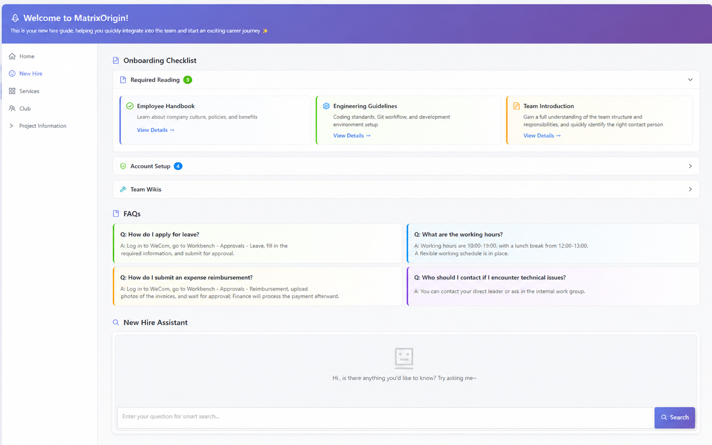
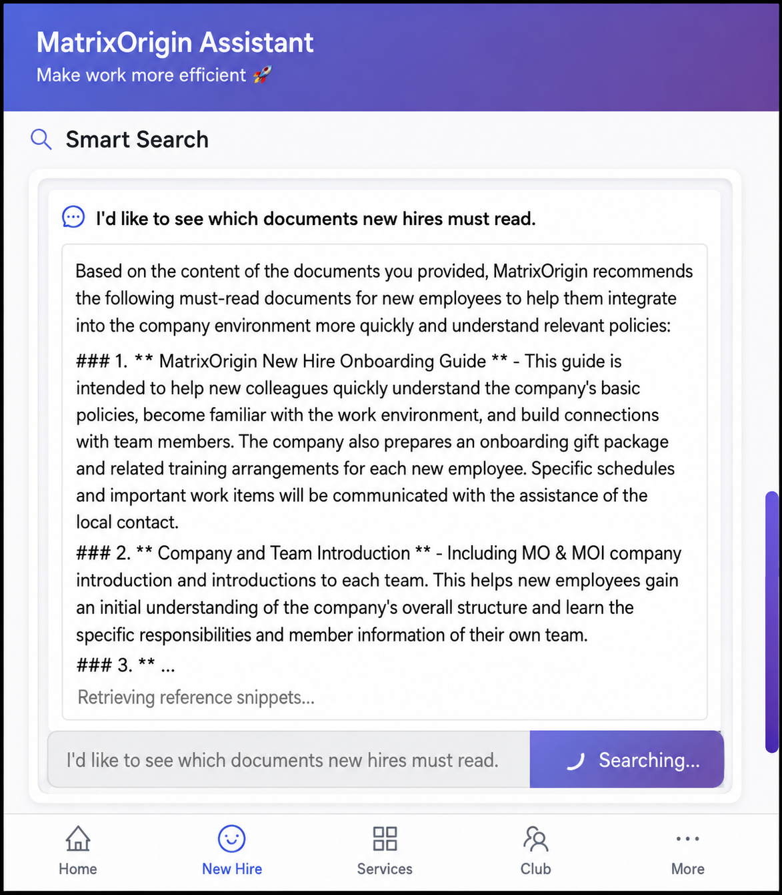

# [MOI Practice Vol.3] Those Messy Documents Sitting in Your Cloud Drive Finally Have a Job to Do

How many "existing but impossible to find" documents are in your company?

Product manuals, operation guides, rules and policies, project retrospectives, meeting minutes... each one was carefully organized by someone. But in reality, the pattern is often the same: save it after writing it, and then nobody opens it again.

It is not that nobody needs it. It is that finding it is too troublesome. Formats are messy, locations are scattered, and sometimes finding a document takes longer than just asking a colleague again.

We had the same problem internally. So recently we built a small tool based on MOI, and it works pretty well. Here is a quick share.

## Can "Just Add an AI Q&A Bot" Solve It?

When faced with this situation, many companies' first reaction is to connect an AI bot and let people ask questions directly.

The idea is good, but in practice there are often several problems:

- **The answers are not trustworthy.** The bot gives an answer, but who knows if it is making things up? Especially for sensitive topics such as reimbursement standards and approval workflows, people do not dare to follow it directly and still have to check the documents themselves. That means the question was basically pointless.
- **It is picky about format.** Enterprise knowledge is not just text. It also includes process diagrams in PPTs, data tables in Excel, scanned copies, screenshots, and meeting recordings. Most bots can only handle well-structured text. They cannot read these "non-standard" contents.
- **Information gets outdated.** Policies are updated, but the bot is still answering with old versions. Employees follow the "official" answer and get rejected, which creates even more trouble.

The root cause of these problems is that the data was never really handled properly. The bot is just a shell, and the underlying data is still a mess.

## We Chose a Different Approach

Based on MOI's data foundation capabilities, we unified the scattered materials, whether PDFs, Word, PPTs, or structured data in systems, and processed and organized them into a knowledge base that AI can truly understand and search.

Then we built an entry point in Enterprise WeCom called "Matrix Work Assistant," so everyone can ask questions directly in natural language.

## What Is Different When You Use It?

### Answers Are Traceable

If you ask "What is the travel allowance standard?", the assistant does not only give an answer. It also tells you that the answer comes from Chapter 3 of the Travel Expense Management Regulations v2.1. You can click through to see the original text and feel confident.

### Any Format Works

If you want to find retrospectives for a project, you do not need to care whether they are in PPT, Word, or a spreadsheet. As long as they are in the knowledge base, they can be retrieved.

### Data Syncs Automatically

When source documents are updated, the knowledge base updates automatically. There is no situation where the bot is still answering questions based on last year's policy.

We also integrated some high-frequency entry points: new employee guides, commonly used system links, and company announcements. One entry point means fewer system switches.

## A Bit of Reflection

The biggest change after using it is that people started trusting the tool.

In the past, people would still need to verify AI answers after asking. Now the answers have sources and can be verified, so the first reaction when encountering a problem is "let me ask the assistant first." Those sleeping documents finally started to be used.

And the most time-consuming parts, "finding materials" and "answering questions," can now be saved for more valuable work.

## Final Notes

Every enterprise has its own data silos: documents scattered in different formats and places, carrying the knowledge and experience of the organization, but left idle because they were not handled properly.

The problem is not whether to adopt AI. The problem is whether AI's data foundation is strong enough. Without a solid foundation, even the strongest model is just "sounding serious while talking nonsense."

If these sleeping data can be activated and turned into a trustworthy, always-available knowledge base for conversation, how much time will the team free up?

How much time does your team spend finding materials? Feel free to reach out and talk.
