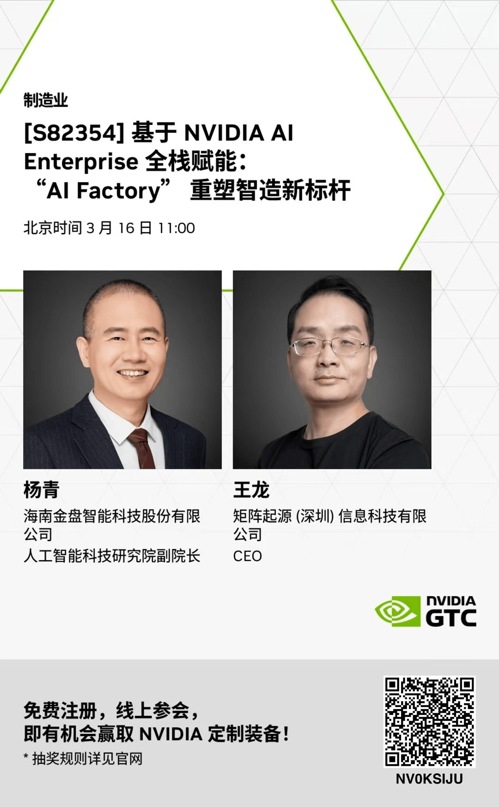

# MatrixOrigin Appears at NVIDIA GTC 2026, Joining Jinpan Technology to Reveal the Full-Stack Enablement Path for AI Factory

On March 16, 2026 at 11:00, MatrixOrigin CEO Wang Long will appear at NVIDIA GTC 2026 together with Yang Qing, Deputy Dean of Jinpan Technology's Artificial Intelligence Technology Research Institute, and deliver an exciting keynote: **"Full-Stack Enablement Based on NVIDIA AI Enterprise: AI Factory Reshapes a New Benchmark for Intelligent Manufacturing."**

This session will officially begin at 11:00 Beijing time on March 16. It will focus on the core pain points of intelligent transformation in manufacturing and provide an in-depth analysis of how to build an efficient and scalable "AI Factory" based on NVIDIA AI Enterprise's full-stack technical capabilities, injecting new momentum into intelligent manufacturing.

Key highlights:

- Technical depth: Reveal how MatrixOrigin deeply integrates the NVIDIA technology stack to build a high-performance, highly available AI data foundation for customers.
- Implementation practice: Dissect on site how "AI Factory" reshapes Jinpan's intelligent manufacturing processes and realizes closed-loop transformation from data to intelligent productivity.
- Future trends: Discuss the underlying foundation support and innovation paths for large-scale application of large models in manufacturing.

Scan the QR code below to register now and join MatrixOrigin in witnessing the collision of AI and intelligent manufacturing.

