# Parallel Universes in Data: Using Branch Management to Implement Data Version Control

> **Version note**: The Data Branch feature mentioned in this article applies to MatrixOne v3.0 and later.
>
> We are not trying to solve "how to make another backup." We are trying to solve three things: **keep a reliable anchor at any time, open isolated test environments, and turn changes into reviewable and replayable patches.**

---

## Prologue: If Two Workflows Edit the Same Table, How Do They Avoid Tripping Over Each Other?

"We need to fix the risk-control rules tonight."
"At the same time, operations needs to run a campaign, so the data has to be recalculated under a new standard."
"Don't touch `orders` for now. I'll copy a version first..."

That phrase "I'll copy a version first" is almost instinctive in many teams: copy the database, copy the table, copy it to a new cluster, and then run a pile of scripts again.

The problems arrive right after:

- Copying is slow. The larger the data, the slower it gets. The more urgent the task, the easier it is to copy the wrong thing or miss something.
- The cost is high. Storage, bandwidth, compute, and time are all being burned.
- The most troublesome part is that **it is hard to say exactly what data changed**, and even harder to selectively roll it back.

What MatrixOne Data Branch wants to do is turn this into a process that is repeatable like engineering: no pile of temporary copies and no reliance on verbal agreements.

---

## 1. First, Clarify the Goal: We Need Five Actions

If we treat "data change" as the main character, then the most commonly used actions in the workflow are actually these five:

1. **Snapshot**: before you make changes, leave a point you can return to.
2. **Clone/Branch**: open an isolated test environment from that point.
3. **Diff**: explain the changes in the test environment in a reviewable and traceable way.
4. **Merge**: bring the confirmed changes back to the main table and handle conflicts.
5. **Restore**: if you regret it, return to that point.

In MatrixOne, these actions can be chained with SQL: `CREATE SNAPSHOT`, `DATA BRANCH DIFF`, `DATA BRANCH MERGE`, `RESTORE ... FROM SNAPSHOT`, plus `CLONE` or the newer dedicated creation syntax to create a branch table.

---

## 2. A Reproducible "Script": Two Branches Change in Parallel and Sync Back to the Main Table

You can run the SQL below in order and feel the difference between this approach and "copying a database for experiments."

### 2.1 Act One: Prepare the Main Table and Mark the Anchor

```sql
drop database if exists demo_branch;
create database demo_branch;
use demo_branch;

create table orders_base (
  order_id     bigint primary key,
  user_id      bigint,
  amount       decimal(12,2),
  risk_flag    tinyint,           -- 0=normal, 1=high risk
  promo_tag    varchar(20),
  updated_at   timestamp
);

insert into orders_base values
(10001, 501,  99.90, 0, null, '2025-12-01 10:00:00'),
(10002, 502, 199.00, 0, null, '2025-12-01 10:00:00'),
(10003, 503,  10.00, 0, null, '2025-12-01 10:00:00');

create snapshot sp_orders_v1 for table demo_branch orders_base;
```

You can think of `sp_orders_v1` as the starting line everyone agrees on. No matter how things change later, you can always go back.

### 2.2 Act Two: Open Two Test Environments, One for Risk Fixes and One for Campaigns

If your version supports dedicated branch-table creation, use it directly. If not, you can use `CLONE` instead. The experience is the same: pull a new table from the snapshot view for independent changes.

```sql
-- Option A: CLONE (works as a branch table in current versions)
create table orders_riskfix clone orders_base {snapshot='sp_orders_v1'};
create table orders_promo  clone orders_base {snapshot='sp_orders_v1'};

-- Option B: if your version supports it
-- data branch create table orders_riskfix from orders_base{snapshot='sp_orders_v1'};
-- data branch create table orders_promo  from orders_base{snapshot='sp_orders_v1'};
```

> [!NOTE] > **Technical note: Why is branch creation so fast?**
> MatrixOne snapshots and branches are based on **Copy-on-Write (CoW)**. When a branch is created, the data is not actually copied. Instead, a reference to the original data is created. Only when you start modifying the branch table does the storage layer allocate new space for the changed data blocks. So even if the original table has hundreds of GB or TB of data, branch creation is millisecond-level and uses almost no extra storage.

### 2.3 Act Three: Each Branch Changes Independently Without Interference

```sql
-- Risk-fix line
update orders_riskfix
   set risk_flag = 1,
       updated_at = '2025-12-01 10:05:00'
 where order_id = 10002;

delete from orders_riskfix where order_id = 10003;
insert into orders_riskfix values
(10003, 503, 10.00, 0, 'repaired', '2025-12-01 10:06:00');

-- Promo line
update orders_promo
   set promo_tag = 'double11',
       amount = amount * 0.9,
       updated_at = '2025-12-01 10:07:00'
 where order_id in (10001, 10002);

insert into orders_promo values
(10004, 504, 39.90, 0, 'double11', '2025-12-01 10:07:30');
```

The most important feeling here is that you do not need to copy TB-scale data first, and you do not need to worry about whether changing one table will break someone else's work. The two branches are isolated by design, and nobody has to "wait a moment."

### 2.4 Act Four: Explain What Changed with Diff

To make diff repeatable and locatable, it is common to take another snapshot of the branch tables:

```sql
create snapshot sp_riskfix for table demo_branch orders_riskfix;
create snapshot sp_promo   for table demo_branch orders_promo;

data branch diff orders_riskfix{snapshot='sp_riskfix'}
  against orders_promo{snapshot='sp_promo'};
```

Example output:

```text
diff orders_riskfix against orders_promo   flag     order_id   risk_flag   promo_tag   amount
orders_promo                               UPDATE   10001      0           double11    89.91
orders_riskfix                             UPDATE   10002      1           null        199.00
orders_promo                               UPDATE   10002      0           double11    179.10
orders_riskfix                             UPDATE   10003      0           repaired    10.00
orders_promo                               INSERT   10004      0           double11    39.90
```

`DATA BRANCH DIFF` lists row-level differences between the two sides, including inserts, deletes, and updates, turning data changes from spoken descriptions into reviewable results.

### 2.5 Act Five: Bring Confirmed Changes Back to the Main Table (Merge + Conflict Strategy)

```sql
-- Merge risk fix first
data branch merge orders_riskfix into orders_base;

-- Then try promo (choose a conflict strategy if needed)
data branch merge orders_promo into orders_base when conflict skip;
-- data branch merge orders_promo into orders_base when conflict accept;
```

The "conflict" here means: if both branches modify the same row and the same primary key, whose change should the target table follow?

The `FAIL / SKIP / ACCEPT` strategies let you write the merge rule into SQL instead of writing it into a group chat.

### 2.6 Act Six: If You Are Not Satisfied, Return to the Starting Line (Restore)

If the merged result is not right, stop the bleeding first:

```sql
restore database demo_branch table orders_base from snapshot sp_orders_v1;
```

The meaning of this SQL is not "we assume you cannot operate." It is to make rollback a routine action: dare to experiment, and you can move faster.

### 2.7 Act Seven: Clean Up the Environment When Testing Ends

```sql
-- Whether in testing or production, clean up when you are done.
drop database demo_branch;
```

---

## 3. One Diagram to Connect the Whole Flow



---

## 4. Advanced: Turn Diff into a Patch File for Cross-Cluster or Cross-Environment Replay

What many teams really struggle with is not whether they can diff and merge. It is the operational questions:

- Pre-production needs daily refreshes, but you do not want to move the entire database.
- Disaster recovery drills need to verify whether key changes can be quickly replayed.
- In multi-cluster deployments, you want to bring changes from one side to another rather than rerun the whole script.

Data Branch provides a practical answer: **output the diff as a file**. The file becomes a patch: portable, archivable, and replayable elsewhere.

### 4.1 Output the Diff to a Local Directory

```sql
data branch diff branch_tbl against base_tbl output file '/tmp/diffs/';
```

The system will clearly tell you where the file was saved and how to use it:

```text
+---------------------------------------------+-------------------------------------------------------+
| FILE SAVED TO                               | HINT                                                  |
+---------------------------------------------+-------------------------------------------------------+
| /tmp/diffs/diff_branch_base_20251219.sql    | DELETE FROM demo_branch.orders_base, REPLACE INTO ... |
+---------------------------------------------+-------------------------------------------------------+
```

If it is full synchronization, meaning the target table is empty, a CSV file will be generated:

```text
+---------------------------------------------+-----------------------------------------------------------------------------------+
| FILE SAVED TO                               | HINT                                                                              |
+---------------------------------------------+-----------------------------------------------------------------------------------+
| /tmp/diffs/diff_branch_base_init.csv        | FIELDS ENCLOSED BY '"' ESCAPED BY '\\' TERMINATED BY ',' LINES TERMINATED BY '\n' |
+---------------------------------------------+-----------------------------------------------------------------------------------+
```

The output tells you where the file is saved and also provides import or execution hints. The common forms are:

- **CSV**: better suited for full imports when the target is empty or being initialized.
- **.sql**: better suited for incremental replay when the target is not empty, usually composed of `DELETE FROM ...` plus `REPLACE INTO ...`.

### 4.2 Write the Diff Directly to a Stage, Such as S3

A Stage is a logical object in MatrixOne used to connect external storage such as S3, HDFS, or the local file system.

**Why introduce this concept?** Mainly for **security and decoupling**:

1. **Hide credentials**: no need to expose AK/SK in every SQL execution. The administrator configures the Stage once, and developers use an alias directly.
2. **Unify paths**: wrap complex URL paths into a simple object name and use it like a mounted disk.

```sql
create stage stage01 url =
  's3://bucket/prefix?region=cn-north-1&access_key_id=xxx&secret_access_key=yyy';

data branch diff t1 against t2 output file 'stage://stage01/';
```

```text
+-------------------------------------------------+-------------------------------------------------------+
| FILE SAVED TO                                   | HINT                                                  |
+-------------------------------------------------+-------------------------------------------------------+
| stage://stage01/diff_t1_t2_20251201_091329.sql  | DELETE FROM test.t2, REPLACE INTO test.t2             |
+-------------------------------------------------+-------------------------------------------------------+
```

This makes "sending a patch to another cluster" straightforward: the source side writes to object storage, and the target side picks up the file.

### 4.3 Replay the Patch: Execute SQL or Import CSV

- **Replay SQL (incremental)**: execute the generated `.sql` file on the target cluster. MatrixOne is compatible with the MySQL protocol.
- **Import CSV (initialization)**: use `LOAD DATA` to import the CSV into the target table.

> [!TIP] > **Tip: Inspect the patch without leaving the terminal**
> If the file is still on the Stage, you can read its contents directly with SQL before executing it:
>
> ```sql
> select load_file(cast('stage://stage01/diff_t1_t2_xxx.sql' as datalink));
> ```

Example replaying SQL:

```bash
mysql -h <mo_host> -P <mo_port> -u <user> -p <db_name> < diff_xxx.sql
```

Example CSV import:

```sql
load data local infile '/tmp/diffs/diff_xxx.csv'
into table demo_branch.orders_base
fields enclosed by '"' escaped by '\\' terminated by ','
lines terminated by '\n';
```

---

## 5. Practical Checklist: Make It a Team Habit, Not a One-Off Demo

If you want to use Data Branch in a real project, these matter more than "whether you can write the SQL":

- **Define naming conventions first**: snapshot names and branch table names should make their purpose obvious, such as `sp_orders_yyyymmdd_hhmm`.
- **Key tables need primary keys or unique keys**: the controllability of diff and merge depends on how you identify a row.
- **Treat diff as review material**: let data changes go through review too, especially for high-risk standard changes.
- **Start with small tables**: run the "create -> modify -> diff -> merge -> restore" flow smoothly before expanding to core business chains.

---

## Further Reading

- [MatrixOrigin, "A New Paradigm for Data Management in the AI Era: Git for Data Makes Data Engineering-Ready", InfoQ Write Community](https://xie.infoq.cn/article/50d702e4a50b8168ea0a71fb5#:~:text=1)
- [Git for Data: Manage Your Data Like Git, InfoQ China](https://www.infoq.cn/article/8qjz1tqen5qngx3g8ofu#:~:text=MatrixOne%20%E5%B7%B2%E5%85%B7%E5%A4%87%20Git%20for%20Data,%E7%9A%84%E6%A0%B8%E5%BF%83%E8%83%BD%E5%8A%9B%EF%BC%8C%E5%8C%85%E6%8B%AC%EF%BC%9A)
- [MatrixOne CREATE SNAPSHOT](https://docs.matrixorigin.cn/v25.3.0.0/MatrixOne/Reference/SQL-Reference/Data-Definition-Language/create-snapshot/)
- [MatrixOne RESTORE SNAPSHOT](https://docs.matrixorigin.cn/v25.3.0.0/MatrixOne/Reference/SQL-Reference/Data-Definition-Language/restore-snapshot/)
- [MatrixOne LOAD DATA](https://docs.matrixorigin.cn/en/dev/MatrixOne/Reference/SQL-Reference/Data-Manipulation-Language/load-data-infile/)
- [PlanetScale Docs: Data Branching®](https://planetscale.com/docs/vitess/schema-changes/data-branching)
- [lakeFS: Data Collaboration & Branching](https://lakefs.io/)
