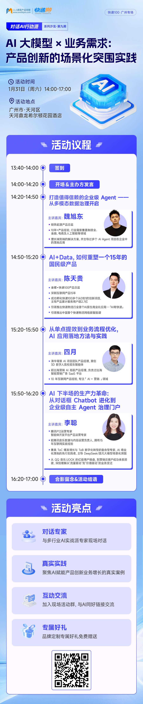

# Invitation | On January 31, MatrixOrigin Invites You to Unlock Data Governance for Enterprise-Grade Agents

The AI large model wave is in full swing, but when we shift our focus from casual chat to enterprise-grade business scenarios, challenges quickly emerge.

Enterprises need more than a Chatbot that can converse. They need an Agent that can understand business context, execute tasks, and deliver trustworthy results.

However, in real-world implementation, **data silos, hallucination issues, and the difficulty of effectively using private-domain knowledge** have become a gap between AI and business value.

**How can an Agent truly "understand" enterprise data? How can enterprises build an AI business assistant that is both intelligent and reliable?**

At **14:00 on January 31 (this Saturday)**, the "AI + Data + MCP: Redefining API" event will begin. **Wei Xudong, Product Director at MatrixOrigin**, will deliver a keynote presentation: 👉 **"Building Trustworthy Enterprise-Grade Agents: Starting with Multimodal Data Governance."** Together with hands-on experts from Tencent, Kingdee Kuaidi100, and other companies, we invite you to explore how to break through in the second half of AI.

