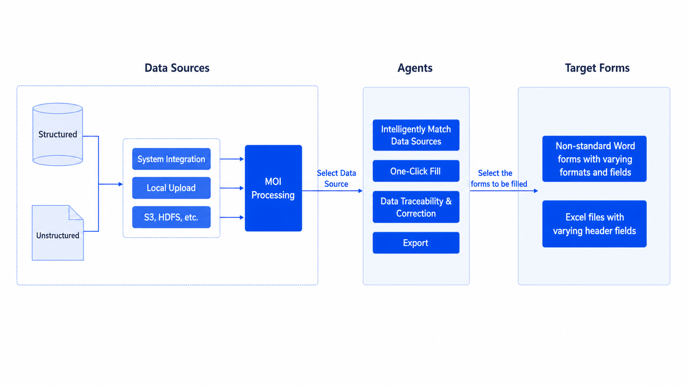

# [MOI Practice Vol.2] When You Spend Two Hours Filling a Form, Only to Get the Company Name Wrong

If you have ever frantically copied and pasted between files for a bid document, declaration form, or project material, you know this pain.

We recently built a small tool specifically to solve this problem.

## How Painful Is Form Filling?

### Scenario 1: More Than a Dozen Materials, and the Fields Never Match

To apply for a government subsidy project, you need to fill in an enterprise information form.

The form asks for the unified social credit code, so you have to open the business license PDF. It asks for last year's tax payment amount, so you have to open the financial statement Excel file. It asks for the legal representative's contact information, so you have to dig through business registration documents.

One form, twenty fields, scattered across five or six files in different formats.

Copy, switch, paste. Copy, switch, paste. After two hours, your eyes are tired and two fields are still wrong.

### Scenario 2: The Same Information, Filled in a Hundred Times

Colleagues who prepare bids probably understand this pain best.

Company name, registered capital, establishment date, qualification certificates. The same information appears once in the enterprise qualification form, once in the bid letter, and again in the quotation sheet.

The format is different every time. Some forms want "year/month/day," some want "year-month-day," and some only ask for the year.

**The same information is filled in repeatedly, and each time it has to be found and verified again. It is inefficient, and the worst part is accidentally entering Project A's amount into Project B.**

### Scenario 3: Every Form Looks Different

Forms from government departments, clients, and industry associations all look different and ask questions differently. Some say "enterprise name," some say "full organization name," and some say "declaration entity." They are actually asking for the same thing.

Traditional methods rely on human understanding, manual mapping, and filling cells one by one.

## What Is the Core Problem?

**Endlessly varying forms + scattered and messy data sources = pure manual labor**

If we break the process down:

- **Understand what the form wants**: field recognition
- **Know where the data is**: data source location
- **Fill in the data**: information matching and filling
- **Check whether it is correct**: validation and traceability

Every step consumes human time and attention. These are exactly the things machines should handle.

## Our Attempt: Let AI Fill the Form

We built a prototype tool called the Intelligent Form-Filling Assistant.

**The core idea is simple: upload data sources, open a form, and fill it with one click.**

### Step 1: Connect Your Data

It supports many types of data sources:

- Structured data: Excel and databases
- Unstructured data: PDFs such as business licenses and audit reports, Word documents, and even scanned copies

You can upload files locally or connect enterprise systems. The system uses MOI, our AI multimodal data intelligence engine, to process all of this data into a unified searchable format.

### Step 2: Intelligent Matching and Filling

When you open a form to be filled, the system:

- Automatically identifies what each field is asking for
- Finds the corresponding information from your data sources
- Fills all fields with one click

Whether the form is Word or Excel, and whether the field is called "enterprise name" or "declaration organization," AI understands that they mean the same thing.

### Step 3: Traceable and Editable

For every filled field, you can click to see which file and which location the data came from.

Wrong field? Edit it directly on the page. Want to verify it? Click through to view the original document.

## How Well Does It Work?

We validated it with real scenarios:

| Comparison item | Traditional method | Intelligent Form-Filling Assistant |
| --- | --- | --- |
| One 20-field form | About 30 minutes | About 30 seconds |
| Accuracy | Depends on humans, error-prone | Automatically matched, traceable, and verifiable |
| Reuse across forms | Refill each form | Reuse the same data source across multiple forms |

**The most important change is that form filling changes from "finding data" to "checking data."**

Previously, 80% of the time was spent looking for information and 20% on filling and checking.

Now, only 20% of the time is needed for checking, because the system has already filled it in.

## Where Can It Be Used?

After reviewing possible scenarios, we found the demand is more common than expected:

- **B2B scenarios**:

  - Government project applications, such as subsidy applications and qualification certifications
  - Bid document preparation, such as enterprise information forms, financial status forms, and project performance forms
  - Enterprise routine work, such as ISO certification applications, tax declarations, and legal case files

- **Consumer scenarios**:
  - Visa applications, where form formats differ widely by country
  - Scholarship and insurance claim applications
  - Job application file organization

In theory, any scenario that requires extracting information from multiple sources and filling it into a fixed-format form is a fit.

## Some Thoughts

- **The pain of form filling is not filling; it is finding.**
  Most of the time, we know what should be filled in. The painful part is digging the information out of different files. The core value of intelligent form filling is letting machines do that digging.

- **Different forms, the same data**
  Basic enterprise information, financial data, qualification certificates: this information is relatively stable, but form formats vary constantly.
  Import the data source once and reuse it across multiple forms. That is the key to improving efficiency.

- **Traceability matters more than automation**
  Fully trusting machine-filled results is not realistic.
  But if every field can be traced back to its original source, users can verify it quickly instead of checking everything again from scratch. **Transparency itself is the source of trust.**

## Final Notes

Form filling may look like a small pain point, but multiply it by "one hundred forms a year, several hours each time," and it becomes a real time sink.

The Intelligent Form-Filling Assistant does not pursue 100% perfection. It aims for:

- **Tasks that used to take hours can now be done in two minutes**
- **Even if edits are needed, the location and source can be found quickly**
- **The same data no longer needs to be filled in a hundred times**

Behind this is MOI's multimodal data processing capability. Whether it is a scanned PDF, financial statement Excel file, or business registration Word document, MOI can intelligently parse it and convert it into searchable, understandable structured data. Deep semantic understanding allows the system not only to "recognize characters," but also to "understand meaning," knowing that "enterprise name," "full organization name," and "declaration entity" are asking for the same thing.

When data only needs to be imported once and can be reused by any form, and when every filled result can be traced back to the original file with one click, form filling changes from manual labor into verification work. This is a practical tool that solves a real problem and lets people spend their time on more creative work.

_Click the link to view the [Intelligent Form-Filling Assistant demo](https://www.bilibili.com/video/BV1YkmCB8EmH/?share_source=copy_web&vd_source=9cf9c0cc2d3209e3a30af3a12d9ea821)_ ->
