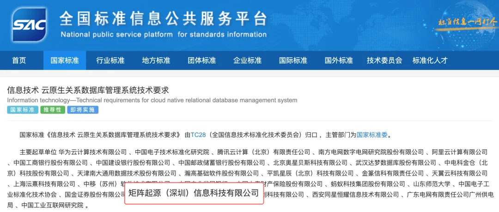
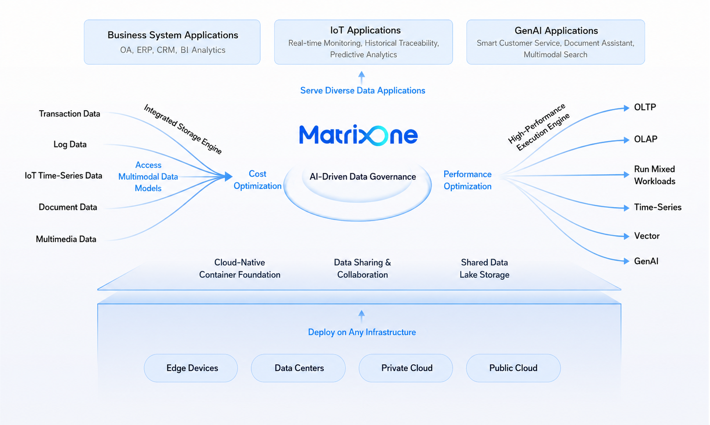

# Major News! National Standard Officially Released, MatrixOrigin Contributes to the New Technical Requirements for Cloud-Native Relational Database Management Systems

## Official Announcement of the National Standard

On March 31, 2026, the State Administration for Market Regulation and the Standardization Administration of China officially released national standard **GB/T 47343-2026, Information Technology - Technical Requirements for Cloud-Native Relational Database Management Systems**.

This not only marks a new stage of standardization and normalization for China's cloud-native database technologies, but also signals a comprehensive acceleration of database technology toward **agility, elasticity, and lower cost**.

## National-Level Technical Recognition

As a pioneer in the cloud-native database field, MatrixOrigin participated in the drafting of this national standard with its deep accumulation in hyper-converged architecture, multi-workload processing, and industry implementation. MatrixOrigin became **one of the main drafting organizations of the national standard**.

Participating in the formulation of a national-level standard is not only strong recognition from authoritative institutions of MatrixOrigin's original technology, but also means that the company's technical path has become a signpost for industry development.

**Standards are the "measuring system" for industry development. MatrixOrigin's participation in the national standard aims to turn our practical experience in the cloud-native field into industry consensus and help enterprises avoid detours in digital transformation.**

## Why MatrixOrigin?

This standard defines the core requirements for cloud-native relational databases across dimensions such as elastic scaling, resource management, high availability, security, and intelligent operations. MatrixOne, MatrixOrigin's self-developed cloud-native hyper-converged database, aligns closely with the standard's design philosophy:

- **Hyper-converged architecture and unified foundation**: MatrixOne natively supports TP, AP, time-series, vector, and other diverse workloads, breaking down data silos. This matches the standard's forward-looking definition of resource management and multimodal data support.
- **Extreme elasticity, defining the future**: Through compute-storage separation and dynamic scaling, MatrixOne fully reflects the standard's technical pursuit of elastic scaling and low-cost transformation.
- **Intelligent operations, simplifying complexity**: The intelligent operations emphasized in the standard have already been implemented in the MatrixOne ecosystem, providing enterprises with self-service, intelligent, and highly available data infrastructure.

## Full Power Ahead to Build the Foundation Together

Looking ahead, MatrixOrigin will continue to uphold its technology-driven original intention and deepen its work in cloud-native database standardization and industrialization. We will continue refining the MatrixOne product matrix to build a more powerful, flexible, and intelligent digital foundation for enterprises worldwide.

**On the demanding track of cloud-native technology, MatrixOrigin is moving forward at full power.**
