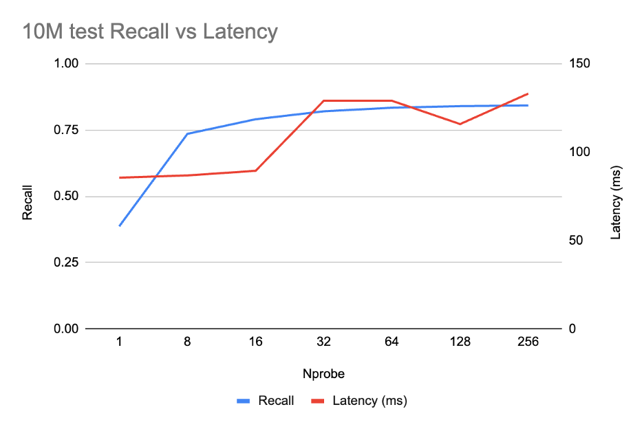
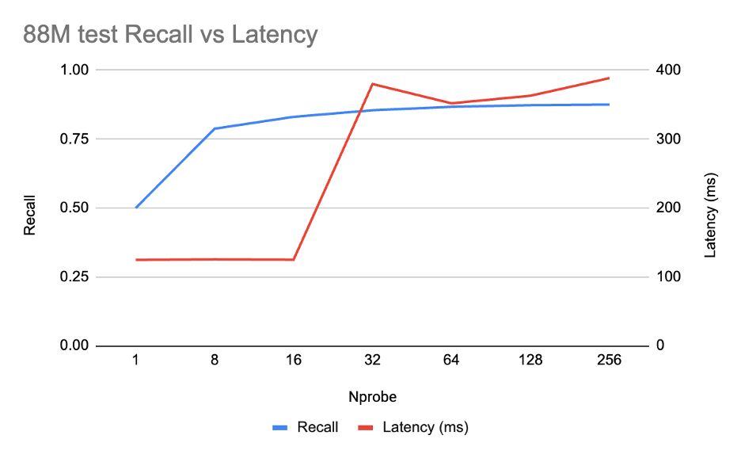

# In-Database vector index on GPU: How MatrixOne uses NVIDIA cuVS for large scale vector data

MatrixOrigin has integrated advanced AI directly into our customers' core business processes. By leveraging AI-driven capabilities, organizations can automate complex workflows, boost operational efficiency far beyond traditional methods. Furthermore, the platform enables deep, actionable insights, allowing businesses to optimize their strategies that were previously unattainable.

Amway China, the largest market of Amway, a global leader in health and wellness, operates a large-scale direct selling model with a distributed salesforce that relies heavily on product knowledge and customer engagement.  MatrixOrigin built an AI Assistant for Amway's sales representatives.  Sales representatives at Amway now can retrieve, review cases and  assist in recommending products and wellness solutions based on curated and approved knowledge and support sales representatives with real-time insights and recommendation suggestions during customer interactions.   

JST is a global leader in digital power equipment and dry-type transformer manufacturing and is a national champion on intelligent manufacturing.  We built an AI-native data foundation that transforms massive ERP and MES records into insights and business intelligence that powers business decision making on finance, sales, investor relations and operations at JST.

Both Amway and JST require their enterprise AI platform to manage structured data (often reside as tables/rows in a database) and unstructured data (documents, images, and vector index on embeddings). The MatrixOne database addresses this by integrating traditional relational capabilities with high-performance vector indexing, allowing for a unified approach to data retrieval. To provide precise context for an LLM, MatrixOne can execute hybrid queries that combine standard SQL filters on metadata and transactional records with vector similarity searches on embedded document chunks. 

Initial success with an AI pilot often leads to rapid, viral adoption across an organization. However, as data volume and query concurrency scale by 100x, platforms face a significant engineering challenge: supporting tens of millions of high-dimensional vectors without sacrificing performance.

To meet this demand, we have deeply integrated NVIDIA cuVS and RAFT libraries directly into the MatrixOne database engine. This architecture has been successfully deployed at Amway and JST using NVIDIA H20 GPUs, significantly accelerating vector indexing and search workload.  By leveraging GPUs rather than the traditional way of scaling by adding more servers, we can scale compute capacity more effectively while minimizing hardware overhead and power requirements.  

---

## The Challenge: Giant vector index in MatrixOne Database

MatrixOne supports vector datatype and IVF-Flat vector index natively, but scaling to tens of millions of vectors reveals significant computational bottlenecks when relying solely on traditional CPU execution.  These challenges manifest in two distinct phases: **index construction** and **query execution strategy**.  

When building the index, the number of centroids should not be too small otherwise we need to visit too many vectors later in search. Calculating a high number of centroids via K-means clustering is computationally expensive and slow on CPUs. Once centroids are established, every one of the tens of millions of vectors must be assigned to its nearest neighbor. This process could take hours.

When querying, in real-world enterprise SQL workloads, vector searches are almost never performed in a vacuum. They are typically constrained by predicates on relational metadata. This creates a complex optimization problem for the MatrixOne query engine,

* **Pre-Filtering (Relational First)**: If the engine evaluates metadata predicates first, it may filter the dataset down to a small fraction. However, if the remaining set is still large, the engine must perform a "brute-force" distance calculation on every surviving vector, as the pre-filtering likely breaks the structural utility of the pre-built IVF index.

* **Post-Filtering (Vector First)**: If the engine queries the vector index first to find the top-K nearest neighbors, the subsequent relational predicates may discard many of those results. This leads to poor **recall**. To compensate for this recall drop, the engine is forced to increase the **nprobe** value to search more clusters (centroids).   This adds more demand for computing power.

---

## Benchmark Setting

Before detailing the step-by-step integration of the NVIDIA cuVS library into the database, it is essential to define the testing environment. To evaluate performance and scalability, we utilize a simplified schema designed to mirror real-world Enterprise AI workloads:

```sql
CREATE TABLE documents  (file_chunk_id INT NOT NULL,
                         file_attribute INT,
                         chunk TEXT,
                         embedding VECTOR(768));
```

The file_attribute column holds relational metadata-such as department IDs, security tags, or creation timestamps-that is used to constrain hybrid queries.

To populate the table with high-dimensional data, we leveraged the **wiki_all dataset from NVIDIA** (88 million 768-dimension embedding vectors, totally ~251GB uncompressed). The tests were conducted on **AWS g6e instances**, powered by **NVIDIA L40S GPUs** (48GB memory), using the following scale-out strategy:

* **1M to 10M Vectors**: Tested on a **g6e.16xlarge** instance utilizing a single GPU.
* **88M Vectors (Full Dataset)**: Tested on a **g6e.48xlarge** instance leveraging 8 GPUs to handle the increased computational and memory demands of the full corpus.

---

## Integration of NVIDIA cuVS/RAFT and the MatrixOne Database

The following provides a technical breakdown of the integration process used to embed **NVIDIA cuVS** and **RAFT** capabilities directly into the MatrixOne database.

### Step 1: Computing clustering (centroids) for index building.

The initial phase of building an IVF-Flat index requires identifying optimal centroids. We utilized the **cuVS Balanced K-Means** algorithm, applying a sqrt(n) heuristic for centroid count. For our 88-million-record dataset, this resulted in approximately 10,000 centroids. By leveraging GPU-accelerated clustering, the time required to compute these centroids was reduced from several minutes on a CPU to just a few seconds.

### Step 2: Offloading vector assignments to GPU

Once the centroids are established, every embedding vector in the database must be mapped to its nearest centroid. To accelerate this, we constructed an **NVIDIA cuVS Brute-Force index** specifically for the centroids. By batching the embedding vectors and offloading the exhaustive distance computations to the GPU, we transformed a process that typically takes hours into one that completes in a few minutes.

### Step 3: GPU resource management

MatrixOne is primarily written in **Go**, which necessitates a bridge to **NVIDIA CUDA**-based **RAFT** library. We implemented C++ worker threads to manage long-lived GPU resources, ensuring that per-request GPU initialization costs remain near zero. To minimize the overhead of cross-language calls (Go to C++ to CUDA), requests to **cuVS** are batched whenever possible, maintaining high throughput even under heavy query loads.

### Step 4: Memory optimization via Auto-Quantization

Managing tens of millions of high-dimensional vectors creates significant memory pressure. We implemented automatic type quantization using the **NVIDIA cuVS quantization routines**. By performing all conversions directly on the GPU, we avoided taxing the CPU. Utilizing the **NVIDIA cuVS IVF-PQ (Product Quantization)** index allows us to dramatically reduce the memory footprint, making it feasible to host the entire index within GPU memory for extremely fast retrieval.

### Step 5: Predicate pushdown for hybrid queries

To answer the hybrid queries - such as "find the top 20 relevant records where file_attribute = X" - MatrixOne pushes relational predicates directly into the **cuVS** execution engine using **predicate bitsets**. Since metadata like file_attribute is relatively small, MatrixOne can maintain it in memory to generate a bitset quickly. This bitset is passed to cuVS alongside the vector search (for example, using **CAGRA** or **IVF-PQ**). **NVIDIA cuVS** then ensures that only the top-K results satisfying the metadata constraints are returned, eliminating the need for inefficient post-search pruning and significantly improving both recall and performance.

---

## Performance

To evaluate the impact of GPU acceleration, we compared the performance of three distinct configurations: a standard **CPU-based IVF-Flat** index, a **GPU-enhanced index build** (where only the construction is offloaded), and a **fully GPU-native solution** utilizing the **NVIDIA cuVS IVF-PQ** index.

Because vector search involves a trade-off between speed and accuracy, we carefully tuned our parameters to maintain a **0.8 recall rate**, a standard threshold demanded by our enterprise customers. We conducted query experiments using 100 concurrent client connections.

The indexing and search parameters were standardized across the experiments as follows:

* **Cluster Configuration**: All indices were constructed with the number of clusters approximately equal to sqrt(num_records). Specifically, we utilized 1,000 clusters for 1M records, 3,000 for 10M, and 10,000 for the full 88M dataset.
* **Search Parameters**: To maintain recall, we use nprobe value of 16 for standard vector searches. When metadata predicates were introduced, we increased nprobe to 32 to compensate for the narrowed search space.
* **Quantization**: For the IVF-PQ index, pq_bits was set to 8 to balance memory efficiency with distance calculation precision.

Detailed documentation of our parameter tuning and the resulting performance curves can be found in the Appendix.

---

### Index Build Time 

| **Dataset** | **IVF-Flat(CPU build**) | **IVF-Flat(GPU build)** | **GPU vs CPU** | **IVF-PQ(GPU buil)** | **PQ vs CPU** |
|----------|----------|----------|----------|----------|----------|
| 1M | 36 s | 15 s | 2.4× | 47 s | 0.8× |
| 10M | 14 min 13 s | 2 min 12 s | 6.5× | 7 min 32 s | 1.7× |
| **88M** | **6 h 23 min** | **20 min** | **19×** | **50 min** | **~7.7×** |

CPU-based index construction is only viable for small datasets. Once you scale to **88 million vectors**, the performance gap becomes staggering: building an index on a CPU takes hours, whereas a GPU-powered **IVF-PQ** build is roughly **7-8× faster**. Moving to a GPU-built **IVF-Flat** index increases the speedup to **19×**, effectively shrinking an overnight process into the length of a coffee break.

While IVF-PQ takes longer to build than IVF-Flat, the extra overhead is intentional. This additional computation optimizes the index for significantly lower memory usage and superior search performance a trade-off in "computing cycles" that proves its value during the retrieval phase.

---

## Search without predicates on metadata

| **Dataset** | **IVF-Flat(nprobe=16)** | **IVF-PQ(nprobe=16)** | **PQ vs Flat** |
|----------|----------|----------|----------|
| 1M | 860 QPS, recall 0.86 | 904 QPS, recall 0.82 | 1.05× |
| 10M | 461 QPS, recall 0.82 | 1066 QPS, recall 0.80 | 2.3× |
| **88M** | **4 QPS, recall 0.89** | **759 QPS, recall 0.83** | **~210×** |

At a small scale (1 million vectors), the dataset is manageable and the computational load is relatively light. Both **CPU and GPU architectures** handle the workload efficiently, with no significant bottlenecking on either side.

As the dataset reaches 10 million, the CPU begins to struggle under the increased load. In contrast, **GPU-based IVF-PQ**(Inverted File Product Quantization) maintains a high **QPS (Queries Per Second)**, leveraging parallel processing to sustain performance where traditional hardware falters.

At the 88 million mark, the gap becomes undeniable.  The architectural advantages of **IVF-PQ** become the deciding factor in maintaining search speed. With quantization, IVF-PQ holds the whole vector index in GPU memory where the search is served directly by GPU. Without quantization, the raw vector data exceeds the cache capacity of the database. This forces the system to fetch data whenever a page misses, causing search performance to **grind to a halt**.

---

### Search with metadata predicates 

| **Dataset** | **IVF-Flat(nprobe=3)** | **IVF-PQ(nprobe=32)** | **PQ vs Flat** |
|----------|----------|----------|----------|
| 1M | 779 QPS，recall 0.82 | 649 QPS，recall 0.83 | 0.83× |
| 10M | 230 QPS，recall 0.82 | 330 QPS，recall 0.80 | 1.43× |
| **88M** | **2.6 QPS，recall 0.82** | **80 QPS，recall 0.84** | **~30×** |

---

## Note On Memory footprint of IVF-PQ

When dealing with 88 million vectors at **768 dimensions (float32)**, you are managing approximately **270 GB of raw data**. At this scale, the difference between CPU and GPU architectures isn't just about speed-it's about where the data live and memory bandwidth.  **IVF-PQ** completely sidesteps these memory limitations through aggressive compression. By utilizing settings such as M=192 and pq_bits=8, the index is compressed to a fraction of its original size. This allows the entire searchable structure to reside within the high-bandwidth VRAM of a single modern GPU, ensuring that every probe is served at maximum velocity. Furthermore, NVIDIA cuVS can distribute the IVF-PQ index across a multi-GPU cluster; for the full 88-million-vector dataset, the memory requirement drops to just **~3.5 GB per GPU** when spread across an **8-GPU** configuration.

**The Bottom Line**: IVF-PQ delivers a compression ratio exceeding **10x**. By combining this quantization strategy with GPU acceleration, a single server outfitted with latest-generation GPUs-offering over 200 GB of memory each-can seamlessly manage billions of high-dimensional embeddings.


---

## Conclusion: Redefining Vector Search in Database with GPU Acceleration

By offloading the entire pipeline-including clustering, assignment, quantization, and search (alongside SQL predicate evaluation)-onto the GPU via **NVIDIA cuVS**, MatrixOne has unlocked the ability to manage massive vector datasets with unprecedented efficiency.

## Key Performance Breakthroughs

* **Accelerated Indexing**: Transitioning to GPU-based index construction yields a **20× speedup** over traditional CPU methods. Tasks that previously required several hours are now completed in well under an hour.
* **The Power of IVF-PQ**: Using cuVS MatrixOne can build, and search vectors completely from the GPU. Quantization and compression reduced memory footprint and we expect the latest generation GPU can hold and search many billions of embedding vectors satisfying most demanding customer scenarios.
* **Architectural Synergy**: By integrating **cvVS** vector search with **bitset pre-filtering**, MatrixOne delivers more than just a fast index. It provides a robust, production-ready database engine engineered to serve hybrid queries over structured data and embedding vectors, satisfying the intensive demands of modern AI applications.

---

## APPENDIX: Parameter Tuning

Before showing the head-to-head numbers, it's worth explaining how the parameters in those tables were picked. Two questions need answers for each index family: how do we pick nprobe, and (for IVF-PQ) how aggressive can the quantization be? We tuned on the 10M slice - large enough to be representative, cheap enough to sweep - targeting recall ≈ 0.80 @ top-20, then validated the chosen setting at 88M.

We ran a Pareto sweep for IVF over nprobe ∈ {1, 8, 16, 32, 64, 128, 256}:



The curve shows a classic IVF knee: recall climbs steeply until nprobe = 16 (0.79), then flattens - beyond that, each doubling of nprobe adds at most ~1 point of recall but latency starts to drift up. **nprobe = 16** is the **Pareto-optimal point** for our 0.80 recall target.

We then validated at 88M:



The 88M curve shows the same result as the 10M curve: recall hits 0.83 at nprobe = 16 (~125 ms), and only creeps to 0.88 by nprobe = 256. The 10M-tuned setting (pq_bits = 8, nprobe = 16) holds well at a larger scale.

Next, can more aggressive PQ compression hold that target? We swept pq_bits ∈ {8, 7, 6} at the same nprobe ladder (10M, top-20, concurrency=100, n=10000):


| nprobe | pq_bits=8 Recall | pq_bits=7 Recall | pq_bits=6 Recall |
|---------|---------|---------|---------|
| 1 | 0.39 | 0.38 | 0.37 |
| 8 | 0.74 | 0.71 | 0.68 |
| 16 | 0.80 | 0.76 | 0.72 |
| 32 | 0.82 | 0.79 | 0.74 |
| 64 | 0.83 | 0.80 | 0.75 |
| 128 | 0.84 | 0.81 | 0.76 |
| 256 | 0.84 | 0.81 | 0.76 |

Only pq_bits = 8 clears 0.80 at nprobe = 16. pq_bits = 7 needs nprobe ≥ 64 to get there (4× more probes for the same recall), and pq_bits = 6 never reaches 0.80 in this sweep - its asymptotic ceiling is ~0.76. Since dropping from 8 → 7 bits saves only ~12% on stored vector bytes, we set pq_bits to 8.

IVF-Flat has no quantization knob - vectors are stored uncompressed in float32 - so the only tunables are cluster count (lists) and nprobe. We set lists = 10000 for the 88M index (≈ √N, the standard heuristic).  

| nprobe | Recall@20 |
|---------|---------|
| 8 | 0.77 |
| 16 | 0.89 |
| 32 | 0.92 |

(88M wiki_all, no filter, top-20, concurrency=100, n=10000.)