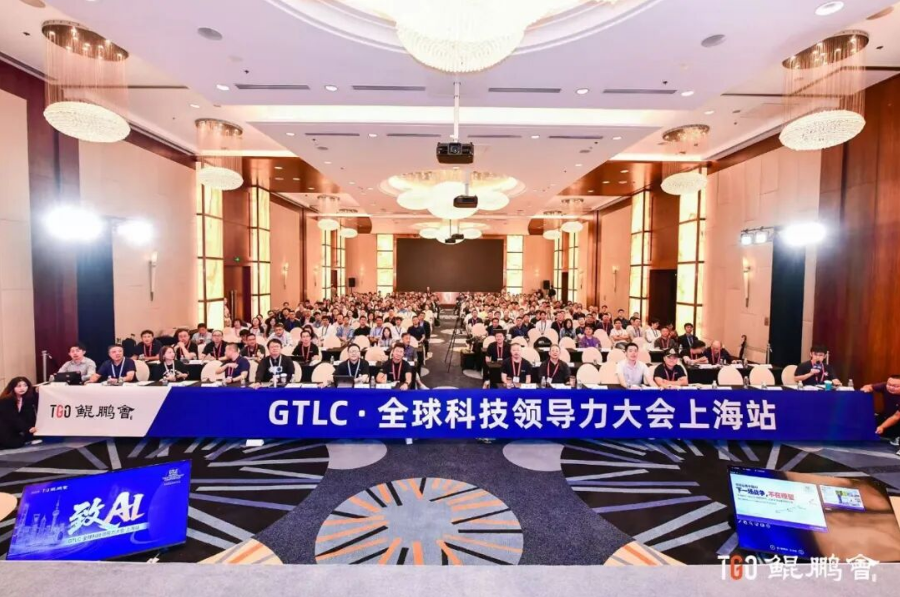
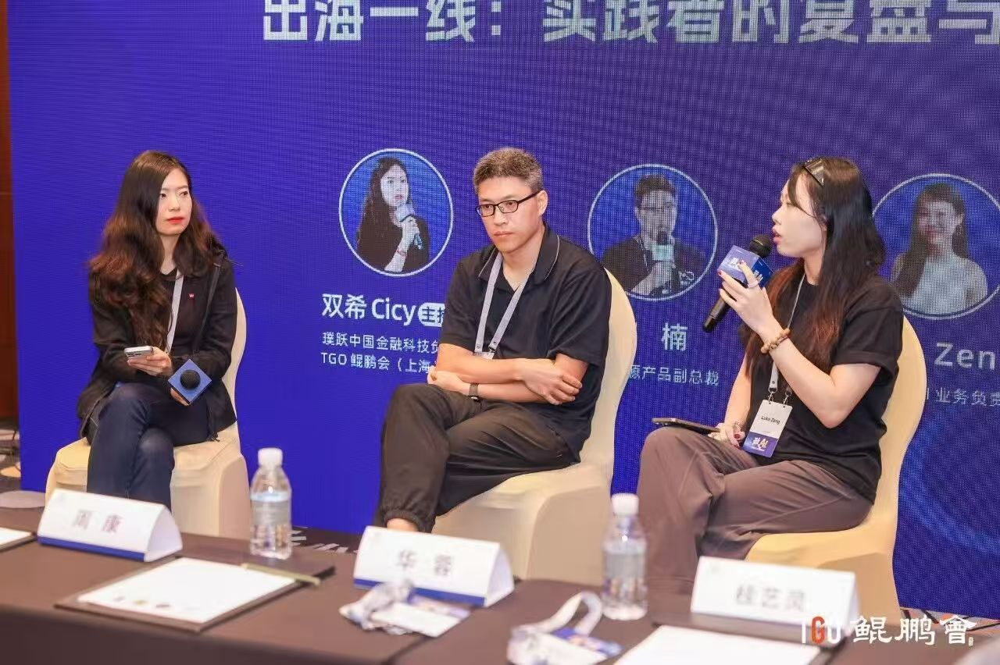

# 矩阵起源亮相2026 GTLC上海站 共话AI企业出海实践

9月19日，2026 GTLC全球科技领导力大会·上海站在上海举行。本届大会以“致AI”为主题，汇聚AI、云计算、金融及产业服务等领域的科技企业与行业实践者，共同交流AI技术落地、企业创新与全球化发展。

*2026 GTLC全球科技领导力大会·上海站现场*

矩阵起源产品副总裁邓楠受邀出席大会，并参加“AI出海：从0到N”分论坛。该论坛围绕科技企业全球化发展展开，来自投资机构、国际市场服务机构及出海企业的嘉宾，就出海战略、全球市场选择和一线经营实践等话题进行交流。

在“出海一线的复盘与建议”炉边对谈中，邓楠与来自不同领域的行业嘉宾，围绕科技企业进入海外市场过程中面对的实际问题，以及产品出海、市场拓展和全球客户服务等话题展开交流。

*矩阵起源产品副总裁邓楠（中）参加“出海一线的复盘与建议”炉边对谈*

作为AI原生多模态数据智能平台的开创者，矩阵起源持续服务国内外企业客户。公司核心产品MatrixOne Intelligence（MOI）面向Agent时代，为企业提供数据与智能基础设施，通过统一数据底座连接企业数据、知识、业务语义和智能体运行，帮助企业推动生产级AI Agent落地。

随着AI应用加速进入企业核心业务，如何以可靠的产品和服务响应不同市场的客户需求，也成为科技企业全球化发展的重要课题。此次参加GTLC上海站，为矩阵起源与行业伙伴交流一线经验、了解全球市场需求提供了新的机会。

未来，矩阵起源将继续推进产品与技术创新，积极连接全球客户及合作伙伴，以统一的数据与智能基础设施，助力更多企业加速AI应用落地与智能化升级。
