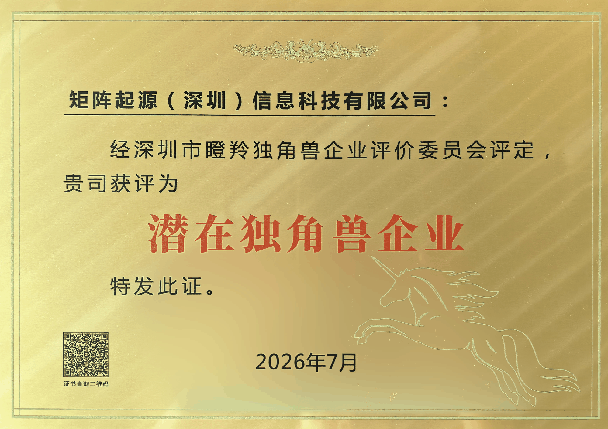

# Good News | MatrixOrigin Named a 2026 Shenzhen "Potential Unicorn Enterprise"

The 2026 China Unicorn Enterprise Conference was recently held in Nanshan District, Shenzhen. The event was guided by the Administration of Industry and Information Technology of Shenzhen Municipality, the Service Bureau for Small and Medium-sized Enterprises of Shenzhen Municipality, and the Nanshan District People’s Government. The conference unveiled a series of lists recognizing Shenzhen’s gazelle and unicorn enterprises. Shenzhen is now home to 47 unicorn enterprises, **167 potential unicorn enterprises**, 278 seed unicorn enterprises, and 401 gazelle enterprises.

Following a review by the **Shenzhen Gazelle and Unicorn Enterprise Evaluation Committee**, MatrixOrigin (Shenzhen) Information Technology Co., Ltd. received the **“Potential Unicorn Enterprise”** designation for its proven technical capabilities, track record of innovation, and strong growth prospects in Data & AI.

The recognition moves MatrixOrigin up another tier in Shenzhen’s unicorn development pipeline, following its designation as a **“Seed Unicorn Enterprise”** in 2025. It reflects broad confidence in the company’s R&D capabilities, commercial prospects, and ability to sustain rapid growth.

As AI reshapes enterprise technology, MatrixOrigin will continue to make innovation the engine of its growth, with a clear focus on building a **unified platform that takes enterprises from data to trusted AI agents**. Central to this strategy is the newly upgraded **MatrixOne Intelligence 5.0** (MOI 5.0), an enterprise-grade Data & AI platform that brings data, models, memory, and the trusted AI agent runtime onto a single foundation. It connects the entire journey—from governing raw data and building knowledge bases to developing trusted AI agents and running them in production. By eliminating the need to stitch together multiple systems, MOI 5.0 reduces complexity and gives enterprises greater control, helping them move AI agents beyond demos and into production at scale—the critical **“last mile”**—and turn AI into measurable business value.

