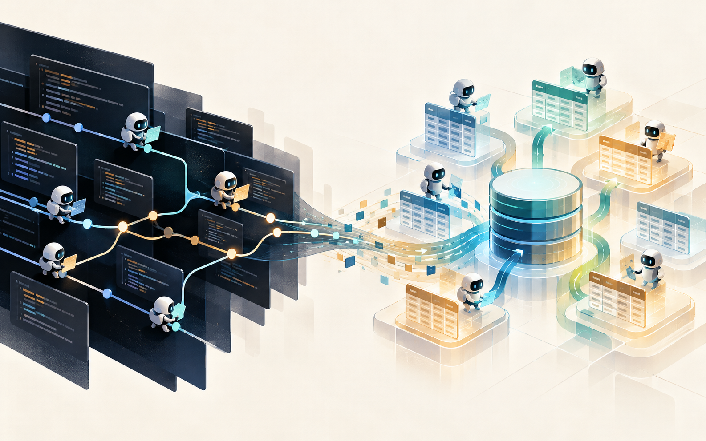
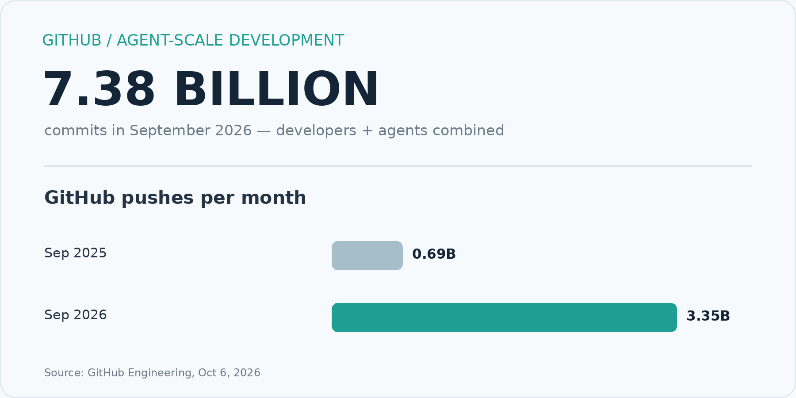
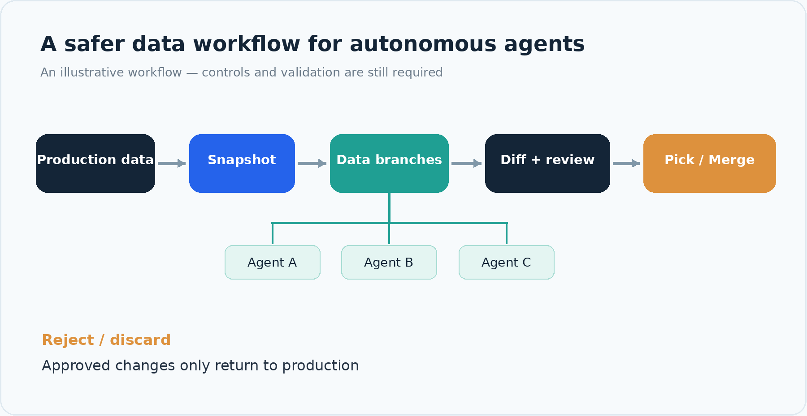

# 7.38 Billion Commits. What Happens When Agents Start Changing Data?

*GitHub is rebuilding Git for agent-scale development. Data infrastructure may be next.*

*Editorial illustration · Agents moving from code workflows into data workflows*

Picture an operations agent updating customer risk tiers on a Friday evening. It queries the order tables, runs a few SQL statements, and changes 120,000 records. The dashboard looks good. The next morning, someone notices that the agent used lifetime refund rates instead of the last 90 days.

If an agent breaks code, a developer can inspect the diff and revert a commit. When an agent changes live business data, the recovery path is less obvious — especially if other systems have already used those changes.

## The GitHub number that caught our attention

On October 6, GitHub reported 7.38 billion commits in September 2026, more than five times the level a year earlier. That figure covers developers and agents together; it is not an agent-only count. Monthly pushes rose from 690 million to 3.35 billion.

GitHub describes coding agents committing or checkpointing after nearly every step, with fleets of agents working on separate branches in the same repository. It is rebuilding its Git architecture to handle the resulting write pressure, coordination, and read amplification.

*Figure 1 · Published GitHub platform activity. Commits include both developers and agents.*

This is a story about coding agents today. It is also a useful preview of what happens when autonomous systems become regular writers to databases.

## Code has branches. Business data needs a place to experiment, too.

An enterprise agent may update CRM records, reclassify transactions, clean customer data, refresh a knowledge corpus, or change the state another agent will read tomorrow. Several agents may test competing hypotheses against the same production dataset.

Databases already have transactions, backups, logs, and point-in-time recovery. Those remain essential. The workflow we are interested in adds isolated experimentation and review: let an agent work against a data branch, inspect the exact changes, and promote only what passed validation.

Putting a CSV in Git works for a small dataset. It is a poor operating model for a live database with billions of rows, concurrent writers, permissions, and transactional constraints. Git can version the SQL and application logic; the database has to manage its own live state.

*Figure 2 · A possible review workflow for agent-made data changes, not a replacement for access controls.*

## A data branch changes the failure mode

Imagine three agents testing different pricing or fraud strategies. They start from the same snapshot and work independently. Reviewers can compare the rows each agent changed, reject one experiment, and selectively promote another. A mistake stays in the experiment until someone chooses to merge it.

> Humans use branches to collaborate. Agents may need branches to fail safely.

There are clear limits: a database rollback will not unsend an email, reverse a completed payment, or undo changes in an external system. Effective agent workflows still need authorization, validation, approvals, and compensating actions where appropriate.

## What we are building with Git for Data

At MatrixOrigin, MatrixOne brings Git-like primitives to database data through SQL: snapshots, table and database branches, row-level diffs, selective picks, and merges with conflict handling. Its copy-on-write branch design avoids eagerly duplicating the entire source dataset when a branch is created.

The idea is straightforward. Give an agent an isolated data workspace. Make the changes inspectable. Keep promotion into production deliberate. In systems where agents increasingly act on their own, that feels like a useful foundation.

GitHub is adapting Git to billions of code changes. We expect a related conversation to grow around data: how will teams review, reconcile, and recover from changes made by autonomous agents?

That is a systems question worth testing, and one we plan to keep exploring at MatrixOrigin Research.

## References

- [GitHub Engineering · Building Git infrastructure for agent-scale development (2026-10-06)](https://github.blog/engineering/architecture-optimization/building-git-infrastructure-for-agent-scale-development/)
- [MatrixOne Docs · Git for Data](https://docs.matrixorigin.cn/mo/en/v26.4.2.0/MatrixOne/Overview/feature/git-for-data.html)
- [MatrixOne Docs · Data Branch Management](https://docs.matrixorigin.cn/mo/en/v26.4.2.4/MatrixOne/Tutorial/git4data-demo.html)

## X thread · ready to post

1/7 GitHub reported 7.38B commits in Sep 2026 — more than 5× a year earlier. That includes developers AND agents, not agents alone. It is changing how GitHub builds Git infrastructure.

2/7 Coding agents checkpoint constantly. Thousands can work on branches in the same repo. GitHub is redesigning for sustained writes, merges, and read amplification. Now picture agents doing the same thing to business data.

3/7 An agent edits code: review the diff, revert the commit. An agent updates 120K CRM records with the wrong rule: what gets reviewed, and how do you unwind just those changes?

4/7 Databases have transactions and backups. Agent workflows also need a safe place to experiment: snapshot → isolated branch → test → row-level diff → approval → selective promotion.

5/7 Putting a CSV in Git is easy. Managing a live multi-billion-row database that way is another matter. Git can version SQL; the database needs a practical way to version live data state.

6/7 At MatrixOrigin, we are exploring this with MatrixOne Git for Data: snapshot, branch, diff, pick, merge — and copy-on-write branches. This complements permissions, review, and recovery procedures; it does not replace them.

7/7 Humans use branches to collaborate. Agents may need branches to fail safely. Source: GitHub Engineering https://github.blog/engineering/architecture-optimization/building-git-infrastructure-for-agent-scale-development/

Suggested visuals for the thread: use the opening illustration with post 1 and Figure 2 with post 4. The GitHub source link appears in the final post.

