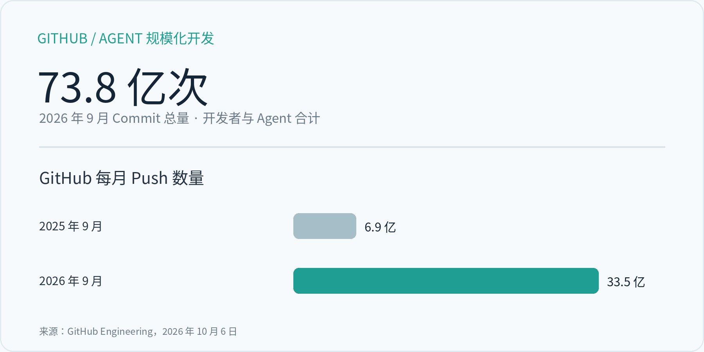
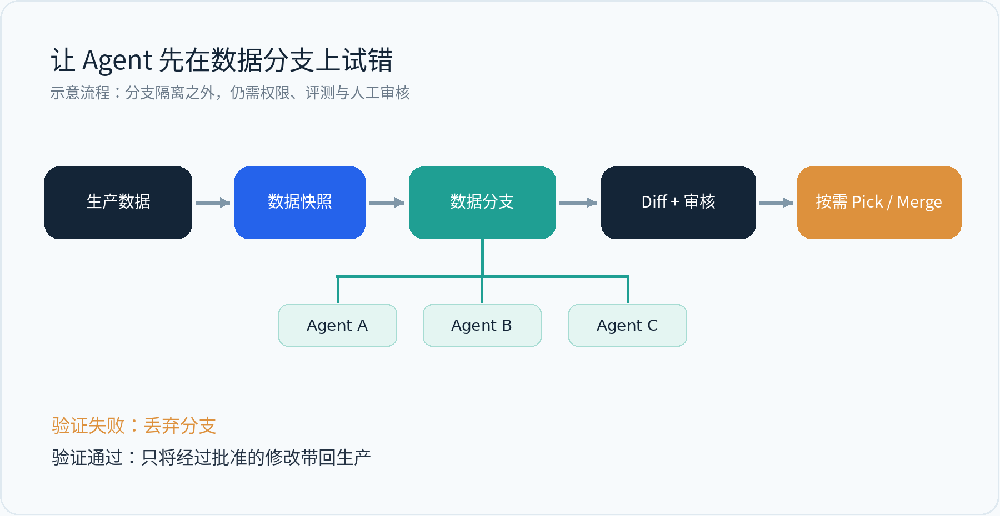

# 73.8 亿次 Commit 之后，Agent 改错的数据谁来收拾？

从 GitHub 的一次架构调整，聊聊 Agent 时代的数据版本管理

插图｜从代码工作流走向数据工作流（概念示意）

周五晚上，一位运营同事让 Agent 测试新的客户分层策略。它读完订单与退款记录，写了几条 SQL，更新了十几万行客户标签。跑得很快，报告也像模像样。

第二天团队发现，Agent 把“最近 90 天退款率”理解成了“历史累计退款率”。分层结果偏了，后面的营销策略还引用了这批标签。

这是一个假设场景，却很贴近企业迟早要面对的事：Agent 一旦有了写入权限，错误就会留在数据库里。它可能被其他系统读取，也可能影响下一个 Agent。

> 代码改坏了，开发者会找 Commit、看 Diff、做 Revert。数据改坏了，应该从哪里下手？

## 01  GitHub 的 73.8 亿次 Commit，说明了什么

10 月 6 日，GitHub 工程团队公开了一组数据：2026 年 9 月，开发者和 Agent 合计在 GitHub 上产生 73.8 亿次 Commit，比一年前高出五倍以上。这里必须强调，这是开发者与 Agent 的合计数据，不能说成 Agent 自己提交了 73.8 亿次。

另一个变化同样醒目：GitHub 月 Push 数量从 6.9 亿上升到 33.5 亿。GitHub 观察到，一些 Coding Agent 会在紧密的执行循环里频繁 Commit 或 Checkpoint；多个 Agent 还可能同时在同一仓库的不同分支上工作。过去人类几乎感觉不到的等待时间，累计起来就会拖慢任务。

图 1｜GitHub 官方公开数据；Commit 为开发者与 Agent 合计

GitHub 因而开始重做底层 Git 架构，重点解决高并发写入、合并协调以及一次 Push 带来的大量后续读取。这件事值得数据库团队关注：Agent 参与系统运行之后，许多原本“按人类节奏”设计的操作，都会被持续、高频地调用。

## 02  今天是代码，接下来轮到数据

Coding Agent 已经有了很成熟的落脚点：代码可以进仓库，实验可以拉分支，改动可以审查。企业里的 Agent 则会越来越多地接触实际业务状态。

比如销售 Agent 更新 CRM 的商机等级，财务 Agent 修正交易分类，数据 Agent 清洗客户记录，知识 Agent 更新检索语料。每一次写入都可能改变下一次查询得到的结果。与此同时，几个 Agent 可能基于同一份数据尝试不同方案。

数据库当然早已有事务、备份、日志和时间点恢复，这些能力至今不可替代。新出现的需求更具体：给每次自动化实验一个隔离的工作区，让变更可以比较，让通过验证的部分再进入生产。

如果 Agent 在第十步才发现第二步的判断有误，我们最好能定位它的改动范围，而不用靠猜测去反向执行一串 SQL。

## 03  把数据上传 GitHub，行不行？

小型 CSV、JSON、配置文件放在 Git 里没有问题。数据库中的数据则一直在线，可能是数十亿行记录，背后还有并发事务、访问权限、主键约束和不断发生的新写入。

一个 Agent 要在 10 亿行订单表上试验风险规则，总不能每次先导出全库、Commit 文件、再导入线上系统。GitHub 继续管理 SQL、程序和规则版本；实际的数据状态，仍需要数据库自己管理。

设想一个更顺手的工作流：先保存数据基线，为 Agent 创建隔离分支；它在分支里查询、修改、试验；完成后查看行级 Diff，再用测试或人工 Review 决定是否合并。

图 2｜示意：不同 Agent 在隔离分支试验，验证后选择性合并

## 04  数据分支，让 Agent 能放心试错

这里有个很朴素的想法：软件开发者之所以敢大幅重构代码，很大程度上因为分支和历史版本提供了退路。Agent 探索数据策略时，也需要类似的空间。

不同 Agent 可以从同一个快照出发，一个调客户分层，一个试退款规则，一个优化库存补货。它们各自的中间结果互不干扰。哪条路径值得采用，由指标、数据约束和审核流程来决定。

> 人类用 Branch 来协作。Agent 可能更需要 Branch 来安全地试错。

这并不意味着数据分支可以替代权限和审批。发出去的邮件、外部支付、第三方系统中的修改，都不可能靠数据库回滚来抹去。分支首先解决的是数据库内部状态的隔离与审查。

## 05  MatrixOne 的 Git for Data，正在解决这段流程

MatrixOne 将 Snapshot、Data Branch、Diff、Pick 和 Merge 这些版本管理动作放到了数据库里，通过 SQL 操作数据，而不必先导出到文件仓库。

其中，Snapshot 留下可识别的数据基线；Data Branch 创建独立的表或数据库分支；Diff 检查行级变化；Pick 可以按主键挑选经过验证的记录；Merge 则处理整个分支的修改，并提供冲突处理策略。具体操作有版本与主键等前提，生产场景仍需配置权限和审批。

Data Branch 使用 Copy-on-Write。创建分支时无需马上完整复制原始数据，后续修改才逐步消耗额外空间。这让“先分支、后试验”成为值得认真考虑的 Agent 工作流。

假设一个风控 Agent 要更新客户风险标签，它可以先在数据分支里执行规则。评测通过后，系统再查看哪些行发生了变化、哪些记录存在冲突，以及哪些修改值得保留。整个过程留下的状态更容易解释，也便于出问题时追溯。

## 写在最后

GitHub 的数据提醒我们，Agent 很快就会把熟悉的软件操作推到新的规模。今天这种压力主要体现在代码仓库里；等 Agent 大量承担数据清洗、运营决策和系统维护任务，数据库也会感受到变化。

一个 Agent 能不能正确生成 SQL，只是故事的前半段。它执行之后改了哪些数据，谁来核对这些变化，出了错怎么恢复，这些问题会越来越具体。

我们希望看到的未来，是 Agent 可以高效探索，同时每一次重要的数据改动都有边界、有记录、有退路。代码世界已经用 Git 证明了这种工作方式的价值。数据世界，也到了继续往前走的时候。

## 参考资料

- [GitHub Engineering · Building Git infrastructure for agent-scale development (2026-10-06)](https://github.blog/engineering/architecture-optimization/building-git-infrastructure-for-agent-scale-development/)
- [MatrixOne Docs · Git for Data](https://docs.matrixorigin.cn/mo/en/v26.4.2.0/MatrixOne/Overview/feature/git-for-data.html)
- [MatrixOne Docs · Data Branch Management](https://docs.matrixorigin.cn/mo/en/v26.4.2.4/MatrixOne/Tutorial/git4data-demo.html)

