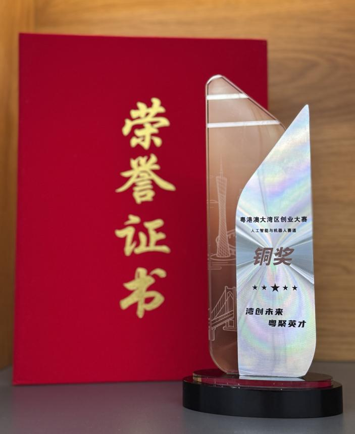
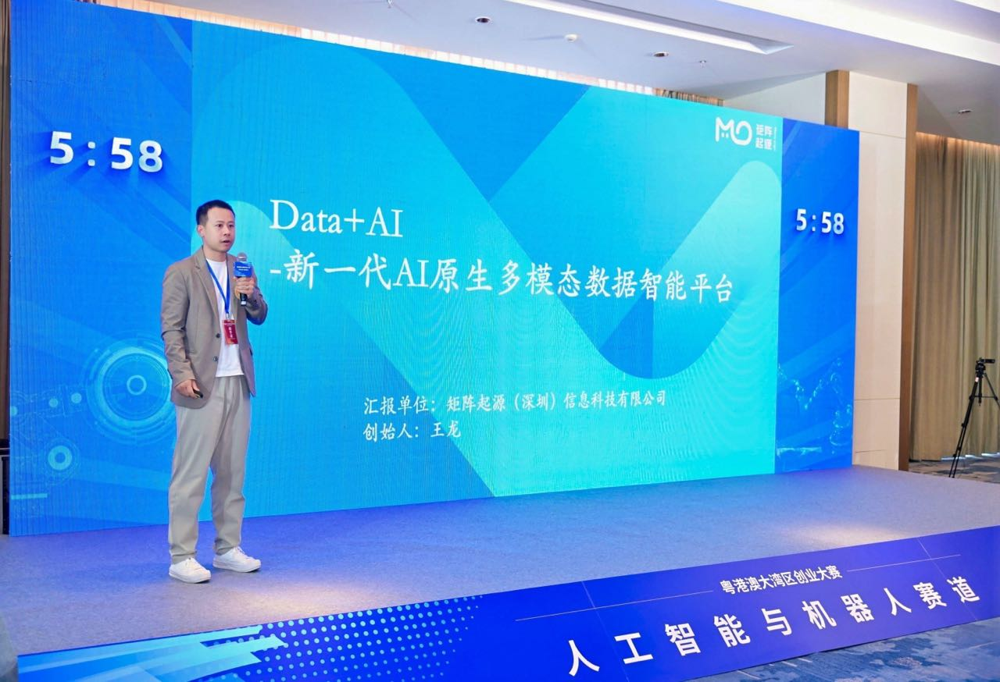
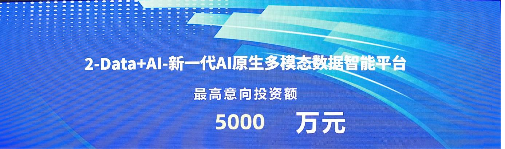

On September 27, the finals of the first Guangdong-Hong Kong-Macao Greater Bay Area Entrepreneurship Competition came to a successful close in Foshan, Guangdong. MatrixOrigin took its **Data + AI next-generation AI-native multimodal data intelligence platform** into the "Artificial Intelligence and Robotics" track, advanced all the way to the national finals, and after intense competition, **won the national bronze award and attracted strong interest from multiple top capital institutions on site!**

_Product R&D VP Zhao Chenyang presents the project on stage_

The Guangdong-Hong Kong-Macao Greater Bay Area Entrepreneurship Competition, referred to as "the competition," has five core tracks: artificial intelligence and robotics, integrated circuits and low-altitude economy, medical health and biomanufacturing, food technology and modern agriculture, and modern services and cultural creativity. Since launching in May, it has attracted more than 7,000 startup projects from home and abroad. After rigorous selection, 150 outstanding teams advanced to the national finals.

At the same time, the competition organized entrepreneurial resource matching activities to build an efficient bridge between entrepreneurs and the capital market. Twenty-four outstanding startup projects met face-to-face with leading investment institutions. With its technical and business model innovation, MatrixOrigin received the highest intended investment amount of RMB 50 million, becoming a favorite among capital on site.

_Entrepreneurial resource matching activity_

## About the Competition

The Guangdong-Hong Kong-Macao Greater Bay Area Entrepreneurship Competition is a national-level event jointly hosted by the Ministry of Human Resources and Social Security, the Hong Kong and Macao Affairs Office of the CPC Central Committee, the Hong Kong and Macao Affairs Office of the State Council, and the People's Government of Guangdong Province. It is organized by the Guangdong Provincial Department of Human Resources and Social Security, the Guangdong Hong Kong and Macao Affairs Office, the Shenzhen Municipal People's Government, the Zhuhai Municipal People's Government, the Foshan Municipal People's Government, the Hong Kong Special Administrative Region Government's Home and Youth Affairs Bureau, the Macao Special Administrative Region Government's Economy and Technology Development Bureau, and South China University of Technology. With the theme "**Bay Area Innovation for the Future, Talent Gathers in Guangdong**", the competition achieved deep linkage among Guangdong, Hong Kong, and Macao for the first time in an entrepreneurship event. Using the Bay Area as a base and radiating to the entire country, it brings together the widest range of high-quality entrepreneurial resources and builds a global, full-cycle empowerment platform, fully showcasing the entrepreneurship ecosystem of "policy support + competition guidance + long-term empowerment" in the Greater Bay Area.

## About MatrixOrigin

MatrixOrigin is a leading provider of data intelligence (Data & AI) platform technologies and services. Its core team comes from well-known technology companies in China and around the world, with broad industry and international perspectives. MatrixOrigin's core product, MatrixOne Intelligence, is an enterprise-oriented AI-native multimodal data intelligence platform. By using artificial intelligence technologies, including large models, and an innovative hyper-converged data foundation, it helps enterprises uniformly manage and govern multimodal data and transform private-domain data into AI-Ready data assets. It has already served leading enterprises across industries, including StoneCastle, China Mobile IoT, Amway Nutrilite, Jiangxi Copper, and XCMG Hanyun, helping enterprises transform and upgrade from informatization and digitization to intelligence.
