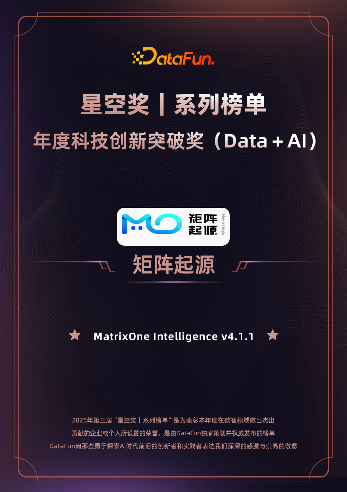
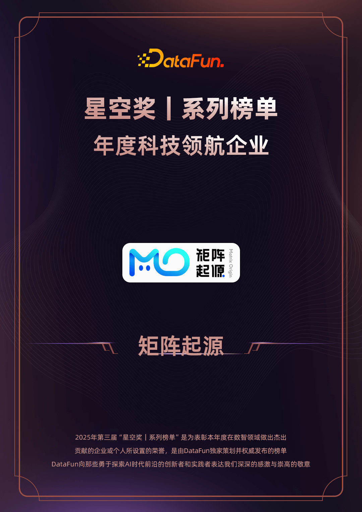

# MatrixOrigin Wins Two DataFun Star Awards: Leading with Technology to Build New Enterprise-Grade Data Intelligence Infrastructure

On January 16, at the awards ceremony of the third DataFun "Star Awards" held at the Zhongguancun Exhibition Center Conference Center in Beijing, **MatrixOrigin** was recognized for its continued work and practical achievements in the field of data intelligence infrastructure, **winning two annual honors in one event**: the "Annual Technology Innovation Breakthrough Award (Data + AI)" and the "Annual Technology Leading Enterprise" award.

## 01 Returning to the Essence of Data and Solving the "Last Mile" of AI Implementation

As enterprise intelligent transformation enters deeper waters, the core challenge of AI implementation is not a lack of model capability, but fragmented private-domain data quality and processing chains. MatrixOne Intelligence (MOI), which won the "Annual Technology Innovation Breakthrough Award (Data + AI)," is designed to provide enterprises with a controllable and trustworthy data intelligence solution.

In response to industry pain points highlighted by the award, such as "data fragmentation" and "prediction bias," MOI provides a practical solution through its hyper-converged architecture:

- Unified data foundation: Facing the scattered state of structured and unstructured data inside enterprises, MOI uses the lakehouse capabilities of its core engine MatrixOne to provide one-stop storage and management for multimodal data, avoiding the operational complexity and data consistency risks caused by stacking multiple systems.
- Engineered intelligent processing chain: MOI embeds AI capabilities throughout the data-processing workflow (MatrixPipeline). Through vectorized retrieval and frontier technologies, it effectively improves the recall accuracy of RAG (Retrieval-Augmented Generation), suppresses large-model "hallucinations" from the data source, and ensures that outputs meet enterprise compliance and risk-control standards.
- Closed-loop feedback mechanism: The system supports bidirectional feedback between "data and applications," allowing models to continuously iterate as business data accumulates and ensuring long-term stability and usability in production environments.

## 02 Focusing on Real Value and Becoming a Trusted Enterprise Partner

Only technology that can withstand real business scenarios has lasting vitality.

The "Annual Technology Leading Enterprise" award is a comprehensive recognition of MatrixOrigin's accumulation of independent intellectual property, product maturity, and customer-service capability. Facing the strict requirements of industries such as finance, manufacturing, and healthcare for data security and business continuity, MatrixOrigin has always remained customer-value oriented.

At present, our solution has completed implementation validation in multiple key industries. In healthcare, we helped a top-tier hospital build high-precision conversational and assisted-diagnosis models, significantly improving the initial diagnosis efficiency and diagnostic accuracy of IBS. In high-end manufacturing, we helped enterprises optimize supply-chain decision-making processes and greatly improve the efficiency of bid-document production and compliance checks.

These frontline practical results not only validate the high availability of the product, but also strongly demonstrate our commitment to becoming a solid foundation for enterprises building data intelligence capabilities.

## 03 Closing

Professional recognition from industry experts and long-term trust from customers are the driving forces behind our continued growth. Looking ahead, we will continue to stay true to our original commitment, refine our product core, and optimize our service system. Through pragmatic technological innovation, we hope to work with ecosystem partners to help more enterprises solve data challenges and build secure, efficient, and sustainably evolving intelligent systems.
