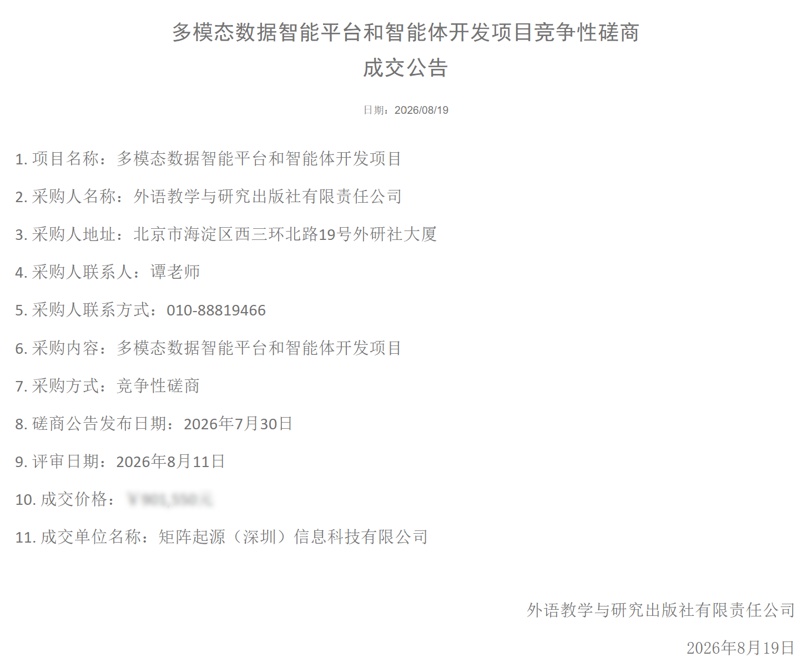

# 矩阵起源中标外研社"多模态数据智能平台和智能体开发项目"

以 MatrixOne Intelligence（MOI）多模态数据底座，赋能外语出版龙头数智化升级

近日，矩阵起源成功中标外语教学与研究出版社有限责任公司（简称「外研社」）**"多模态数据智能平台和智能体开发项目"**，本次项目将围绕多模态数据智能平台部署与教学 / 编辑 / 服务智能体的定制化开发，构建面向外语教育出版全业务场景的 **"Data + AI"** 基础设施 —— 这也是矩阵起源核心产品 MatrixOne Intelligence（MOI）在国内 **头部出版机构**中的又一次标杆落地。

## 携手外研社，共建外语教育 AI 数据底座

外研社是中国规模最大、最具影响力的外语出版机构之一，依托北京外国语大学的学术与教育资源，长期服务于高校外语教学、教材研发、国际中文教育及教师发展等核心场景。面对数字内容爆发、AI 重塑知识生产与传播方式等行业变局，外研社近年来持续推进。

外研社近年来持续推进"数智引领、数纸融合"的数字化战略，并将"建设外语教育垂类大模型与多种教与学智能体"明确为面向"十五五"的关键能力建设方向。

本次合作，矩阵起源将以外研社真实业务场景为锚点，提供以下能力组合：

- **MatrixOne Intelligence 多模态数据解析平台**：实施部署服务，统一管理教材语料、教学资源、出版素材等结构化 / 半结构化 / 非结构化数据，构建对外研社全业务可见、可治理、可追溯的数据底座。

- **智能体定制开发**：围绕教学辅助、内容创作、编辑校对、知识服务等核心场景，开展面向多角色、多任务的智能体开发与系统集成。

项目交付后，外研社将拥有一套"数据可治理、智能可编排、应用可观测"的多模态 AI 中台，进一步夯实其在数字教材背后的底层数据与服务能力。

## 重塑内容生产与知识服务的新范式

过去几年，出版机构对 AI 的引入多停留在"引入一个写作助手、加一个智能客服"的工具层面；而随着大模型走入业务深水区，真正决定行业差异化竞争力的，是底层的数据资产沉淀与智能体编排能力——这恰恰是矩阵起源的核心所在。

矩阵起源是业界领先的 Data + AI 数据智能平台技术和服务提供商，核心产品 MatrixOne Intelligence 基于团队自研的超融合数据库 MatrixOne 构建，平台原生融合 OLTP、OLAP、向量检索、全文检索等多种数据负载，能够一次性打通异构多模态数据的接入、清洗、治理、标注与增强，为企业提供开箱即用的多模态混合检索、智能问答与智能体定制开发能力。

在外研社之前，这套能力已在多个行业得到验证：在新能源领域帮助龙头企业构建招投标智能分析与知识图谱，决策效率提升 40%；在营养保健行业为头部客户搭建统一 GenAI 数据底座，营销服务效能提升超 50%.

本次外研社与矩阵起源的联手，正是这套能力在出版业的首次体系化落地——是国内头部出版机构首次以"多模态数据平台 + 智能体定制开发"一体化的方式，重塑 AI 时代的内容生产与服务流程。它的意义至少在三方面：

1. **推动出版业从"内容数字化"走向"内容智能化"** —— 依托 MOI 平台的多模态解析与数据治理能力，教材、读物、课程资源从此具备结构化、可被智能体消费的统一形态。

2. **树立外语垂类大模型与智能体的基础设施样本** —— 借助 Agent 工厂与智能体定制能力，将外研社数十年积累的语料、教材体系、教研知识，沉淀为可复用的数据资产。

3. **探索可信、合规、可解释的 AI 应用范式** —— 以"数据不脱域、流程可审计"的平台能力为底座，为出版这一对内容质量与社会效益高度敏感的行业，输出一套可参考的"AI 中台 + 智能体工厂"建设方法论。

## 关于外研社

外语教学与研究出版社（简称"外研社"）由北京外国语大学于 1979 年创建并主办，2010 年完成企业改制，现已成为全国规模最大的大学出版社和外语出版机构，是一家以外语教育出版为特色、国内领先、国际知名的综合性文化教育出版集团。
