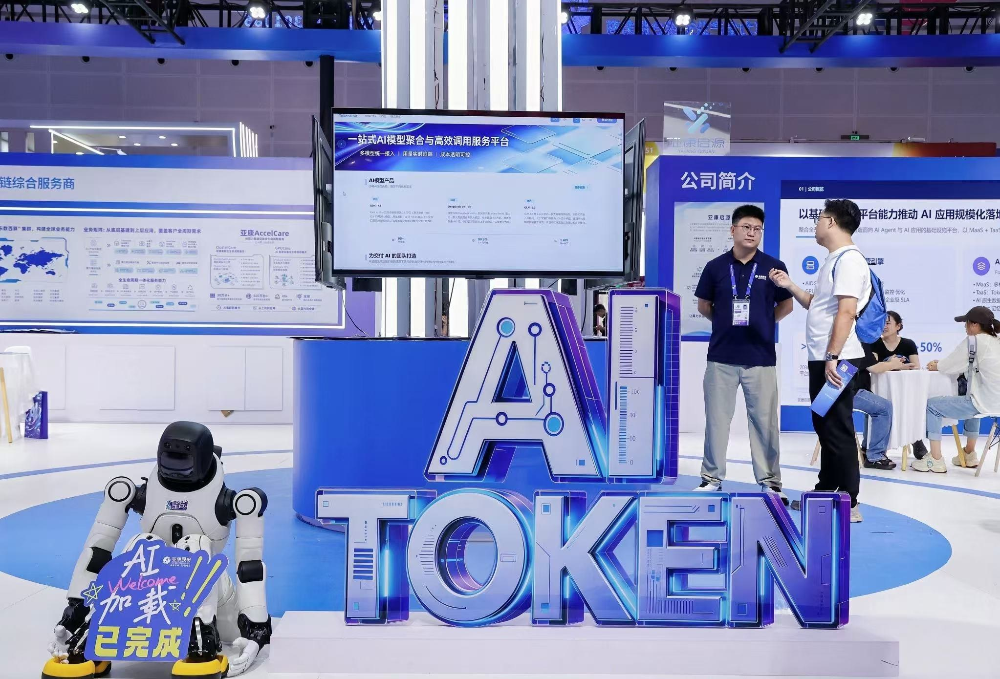
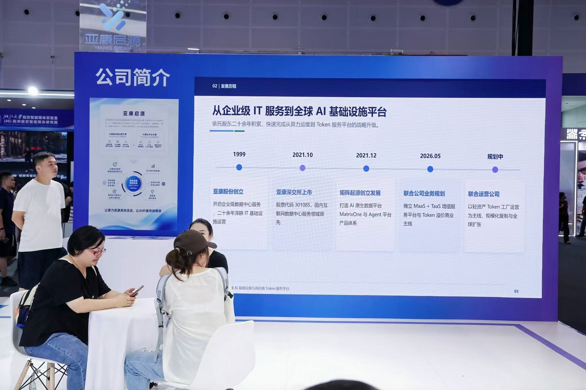
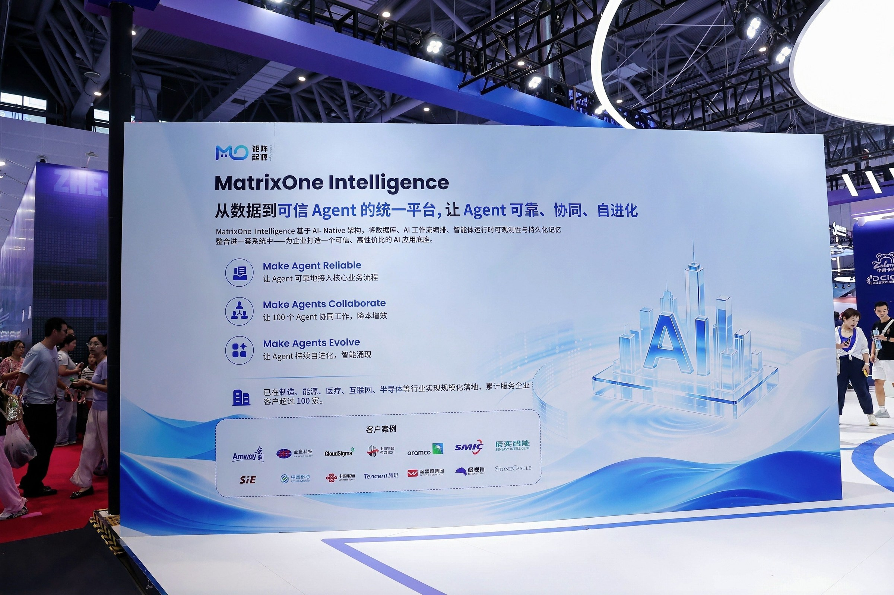
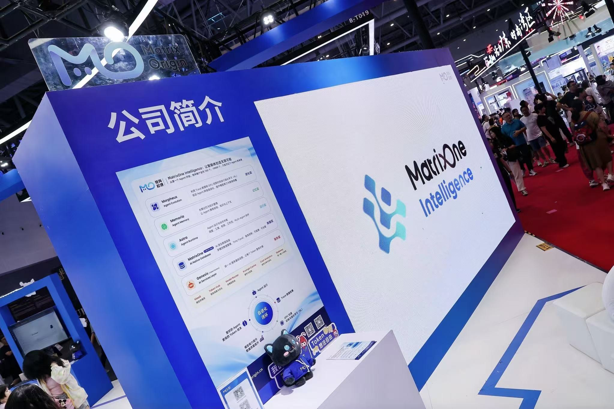
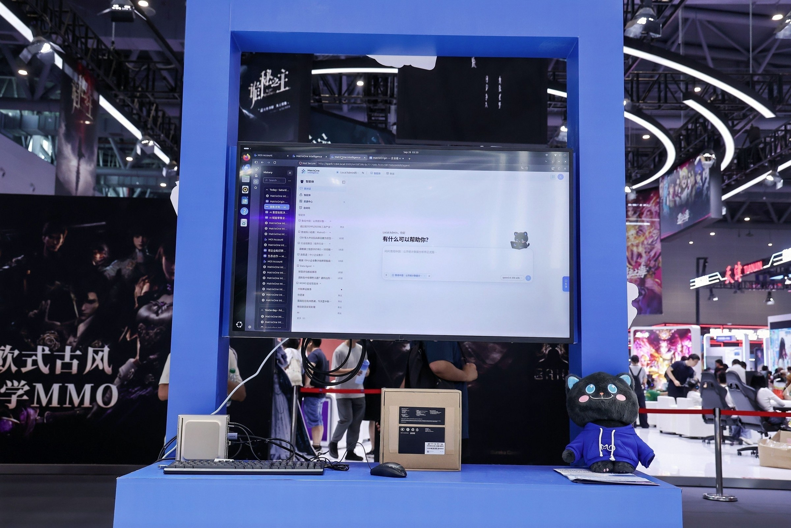
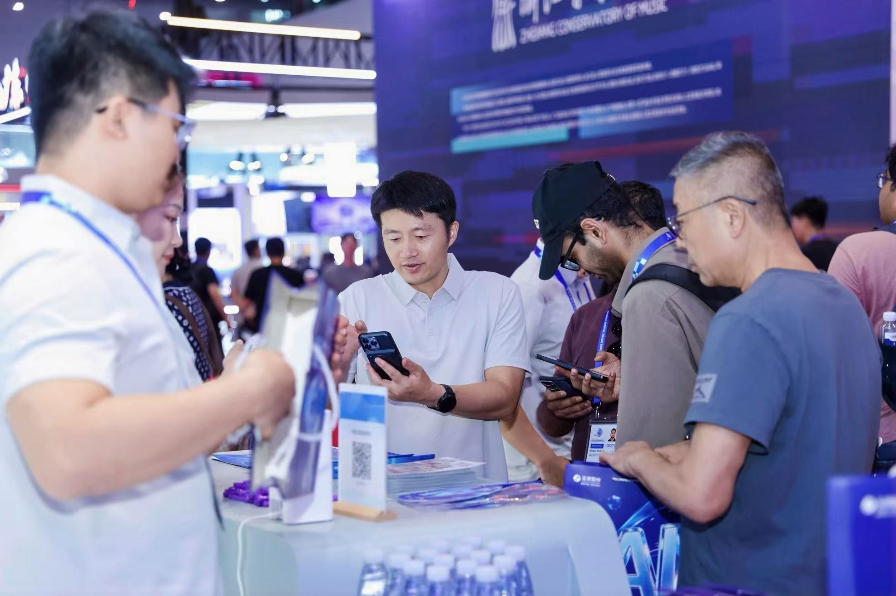
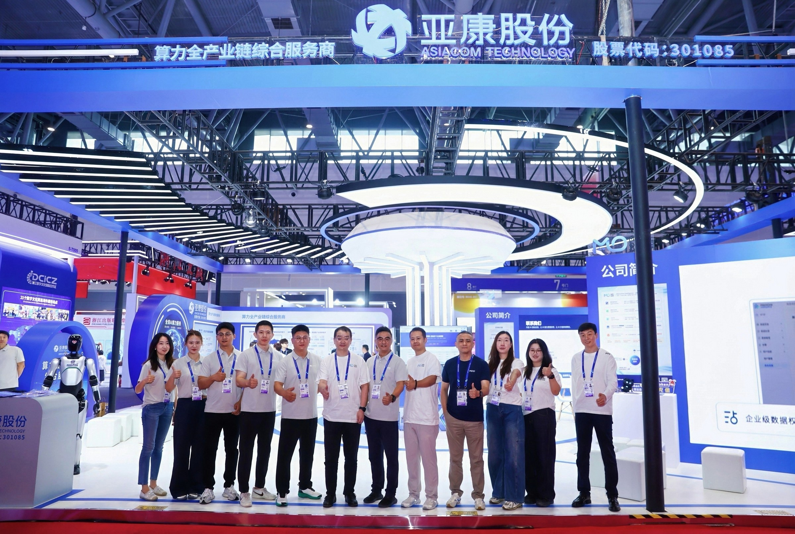

9月27日，第五届全球数字贸易博览会在杭州大会展中心圆满落幕。

本届数贸会以“在数贸会遇见AI未来”为年度主题。展会期间，矩阵起源携手亚康股份、亚康启源亮相数智文娱展区（8号馆）8-T013展位，围绕算力基础设施、Token服务与企业级智能体应用，呈现企业AI从底层资源到实际应用的完整链路。

五天时间里，来自不同领域的客户、合作伙伴和专业观众来到展位，与我们交流企业AI建设中的实际需求，也让更多关于数据、模型、算力和智能体应用的讨论在现场展开。

## 从算力到智能体  企业AI如何真正落地

随着企业对AI应用的关注不断深入，大家关心的问题也越来越具体：算力资源如何稳定支撑业务？模型服务如何更高效地调用？企业已有的数据和知识怎样被智能体使用？智能体又如何进入真实的业务流程？

围绕这些问题，本次联合展示呈现了“算力基础设施—Token服务—企业级智能体”的整体路径。

亚康股份展示了覆盖算力全生命周期的服务能力，从算力设备选型、采购与集成交付，到AIDC数据中心部署与运维，再到算力集群运营和模型服务，为企业AI建设提供底层资源支撑。

亚康启源围绕AI基础设施、Token服务与智能体平台，连接算力、模型、数据与上层应用，推动算力和模型能力转化为可计量、可调用、可交付的Token服务。

沿着这条链路，矩阵起源带来了企业级AI基础设施及MatrixOne Intelligence（MOI）的最新进展，重点呈现企业数据、模型服务、业务知识和智能体运行如何在统一的平台中实现连接。

## MatrixOne Intelligence AI 原生多模态数据智能平台亮相 带来企业级智能体建设新进展

本次数贸会上，MatrixOne Intelligence 5.0与现场观众见面。

新版本围绕企业级智能体的开发、运行和持续进化，进一步整合数据、运行、记忆、进化与模型服务等能力，帮助企业连接分散的数据、知识、模型和工具，为智能体进入实际业务提供统一的基础设施支撑。

在现场交流中，不少观众重点关注企业数据如何支持智能体运行、智能体如何管理长期记忆与业务上下文，以及如何利用运行过程中积累的数据持续优化能力。这些问题也反映出，企业对AI的关注正在从“能不能用”，逐渐走向“如何稳定运行、如何持续优化、如何真正进入业务”。

## 现场交流  让需求和场景更加具体

展会期间，矩阵起源围绕企业数据基础设施、模型服务和智能体平台等方向，与现场客户及生态伙伴深入探讨不同产业场景下的AI基础设施与应用需求。

从数据治理和模型接入，到智能体开发、运行与持续优化，交流内容覆盖企业AI建设的多个关键环节，也让我们对不同行业的落地需求有了更直接的了解。

## 数贸会收官  探索继续

五天展会已经结束，感谢每一位在数贸会与矩阵起源相遇的客户、伙伴和朋友，也感谢大家对MOI的关注。

接下来，矩阵起源将继续推进MOI的产品迭代，围绕企业数据与智能体运行中的实际问题，完善从数据底座到智能体应用的基础设施能力，让企业级智能体更加稳定地进入业务、参与协作并持续进化。

感谢相遇  期待下一次再见
