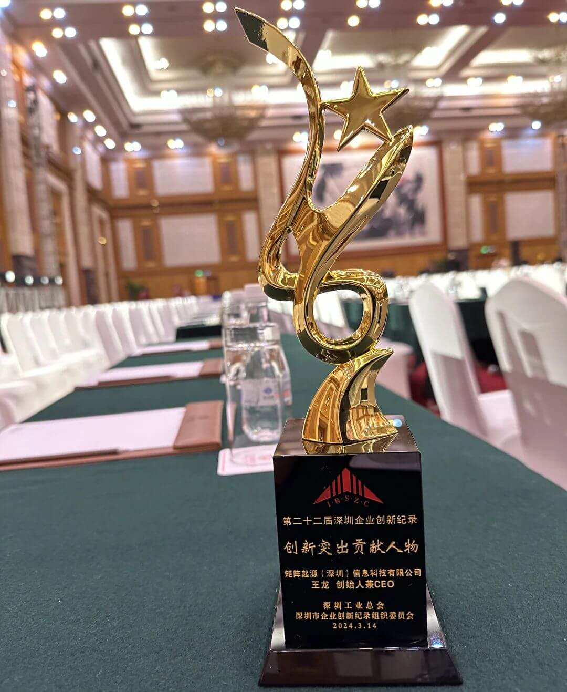
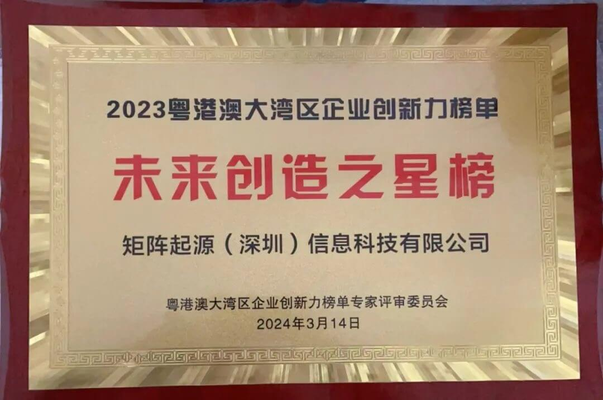
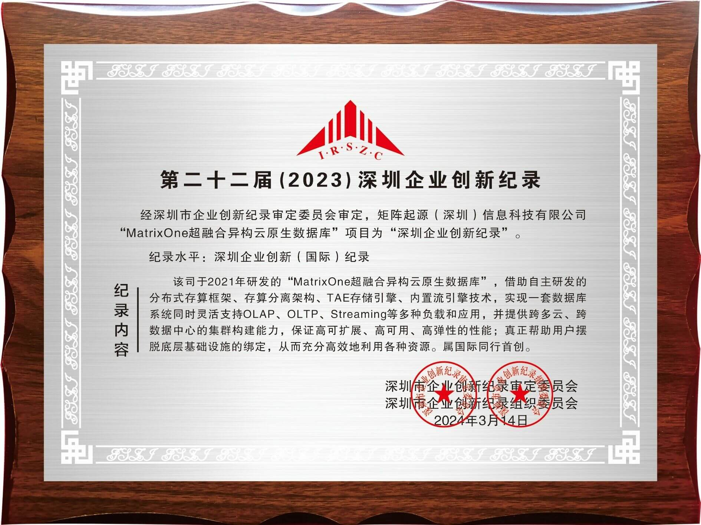
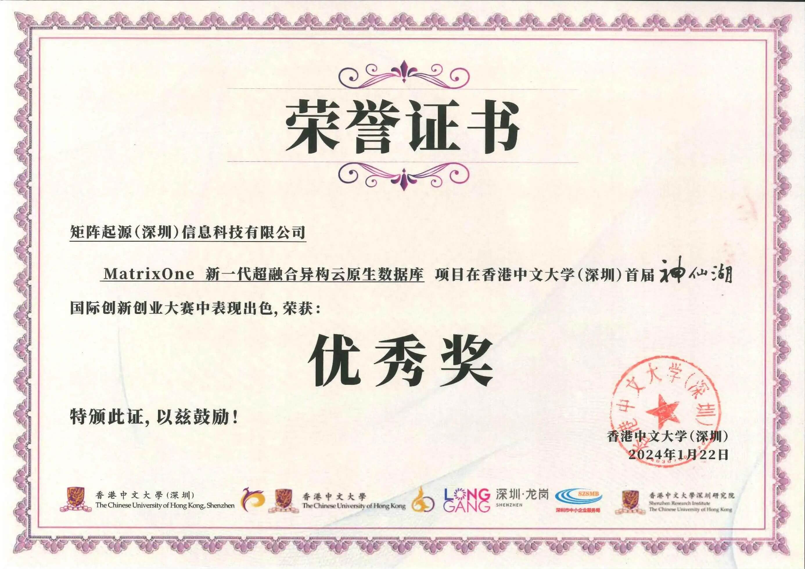
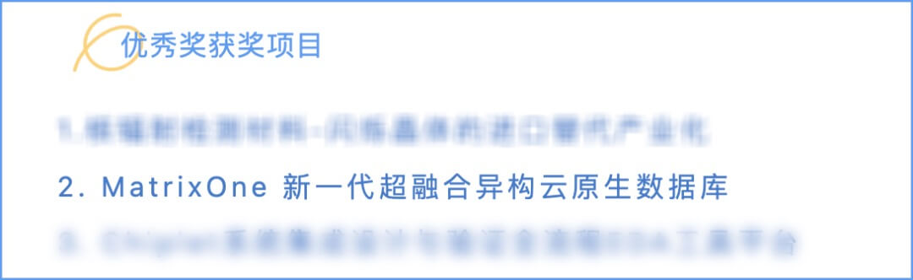

At the start of the new year, MatrixOrigin is pleased to share a series of good news.

First, **MatrixOrigin founder and CEO Mr. Wang Long was named a "2023 Shenzhen Outstanding Contributor to Innovation."** This honor recognizes his outstanding contributions to technological innovation and product development in the database industry.

Second, **the company was selected for the "2023 Guangdong-Hong Kong-Macao Greater Bay Area Enterprise Innovation List - Future Creator Stars."** Its project, **"MatrixOne Next-Generation Hyper-Converged Cloud-Native Heterogeneous Database," was recognized as a "2023 Shenzhen Enterprise Innovation (International) Record" and included in the Shenzhen Yearbook**, showcasing it to the public as a high-quality innovation achievement from Shenzhen. These honors recognize both our distinctive product development and technological innovation, as well as the company's future growth potential.

In addition, we participated in and won an Excellence Award at the Chinese University of Hong Kong, Shenzhen "Shenxian Lake" International Innovation and Entrepreneurship Competition.

## About MatrixOrigin

MatrixOrigin is a leading provider of big data and database management system (DBMS) technologies and services. Its core team members come from well-known technology companies in China and around the world, bringing strong innovation capabilities. MatrixOrigin aims to build and use world-class data infrastructure technologies and products to help enterprises transform and upgrade from informatization and digitization to intelligence. With core competitiveness in cloud computing, databases, big data, and artificial intelligence, MatrixOrigin has broad industry and international perspectives, as well as a forward-looking vision, enabling it to quickly and effectively put advanced technologies into practical use across different fields and scale them broadly.

## About MatrixOne

MatrixOne, MatrixOrigin's core product, is a multimodal database based on cloud-native technology that can be deployed in both public and private clouds. Built on an original architecture featuring compute-storage separation, read-write separation, and hot-cold data separation, it supports transaction, analytical, streaming, time-series, and vector workloads within a single storage and compute system. It can also isolate or share storage and compute resources in real time and on demand. MatrixOne helps users greatly simplify increasingly complex IT architectures and provides minimalist, highly flexible, cost-effective, and high-performance data services.
