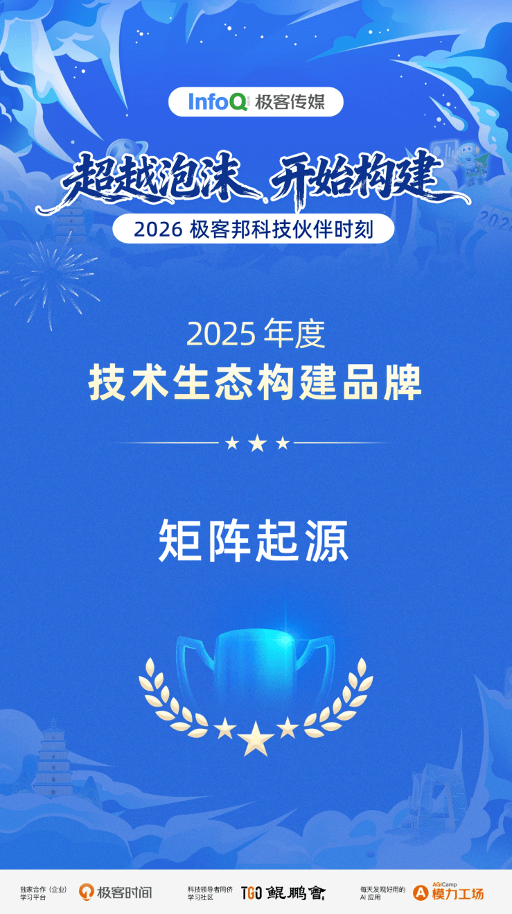

# Good News: MatrixOrigin Wins InfoQ Geek Media's 2025 Technology Ecosystem Builder Brand Award

On January 21, the 2026 Geek Technology Partner Moment event, themed "Beyond the Bubble, Start Building," concluded successfully. The event is an annual program organized by Geekbang Technology to recognize companies, teams, and individuals that made outstanding contributions to technology ecosystem development and construction over the past year.

Among the honorees, MatrixOrigin won the "2025 Technology Ecosystem Builder Brand Award" for its deep commitment to the technology ecosystem. MatrixOrigin's persistence has made the ecosystem more resilient and more connected, injecting continuous momentum into the industry.

As a core force in the industry, MatrixOrigin understands that the ultimate goal of ecosystem development is not to go alone, but to achieve shared success. Behind this award are our steadfast actions to connect developers, users, and partners, and to promote inclusive technology and sustainable growth. Looking ahead, MatrixOrigin will continue to uphold the original aspiration of a builder and keep exploring the deep waters of the technology ecosystem. Through more pragmatic actions and a more open attitude, we hope to work with every ecosystem partner to move through cycles together and build a new technology ecosystem that is secure, efficient, and vibrant.
