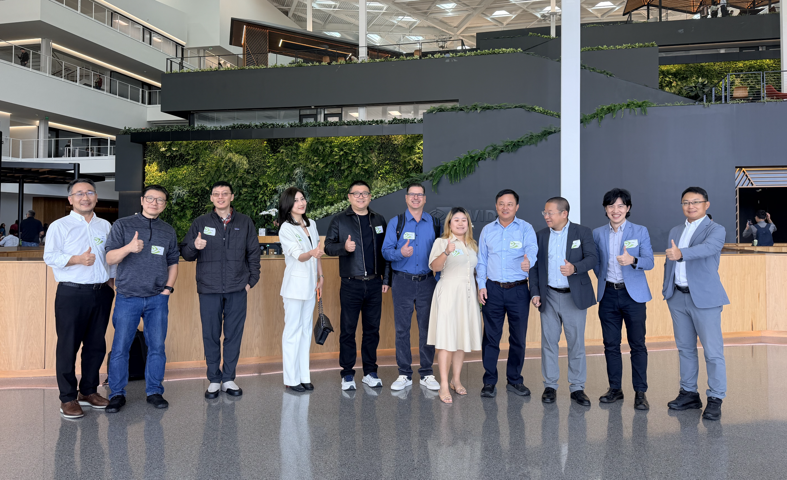
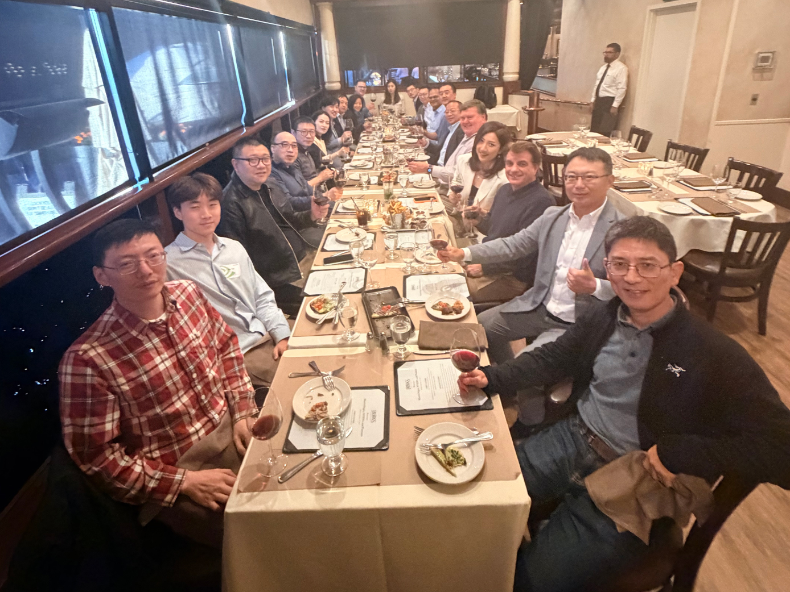

# 矩阵起源硅谷 AI 产业领袖晚宴

**从算力、智能到生产力**

当地时间9月21日晚，矩阵起源（MatrixOrigin）在硅谷举办“从算力、智能到生产力”AI产业领袖晚宴，招待到访硅谷、赴英伟达总部交流的中国AI产业企业访问团，与产业伙伴共话企业AI的落地与合作。

中鼎股份董事长夏迎松、汉得信息COO 唐健、软通动力副总裁韩景润、亚信副总裁刘承堃等嘉宾出席。矩阵起源CTO田丰博士、科学家张祖羽博士、国际业务合伙人CK Tan与来宾交流，探讨AI基础设施、企业智能体及产业应用的合作机会。

## 立足硅谷 连接技术与产业

作为在硅谷拥有核心团队的生态企业，矩阵起源参与了此次访问交流，并借晚宴进一步连接全球AI计算生态与中国企业的业务需求。从前沿技术交流到企业场景落地，矩阵起源希望与伙伴建立持续、深入的合作，让技术创新更快进入真实业务。

## 从算力到生产力 共建端到端价值链

围绕晚宴主题，交流聚焦一个共同关切：如何让算力投入转化为可持续的企业价值。

从Token Factory提供高效、稳定的模型服务，到AI Factory连接企业数据、知识与智能体，再到Intelligence Factory推动业务流程与决策升级，矩阵起源希望与伙伴共同打通算力、智能和生产力之间的完整链条。

这需要计算平台、基础设施、模型、企业软件和行业服务伙伴各展所长。矩阵起源愿以开放的技术和合作方式，与伙伴共同建设方案、服务客户、拓展市场，分享企业AI发展的长期价值。

相聚硅谷，合作面向全球。从算力、智能到生产力，期待与更多伙伴携手同行。
