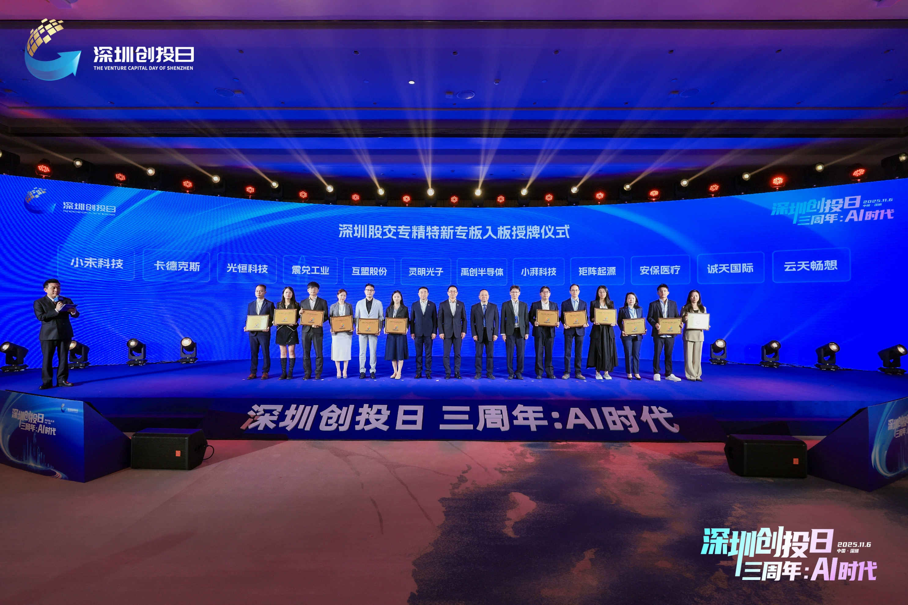

On November 6, at the themed event "Shenzhen Venture Capital Day 3rd Anniversary: The AI Era," MatrixOrigin (Shenzhen) Information Technology Co., Ltd. appeared as a company listed on the "Specialized, Refined, Distinctive, and Innovative" Board and received its plaque on stage.

After strict review by the Shenzhen Equity Exchange, MatrixOrigin (Shenzhen) Information Technology Co., Ltd. stood out with its leading position in enterprise-grade AI data intelligence and was approved to enter the highest layer (cultivation layer) of the "Specialized, Refined, Distinctive, and Innovative" Board. This marks authoritative recognition of the company's path toward specialization, refinement, distinctiveness, and innovation, and injects strong momentum into its accelerated technological innovation and global market expansion.

Shenzhen's "Specialized, Refined, Distinctive, and Innovative" Board is one of the first national pilot boards approved by the China Securities Regulatory Commission. The Shenzhen Securities Regulatory Bureau and Shenzhen SME Service Bureau jointly issued the *Notice on Encouraging and Recommending Shenzhen Specialized, Refined, Distinctive, and Innovative SMEs to Enter the Shenzhen Qianhai Equity Exchange Specialized, Refined, Distinctive, and Innovative Board for Cultivation*, encouraging and recommending Shenzhen specialized SMEs to enter the board for cultivation. On April 27, 2025, the Shenzhen Equity Exchange "Specialized, Refined, Distinctive, and Innovative" Board officially opened, aiming to support high-quality development of outstanding SMEs through a full-chain support system of "basic services + integrated finance + listing cultivation."

## About MatrixOrigin

MatrixOrigin is a pioneer of AI-native multimodal data intelligence platforms and a leading company in China's AI data infrastructure field. The company focuses on big data and artificial intelligence platform technologies and services, and is committed to building a simple yet powerful data intelligence operating system for the digital world, helping enterprises efficiently upgrade from informatization to intelligence. Its core product, MatrixOne Intelligence, is an AI-native multimodal data intelligence platform for enterprises. It uses artificial intelligence technologies, including large models, and an innovative hyper-converged data foundation to help enterprises centrally manage and govern multimodal data and turn private-domain data into AI-Ready data assets. The company has obtained titles including national high-tech enterprise, specialized SME, and Shenzhen "seed unicorn," and is also a drafting unit for national standards.
