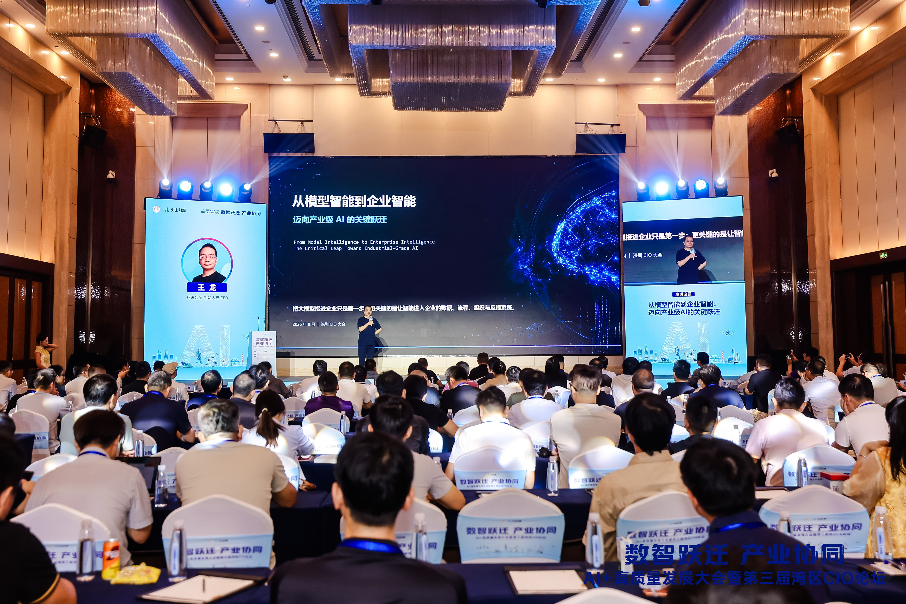
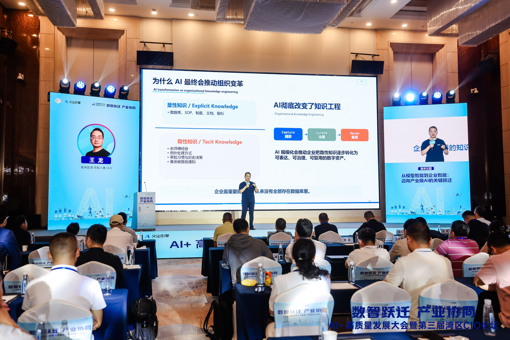

# 湾区论“智”｜矩阵起源受邀亮相第三届湾区CIO论坛

8月22日，以“数智跃迁·产业协同”为主题的AI+高质量发展大会暨第三届湾区CIO论坛在深圳龙岗举行，企业管理者、行业专家及数字科技领域代表齐聚一堂，共同探讨AI驱动企业智能化与产业协同发展的新路径。**矩阵起源创始人兼CEO王龙受邀出席本次大会**，并作为特邀嘉宾发表《从模型智能到企业智能：迈向产业级AI的关键跃迁》主题演讲。

演讲中，王龙提出企业AI竞争的关键正在从单纯追求模型能力，转向让智能真正进入企业的数据、流程与组织运行体系。过去的软件主要执行人预先设定的规则，而今天的AI已经开始参与业务的理解、判断与行动。但通用大模型并不了解企业实时变化的业务状态和运行规则，要让AI从“会回答”走向“会行动”，企业需要将数据、语义、权限、记忆与反馈转化为可供AI调用的上下文。由此，企业智能化不再只是一次技术升级，而是涉及数据基础设施、业务流程和组织协同的系统性变革。只有真正连接业务，AI才能转化为支持企业经营和产业升级的新型生产力。

在演讲现场分享对产业级AI与企业智能化转型的思考

**从模型能力走向企业价值，矩阵起源正在把这条路走进产业现场。**

作为一家专注于企业级AI基础设施的公司，矩阵起源更关注如何让AI真正连接企业的数据和业务。自主研发的MatrixOne Intelligence，是一体化AI-Native数智平台，将数据管理、AI服务、智能体运行和企业级治理整合在同一平台中，为企业应用AI提供统一支撑。

在新能源行业，帮助龙头企业将AI应用于招投标分析和知识沉淀，推动决策效率提升40%；在营养保健行业，为头部客户搭建统一 GenAI 数据底座支撑销售与营销应用，服务效能提升超 50%。这些实践让AI不再停留在模型和工具层面，而是逐步进入企业的业务流程并创造可衡量的实际价值。

未来，我们将继续深化多模态数据治理、企业知识构建与智能体协作能力，把项目建设中形成的技术、方法和经验沉淀为可复用的行业方案，携手更多客户与生态伙伴，推动企业AI从单点应用走向体系化建设。
